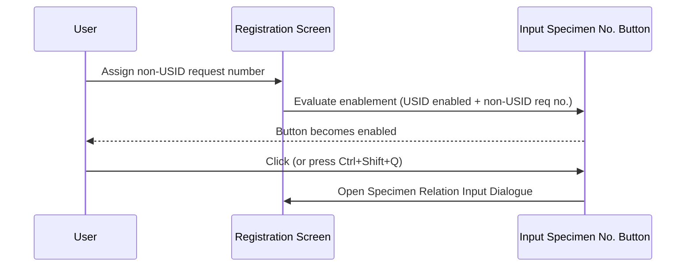
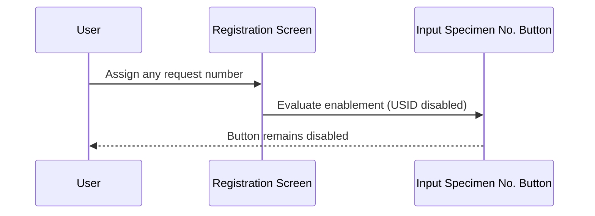
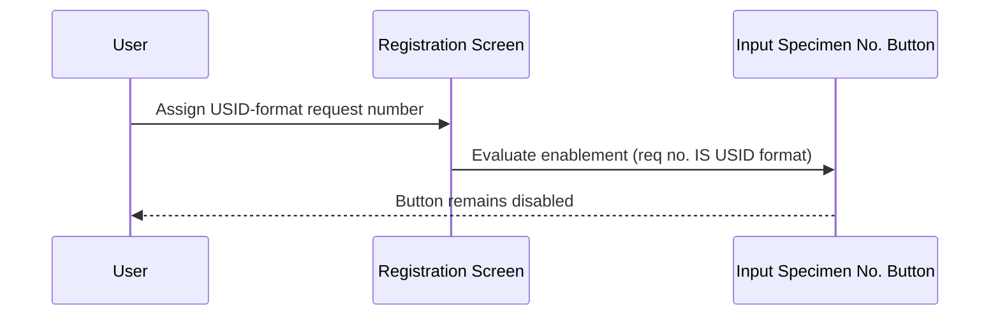

# Input Specimen No. Button

## Overview

The **Input Specimen No.** button is a Registration screen control that opens the Specimen Relation Input Dialogue, allowing staff to assign a Universal Specimen Identifier (USID) to the current request's specimen-test-profile mappings. The button is always disabled when the Registration screen first opens and only becomes enabled once a valid, non-USID-format request number has been assigned and the USID feature is active for the current laboratory. Its enablement state is re-evaluated each time the registration reaches the Ready state.

---

## Related User Stories

- **[[CRST-465]]** - Registration - Input Specimen No. Button Enablement

**Epic:** LISP-25 [CRST][DEV] Registration - Screen Object Enablement

---

## Key Concepts

### USID (Universal Specimen Identifier)
A specimen identifier format that follows a fixed digit-count pattern (either 10 or 12 digits, depending on the lab's configuration). When a request number itself is entered in USID format, the system treats the request number as a USID and does not require separate specimen input through this button.

### USID Feature
A lab-level option that enables or disables USID-related functionality. Controlled by the `ENABLE` option in the `USID` option group. The button is only relevant and usable when this feature is active.

### Non-USID Request Number
A request number that does not match the 10-digit or 12-digit USID format. Only when the assigned request number is non-USID can the staff member use the button to input specimen numbers separately.

---

## Trigger Point

The button's enablement state is evaluated when the registration transitions to the Ready state (after a valid request number has been successfully assigned). It cannot become enabled in the Initial or Patient Ready states.

---

## Workflow Scenarios

### Scenario 1: Button Enabled — USID Feature Active, Non-USID Request Number

#### Prerequisites
- The USID lab option is enabled (`option_value = 1`).
- The registration screen has reached the Ready state.
- The assigned request number does not match the USID format (is not 10 or 12 digits).

#### Process Flow

#### Step-by-Step Details

1. The user assigns a request number that is not in USID format (not 10 or 12 digits).
2. Because the USID feature is enabled and the request number is non-USID, the **Input Specimen No.** button becomes enabled.
3. The user clicks the button (or presses the **Ctrl+Shift+Q** shortcut).
4. The Specimen Relation Input Dialogue opens, allowing the user to map USID specimen numbers to the request's specimen-test-profile relations.

---

### Scenario 2: Button Disabled — USID Feature Inactive

#### Prerequisites
- The USID lab option is disabled (`option_value = 0`, `2`, or `3`).

#### Process Flow

#### Step-by-Step Details

1. When the USID feature is not enabled for the current laboratory, the **Input Specimen No.** button remains disabled regardless of what request number is assigned.
2. The user cannot open the Specimen Relation Input Dialogue through this button.

---

### Scenario 3: Button Disabled — USID Feature Active but Request Number is in USID Format

#### Prerequisites
- The USID lab option is enabled (`option_value = 1`).
- The registration screen has reached the Ready state.
- The assigned request number matches the USID format (10 or 12 digits, per the CRS configuration).

#### Process Flow

#### Step-by-Step Details

1. The user enters a request number that matches the USID format (e.g., a 10-digit or 12-digit value per the configured CRS setting).
2. Because the request number itself is already in USID format, no separate specimen input is required through this button.
3. The **Input Specimen No.** button remains disabled.

> When the request number is itself a USID, the system processes the USID lookup as part of the request number assignment flow and does not require the user to separately input a specimen number.

---

### Scenario 4: Default State — Registration Screen Just Opened

#### Prerequisites
- The Manual Registration screen has been opened.
- No request number has been assigned yet.

#### Step-by-Step Details

1. When the Registration screen opens, the **Input Specimen No.** button is disabled by default.
2. It remains disabled through the Initial and Patient Ready states, regardless of USID configuration.

---

## Button Enablement Summary

| State | USID Feature | Request No. Format | Button State |
|---|---|---|---|
| Initial | Any | N/A | **Disabled** |
| Patient Ready | Any | N/A | **Disabled** |
| Ready | Disabled | Any | **Disabled** |
| Ready | Enabled | USID format (10 or 12 digits) | **Disabled** |
| Ready | Enabled | Non-USID format | **Enabled** |

---

## Button Properties

| Property | Value |
|---|---|
| Label | Input Specimen No. |
| Keyboard shortcut | **Ctrl+Shift+Q** |
| Default state | Disabled |
| What it does | Opens the Specimen Relation Input Dialogue for USID specimen number entry |

---

## Configuration

| Setting | Option Code | Purpose | Effect when enabled | Effect when disabled |
|---|---|---|---|---|
| USID Feature | `ENABLE` (group: `USID`, option_value = `1`) | Controls whether USID-based specimen identification is active for the lab | Input Specimen No. button can become enabled when a non-USID request number is assigned | Input Specimen No. button is always disabled |

> The USID `option_value` controls both the feature enable/disable (`1` = enabled) and the USID digit-count format used to detect USID-format request numbers (`2` = 10-digit USID, `3` = 12-digit USID). Values `2` and `3` disable the button even though they control a related but distinct aspect of the USID format detection.

---

## Business Rules

1. The **Input Specimen No.** button is disabled by default when the Registration screen opens and remains disabled until the Ready state is reached.
2. The button is disabled in both the Initial and Patient Ready states, regardless of USID configuration.
3. For the button to be enabled in the Ready state, both conditions must be satisfied simultaneously: (a) the USID feature must be enabled, and (b) the current request number must not be in USID format.
4. A request number is considered to be in USID format if it matches either the 10-digit or 12-digit pattern configured for the CRS.
5. When a USID-format value is entered as the request number, the system processes the USID lookup as part of the request number assignment workflow — the Input Specimen No. button is not the entry point in that case.

---

## Related Workflows

- [[Request No. Enablement after Registration Key Input]] — Describes the state transitions (Initial → Patient Ready → Ready) that govern when registration buttons and fields become enabled.
- [[Default Opening Behaviour]] — The button is disabled by default when the screen opens, consistent with the overall initial disabled state of all registration controls.
