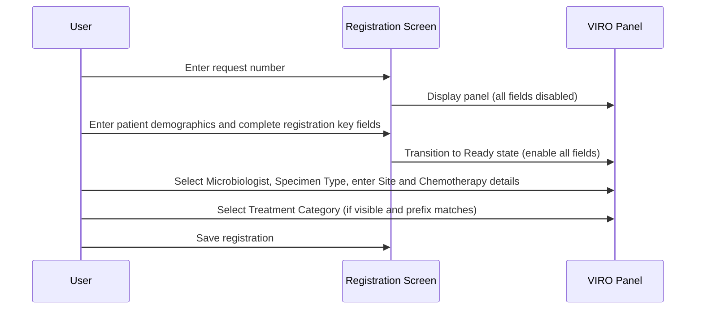

# MICR / VIRO Panel

## Overview

The MICR Panel and VIRO Panel are discipline-specific information panels that appear on the Registration screen when the current request belongs to the Microbiology (MICR) or Virology (VIRO) laboratory respectively. Each panel collects clinical and specimen information relevant to the discipline, including the responsible microbiologist, specimen type, site details, chemotherapy history, and treatment category. The panels share the same visual layout and field set but are bound to their respective laboratory's keyword dictionaries. Fields are disabled until the request reaches the Ready state, ensuring data entry occurs only after the request is properly identified.

---

## Related User Stories

- **[[CRST-463]]** - Registration - MICR/VIRO Panel Enablement
- **[[CRST-459]]** - Registration - MICR/VIRO Panel (field content detail)

**Epic:** LISP-23 [CRST][DEV] Registration - Patient Handling

---

## Key Concepts

### MICR Panel
Shown when the current request is assigned to the Microbiology laboratory (lab number 7). Keyword lists (Microbiologist, Specimen Type, Treatment Category) are loaded from the Microbiology keyword dictionary.

### VIRO Panel
Shown when the current request is assigned to the Virology laboratory (lab number 8). Keyword lists are loaded from the Virology keyword dictionary. The Chemotherapy field uses a plain free-text area rather than the specialised antibiotics input used in the MICR panel.

### Treatment Category (Two-Gate Visibility and Enablement)
The Treatment Category field is subject to two independent conditions before it is usable:
1. **Visibility gate:** The `TREATMENT_CATEGORY_VISIBLE` lab option must be enabled. If it is not, the field and its label are hidden and the user never sees them.
2. **Enablement gate:** Even when visible, the field is only enabled if the lab prefix of the current request number is included in the `LAB_PREFIXS_TO_ENABLE_TREATMENT_CATEGORY` configuration list. If the prefix is not listed, the field remains visible but disabled.

### Panel Trigger (REQUEST_FORMAT)
Each panel is triggered by matching the request format against the laboratory's configuration. The MICR panel activates when the request format is associated with lab number 7; the VIRO panel activates when the request format is associated with lab number 8. Both require the request number prefix to match and the lab hospital to match the configured value.

---

## Trigger Point

The MICR Panel appears after the request number is entered and the request format resolves to a Microbiology request (lab number 7, lab-no 99). The VIRO Panel appears under the same conditions for Virology requests (lab number 8, lab-no 99). In both cases the panel's fields remain disabled until the registration reaches the Ready state.

---

## Workflow Scenarios

### Scenario 1: Microbiology (MICR) Panel — Standard Registration Flow

#### Prerequisites
- The request format resolves to a Microbiology request (lab number 7).
- The request number prefix matches the configured lab prefix.
- The lab hospital matches the configured value.

#### Process Flow

#### Step-by-Step Details

1. When the request number is entered and the request format is identified as Microbiology, the MICR Panel is displayed in the lower portion of the Registration screen.
2. All fields on the panel are initially **disabled**. The user cannot enter any data until patient demographics and the registration key are completed.
3. When the registration reaches the **Patient Ready** state (patient identified but registration not yet completed), all panel fields remain disabled.
4. When the registration reaches the **Ready** state (all registration key information is complete), all fields become enabled:
   - **Microbiologist** — a dropdown populated from the Microbiology keyword dictionary.
   - **Specimen Type** — a required dropdown populated from the Microbiology keyword dictionary. If a prior registration record exists for this request, the system automatically pre-fills the Specimen Type from that record.
   - **Site** — a free-text area (up to 255 characters).
   - **Chemotherapy used** — a specialised antibiotics free-text area (up to 255 characters) for recording chemotherapy or antibiotic details.
   - **Treatment Category** — a dropdown populated from the Microbiology keyword dictionary. This field is only enabled if the request number's lab prefix appears in the **Treatment Category Prefix** configuration list (see Configuration section). If the prefix is not listed, the field remains visible but disabled.
5. The Treatment Category field and its label are only visible if the **Treatment Category Visible** lab option is enabled. If it is disabled, the field is completely hidden.
6. The user completes the relevant fields and saves the registration. No panel fields are mandatory except **Specimen Type**, which is marked as required.

---

### Scenario 2: Virology (VIRO) Panel — Standard Registration Flow

#### Prerequisites
- The request format resolves to a Virology request (lab number 8).
- The request number prefix matches the configured lab prefix.
- The lab hospital matches the configured value.

#### Process Flow

#### Step-by-Step Details

1. When the request number is entered and the request format is identified as Virology, the VIRO Panel is displayed.
2. All fields are disabled initially and remain disabled through the Patient Ready state — the behaviour is identical to the MICR Panel.
3. When the registration reaches the **Ready** state, all fields become enabled. The field set is the same as MICR with one difference:
   - **Chemotherapy used** — uses a plain free-text area (instead of the specialised antibiotics area used on the MICR Panel). Data is still entered as free text up to 255 characters.
   - All other fields (Microbiologist, Specimen Type, Site, Treatment Category) behave identically to the MICR Panel using the Virology keyword dictionary.
4. Specimen Type is auto-filled from prior registration data if available, and is marked as required.
5. Treatment Category visibility and enablement follow the same two-gate logic as MICR (see Key Concepts above), but evaluated against the Virology lab options.

---

## Visual Layout

Both the MICR Panel and VIRO Panel share the same visual structure — a vertically stacked form panel approximately 430 pixels wide:

| Position | Element | Notes |
|---|---|---|
| Top | **Microbiologist** label + dropdown | Optional field |
| Below Microbiologist | **Specimen Type** label + dropdown | Required field; label marked with required indicator |
| Below Specimen Type | **Site** label + text area | Free text; height ~150 pixels |
| Below Site | **Chemotherapy used** label + text area | Free text; height ~150 pixels; MICR uses specialised antibiotics input; VIRO uses plain text area |
| Below Chemotherapy | **Treatment Category** label + dropdown | Conditionally visible and conditionally enabled (see Key Concepts) |

---

## Field Summary

| Field | Type | Required | Keyword Source | Notes |
|---|---|---|---|---|
| Microbiologist | Dropdown | No | `MICRO_DOC` / lab number | Populated from lab's keyword dictionary |
| Specimen Type | Dropdown | Yes | `SPECIMEN` / lab number | Auto-filled from prior registration data if available |
| Site | Text area | No | — | Free text, max 255 characters |
| Chemotherapy used | Text area | No | — | MICR: specialised antibiotics area; VIRO: plain text area. Max 255 characters |
| Treatment Category | Dropdown | No | `TREATMENT` / lab number | Conditionally visible; conditionally enabled by lab prefix |

---

## Field Enablement States

| State | Microbiologist | Specimen Type | Site | Chemotherapy | Treatment Category |
|---|---|---|---|---|---|
| Initial | Disabled | Disabled | Disabled | Disabled | Disabled |
| Patient Ready | Disabled | Disabled | Disabled | Disabled | Disabled |
| Ready | Enabled | Enabled | Enabled | Enabled | Enabled if prefix matches; otherwise Disabled |

> Treatment Category is only shown at all when the **Treatment Category Visible** option is enabled (see Configuration). When hidden, the entire field and its label are removed from the panel.

---

## Configuration

Both the MICR and VIRO panels share the same set of configuration options. Options are loaded per lab number — MICR reads from lab 7 options, VIRO reads from lab 8 options.

| Setting | Option Code | Purpose | Effect when enabled | Effect when disabled |
|---------|------------|---------|--------------------|--------------------|
| Treatment Category Visible | `TREATMENT_CATEGORY_VISIBLE` | Controls whether the Treatment Category field is shown on the panel | Treatment Category field and label are visible | Treatment Category field and label are hidden |
| Treatment Category Prefix List | `LAB_PREFIXS_TO_ENABLE_TREATMENT_CATEGORY` | Comma-separated list of lab prefixes for which Treatment Category is enabled | Treatment Category is enabled when current request prefix is in the list | Treatment Category is visible but disabled for all requests |
| Request Level Tests | `REQUEST_LEVEL_TESTS` | Defines which tests are applied at the request level rather than specimen level | Request-level test codes are configured | No request-level tests configured |
| Infection Control Comment Visible | `VISIBLE` / `MBS_INF_CTRL_COM` | Controls whether the Infection Control Comment field is shown | Infection Control Comment field is displayed | Field is hidden |
| Infection Control Comment Test | `INF_CTRL_COM` / `MBS_INF_CTRL_COM` | Identifies the test code associated with the infection control comment | Infection control comment is linked to the specified test | No infection control comment test linkage |

---

## Business Rules

1. Both the MICR Panel and VIRO Panel fields are fully disabled in the Initial and Patient Ready states. Data entry is only permitted once the registration reaches the Ready state.
2. Specimen Type is a required field. The user must select a value before registration can be saved.
3. If the request has a prior registration record, the system automatically pre-fills the **Specimen Type** field with the value from that record. The user may change it.
4. Treatment Category is subject to two independent conditions: (a) the lab option `TREATMENT_CATEGORY_VISIBLE` must be enabled, and (b) the current request number's lab prefix must appear in the `LAB_PREFIXS_TO_ENABLE_TREATMENT_CATEGORY` list. Both conditions must be true for the field to be enabled.
5. A lab prefix of `0` in `LAB_PREFIXS_TO_ENABLE_TREATMENT_CATEGORY` does not imply "all prefixes" — only exact prefix matches are evaluated.
6. The MICR Panel uses a specialised antibiotics text area for the **Chemotherapy used** field. The VIRO Panel uses a plain text area for the same field. Both accept free text up to 255 characters.
7. Keyword lists (Microbiologist, Specimen Type, Treatment Category) are loaded from the keyword dictionary of the respective lab — lab 7 for MICR, lab 8 for VIRO. The two panels do not share keyword data.

---

## Related Workflows

- [[Default Opening Behaviour]] — Describes the initial disabled state of all lab-specific panels when the Registration screen first opens.
- [[Request No. Enablement after Registration Key Input]] — Describes the state transitions (Initial → Patient Ready → Ready) that govern when panel fields become enabled.
- [[ANAT Panel]] — A lab-specific panel with similar enablement logic for the Anatomical Pathology laboratory.
- [[BBNK Panel]] — A lab-specific panel with similar enablement logic for the Blood Bank laboratory.
