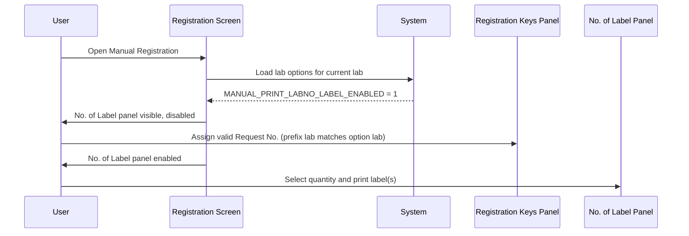
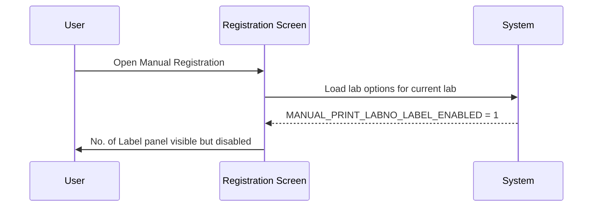
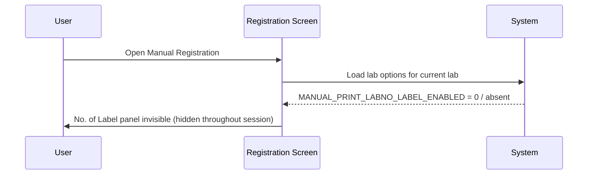

# No. of Label Panel

## Overview

The **No. of Label** panel is a small control on the Manual Registration screen that allows registration staff to specify how many Request No. labels to print and to trigger the printing. The panel contains a numeric stepper (for selecting the label quantity) and a reprint button. Its visibility is driven entirely by a lab option — if the option is disabled or absent, the panel is never shown. When the option is enabled, the panel is visible but disabled until the registration reaches the Ready state (i.e., a valid request number has been assigned and the prefix lab matches the option's lab configuration).

---

## Related User Stories

- **[[CRST-486]]** - Registration - Request No. Labeller Control Enablement

**Epic:** LISP-25 [CRST][DEV] Registration - Screen Object Enablement

---

## Key Concepts

### Request No. Label
A barcode label printed for a specific request number. The label carries patient demographics, request number, test description, site, urgency/reprint indicators, and other contextual data. Multiple copies may be printed in a single operation, each appended with a sequential letter suffix (e.g., -A, -B, -C).

### No. of Label (Numeric Stepper)
An input control on the panel that lets the user choose how many label copies to print. The value resets to zero when the screen is cleared.

### Reprint Button
A button within the panel. Its visibility is controlled at construction time and is separate from the overall panel enablement rules covered in this document.

### Lab Number Matching
The option is stored per lab number in `LAB_OPTION`. For the panel to be visible and enabled, the lab number of the request prefix assigned during registration (i.e., the lab that owns the prefix format) must match the lab number against which the option is configured. This means the panel's availability is specific to the lab whose request formats are in use.

---

## Trigger Point

The panel visibility is determined when the Manual Registration screen loads its configuration (the dictionary/options are parsed at that point). From that moment the panel is either permanently invisible (option disabled) or visible-but-disabled for the session, until a valid request number is assigned.

---

## Workflow Scenarios

### Scenario 1: Option enabled — Ready state reached with matching prefix lab

#### Prerequisites
- `LAB_OPTION [option_group = 'REQUEST_REGISTRATION', option_code = 'MANUAL_PRINT_LABNO_LABEL_ENABLED', option_value = 1]` exists.
- The lab number of the assigned request prefix matches the lab number against which the option is configured.
- The screen has transitioned to the Ready state (valid request number assigned).

#### Process Flow

#### Step-by-Step Details

1. The user opens the Manual Registration screen.
2. The system loads the lab options for the current lab. Because **Manual Print Label No. Label** is enabled, the **No. of Label** panel is made visible but remains disabled.
3. The user enters and validates a registration key (Encounter No. or HKID), then assigns a valid request number whose prefix belongs to a lab that matches the option's lab configuration.
4. The screen transitions to the Ready state. The **No. of Label** panel becomes enabled.
5. The user sets the desired quantity using the numeric stepper within the panel.
6. The user initiates printing. The system prints the specified number of Request No. labels, each appended with a sequential letter suffix (e.g., -A, -B for two copies).

---

### Scenario 2: Option enabled — screen open, not yet in Ready state

#### Prerequisites
- `LAB_OPTION [option_group = 'REQUEST_REGISTRATION', option_code = 'MANUAL_PRINT_LABNO_LABEL_ENABLED', option_value = 1]` exists.
- The screen has just been opened and no valid request number has been assigned yet.

#### Process Flow

#### Step-by-Step Details

1. The user opens the Manual Registration screen.
2. The system detects the option is enabled and makes the **No. of Label** panel visible.
3. The panel remains disabled — the user cannot interact with it — until the screen reaches the Ready state.

---

### Scenario 3: Option disabled or absent — panel invisible throughout

#### Prerequisites
- `LAB_OPTION [option_group = 'REQUEST_REGISTRATION', option_code = 'MANUAL_PRINT_LABNO_LABEL_ENABLED']` either does not exist or has `option_value = 0`.

#### Process Flow

#### Step-by-Step Details

1. The user opens the Manual Registration screen.
2. The system detects the option is disabled or absent. The **No. of Label** panel is hidden and remains invisible for the entire session, regardless of which request number is assigned.

---

## Panel State Summary

| Screen State | Option Enabled | Panel Visible | Panel Enabled |
|---|---|---|---|
| Initial (screen just opened) | Yes | Yes | No |
| Patient Ready (key validated, no Req No. yet) | Yes | Yes | No |
| Ready (valid Req No. assigned, prefix lab matches) | Yes | Yes | Yes |
| Any state | No | No | No (irrelevant) |

---

## Configuration

| Setting | Option Code | Purpose | Effect when enabled | Effect when disabled |
|---|---|---|---|---|
| Manual Print Label No. Label | `MANUAL_PRINT_LABNO_LABEL_ENABLED` | Controls whether the No. of Label panel is shown on the Manual Registration screen | No. of Label panel is visible (disabled until Ready state) | No. of Label panel is invisible throughout the session |

> The option is evaluated per lab number. The panel is only enabled for requests whose prefix lab number matches the lab number against which this option is configured.

---

## Business Rules

1. The **No. of Label** panel is invisible by default when the Manual Registration screen opens if the **Manual Print Label No. Label** option is disabled or absent for the current lab.
2. When the option is enabled, the panel is visible but disabled from the moment the screen opens, until the screen reaches the Ready state.
3. The panel becomes enabled only when the screen is in the Ready state **and** the assigned request prefix belongs to a lab whose number matches the lab number of the option configuration.
4. The panel is disabled (along with all other interactive screen controls) whenever the screen transitions out of the Ready state (e.g., after saving or clearing).
5. The numeric stepper value resets to zero whenever the screen is cleared.
6. Multiple label copies may be printed in a single operation; each copy is appended with a sequential letter suffix (-A through -J for up to 10 copies).

---

## Related Workflows

- [[Default Opening Behaviour]] — The No. of Label panel is either invisible (option disabled) or visible but disabled when the screen first opens.
- [[Request No. Enablement after Registration Key Input]] — The No. of Label panel becomes enabled as part of the Ready state transition after a valid request number is assigned (when the option is enabled for the lab).
