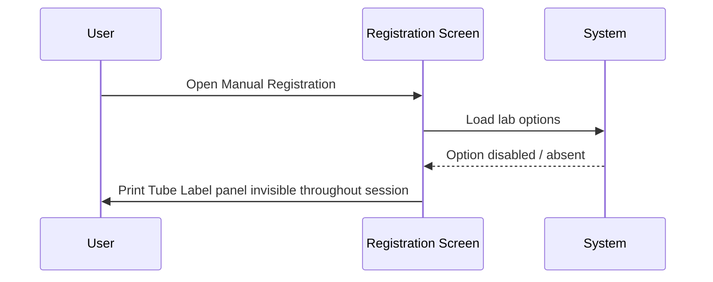

# Print Tube Label Panel

## Overview

The **Print Tube Label** panel is a control on the Manual Registration screen that allows registration staff to trigger the printing of tube labels for a registered request. Its visibility depends on two conditions evaluated at screen load time: the **Tube Label Printing** lab option must be enabled, and the user's current workstation must be listed among the workstations authorised in that option's configuration. If either condition is not met, the panel remains invisible for the entire session. When both conditions are satisfied, the panel is visible but disabled until the registration reaches the Ready state (i.e., a valid request number has been assigned with a prefix lab that matches the option's lab configuration).

---

## Related User Stories

- **[[CRST-487]]** - Registration - Tube Label Print Enablement

**Epic:** LISP-25 [CRST][DEV] Registration - Screen Object Enablement

---

## Key Concepts

### Tube Label
A specimen tube label printed for a specific registered request. The label content is derived from the request's lab result data.

### Workstation (Station Code)
Each physical terminal or workstation running the CRS application has a unique Workstation ID (also called station code). The Tube Label Printing option records a list of authorised workstation IDs in its `option_text` field. The panel is only shown on workstations whose ID appears in this list.

### Lab Number Matching
The option is stored per lab number in `LAB_OPTION`. For the panel to be visible and enabled, the lab number of the assigned request prefix (i.e., the lab that owns the prefix format) must match the lab number against which the option is configured.

### Dual-Gate Visibility
Unlike most lab-option-controlled panels, the Print Tube Label panel has two independent visibility gates: the option must be enabled **and** the current workstation must be authorised. Both must be true for the panel to appear.

---

## Trigger Point

Visibility is determined when the Manual Registration screen loads its lab configuration. At that point the system checks whether the Tube Label Printing option is enabled for the current lab and whether the user's workstation ID is in the authorised list. The panel's visibility is set at that moment and does not change for the remainder of the session.

---

## Workflow Scenarios

### Scenario 1: Option enabled, workstation authorised — Ready state reached

#### Prerequisites
- `LAB_OPTION [option_group = 'REQUEST_REGISTRATION', option_code = 'TUBE_LABEL_PRINTING_ENABLED', option_enable = 'Y']` exists.
- The current workstation ID is listed in the option's workstation configuration (`option_text`).
- The screen has transitioned to the Ready state (valid request number assigned, prefix lab matches option lab).

#### Process Flow

```mermaid
sequenceDiagram
    User->>Registration Screen: Open Manual Registration
    Registration Screen->>System: Load lab options; check workstation ID
    System-->>Registration Screen: Option enabled + workstation authorised
    Registration Screen->>User: Print Tube Label panel visible, disabled
    User->>Registration Keys Panel: Assign valid Request No. (prefix lab matches option lab)
    Registration Screen->>User: Print Tube Label panel enabled
    User->>Print Tube Label Panel: Initiate tube label printing
    Registration Screen->>Printer: Send tube label content
```

#### Step-by-Step Details

1. The user opens the Manual Registration screen.
2. The system loads the lab options and evaluates the Tube Label Printing option for the current lab. It also checks whether the current workstation ID appears in the option's authorised workstation list.
3. Because both conditions are met, the **Print Tube Label** panel is made visible but remains disabled.
4. The user enters and validates a registration key, then assigns a valid request number whose prefix belongs to a lab that matches the option's lab configuration.
5. The screen transitions to the Ready state. The **Print Tube Label** panel becomes enabled.
6. The user triggers tube label printing from the panel. The system sends the label content (derived from the lab result data for the registered request) to the tube label printer.

---

### Scenario 2: Option enabled, workstation authorised — pre-Ready state

#### Prerequisites
- `LAB_OPTION [option_group = 'REQUEST_REGISTRATION', option_code = 'TUBE_LABEL_PRINTING_ENABLED', option_enable = 'Y']` exists.
- The current workstation ID is listed in the option's workstation configuration.
- The screen has just been opened; no valid request number has been assigned yet.

#### Process Flow

```mermaid
sequenceDiagram
    User->>Registration Screen: Open Manual Registration
    Registration Screen->>System: Load lab options; check workstation ID
    System-->>Registration Screen: Option enabled + workstation authorised
    Registration Screen->>User: Print Tube Label panel visible but disabled
```

#### Step-by-Step Details

1. The user opens the Manual Registration screen.
2. Both conditions are satisfied, so the **Print Tube Label** panel is made visible.
3. The panel remains disabled — the user cannot interact with it — until the screen reaches the Ready state after a valid request number is assigned.

---

### Scenario 3: Option disabled

#### Prerequisites
- `LAB_OPTION [option_group = 'REQUEST_REGISTRATION', option_code = 'TUBE_LABEL_PRINTING_ENABLED', option_enable = 'N']` or the option does not exist.

#### Process Flow



#### Step-by-Step Details

1. The user opens the Manual Registration screen.
2. The system detects that the Tube Label Printing option is disabled or absent. The **Print Tube Label** panel is hidden and remains invisible for the entire session, regardless of workstation or request number.

---

### Scenario 4: Option enabled, but workstation not authorised

#### Prerequisites
- `LAB_OPTION [option_group = 'REQUEST_REGISTRATION', option_code = 'TUBE_LABEL_PRINTING_ENABLED', option_enable = 'Y']` exists.
- The current workstation ID is **not** listed in the option's workstation configuration.

#### Process Flow

```mermaid
sequenceDiagram
    User->>Registration Screen: Open Manual Registration
    Registration Screen->>System: Load lab options; check workstation ID
    System-->>Registration Screen: Option enabled but workstation not authorised
    Registration Screen->>User: Print Tube Label panel invisible throughout session
```

#### Step-by-Step Details

1. The user opens the Manual Registration screen.
2. The system detects that, although the option is enabled, the current workstation ID does not appear in the authorised list. The **Print Tube Label** panel is hidden and remains invisible for the entire session.

---

## Panel State Summary

| Screen State | Option Enabled | Workstation Authorised | Panel Visible | Panel Enabled |
|---|---|---|---|---|
| Initial (screen just opened) | Yes | Yes | Yes | No |
| Patient Ready (key validated, no Req No. yet) | Yes | Yes | Yes | No |
| Ready (valid Req No. assigned, prefix lab matches) | Yes | Yes | Yes | Yes |
| Any state | Yes | No | No | No |
| Any state | No | Yes or No | No | No |

---

## Configuration

| Setting | Option Code | Purpose | Effect when enabled (Y) | Effect when disabled (N) / absent |
|---|---|---|---|---|
| Tube Label Printing | `TUBE_LABEL_PRINTING_ENABLED` | Controls whether the Print Tube Label panel is shown on the Manual Registration screen, and specifies which workstations are permitted to use it | Print Tube Label panel visible (disabled until Ready) for authorised workstations | Print Tube Label panel invisible throughout the session |

> The option's `option_text` field holds a list of authorised Workstation IDs. The panel is only visible on workstations whose ID matches an entry in this list. The option is also evaluated per lab number — only requests whose prefix lab matches the option's lab configuration will activate the panel.

---

## Business Rules

1. The **Print Tube Label** panel is invisible by default when the Manual Registration screen opens if the Tube Label Printing option is disabled or absent.
2. Even when the option is enabled, the panel is invisible if the current user's workstation is not in the list of authorised workstations recorded in the option configuration.
3. When both conditions are met (option enabled and workstation authorised), the panel is visible but disabled from the moment the screen opens, until the screen reaches the Ready state.
4. The panel becomes enabled only when the screen is in the Ready state **and** the assigned request prefix belongs to a lab whose number matches the lab number of the option configuration.
5. The panel is disabled (along with all other interactive screen controls) whenever the screen transitions out of the Ready state (e.g., after saving or clearing).
6. The workstation check is performed at screen load time; it is not re-evaluated mid-session if the workstation configuration changes.

---

## Related Workflows

- [[Default Opening Behaviour]] — The Print Tube Label panel is either invisible (option disabled or workstation not authorised) or visible but disabled when the screen first opens.
- [[Request No. Enablement after Registration Key Input]] — The Print Tube Label panel becomes enabled as part of the Ready state transition after a valid request number is assigned (when the option is enabled and the workstation is authorised).
