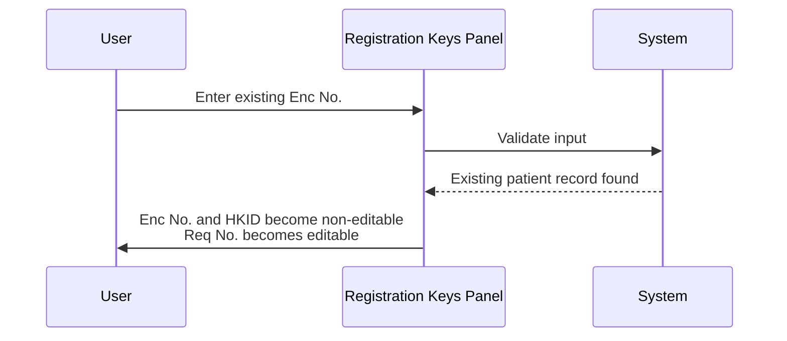
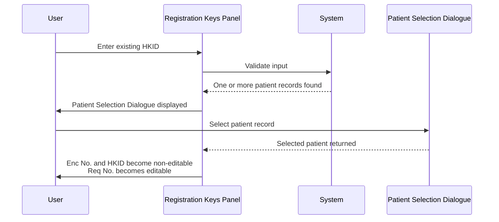

# Request No. Enablement after Registration Key Input

## Overview

After the user enters a value in the Registration Keys Panel (either an Encounter No. or an HKID), the system validates the input. When validation passes, the screen transitions to a patient-ready state in which the **Req No.** field becomes editable so the user can assign a new request number. The Encounter No. and HKID fields become non-editable at this point, locking the registration key that was used. The Patient Demographics Panel, Request Information Panel, and Test Panel remain disabled until a valid request number is entered.

---

## Related User Stories

- **[[CRST-457]]** - Registration - Request No. Enablement after Registration Key Input

**Epic:** LISP-25 [CRST][DEV] Registration - Screen Object Enablement

---

## Key Concepts

### New Encounter No. / New HKID
An Encounter No. or HKID that does not yet exist in the local patient database. The system creates a new patient or new episode on this basis.

### Existing Encounter No. / Existing HKID
An Encounter No. or HKID that already exists in the local patient database. The system retrieves the corresponding patient record.

### Percent-prefixed HKID
A HKID value beginning with the `%` character (e.g., `%XXXXX`) is treated as a valid new HKID for patients who do not have a standard identity card number.

### Patient-Ready State
The intermediate screen state entered after a registration key has been validated. In this state, the Req No. field is editable but all other panels (Patient Demographics, Request Information, Test) are still disabled.

---

## Trigger Point

This workflow begins immediately after the user enters a value in the **Enc No.** or **HKID** field and the system completes its validation. The trigger is the successful validation of the registration key — whether the key is new or existing.

---

## Workflow Scenarios

### Scenario 1: New Encounter No. or New HKID entered

#### Prerequisites
- The Manual Registration screen is open in its default initial state.
- The user has typed an Encounter No. or HKID that does not exist in the local patient database.
- The system has validated the input as a new, unrecognised key.

#### Process Flow

```mermaid
sequenceDiagram
    User->>Registration Keys Panel: Enter new Enc No. or new HKID
    Registration Keys Panel->>System: Validate input
    System-->>Registration Keys Panel: New patient / new episode confirmed
    Registration Keys Panel->>User: Enc No. and HKID become non-editable; Req No. becomes editable
```

#### Step-by-Step Details

1. The user types a new Encounter No. in the **Enc No.** field, or a new HKID (including a percent-prefixed value) in the **HKID** field, and confirms the entry.
2. The system validates that the value does not match any existing patient record.
3. The screen transitions to the patient-ready state:
   - The **Enc No.** field becomes non-editable.
   - The **HKID** field becomes non-editable.
   - The **Req No.** field becomes editable, allowing the user to enter a new request number.
4. The Patient Demographics Panel, Request Information Panel, and Test Panel remain disabled.

---

### Scenario 2: Existing Encounter No. entered

#### Prerequisites
- The Manual Registration screen is open in its default initial state.
- The user has typed an Encounter No. that already exists in the patient database.

#### Process Flow



#### Step-by-Step Details

1. The user types an existing Encounter No. in the **Enc No.** field and confirms the entry.
2. The system validates the value and finds a matching patient record.
3. The screen transitions to the patient-ready state:
   - The **Enc No.** field becomes non-editable.
   - The **HKID** field becomes non-editable.
   - The **Req No.** field becomes editable.
4. The Patient Demographics Panel, Request Information Panel, and Test Panel remain disabled until a valid request number is entered.

---

### Scenario 3: Existing HKID entered

#### Prerequisites
- The Manual Registration screen is open in its default initial state.
- The user has typed an HKID that already exists in the patient database.

#### Process Flow



#### Step-by-Step Details

1. The user types an existing HKID in the **HKID** field and confirms the entry.
2. The system validates the value and finds one or more matching patient records.
3. If multiple records exist, the [[Patient Selection Dialogue]] is displayed for the user to choose the correct patient episode.
4. After the patient record is selected (or confirmed), the screen transitions to the patient-ready state:
   - The **Enc No.** field becomes non-editable.
   - The **HKID** field becomes non-editable.
   - The **Req No.** field becomes editable.
5. The Patient Demographics Panel, Request Information Panel, and Test Panel remain disabled until a valid request number is entered.

---

## Registration Keys Panel — State Summary

| Field | Initial State | Patient-Ready State |
|---|---|---|
| Enc No. | Editable | Non-editable |
| Req No. | Non-editable | **Editable** |
| HKID | Editable | Non-editable |

---

## Panels Enabled After Req No. Entry

Once the user enters a valid request number, the screen transitions to the ready state and the following panels become active:

| Panel | State After Valid Req No. |
|---|---|
| Patient Demographics Panel | Enabled |
| Request Information Panel | Enabled |
| Test Panel | Visible and enabled |

> For the detailed enablement rules that apply within these panels in the ready state, see [[Patient Demographics Panel]], [[Request Information Panel]], and the related CRST user stories.

---

## Business Rules

1. The Req No. field only becomes editable after the system has successfully validated a registration key (Enc No. or HKID) — whether it is new or existing.
2. Once the patient-ready state is reached, both the Enc No. and HKID fields are locked (non-editable) to prevent the registration key from being changed mid-workflow.
3. A HKID prefixed with `%` is accepted as a valid new HKID.
4. One HKID may be associated with multiple Encounter Numbers (i.e., multiple patient episodes).
5. The Patient Demographics Panel, Request Information Panel, and Test Panel remain disabled until a valid Req No. has been entered, regardless of which registration key pathway was used.

---

## Related Workflows

- [[Retrieve Patient by HKID]] — Describes the full HKID validation and patient retrieval process that leads to the patient-ready state via the HKID pathway.
- [[Retrieve Patient by Encounter Number]] — Describes the full Encounter No. validation and patient retrieval process that leads to the patient-ready state via the Enc No. pathway.
- [[Create New Patient by HKID]] — Describes the new patient creation path, which also results in the Req No. field becoming editable.
- [[Default Opening Behaviour]] — Describes the screen state before any registration key input is made.
- [[Patient Demographics Panel]] — Documents the enablement rules applied to the Patient Demographics Panel once the Req No. is assigned.
- [[Request Information Panel]] — Documents the enablement rules applied to the Request Information Panel once the Req No. is assigned.
- [[Input Specimen No. Button]] — The Input Specimen No. button's enablement is evaluated when the registration reaches the Ready state after request number assignment.
- [[Sendout Button]] — The Sendout button becomes enabled as part of the Ready state transition after a valid request number is assigned (when the Sendout option is enabled for the lab).
