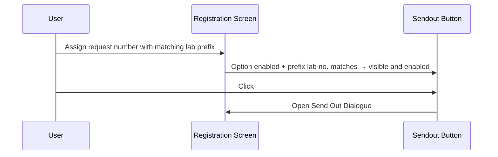
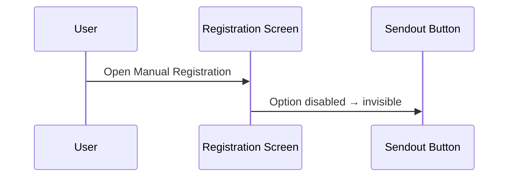

# Sendout Button

## Overview

The **Sendout** button is a Registration screen control that opens the Send Out Dialogue, allowing staff to register a request as a send-out (i.e., forwarded to an external laboratory). The button's visibility and enablement are governed by a lab option and the lab prefix of the assigned request number. It is invisible by default if the Sendout feature is not configured, and is visible but disabled until the registration reaches the Ready state with a matching lab prefix.

---

## Related User Stories

- **[[CRST-485]]** - Registration - Sendout Button Enablement

**Epic:** LISP-25 [CRST][DEV] Registration - Screen Object Enablement

---

## Key Concepts

### Sendout Function
A feature that allows a lab request to be forwarded to an external laboratory as part of registration. Not all labs offer this functionality — it is controlled per laboratory via a lab option.

### Lab Prefix and Lab Number Matching
When the user assigns a request number, the system identifies the lab number associated with that request's prefix via the Request Format configuration (`REQUEST_FORMAT.reqfmt_lab`). The Sendout button is only enabled when this lab number matches the lab number (`LAB_OPTION.option_labno`) under which the `SENDOUT_FUNCTION_ENABLED` option is set.

---

## Trigger Point

The Sendout button's visibility is determined when the Registration screen loads its dictionary settings. Its enabled state is re-evaluated each time the registration transitions to the Ready state (after a valid request number has been assigned and a matching lab prefix is confirmed).

---

## Workflow Scenarios

### Scenario 1: Sendout Feature Enabled — Button Visible and Enabled

#### Prerequisites
- `SENDOUT_FUNCTION_ENABLED` lab option is enabled (`option_value = 1`) for the relevant lab number.
- The registration screen has reached the Ready state.
- The assigned request number's lab prefix resolves to a lab number that matches the lab number on which the Sendout option is configured.

#### Process Flow

#### Step-by-Step Details

1. When the registration dictionary is loaded, the system checks the `SENDOUT_FUNCTION_ENABLED` option for the current lab. If enabled, the **Sendout** button becomes visible (but still disabled).
2. The user assigns a valid request number. The system confirms the request's lab prefix resolves to the correct lab number.
3. When the registration reaches the Ready state, the **Sendout** button becomes enabled.
4. The user clicks the button to open the Send Out Dialogue and enter the send-out destination details.

---

### Scenario 2: Sendout Feature Enabled — Button Visible but Disabled (Before Ready)

#### Prerequisites
- `SENDOUT_FUNCTION_ENABLED` lab option is enabled (`option_value = 1`).
- The registration screen is in the Initial or Patient Ready state (no valid request number assigned yet).

#### Step-by-Step Details

1. Because the Sendout option is enabled, the **Sendout** button is visible on the screen when it opens.
2. However, the button is disabled in the Initial and Patient Ready states — the user cannot click it until a valid request number has been assigned.

---

### Scenario 3: Sendout Feature Disabled — Button Invisible

#### Prerequisites
- `SENDOUT_FUNCTION_ENABLED` lab option is disabled (`option_value = 0`) or does not exist for the current lab.

#### Process Flow

#### Step-by-Step Details

1. When the Sendout option is not enabled, the **Sendout** button is not shown on the Registration screen at all.
2. The button remains invisible regardless of which request number the user assigns or what state the registration is in.

---

## Button State Summary

| Screen State | Sendout Option Disabled | Sendout Option Enabled |
|---|---|---|
| Screen opens (Initial) | Invisible | Visible, **Disabled** |
| Patient Ready | Invisible | Visible, **Disabled** |
| Ready (prefix lab no. matches) | Invisible | Visible, **Enabled** |

---

## Configuration

| Setting | Option Code | Purpose | Effect when enabled | Effect when disabled |
|---------|------------|---------|--------------------|--------------------|
| Sendout Function | `SENDOUT_FUNCTION_ENABLED` (group: `REQUEST_REGISTRATION`) | Controls whether the Sendout button is shown and usable for the configured lab | Sendout button is visible; enabled in the Ready state when the request prefix lab number matches | Sendout button is invisible |

> The option is evaluated per lab number (`LAB_OPTION.option_labno`). The Sendout button is only enabled when the request number's prefix resolves to a lab number (`REQUEST_FORMAT.reqfmt_lab`) that matches the lab number on the Sendout option record.

---

## Business Rules

1. The Sendout button is invisible by default when the Registration screen opens if the `SENDOUT_FUNCTION_ENABLED` option is not set or is disabled.
2. If the `SENDOUT_FUNCTION_ENABLED` option is enabled, the button is visible from screen open but remains disabled until the Ready state is reached.
3. The button is disabled in the Initial and Patient Ready states regardless of the option setting.
4. In the Ready state, the button is enabled only if the request number's lab prefix maps to a lab number that matches the lab number on which the `SENDOUT_FUNCTION_ENABLED` option is configured.
5. The Sendout button's enabled state is controlled by the same mechanism that enables all other main registration controls at Ready state — it cannot be enabled in isolation.

---

## Related Workflows

- [[Default Opening Behaviour]] — The Sendout button is invisible (option disabled) or visible but disabled (option enabled) when the screen first opens.
- [[Request No. Enablement after Registration Key Input]] — The Sendout button becomes enabled as part of the overall Ready state transition after a valid request number is assigned.
