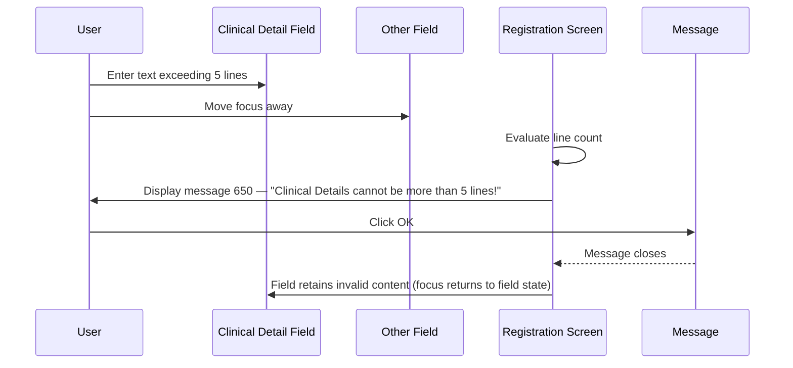
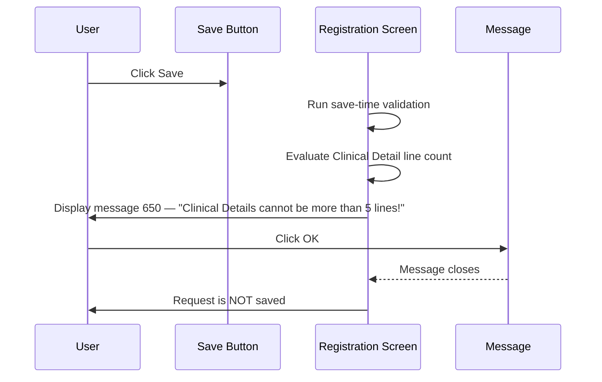

# Clinical Detail Line Limit Validation

## Overview

This workflow enforces a line limit on the **Clinical Detail** text area during manual lab request registration. When a user enters more than five lines of text in the **Clinical Detail** field, the system displays a warning message and prevents the request from being saved until the content is reduced to five lines or fewer. The rule exists to ensure that clinical detail data conforms to storage and downstream processing constraints.

---

## Related User Stories

- **[[CRST-537]]** - Registration - Line Limit for Clinical Detail

**Epic:** LISP-25 [CRST][DEV] Registration - Screen Object Enablement

---

## Key Concepts

### Line Count
The number of lines is determined by the number of newline characters (line breaks) in the **Clinical Detail** field. A single block of continuous text with no line breaks counts as one line.

### Five-Line Limit
The **Clinical Detail** field accepts a maximum of five lines. Content with exactly five lines or fewer is valid. Content with six or more lines triggers the validation message.

---

## Trigger Point

This workflow is triggered in two distinct situations:

1. **On focus change** — immediately after the user finishes editing the **Clinical Detail** field and moves focus to another field.
2. **On save** — when the user clicks the **Save** button while the **Clinical Detail** field still contains more than five lines of text.

---

## Workflow Scenarios

### Scenario 1: User Enters More Than Five Lines and Moves Focus Away

#### Prerequisites
- A lab request is open and ready for registration on the Manual Registration screen.
- The **Clinical Detail** field contains more than five lines of text.
- The user moves focus away from the **Clinical Detail** field to another field.

#### Process Flow



#### Step-by-Step Details

1. The user enters text into the **Clinical Detail** field that spans more than five lines (i.e., contains more than five line breaks).
2. The user moves focus to another field on the Registration screen.
3. The system evaluates the content of the **Clinical Detail** field.
4. Because the content exceeds five lines, the system displays message **650**: *"Clinical Details cannot be more than 5 lines!"*
5. The user clicks **OK** to dismiss the message.
6. The message closes. The field retains its current (invalid) content. The registration cannot proceed until the content is corrected.

---

### Scenario 2: User Clicks Save with More Than Five Lines in Clinical Detail

#### Prerequisites
- A lab request is open and ready for registration on the Manual Registration screen.
- All required request information has been filled in.
- The **Clinical Detail** field still contains more than five lines of text.
- The user clicks the **Save** button.

#### Process Flow



#### Step-by-Step Details

1. The user has completed all required fields and clicks **Save**.
2. The system runs its standard save-time validation sequence.
3. During validation, the system evaluates the content of the **Clinical Detail** field.
4. Because the content exceeds five lines, the system displays message **650**: *"Clinical Details cannot be more than 5 lines!"*
5. The user clicks **OK** to dismiss the message.
6. The message closes. The request is not saved. The user must reduce the **Clinical Detail** content to five lines or fewer before saving.

---

### Scenario 3: Clinical Detail Contains Five Lines or Fewer (No Validation Triggered)

#### Prerequisites
- A lab request is open and ready for registration on the Manual Registration screen.
- The **Clinical Detail** field contains five lines or fewer of text.

#### Process Flow

```mermaid
sequenceDiagram
    User->>Clinical Detail Field: Enter text with 5 lines or fewer
    User->>Other Field: Move focus away (or click Save)
    Registration Screen->>Registration Screen: Evaluate line count
    Registration Screen->>Registration Screen: Validation passes
    Note over Registration Screen: No message displayed; workflow continues normally
```

#### Step-by-Step Details

1. The user enters text into the **Clinical Detail** field that does not exceed five lines.
2. The user moves focus away or clicks **Save**.
3. The system evaluates the line count and finds it is within the allowed limit.
4. No message is displayed. The workflow continues normally, and the request can be saved.

---

## Summary Tables

### Validation Trigger Matrix

| Clinical Detail Line Count | Trigger Event | Message Displayed | Request Saved |
|---|---|---|---|
| ≤ 5 lines | Focus change | No | Yes (if all other validation passes) |
| ≤ 5 lines | Save button clicked | No | Yes (if all other validation passes) |
| > 5 lines | Focus change | Yes — message 650 | No |
| > 5 lines | Save button clicked | Yes — message 650 | No |

### Message Reference

| Message | Text | Trigger | User Options |
|---|---|---|---|
| 650 | "Clinical Details cannot be more than 5 lines!" | User moves focus away from Clinical Detail with > 5 lines, or clicks Save with > 5 lines | OK (dismiss) |

---

## Business Rules

1. The **Clinical Detail** field accepts a maximum of five lines. A "line" is defined by the presence of a newline (line break) character.
2. The five-line limit is evaluated both on focus change (when the user leaves the field) and on save (when the user attempts to submit the request).
3. When the limit is exceeded, the system displays message 650 and blocks further progress until the content is corrected.
4. Dismissing message 650 does not automatically clear or truncate the **Clinical Detail** field — the user must manually reduce the content.
5. If the **Clinical Detail** field contains five lines or fewer, no validation message is shown and the registration proceeds normally.

> **Note:** The five-line limit applies to Manual Registration. Amend Request has a separate validation rule (message 3734) for the same field, with different handling. See [[CRST-797]] for details.

---

## Related Workflows

- [[Pre-register Request Info Validation]] — The Clinical Detail line limit is one of several field-level validations applied when saving a registration request. See [[CRST-501]] for the broader validation context.
