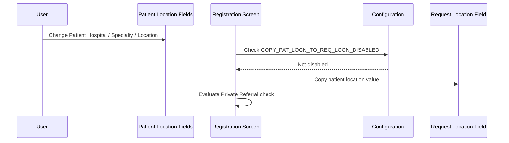
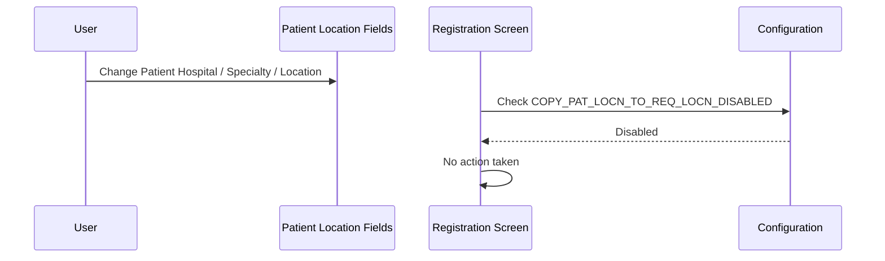

# Copy Patient Location to Request Location

## Overview

When a user updates the **Patient Hospital**, **Patient Specialty**, or **Patient Location** on the Registration screen, the system automatically copies the new patient location value into the corresponding **Request Location** fields. This keeps the request location in sync with the patient's physical location by default, reducing the need for staff to re-enter the same location in two places. The behaviour can be suppressed by a system configuration option. After any copy takes place, the system also evaluates the private referral check on the updated request location (see [[Location Interaction - Private Referral]]).

---

## Related User Stories

- **[[CRST-538]]** - Registration - Location Interaction - Copy Patient Location to Request Location

**Epic:** LISP-25 [CRST][DEV] Registration - Screen Object Enablement

---

## Key Concepts

### Patient Location Fields
The Registration screen contains three patient location sub-fields that together describe where the patient is located:

| Field | Description |
|---|---|
| Patient Hospital | The hospital the patient is admitted to or attending |
| Patient Specialty | The clinical specialty within the hospital |
| Patient Location | The specific ward, clinic, or office location |

### Request Location Field
A separate set of location fields on the Registration screen that indicates where the test request originated. By default, this mirrors the patient's location.

### Copy Behaviour
The automatic process by which the system populates the **Request Location** fields with the values currently entered in the **Patient Location** fields. This is triggered whenever any one of the three patient location sub-fields is changed.

---

## Trigger Point

The copy behaviour is triggered whenever the user modifies any of the following fields on the Registration screen:

- **Patient Hospital**
- **Patient Specialty**
- **Patient Location**

Changes made by direct text input and changes confirmed through a lookup dialogue both trigger the copy.

---

## Workflow Scenarios

### Scenario 1: Copy Is Not Disabled — User Updates Patient Location

#### Prerequisites
- The Registration screen is open with a valid request number loaded.
- The system configuration option `COPY_PAT_LOCN_TO_REQ_LOCN_DISABLED` is **not** set to `'Y'` (i.e., the copy behaviour is active).
- The user changes the **Patient Hospital**, **Patient Specialty**, or **Patient Location**.

#### Process Flow

#### Step-by-Step Details

1. The user changes the **Patient Hospital**, **Patient Specialty**, or **Patient Location** field.
2. The system checks the lab configuration to determine whether the copy behaviour has been disabled.
3. The configuration is not disabled — the copy is permitted.
4. The system copies the current patient location values into the **Request Location** fields, overwriting whatever was previously there.
5. The system then evaluates the private referral check against the updated request location. See [[Location Interaction - Private Referral]] for how this check works.

---

### Scenario 2: Copy Is Disabled — User Updates Patient Location

#### Prerequisites
- The Registration screen is open with a valid request number loaded.
- The system configuration option `COPY_PAT_LOCN_TO_REQ_LOCN_DISABLED` is set to `'Y'` (i.e., the copy behaviour is suppressed).
- The user changes the **Patient Hospital**, **Patient Specialty**, or **Patient Location**.

#### Process Flow

#### Step-by-Step Details

1. The user changes the **Patient Hospital**, **Patient Specialty**, or **Patient Location** field.
2. The system checks the lab configuration to determine whether the copy behaviour has been disabled.
3. The configuration is disabled — no copy is performed.
4. The **Request Location** fields remain unchanged.
5. The private referral check is not triggered.

---

## Behaviour Matrix

| Patient Location Field Changed | `COPY_PAT_LOCN_TO_REQ_LOCN_DISABLED` = `'Y'`? | Request Location Updated | Private Referral Check Triggered |
|---|---|---|---|
| Patient Hospital | No | Yes | Yes |
| Patient Specialty | No | Yes | Yes |
| Patient Location | No | Yes | Yes |
| Patient Hospital | Yes | No | No |
| Patient Specialty | Yes | No | No |
| Patient Location | Yes | No | No |

---

## Configuration

| Setting | Option Code | Purpose | Effect when enabled | Effect when disabled |
|---------|------------|---------|--------------------|--------------------|
| Disable Copy Patient Location to Request Location | `COPY_PAT_LOCN_TO_REQ_LOCN_DISABLED` | Controls whether changing the patient location fields automatically updates the request location | Patient location changes do **not** copy to the request location; request location and private referral are unaffected | Patient location changes **are** copied to the request location; private referral check runs after each copy |

---

## Business Rules

1. The copy is triggered by any change to any of the three patient location sub-fields: **Patient Hospital**, **Patient Specialty**, or **Patient Location**.
2. When the copy is performed, all patient location sub-field values are copied to the request location — not just the sub-field that was changed.
3. The private referral check always runs immediately after a successful copy. See [[Location Interaction - Private Referral]].
4. When the copy behaviour is disabled by configuration, no copy and no private referral check occurs as a result of patient location changes.
5. The copy behaviour applies regardless of whether the patient location was entered by direct text input or selected through a lookup dialogue.

---

## Related Workflows

- [[Location Interaction - Private Referral]] — After the patient location is copied to the request location, the private referral check evaluates whether the new request location is a private location and sets the **Private** dropdown accordingly.
