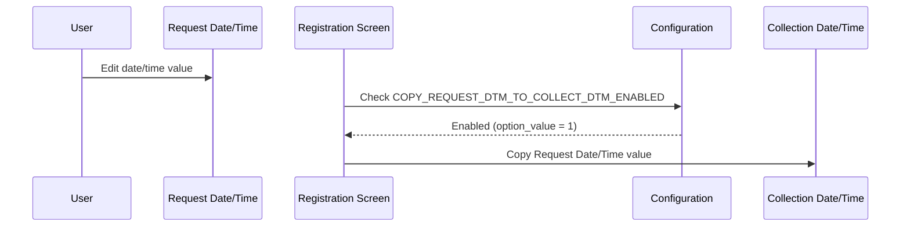
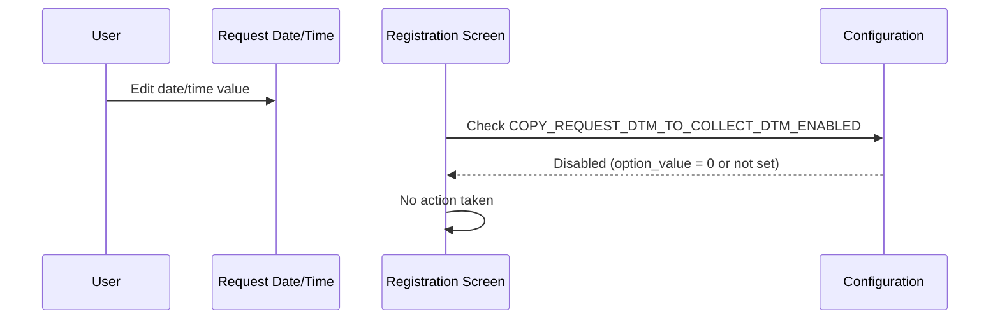

# Copy Request Date to Collection Date

## Overview

When a user edits the **Request Date/Time** field on the Manual Registration screen, the system automatically copies the newly entered date and time into the **Collection Date/Time** field. This behaviour is controlled by a lab-level configuration option and only applies when both the **Request Date/Time** and **Collection Date/Time** fields are visible on the screen. The feature saves staff from having to enter the same timestamp in two places when the request date and collection date are the same.

---

## Related User Stories

- **[[CRST-540]]** - Registration - Copy Request Date to Collection Date

**Epic:** LISP-25 [CRST][DEV] Registration - Screen Object Enablement

---

## Key Concepts

### Request Date/Time
The date and time field on the Registration screen that records when the lab request was made. Editing this field is the event that triggers the copy behaviour.

### Collection Date/Time
The date and time field on the Registration screen that records when the specimen was collected. This field receives the copied value when the feature is enabled.

### Lab-Level Configuration
The copy behaviour is configured individually per lab. The option is stored in `LAB_OPTION` with `option_group = 'REQUEST_REGISTRATION'` and `option_code = 'COPY_REQUEST_DTM_TO_COLLECT_DTM_ENABLED'`. The lab number of the active request prefix must match the lab number of the option record for the configuration to take effect.

---

## Trigger Point

The copy is triggered each time the user edits (modifies) the **Request Date/Time** field while the Manual Registration screen is open.

---

## Workflow Scenarios

### Scenario 1: Copy Option Enabled — User Edits Request Date/Time

#### Prerequisites
- The Manual Registration screen is open.
- Both **Request Date/Time** and **Collection Date/Time** fields are visible.
- The lab configuration option `COPY_REQUEST_DTM_TO_COLLECT_DTM_ENABLED` is set to `1` (enabled) for the lab matching the current request's lab number.

#### Process Flow

#### Step-by-Step Details

1. The user edits the **Request Date/Time** field on the Registration screen.
2. The system checks whether the `COPY_REQUEST_DTM_TO_COLLECT_DTM_ENABLED` option is enabled for the current lab.
3. The option is enabled.
4. The system copies the newly entered **Request Date/Time** value directly into the **Collection Date/Time** field, overwriting whatever value was previously there.

---

### Scenario 2: Copy Option Disabled — User Edits Request Date/Time

#### Prerequisites
- The Manual Registration screen is open.
- Both **Request Date/Time** and **Collection Date/Time** fields are visible.
- The lab configuration option `COPY_REQUEST_DTM_TO_COLLECT_DTM_ENABLED` is set to `0` (disabled) or not defined for the current lab.

#### Process Flow

#### Step-by-Step Details

1. The user edits the **Request Date/Time** field on the Registration screen.
2. The system checks whether the `COPY_REQUEST_DTM_TO_COLLECT_DTM_ENABLED` option is enabled for the current lab.
3. The option is disabled or not configured.
4. The **Collection Date/Time** field is not updated — it retains its current value.

---

## Behaviour Matrix

| `COPY_REQUEST_DTM_TO_COLLECT_DTM_ENABLED` | User Action | Collection Date/Time Updated? |
|---|---|---|
| Enabled (option_value = 1) | User edits Request Date/Time | Yes — copied from Request Date/Time |
| Disabled (option_value = 0) | User edits Request Date/Time | No |
| Not configured | User edits Request Date/Time | No |

---

## Configuration

| Setting | Option Code | Purpose | Effect when enabled | Effect when disabled |
|---------|------------|---------|--------------------|--------------------|
| Copy Request Date/Time to Collection Date/Time | `COPY_REQUEST_DTM_TO_COLLECT_DTM_ENABLED` | Controls whether editing the Request Date/Time automatically updates the Collection Date/Time | Collection Date/Time is overwritten with the Request Date/Time value each time the Request Date/Time is modified | Collection Date/Time is not affected when Request Date/Time is modified |

> The option is evaluated per lab. The lab number of the active request prefix must match the lab number associated with the option record.

---

## Business Rules

1. The copy is triggered on every edit of the **Request Date/Time** field — not just on the first entry.
2. The copy overwrites the current **Collection Date/Time** value without prompting the user.
3. The copy only occurs when the option is explicitly enabled (`option_value = 1`). If the option is absent or set to `0`, no copy is performed.
4. The configuration is lab-specific. The same registration screen may behave differently depending on which lab the current request belongs to.
5. This behaviour applies to the Manual Registration screen. See [[CRST-789]] for the equivalent behaviour on the Amend Request screen.

---

## Related Workflows

- [[Clinical Detail Line Limit Validation]] — Another field-level interaction that runs on the Registration screen when the user modifies a specific input field.
