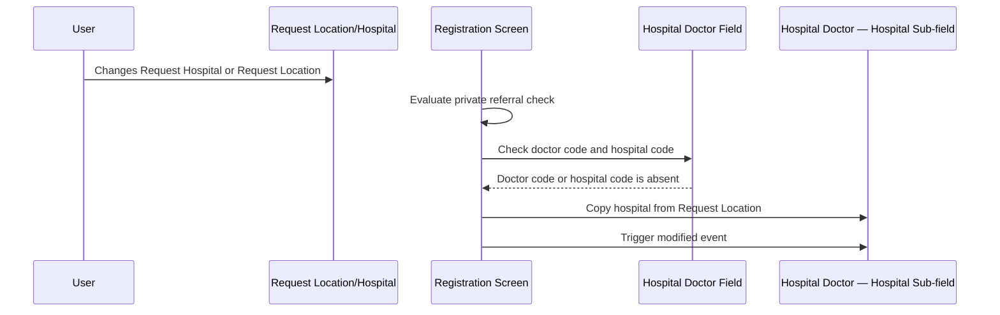
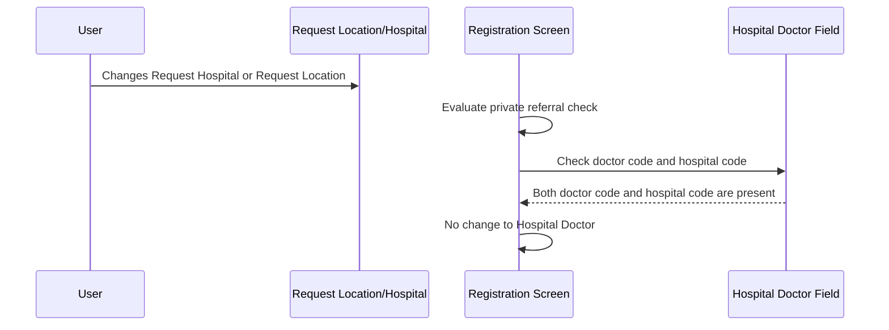

# Location Interaction — Change Doctor Hospital

## Overview

When a user updates the **Request Hospital** or **Request Location** on the Registration screen, the system automatically checks whether the **Hospital Doctor** field has been fully populated. If either the doctor code or the hospital code within the **Hospital Doctor** field is absent, the system copies the hospital from the **Request Location** into the hospital sub-field of the **Hospital Doctor** field. This ensures the doctor's hospital is kept in sync with the request location when no explicit doctor-hospital pairing has been established.

---

## Related User Stories

- **[[CRST-539]]** - Registration - Location Interaction - Change Doctor Hospital

**Epic:** LISP-25 [CRST][DEV] Registration - Screen Object Enablement

---

## Key Concepts

### Hospital Doctor Field
A composite field on the Registration screen that captures both a **doctor code** and a **hospital code** as a paired unit. It is used to record the doctor responsible for the request, qualified by the hospital they are attached to.

### Doctor Code (within Hospital Doctor)
The individual sub-field within **Hospital Doctor** that holds the doctor's identifier code. If this sub-field is blank, the Hospital Doctor field is considered incomplete.

### Hospital Code (within Hospital Doctor)
The individual sub-field within **Hospital Doctor** that holds the hospital code for the doctor's affiliation. If this sub-field is blank, the Hospital Doctor field is considered incomplete.

### Request Location Hospital
The hospital value derived from the currently selected **Request Location**. When the **Request Hospital** field is directly changed, or when the **Request Location** field is changed, this value reflects the newly selected hospital.

---

## Trigger Point

The doctor hospital synchronisation check is triggered whenever the user changes:

- **Request Hospital** (by direct text input or via lookup dialogue)
- **Request Location** (by direct text input or via lookup dialogue)

> Note: Changing **Request Specialty** does **not** trigger the doctor hospital check — it only triggers the private referral check.

The check always runs **after** the private referral check has been evaluated for the same field change.

---

## Workflow Scenarios

### Scenario 1: Hospital Doctor Is Incomplete — Request Hospital or Location Changed

#### Prerequisites
- The Registration screen is open.
- The **Hospital Doctor** field has either the doctor code, the hospital code, or both absent (i.e., the field has not been fully filled in).
- The user changes the **Request Hospital** or **Request Location**.

#### Process Flow

#### Step-by-Step Details

1. The user changes the **Request Hospital** or **Request Location** field (by direct entry or through a lookup dialogue).
2. The system evaluates the private referral check first (see [[Location Interaction - Private Referral]]).
3. The system then inspects the **Hospital Doctor** field:
   - It checks whether the doctor code sub-field is blank.
   - It checks whether the hospital code sub-field is blank.
4. At least one of the two sub-fields is blank — the **Hospital Doctor** field is incomplete.
5. The system copies the hospital value from the current **Request Location** into the hospital sub-field of the **Hospital Doctor** field.
6. The modified event is fired on the hospital sub-field, so any downstream behaviour dependent on the hospital doctor field is also triggered.

---

### Scenario 2: Hospital Doctor Is Fully Populated — Request Hospital or Location Changed

#### Prerequisites
- The Registration screen is open.
- The **Hospital Doctor** field has both doctor code and hospital code populated (the field is complete).
- The user changes the **Request Hospital** or **Request Location**.

#### Process Flow

#### Step-by-Step Details

1. The user changes the **Request Hospital** or **Request Location** field.
2. The system evaluates the private referral check.
3. The system inspects the **Hospital Doctor** field.
4. Both the doctor code sub-field and the hospital code sub-field are populated.
5. No action is taken — the **Hospital Doctor** field is left unchanged.

---

### Scenario 3: Request Specialty Changed

#### Prerequisites
- The user changes the **Request Specialty** field.

#### Step-by-Step Details

1. The user changes the **Request Specialty** field.
2. The system evaluates the private referral check only.
3. The doctor hospital check is **not** triggered — the **Hospital Doctor** field is unaffected.

---

## Behaviour Matrix

| Field Changed | Hospital Doctor — Doctor Code | Hospital Doctor — Hospital Code | Hospital Doctor Updated? |
|---|---|---|---|
| Request Hospital or Request Location | Blank | Blank | Yes — hospital copied from Request Location |
| Request Hospital or Request Location | Blank | Populated | Yes — hospital copied from Request Location |
| Request Hospital or Request Location | Populated | Blank | Yes — hospital copied from Request Location |
| Request Hospital or Request Location | Populated | Populated | No — no change made |
| Request Specialty | Any | Any | No — check not triggered |

---

## Business Rules

1. The doctor hospital check runs only when **Request Hospital** or **Request Location** is changed — it does not run on **Request Specialty** changes.
2. The check condition is: if either the doctor code **or** the hospital code in the **Hospital Doctor** field is absent, the copy is performed.
3. Only the hospital sub-field of **Hospital Doctor** is updated — the doctor code sub-field is not affected by this interaction.
4. The copy overwrites whatever value (if any) is currently in the hospital sub-field of **Hospital Doctor**.
5. After the hospital value is copied, the modified event is dispatched on the hospital sub-field, ensuring any dependent behaviour is re-evaluated.
6. This check always runs after the private referral check for the same field change.

---

## Related Workflows

- [[Location Interaction - Private Referral]] — The private referral check always runs before the doctor hospital check when **Request Hospital** or **Request Location** is changed.
- [[Copy Patient Location to Request Location]] — When patient location changes propagate to the request location, the doctor hospital check is subsequently triggered as part of the request location change handling.
