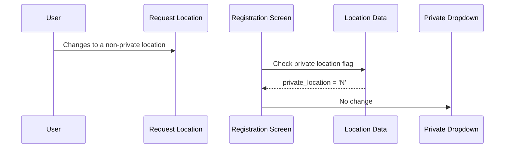
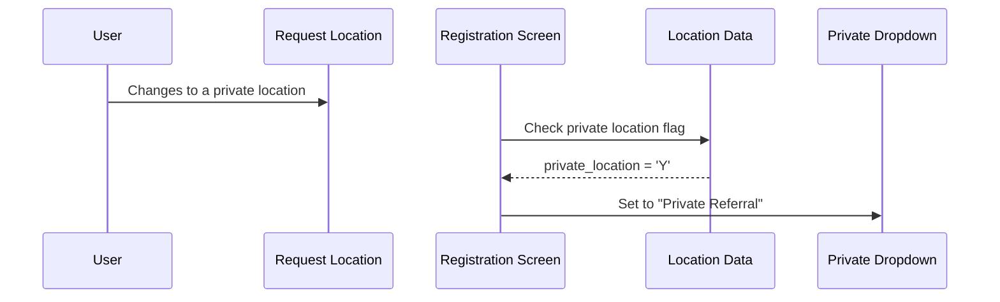
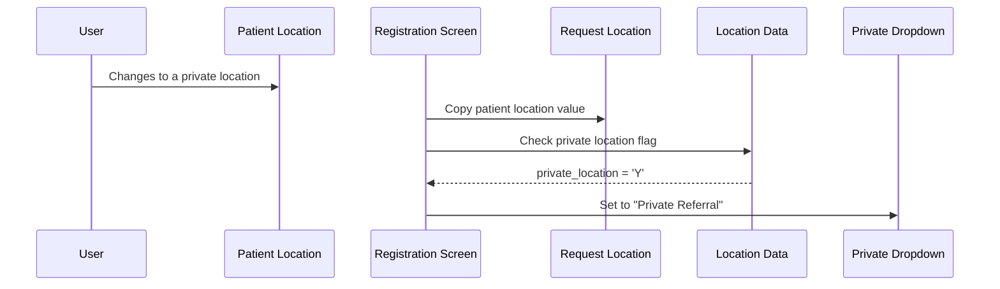

# Location Interaction - Private Referral

## Overview

When a user changes the **Request Hospital**, **Request Specialty**, or **Request Location** on the Registration screen, the system automatically checks whether the newly selected location is flagged as a private location. If it is, the **Private** dropdown is immediately set to **Private Referral**, marking the request accordingly. This ensures that requests originating from private locations are correctly classified without requiring manual intervention by the user.

---

## Related User Stories

- **[[CRST-102]]** - Registration - Location Interaction - Private Referral

**Epic:** LISP-29 [CRST][DEV] Registration - Screen Object Interaction

---

## Key Concepts

### Private Location
A hospital location (ward, clinic, or office) that is administratively designated as a private location. This designation is stored against the location record in the office/location master data (`office.office_private_location = 'Y'`). The system evaluates the currently selected **Request Location** field to determine whether the location carries this flag.

### Private Dropdown
The **Private** dropdown on the Registration screen classifies the request type. Relevant values for this workflow are:

| Value | Meaning |
|-------|---------|
| No | The request is a standard (non-private) request |
| Private Referral | The request originates from a private location and is classified as a private referral |

> The **Private** dropdown is only visible on screen when the **Lab Only Request** feature is enabled in the system configuration. However, the private referral classification is still applied to the request data regardless of visibility.

### Copy Patient Location to Request Location
By default, when the user changes the **Patient Hospital**, **Patient Specialty**, or **Patient Location**, the system copies the new value to the corresponding **Request Location** fields and then evaluates the private referral check. This copy behaviour can be disabled by a system configuration option.

---

## Trigger Point

The private referral check is triggered automatically whenever the **Request Location** changes. This occurs in three situations:

1. The user directly changes the **Request Location** field (by typing or selecting from a lookup dialogue).
2. The user changes the **Patient Hospital**, **Patient Specialty**, or **Patient Location** fields, which causes the system to copy the patient location to the request location (when this copy behaviour is not disabled).
3. The screen is initialised or cleared with a new patient/request loaded — the system resets the **Private** dropdown to its default and then immediately re-evaluates the private referral check based on the current request location.

---

## Workflow Scenarios

### Scenario 1: User Selects a Non-Private Location

#### Prerequisites
- The Registration screen is open.
- The user changes the **Request Hospital**, **Request Specialty**, or **Request Location** to a location where `office_private_location = 'N'`.

#### Process Flow

#### Step-by-Step Details

1. The user selects or enters a new value in the **Request Location** (or **Request Hospital** / **Request Specialty**) field.
2. The system looks up the private location flag for the selected location.
3. The flag is not set (the location is not private).
4. The **Private** dropdown remains unchanged.

---

### Scenario 2: User Selects a Private Location

#### Prerequisites
- The Registration screen is open.
- The user changes the **Request Hospital**, **Request Specialty**, or **Request Location** to a location where `office_private_location = 'Y'`.

#### Process Flow

#### Step-by-Step Details

1. The user selects or enters a new value in the **Request Location** (or **Request Hospital** / **Request Specialty**) field.
2. The system looks up the private location flag for the selected location.
3. The flag is set — the location is designated as private.
4. The system automatically sets the **Private** dropdown to **Private Referral**.
5. The request is now flagged as a private referral.

---

### Scenario 3: Patient Location Change Propagates to Request Location (Private)

#### Prerequisites
- The Registration screen is open.
- The "Copy Patient Location to Request Location" behaviour is **not** disabled in the system configuration.
- The user changes the **Patient Hospital**, **Patient Specialty**, or **Patient Location** to a private location.

#### Process Flow

#### Step-by-Step Details

1. The user changes the **Patient Hospital**, **Patient Specialty**, or **Patient Location** to a new location.
2. The system copies the updated patient location values into the **Request Location** fields.
3. The system then checks whether the newly copied request location is a private location.
4. If the location is private, the **Private** dropdown is automatically set to **Private Referral** (as in Scenario 2).
5. If the location is not private, the **Private** dropdown remains unchanged (as in Scenario 1).

> If "Copy Patient Location to Request Location" is disabled by system configuration, changing the patient location fields has no effect on the request location or the **Private** dropdown.

---

### Scenario 4: Screen Clear / New Request — Private Location Already Set

#### Prerequisites
- The Registration screen is cleared or a new patient/request is loaded.
- The current request location corresponds to a private location.

#### Step-by-Step Details

1. The screen clears the **Private** dropdown back to its default value (**No**).
2. Immediately after the reset, the system re-evaluates the private referral check against the current request location.
3. If the request location is a private location, the **Private** dropdown is set back to **Private Referral** automatically.
4. This ensures the private referral classification is always consistent with the location, even after a screen reset.

---

## Summary Table

| Trigger | Request Location is Private? | Private Dropdown Result |
|---------|------------------------------|------------------------|
| User changes Request Hospital / Specialty / Location | Yes | Set to "Private Referral" |
| User changes Request Hospital / Specialty / Location | No | No change |
| User changes Patient Location (copy not disabled) | Yes | Set to "Private Referral" |
| User changes Patient Location (copy not disabled) | No | No change |
| User changes Patient Location (copy **disabled**) | Any | No change |
| Screen reset / new request loaded | Yes | Set to "Private Referral" |
| Screen reset / new request loaded | No | Remains at default ("No") |

---

## Configuration

| Setting | Option Code | Purpose | Effect when enabled | Effect when disabled |
|---------|------------|---------|--------------------|--------------------|
| Lab Only Request | `LAB_ONLY_REQUEST_ENABLED` | Controls whether the **Private** dropdown field is visible on the Registration screen | Private dropdown is visible; user can see and interact with the classification | Private dropdown is hidden; private referral classification is still applied to the request data but not visible to the user |
| Copy Patient Location to Request Location | `COPY_PAT_LOCN_TO_REQ_LOCN_DISABLED` | Controls whether changing the patient location automatically updates the request location | *(this option disables the copy)* When this option is **disabled** (i.e., the option is off), patient location changes are copied to request location | When this option is **enabled** (i.e., the option is on), patient location changes do NOT copy to request location and do not trigger the private referral check |

---

## Business Rules

1. The private referral check is driven solely by the **Request Location** field — the patient location fields are not evaluated directly.
2. When patient location changes are copied to the request location (default behaviour), the private referral check runs as a consequence of the request location changing.
3. The private referral check only *sets* the **Private** dropdown to **Private Referral** when a private location is detected; it never automatically clears the value if the user has manually changed the dropdown to a different value.
4. On screen initialisation and after a clear operation, the **Private** dropdown is first reset to its default (**No**) before the private referral check runs, ensuring the field reflects the current request location accurately.
5. The **Private** dropdown field visibility (controlled by the Lab Only Request setting) does not affect whether the private referral classification is applied — the classification is applied to the request data regardless.

---

## Related Workflows

- [[Copy Patient Location to Request Location]] — When patient location changes are not disabled by configuration, the patient location is first copied to the request location before the private referral check runs.
- [[Screen Object Focus]] — The Request Location and Patient Location fields are part of the Registration screen tab sequence.
- [[Retain]] — The Private dropdown value can be retained across Clear operations if included in the active Retain group.
