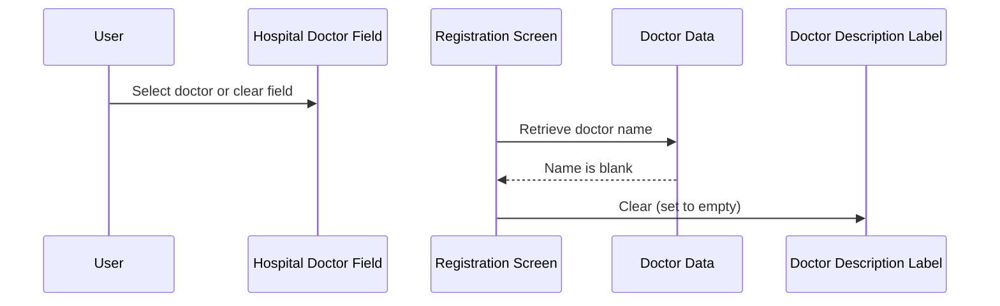

# Request Doctor Description

## Overview

When a user selects a doctor in the **Hospital Doctor** field on the Manual Registration screen, the system automatically updates the **Doctor Description** label to display the doctor's name. If the doctor also has a department associated with their record, the department name is appended to the description in square brackets. If the selected doctor has no name recorded, the **Doctor Description** label is cleared. This gives registration staff immediate visual confirmation of which doctor has been selected without having to look up the doctor code separately.

---

## Related User Stories

- **[[CRST-511]]** - Registration - Request Doctor Description

**Epic:** LISP-29 [CRST][DEV] Registration - Screen Object Interaction

---

## Key Concepts

### Hospital Doctor Field
A composite input field on the Registration screen that captures a doctor and their associated hospital as a paired unit. Selecting a doctor through this field triggers the doctor description update.

### Doctor Description
A read-only label displayed on the Registration screen alongside the **Hospital Doctor** field. It shows the resolved name and department of the currently selected doctor, formatted for easy reading by registration staff.

### Doctor Name
The full name recorded against the selected doctor in the doctor master data. If this is blank, the **Doctor Description** label is cleared.

### Doctor Department
An optional department or unit associated with the doctor record. When present, it is appended to the doctor name in the description using the format: `Doctor Name [Department]`.

---

## Trigger Point

The doctor description update is triggered whenever the user modifies the doctor entry in the **Hospital Doctor** field — whether by direct text input or by selecting a doctor through a lookup dialogue.

---

## Workflow Scenarios

### Scenario 1: Doctor Has a Name (No Department)

#### Prerequisites
- The Registration screen is open.
- The user selects a doctor whose record has a name but no department recorded.

#### Process Flow

```mermaid
sequenceDiagram
    User->>Hospital Doctor Field: Select doctor
    Registration Screen->>Doctor Data: Retrieve doctor name and department
    Doctor Data-->>Registration Screen: Name present; department absent
    Registration Screen->>Doctor Description Label: Set to doctor name only
```

#### Step-by-Step Details

1. The user selects or enters a doctor in the **Hospital Doctor** field.
2. The system retrieves the doctor's name from the doctor record.
3. The name is not blank.
4. The system sets the **Doctor Description** label to the doctor's name.
5. No department is present, so nothing further is appended.

**Example display:** `Chan Tai Man`

---

### Scenario 2: Doctor Has a Name and a Department

#### Prerequisites
- The Registration screen is open.
- The user selects a doctor whose record has both a name and a department recorded.

#### Process Flow

```mermaid
sequenceDiagram
    User->>Hospital Doctor Field: Select doctor
    Registration Screen->>Doctor Data: Retrieve doctor name and department
    Doctor Data-->>Registration Screen: Name present; department present
    Registration Screen->>Doctor Description Label: Set to "Doctor Name [Department]"
```

#### Step-by-Step Details

1. The user selects or enters a doctor in the **Hospital Doctor** field.
2. The system retrieves the doctor's name and department from the doctor record.
3. The name is not blank. The system sets the **Doctor Description** label to the doctor's name.
4. The department is also not blank. The system appends a space, an opening square bracket, the department name, and a closing square bracket to the description.

**Example display:** `Chan Tai Man [Cardiology]`

---

### Scenario 3: Doctor Has No Name

#### Prerequisites
- The Registration screen is open.
- The user selects or enters a doctor whose record has no name recorded, or the doctor field is cleared.

#### Process Flow



#### Step-by-Step Details

1. The user selects a doctor with no name recorded, or clears the **Hospital Doctor** field.
2. The system checks the doctor's name — it is blank.
3. The system clears the **Doctor Description** label, setting it to empty.

---

## Summary Table

| Doctor Name | Doctor Department | Doctor Description Display |
|---|---|---|
| Populated | Absent | `Doctor Name` |
| Populated | Populated | `Doctor Name [Department]` |
| Blank | Any | *(empty)* |

---

## Business Rules

1. The **Doctor Description** label is always driven by the doctor selected in the **Hospital Doctor** field — it is never entered manually by the user.
2. The description format when a department is present is: `<Doctor Name> [<Department>]` — with a single space before the opening bracket.
3. If the doctor name is blank, the description is cleared regardless of whether a department exists.
4. The description is updated on every doctor selection or modification — including when the field is cleared.

---

## Related Workflows

- [[Location Interaction - Change Doctor Hospital]] — When the Request Location or Request Hospital is changed, the system may update the hospital sub-field of the Hospital Doctor field, which can subsequently trigger the doctor description update.
