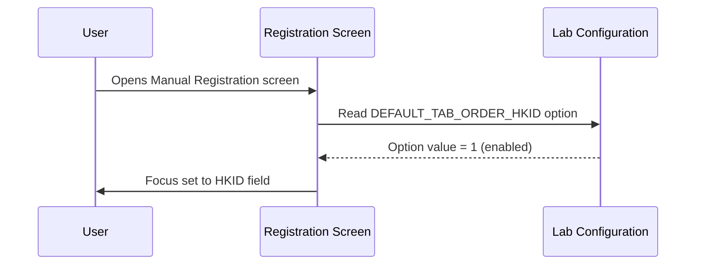
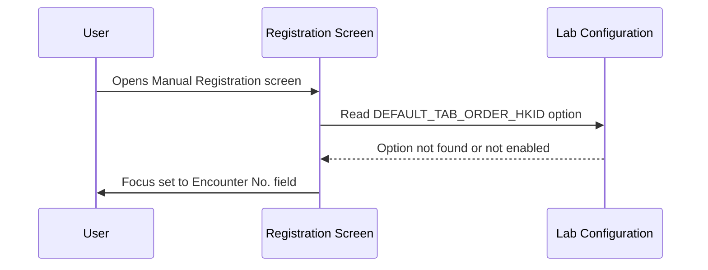
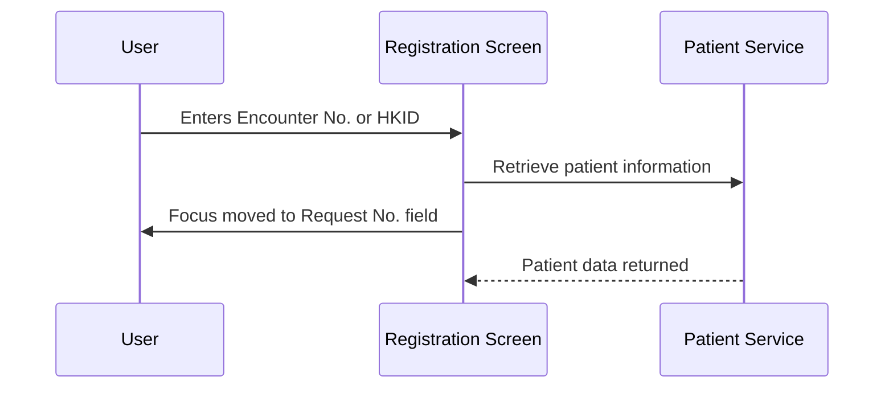
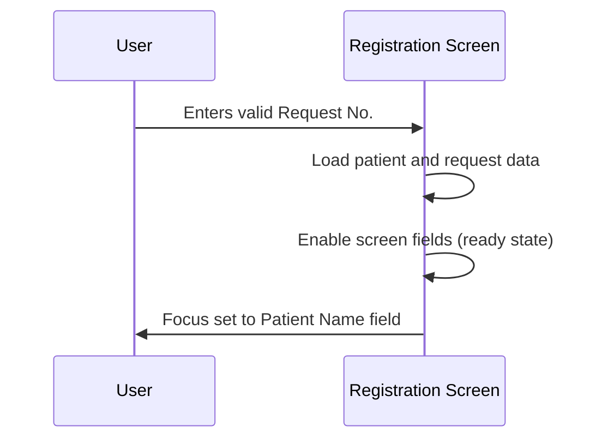
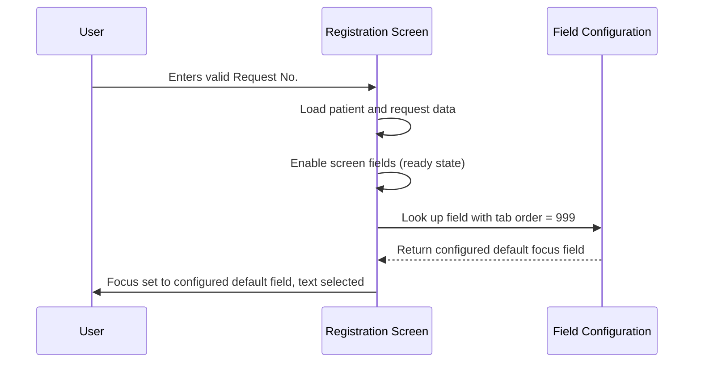

# Screen Object Focus

## Overview

This workflow governs where keyboard focus is placed on the Manual Registration screen at each stage of the registration process. The system automatically moves focus from one field to the next as the user progresses — from the initial patient identifier field, to the Request No. field, and finally to the appropriate data-entry field once the request is ready. Correct focus sequencing reduces manual mouse interaction and keeps registration staff efficient, particularly in high-volume environments.

---

## Related User Stories

- **[[CRST-116]]** - Registration - Screen Object Focus

**Epic:** LISP-29 [CRST][DEV] Registration - Screen Object Interaction

---

## Key Concepts

### Default Focus Field
The first field that receives keyboard focus when the screen opens. This can be configured per lab to be either the **HKID** field or the **Encounter No.** field.

### Post-Request-Ready Focus Field
The field that receives focus after a valid Request No. has been entered and patient data has been loaded. This is determined by the field whose tab order is set to **999** in the screen's field configuration table (OBJECT_ATTRIBUTE). The common default is the **Clinical Detail** field.

### New Patient
A patient whose HKID or Encounter No. does not yet exist in the local patient records.

### Existing Patient
A patient whose HKID or Encounter No. is found in the local patient records.

---

## Trigger Point

This workflow is active from the moment the Manual Registration screen opens and continues through each major transition in the registration sequence: screen open → patient identifier entered → Request No. entered → screen ready for data entry.

---

## Workflow Scenarios

### Scenario 1: Screen Opens — Default Focus is HKID

#### Prerequisites
- The user has access rights to open the Manual Registration screen.
- The lab is configured with `DEFAULT_TAB_ORDER_HKID` set to enabled (`option_value = 1`).

#### Process Flow

#### Step-by-Step Details

1. The user opens the Manual Registration screen.
2. The system reads the lab configuration for the default tab order setting.
3. Because the HKID default focus option is enabled, the system places focus in the **HKID** field.
4. The user can begin typing the patient's HKID immediately.

---

### Scenario 2: Screen Opens — Default Focus is Encounter No.

#### Prerequisites
- The user has access rights to open the Manual Registration screen.
- The lab is **not** configured with `DEFAULT_TAB_ORDER_HKID` enabled (option is absent or `option_value ≠ 1`).

#### Process Flow

#### Step-by-Step Details

1. The user opens the Manual Registration screen.
2. The system reads the lab configuration for the default tab order setting.
3. Because the HKID default focus option is not enabled, the system places focus in the **Encounter No.** field.
4. The user can begin typing the encounter number immediately.

---

### Scenario 3: Patient Identifier Entered — Focus Moves to Request No.

#### Prerequisites
- The screen is open with focus on either the **Encounter No.** field or the **HKID** field.
- The user has entered a valid Encounter No. or a valid HKID.

#### Process Flow

#### Step-by-Step Details

1. The user enters a value in the **Encounter No.** field or the **HKID** field and confirms the entry (e.g., by pressing Enter or Tab).
2. The system validates that the entered value is non-empty (and, for HKID, that the check digit is valid).
3. Immediately after validation, the system moves focus to the **Request No.** field.
4. The system begins retrieving patient information in the background.
5. The user may proceed to enter the Request No. while patient data is being loaded.

> **Note:** If the HKID check digit is invalid, the HKID field is cleared, an error message is displayed, and focus remains on the **HKID** field. Focus does not advance to Request No.

> **Note:** If the Encounter No. field is cleared (empty entry), focus is returned to the **HKID** field rather than advancing.

---

### Scenario 4: Valid Request No. Entered — Focus Moves to Patient Name (New Patient)

#### Prerequisites
- The user has entered a valid Request No.
- The patient is identified as a **new patient** (no existing local record found) and the patient data was not sourced from the external patient index (PMI).

#### Process Flow

#### Step-by-Step Details

1. The user enters a valid Request No. in the **Request No.** field.
2. The system loads patient data and request details onto the screen.
3. The screen fields are enabled for editing.
4. Because the patient is new and their details were not pre-populated from the external patient index, the system places focus in the **Patient Name** field and selects any existing content so the user can type the name immediately.

---

### Scenario 5: Valid Request No. Entered — Focus Moves to Configured Default Field (Existing Patient)

#### Prerequisites
- The user has entered a valid Request No.
- The patient is an **existing patient** (record found locally), or the patient data was sourced from the external patient index (PMI).

#### Process Flow

#### Step-by-Step Details

1. The user enters a valid Request No. in the **Request No.** field.
2. The system loads patient data and request details onto the screen.
3. The screen fields are enabled for editing.
4. The system looks up which field is configured as the post-request-ready default focus field. This is determined by the field with **tab order = 999** in the screen's field configuration (OBJECT_ATTRIBUTE).
5. Focus is placed in that configured field. If it is a text field, all existing text in the field is selected so the user can overwrite or confirm the value without additional clicks.

> If no field is configured with tab order 999, the **Clinical Detail** field receives focus by default.

---

## Summary Table

| Stage | Condition | Field Receiving Focus |
|-------|-----------|----------------------|
| Screen opens | `DEFAULT_TAB_ORDER_HKID` enabled | HKID |
| Screen opens | `DEFAULT_TAB_ORDER_HKID` not enabled / absent | Encounter No. |
| Encounter No. entered (valid, non-empty) | — | Request No. |
| HKID entered (valid check digit) | — | Request No. (focus advances; patient lookup begins) |
| HKID entered (invalid check digit) | — | HKID (focus stays; error displayed; field cleared) |
| Encounter No. cleared (empty) | — | HKID |
| Valid Request No. entered | New patient, data not from PMI | Patient Name |
| Valid Request No. entered | Existing patient, or data from PMI | Field with tab order = 999 in OBJECT_ATTRIBUTE (default: Clinical Detail) |

---

## Configuration

| Setting | Option Code | Purpose | Effect when enabled | Effect when disabled |
|---------|------------|---------|--------------------|--------------------|
| Default Focus: HKID | `DEFAULT_TAB_ORDER_HKID` | Controls whether the HKID field or Encounter No. field receives initial focus when the screen opens | HKID field receives focus on screen open | Encounter No. field receives focus on screen open |
| Post-request-ready default focus field | *(source: OBJECT_ATTRIBUTE table, function = REG, tab order = 999)* | Controls which field receives focus after a valid Request No. has been entered for an existing patient | Focus moves to the configured field; text is selected | If no field is configured at order 999, the Clinical Detail field receives focus by default |

---

## Business Rules

1. On screen open, the system always places focus in one of two fields — **HKID** or **Encounter No.** — determined by the `DEFAULT_TAB_ORDER_HKID` lab configuration option.
2. When a non-empty Encounter No. is submitted, focus immediately advances to **Request No.** before patient data has finished loading. The user does not need to wait for the patient lookup to complete before entering the Request No.
3. When a valid HKID (passing check digit validation) is submitted, focus advances to **Request No.**
4. When an HKID fails check digit validation, focus does not advance. The field is cleared and focus remains on **HKID** so the user can re-enter.
5. After a valid Request No. is entered, focus placement depends on whether the patient is new or existing:
   - **New patient (not from PMI):** focus goes to **Patient Name**.
   - **Existing patient or PMI-sourced patient:** focus goes to the field configured at tab order 999 in OBJECT_ATTRIBUTE.
6. When focus is placed in a text field after a valid Request No. is entered, the full content of that field is selected, allowing the user to overwrite it without manually clearing it first.
7. The post-request-ready focus field (tab order 999) is configured per lab and per screen via the OBJECT_ATTRIBUTE table.

---

## Related Workflows

- [[Retrieve Patient by Encounter Number]] — Focus advances to Request No. as part of this retrieval process.
- [[Retrieve Patient by HKID]] — Focus advances to Request No. as part of this retrieval process.
- [[Create New Patient by HKID]] — When a new patient is identified, focus is directed to Patient Name after Request No. entry.
- [[Request No. Generation]] — The Request No. field receives focus at the midpoint of this workflow.
