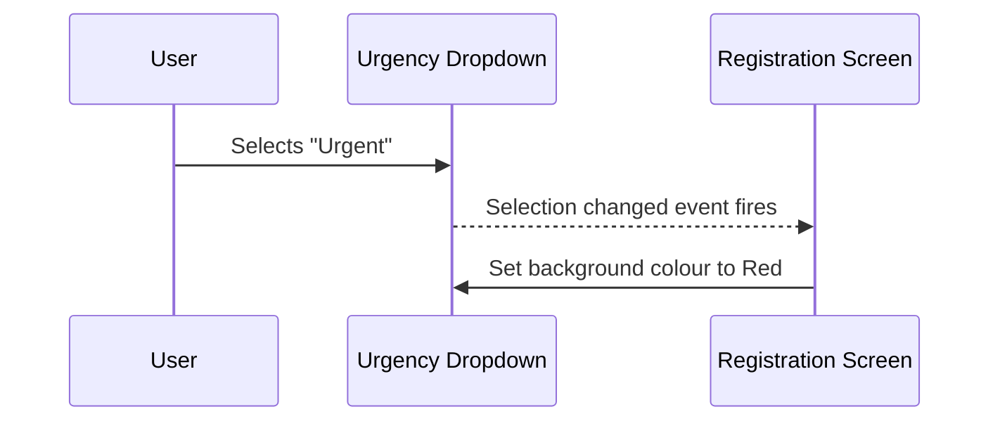
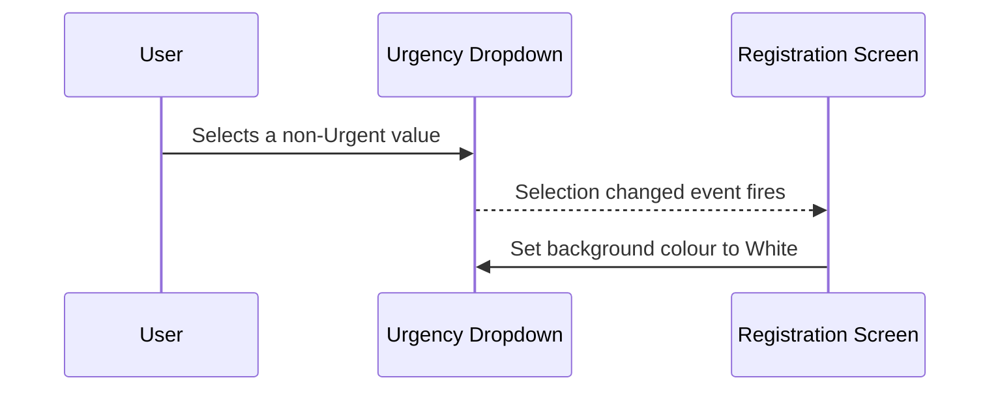
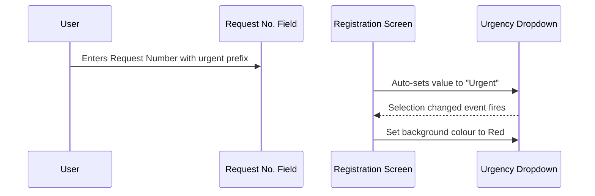

# Urgency Color

## Overview

The Urgency Color is a visual indicator built into the **Urgency** dropdown field on the Registration screen. When the user selects a value from the Urgency dropdown, the background colour of the field changes immediately to reflect the urgency level: red for **Urgent** and white for any other value (Non-Urgent, Desperate, or no selection). This provides instant at-a-glance feedback to help staff identify urgent requests without reading the field label.

---

## Related User Stories

- **[[CRST-101]]** - Registration - Urgency Color

**Epic:** LISP-29 [CRST][DEV] Registration - Screen Object Interaction

---

## Key Concepts

### Urgency Levels
The Urgency dropdown offers selectable values defined by system keyword data. The recognised urgency levels relevant to colour logic are:

| Level | Colour |
|-------|--------|
| Urgent | Red (`#FF0000`) |
| Non-Urgent | White (`#FFFFFF`) |
| Desperate | White (`#FFFFFF`) |
| No selection / blank | White (`#FFFFFF`) |

> Only the **Urgent** value triggers the red background. All other values — including Desperate — display the white (default) background.

---

## Trigger Point

The colour change is applied **immediately and automatically** whenever the user changes the selected value in the **Urgency** dropdown. No additional action (e.g., clicking a button or tabbing away) is required. The colour is also applied when the urgency value is set programmatically, for example when the system detects an urgent lab prefix in the Request Number and auto-selects the Urgent value.

---

## Workflow Scenarios

### Scenario 1: User Selects "Urgent"

#### Prerequisites
- The Registration screen is open.
- The **Urgency** dropdown is enabled and visible.

#### Process Flow

#### Step-by-Step Details

1. The user opens the **Urgency** dropdown and selects the **Urgent** option.
2. The system detects the selection change immediately.
3. The system evaluates the selected value — it matches the Urgent urgency level.
4. The background colour of the **Urgency** dropdown field changes to **red**.

---

### Scenario 2: User Selects a Non-Urgent Value (Including Desperate)

#### Prerequisites
- The Registration screen is open.
- The **Urgency** dropdown currently has any value selected (including Urgent).

#### Process Flow

#### Step-by-Step Details

1. The user opens the **Urgency** dropdown and selects any value other than **Urgent** (e.g., Non-Urgent, Desperate, or blank).
2. The system detects the selection change immediately.
3. The system evaluates the selected value — it does not match the Urgent urgency level.
4. The background colour of the **Urgency** dropdown field changes to **white** (the default background).

---

### Scenario 3: System Auto-Selects "Urgent" via Request Number Prefix

#### Prerequisites
- The Registration screen is open.
- The entered Request Number contains a prefix that the system recognises as corresponding to an urgent lab.

#### Process Flow

#### Step-by-Step Details

1. The user enters a Request Number whose prefix is associated with an urgent lab in the system configuration.
2. The system automatically sets the **Urgency** dropdown to the **Urgent** value.
3. Because the urgency value changes, the same colour logic applies as in Scenario 1.
4. The background colour of the **Urgency** dropdown field changes to **red** without any further user action.

---

## Summary Table

| Selected Urgency Value | Field Background Colour |
|------------------------|------------------------|
| Urgent | Red |
| Non-Urgent | White |
| Desperate | White |
| Blank / no selection | White |

---

## Business Rules

1. The colour change fires on every selection change, regardless of whether the change was made by the user or triggered automatically by the system.
2. Only the **Urgent** urgency level produces a red background; all other values — including Desperate — produce the white (neutral) background.
3. The colour indicator has no effect on field editability or the ability to save the request; it is a visual aid only.
4. The default urgency value on screen load is determined by the system configuration (**Default Request Urgency** setting). If that default is Urgent, the field will be red on initial load.

---

## Related Workflows

- [[Screen Object Focus]] — The Urgency field participates in the tab sequence of the Registration screen alongside other request fields.
- [[Retain]] — The Urgency field value and its colour state can be retained across Clear operations if the field is included in the active Retain group.
