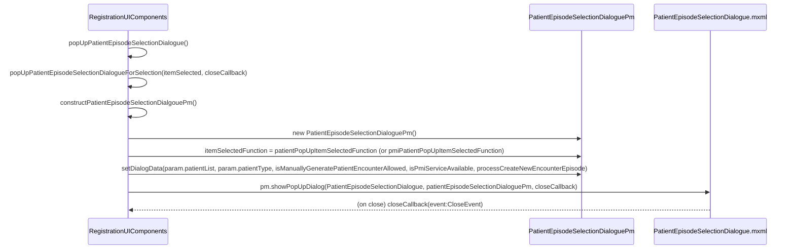

# Patient Selection Dialogue

## Overview

The **Patient Selection Dialogue** (formally "Select an episode" panel) is a modal popup displayed during the Registration workflow when a patient HKID is entered and one or more matching records exist in the PATIENT table. It allows users to:

- View and select from existing patient episodes
- Generate a new computer-assigned encounter number for an existing patient (CRST-94)
- Manually input a new encounter number for an existing patient (CRST-94)
- Access PMI patient records (CRST-93)
- Cancel and trigger new patient creation when no suitable episode exists

**Related User Stories:**
- [[CRST-492]] - Registration - Patient Selection Dialogue
- [[CRST-93]] - Registration - Retrieve PMI Patient by HKID
- [[CRST-94]] - Registration - New Case Number for Existing Patient by HKID

**Epic:** LISP-23 [CRST][DEV] Registration - Patient Handling

---

## Component Files

| File | Location | Description |
|------|----------|-------------|
| `PatientEpisodeSelectionDialogue.mxml` | `lisFlexLib/flex_src/hk/org/ha/lis/common/component/dialog/` | View — 800×500 modal dialogue |
| `PatientEpisodeSelectionDialoguePm.as` | `lisFlexLib/flex_src/hk/org/ha/lis/common/component/dialog/` | Presentation Model |

> **Note (LIS-9914):** Both files were moved from `lisWeb` to `lisFlexLib` on 08 Apr 2025.

---

## Panel Variants

The dialogue title changes depending on context:

| Context | Title |
|---------|-------|
| Local LIS patient list, PMI available | `Select an episode` + **"PMI List" button** shown as `cancelButtonPm` |
| PMI patient list displayed | `Select an episode (PMI List)` + **"Cancel" button** shown as `cancelButtonPm` |
| PMI not available / disabled | `Select an episode` + **"Cancel" button** shown as `cancelButtonPm` |

Title and button label logic in `PatientEpisodeSelectionDialoguePm.setDialogData()`:
```actionscript
if (isPmiServerAvailable && patientType == RegistrationConstants.LIS_PATIENT)
{
    cancelButtonPm.label = "~PMI List";
    title = defaultTitle;             // "Select an episode"
}
else if (patientType == RegistrationConstants.PMI_PATIENT)
{
    cancelButtonPm.label = "C~ancel";
    title = defaultTitle + "(PMI List)"; // "Select an episode (PMI List)"
}
else if (!isPmiServerAvailable)
{
    cancelButtonPm.label = "C~ancel";
    title = defaultTitle;             // "Select an episode"
}
```

---

## Grid Columns

The grid (`dgData`) uses `LisDynamicGrid` with the following columns defined in `getDisplayColumns()`. Columns marked with **sort** are initially sorted; columns marked **visible by default** are shown without horizontal scrolling.

| # | Header | Data Binding | Data Type | Width | Sort Priority | Default Visible |
|---|--------|-------------|-----------|-------|--------------|-----------------|
| 1 | HKID *(dynamic label via `CommonUtil.getHkidParm()`)* | `patientInfoVo.patientId.hkid` | `char(12)` | 120 | 3 | ✅ |
| 2 | Encounter No | `encounterInfoVo.encounterId.encounterNo` | `char(15)` | 190 | 2 | ✅ |
| 3 | Hosp | `encounterInfoVo.encounterId.hospital` | `char(3)` | 80 | — | ✅ |
| 4 | Unit | `encounterInfoVo.encounterDetail.location.specialty` | `char(6)` | 80 | — | ✅ |
| 5 | Locn | `encounterInfoVo.encounterDetail.location.ward` | `char(6)` | 80 | — | ✅ |
| 6 | Name | `patientInfoVo.patientDetail.name` | `varchar(81)` | 200 | — | ✅ |
| 7 | Sex | `patientInfoVo.patientDetail.sex` | `char(1)` | 65 | — | ✅ |
| 8 | Age | `patientInfoVo.patientDetail.age` | `tinyint` | 70 | — | ✅ |
| 9 | *(Age Unit)* | `patientInfoVo.patientDetail.ageUnit` | `tinyint` | 30 | — | ✅ |
| 10 | DOB | `patientInfoVo.patientDetail.dob` | `datetime` | 130 | — | ✅ |
| 11 | Admission Date | `encounterInfoVo.encounterDetail.admissionDate` | `datetime` | 175 | 1 | ✅ |
| 12 | CCC Code | `patientInfoVo.patientDetail.cccCode` | `varchar(60)` | 120 | — | ✅ |
| 13 | Exact DOB | `patientInfoVo.patientDetail.exactDob` | `char(1)` | 120 | — | — |
| 14 | Race | `patientInfoVo.patientDetail.race` | `char(2)` | 80 | — | — |
| 15 | MRN | `patientInfoVo.patientDetail.mrn` | `char(10)` | 80 | — | — |
| 16 | Confidential | `patientInfoVo.patientDetail.confidential` | `char(1)` | 150 | — | — |
| 17 | Death | `patientInfoVo.patientDetail.death` | `char(1)` | 80 | — | — |
| 18 | Death Date | `patientInfoVo.patientDetail.dod` | `datetime` | 120 | — | — |
| 19 | Discharge Date | `encounterInfoVo.encounterDetail.dischargeDate` | `datetime` | 150 | — | — |
| 20 | Bed | `encounterInfoVo.encounterDetail.bed` | `varchar(8)` | 80 | — | — |
| 21 | Category | `encounterInfoVo.encounterDetail.category` | `tinyint` | 150 | — | — |
| 22 | Type | `encounterInfoVo.encounterDetail.type` | `char(3)` | 80 | — | — |
| 23 | Address | `patientInfoVo.patientDetail.address` | `varchar(120)` | 200 | — | — |

**Category column** uses `getCategoryLabel(patient:PatientVo):String` as its label function, which looks up the CATEGORY keyword group via `KeywordUtil.getActiveKeywordsByGroupCodeLabNo("CATEGORY")`.

### Data Reference (PATIENT table)

| Column Header | `PATIENT` Column |
|---------------|-----------------|
| HKID | `pat_pid` |
| Encounter No | `pat_encounter` |
| Hosp | `pat_hospital` |
| Unit | `pat_unit` |
| Locn | `pat_location` |
| Name | `pat_name` |
| Sex | `pat_sex` |
| Age | `pat_age` |
| Age Unit | `pat_age_unit` |
| DOB | `pat_dob` |
| Admission Date | `pat_adm_date` |
| CCC Code | `pat_cname` |
| Exact DOB | `pat_exact_dob_flag` |
| Race | `pat_race` |
| MRN | `pat_mrn` |
| Confidential | `pat_confidential` |
| Death | `pat_death` |
| Death Date | `pat_death_date` |
| Discharge Date | `pat_discharge_date` |
| Bed | `pat_bed` |
| Category | `pat_cat` |
| Type | `pat_type` |
| Address | `pat_address` |

---

## Buttons

All buttons are positioned at the bottom of the 800×500 dialogue.

### Generate Computer Encounter (`btnGenerateNew`)

| Property | Value |
|----------|-------|
| Label | `~Generate Computer Encounter` |
| Shortcut | Ctrl+Shift+G |
| Width | 300 |
| Visibility | Always visible |

**Behaviour (`generateNewButtonClickFunction`):**
1. Calls `ConversionUtility.sysgenEncounterNo()` to auto-generate encounter number
2. Populates `inputPm.text` with the generated number
3. If `patientType == LIS_PATIENT`: sets `selectedIndex = -1` (deselects grid)
4. If `inputPm` is **hidden** (i.e., `isManuallyGeneratePatientEncounterAllowed = false`):
   - Immediately calls `setItemBySelectedIndex()` and closes the dialogue
   - Registration screen gets the new encounter number directly — **no "Enter new episode" panel shown**
5. If `inputPm` is **visible** (i.e., `isManuallyGeneratePatientEncounterAllowed = true`):
   - Generated number shown in the text input for user to review
   - User must click OK to confirm

**Condition for visibility (CRST-492 Acceptance Criteria):**
```
GIVEN patient HKID exists in PATIENT table
WHEN valid patient HKID is inputted
THEN Generate Computer Encounter button is visible and enabled
```

---

### Text Input (`txtInput`) + OK Button (`btnOk`)

| Property | Value |
|----------|-------|
| `txtInput` label | *(empty — display-only text input)* |
| `txtInput` editable | `false` (read-only display) |
| `btnOk` Label | `~OK` |
| `btnOk` Width | 80 |

**Visibility rule:**
```actionscript
inputPm.visible     = isManuallyGeneratePatientEncounterAllowed && manualInputEncounterFunction == null;
okButtonPm.visible  = isManuallyGeneratePatientEncounterAllowed && manualInputEncounterFunction == null;
```

- Both are **visible** only when `isManuallyGeneratePatientEncounterAllowed = true` **AND** `manualInputEncounterFunction` is `null` (i.e., Manual Input Encounter is NOT in use)
- When visible: shows the generated encounter number after "Generate Computer Encounter" is clicked

**OK Button Behaviour (`okButtonClickFunction`):**
- If a row is selected (`selectedIndex != -1`): calls `setItemBySelectedIndex()` + closes dialogue (selects existing episode)
- If no row selected: sets `isSelected = true`, calls `itemSelectedFunction(null, newEncounterNo)` + closes (creates new episode for existing patient)

---

### Manual Input Encounter (`btnManualInput`)

| Property | Value |
|----------|-------|
| Label | `~Manual Input Encounter` |
| Shortcut | Ctrl+Shift+M |
| Width | 300 |

**Visibility rule:**
```actionscript
manualInputButtonPm.visible = isManuallyGeneratePatientEncounterAllowed && manualInputEncounterFunction != null;
```

- Visible only when `isManuallyGeneratePatientEncounterAllowed = true` **AND** a `manualInputEncounterFunction` has been provided
- In `RegistrationUIComponents`, this function is `processCreateNewEncounterEpisode` (passed via `setDialogData()`)

**Behaviour (`manualInputButtonClickFunction`):**
1. Clears `closePopUpHandlerFunction` (prevents close callback from firing)
2. Closes the dialogue
3. Calls `manualInputFunction()` → `processCreateNewEncounterEpisode()`
4. This opens the **"Enter new episode"** dialogue where the user can **edit** the generated encounter number

**LAB_OPTION control:**
```sql
SELECT * FROM LAB_OPTION
WHERE option_group = 'REQUEST_REGISTRATION'
  AND option_code  = 'MANUAL_GEN_ENCOUNTER_ENABLED'
  AND option_value = 1
```
- `option_value = 1` → `isManuallyGeneratePatientEncounterAllowed = true` → button **visible**
- `option_value = 0` → button **invisible**

---

### Cancel / PMI List (`btnCancel`)

| Property | Value |
|----------|-------|
| Default Label | `C~ancel` or `~PMI List` (context-dependent — see Panel Variants) |
| Shortcut | Ctrl+Shift+A (Cancel) / Ctrl+Shift+P (PMI List) |
| Width | 100 |
| Position | `right=10, y=410` (separate from the HorizontalLayout) |

**Behaviour (`cancelButtonClickFunction`):**
```actionscript
this.isSelected = false;
this.close();
```

The `closePopUpHandlerFunction` is then invoked automatically. In `RegistrationUIComponents`:

| Scenario | Close callback | Result |
|----------|---------------|--------|
| LIS patient list shown (`patientType == LIS_PATIENT`) | `closePatientPopUpCallbackFunction()` | Attempts PMI lookup; if patient not in PMI → Message 687 |
| PMI patient list shown (`patientType == PMI_PATIENT`) | `closePMIPatientPopUpCallbackFunction()` | Message 687 prompted |

---

### Close Indicator (✕ / Window Close)

The dialogue extends `LisDialogue`, which provides a standard window close button.

**Behaviour:** Same as clicking the Cancel button — `isSelected = false`, `close()` fires, the close callback handles the result:
- If patient **in PMI**: system retrieves PMI records → switches to `Select an episode (PMI List)`
- If patient **not in PMI**: Message 687 prompted ("Create new Encounter case?")
- If **on PMI List panel** already: Message 687 prompted

---

## Presentation Model API

**Class:** `PatientEpisodeSelectionDialoguePm`  
**Extends:** `LisGridDialogueBasePm`

### Public Properties

| Property | Type | Description |
|----------|------|-------------|
| `isSelected` | `Boolean` | `true` after user confirms a selection; `false` if cancelled |
| `itemSelectedFunction` | `Function` | Callback `(item:PatientVo, newEncounterNo:String):void` fired on selection |
| `generateNewFunction` | `Function` | *(reserved — not currently used externally)* |
| `manualInputFunction` | `Function` | Callback for Manual Input Encounter button (`processCreateNewEncounterEpisode`) |
| `inputPm` | `LisTextInputPm` | Read-only text input displaying generated encounter number |
| `generateNewButtonPm` | `LisButtonPm` | Generate Computer Encounter button PM |
| `cancelButtonPm` | `LisButtonPm` | Cancel / PMI List button PM |
| `okButtonPm` | `LisButtonPm` | OK button PM |
| `manualInputButtonPm` | `LisButtonPm` | Manual Input Encounter button PM |

### Key Methods

| Method | Description |
|--------|-------------|
| `setDialogData(patientList, patientType, isManuallyGeneratePatientEncounterAllowed, isPmiServerAvailable, manualInputEncounterFunction)` | Initialises dialogue state; sets title, button labels, and data source. Lazily creates button PMs on first call. |
| `setItemBySelectedIndex()` | Sets `isSelected = true` and calls `itemSelectedFunction(item, newEncounterNo)` |
| `gridDoubleClickHandler()` | Calls `setItemBySelectedIndex()` then closes — triggered on grid double-click |
| `getTitle()` | Returns `"Select an episode"` — overrideable by subclasses |
| `getDisplayColumns()` | Returns the `ArrayList` of `LisGridDisplayColumnVo` — overrideable |
| `getCategoryLabel(patient)` | Keyword lookup for Category column label function |
| `generateNewButtonClickFunction(event)` | Generates encounter no. via `ConversionUtility.sysgenEncounterNo()` |
| `cancelButtonClickFunction(event)` | Sets `isSelected = false` and closes |
| `okButtonClickFunction(event)` | Confirms selection or new encounter number |
| `manualInputButtonClickFunction(event)` | Clears close callback, closes, and calls `manualInputFunction()` |

### `setDialogData` Signature

```actionscript
public function setDialogData(
    patientList:ArrayCollection,
    patientType:int,
    isManuallyGeneratePatientEncounterAllowed:Boolean,
    isPmiServerAvailable:Boolean,
    manualInputEncounterFunction:Function = null
):void
```

| Parameter | Description |
|-----------|-------------|
| `patientList` | `ArrayCollection` of `PatientVo` objects to display in the grid |
| `patientType` | `RegistrationConstants.LIS_PATIENT` or `RegistrationConstants.PMI_PATIENT` |
| `isManuallyGeneratePatientEncounterAllowed` | Controls visibility of `inputPm`, `okButtonPm`, and `manualInputButtonPm` |
| `isPmiServerAvailable` | Controls title and `cancelButtonPm.label` (PMI List vs Cancel) |
| `manualInputEncounterFunction` | If provided, shows `btnManualInput` instead of `txtInput`+`btnOk` |

---

## Integration with RegistrationUIComponents

**File:** `RegistrationUIComponents.as`

The dialogue is managed via a lazily-instantiated `patientEpisodeSelectionDialoguePm` field:

```actionscript
protected var patientEpisodeSelectionDialoguePm:PatientEpisodeSelectionDialoguePm = null;
```

### Invocation Flow



### Method Responsibilities

| Method | Role |
|--------|------|
| `popUpPatientEpisodeSelectionDialogue()` | Routes to LIS vs PMI item-selected function based on `param.patientType` |
| `popUpPatientEpisodeSelectionDialogueForSelection(itemSelectedFunction, closePopUpCallbackFunction)` | Creates PM if needed; sets `itemSelectedFunction`; calls `setDialogData`; shows popup |
| `constructPatientEpisodeSelectionDialgouePm()` | Factory method — returns `new PatientEpisodeSelectionDialoguePm()`. Overrideable by subclasses (e.g., DhHncRegistrationUIComponents) |
| `patientPopUpItemSelectedFunction(item:PatientVo, newEncounterNo:String)` | For LIS patients: if `newEncounterNo != null` → trigger new patient; else → `gatherPatientInformation()` |
| `pmiPatientPopUpItemSelectedFunction(item:PatientVo, newEncounterNo:String)` | For PMI patients: if `newEncounterNo != null` → trigger new episode; else → load PMI data |
| `closePatientPopUpCallbackFunction(event:CloseEvent)` | If `!isSelected`: try PMI lookup; if PMI not found → Message 4274 on log + Message 687 to user |
| `closePMIPatientPopUpCallbackFunction(event:CloseEvent)` | If `!isSelected`: Message 687 to user |
| `processCreateNewEncounterEpisode(skipPopUp:Boolean=false)` | Passed as `manualInputEncounterFunction` — opens "Enter new episode" dialogue for manual encounter entry |

---

## Button Visibility Matrix

| `isManuallyGeneratePatientEncounterAllowed` | `manualInputEncounterFunction` | `inputPm` visible | `okButtonPm` visible | `manualInputButtonPm` visible |
|----|----|----|----|----|
| `false` | any | ❌ | ❌ | ❌ |
| `true` | `null` | ✅ | ✅ | ❌ |
| `true` | provided | ❌ | ❌ | ✅ |

> In standard Registration, `manualInputEncounterFunction = processCreateNewEncounterEpisode` is **always** passed, so `btnManualInput` is shown when enabled and `txtInput`/`btnOk` are never shown.

---

## Selection Behaviours

### User double-clicks a row
→ `gridDoubleClickHandler()` → `setItemBySelectedIndex()` → close  
→ `itemSelectedFunction(PatientVo, null)` called

### User single-clicks a row + clicks OK (when OK visible)
→ `okButtonClickFunction()` → `setItemBySelectedIndex()` → close  
→ `itemSelectedFunction(PatientVo, null)` called

### User clicks "Generate Computer Encounter" (when inputPm hidden)
→ `generateNewButtonClickFunction()` → generates encounter → `setItemBySelectedIndex()` → close  
→ `itemSelectedFunction(null, newEncounterNo)` called  
→ Registration screen populates Enc No field directly; focus → Req No.

### User clicks "Manual Input Encounter"
→ `manualInputButtonClickFunction()` → close (no close callback) → `processCreateNewEncounterEpisode()`  
→ "Enter new episode" dialogue opens with Enc No **editable**  
→ User can revise encounter number → click Done  
→ Registration screen populates Enc No; focus → Req No.

### User clicks Cancel / PMI List (LIS patient list)
→ `cancelButtonClickFunction()` → `isSelected = false` → close  
→ `closePatientPopUpCallbackFunction()` fires  
→ If patient in PMI: retrieves PMI list → re-opens dialogue as PMI List  
→ If patient not in PMI: Message 4274 (log) + Message 687 (user prompt)

### User clicks Cancel (PMI patient list)
→ `cancelButtonClickFunction()` → `isSelected = false` → close  
→ `closePMIPatientPopUpCallbackFunction()` fires  
→ Message 687 prompted

### User closes window (Close Indicator / ✕)
Same result as clicking Cancel.

---

## Configuration Requirements

### LAB_OPTION: PMI Server

```sql
SELECT * FROM LAB_OPTION
WHERE option_group = 'PMI'
  AND option_code  = 'SERVER'
```

| `option_value` | Effect |
|---------------|--------|
| `1` / enabled | `isPmiServerAvailable = true` → `cancelButtonPm.label = "~PMI List"` |
| `0` / disabled or row absent | `isPmiServerAvailable = false` → `cancelButtonPm.label = "C~ancel"` |

### LAB_OPTION: Manual Generate Encounter Enabled

```sql
SELECT * FROM LAB_OPTION
WHERE option_group = 'REQUEST_REGISTRATION'
  AND option_code  = 'MANUAL_GEN_ENCOUNTER_ENABLED'
```

| `option_value` | Effect |
|---------------|--------|
| `1` | `isManuallyGeneratePatientEncounterAllowed = true` → Manual Input Encounter button visible |
| `0` or absent | `isManuallyGeneratePatientEncounterAllowed = false` → button invisible |

---

## Error Messages

| Message Code | Text | Trigger | Shown By |
|-------------|------|---------|----------|
| `687` | "Create new Encounter case?" | Cancel / Close on any panel variant; patient not in PMI | `RegistrationUIComponents` (user prompt) |
| `4274` | "Due to the unavailability of PMI service, the system cannot retrieve patient details for entered HKID at this moment." | PMI lookup fails / patient not found in PMI after LIS panel cancel | `RegistrationUIComponents` (log monitor) |

---

## Modification History

| Date | Developer | Reference | Changes |
|------|-----------|-----------|---------|
| 02 Mar 2012 | Christie Tse | — | New class |
| 20 Feb 2013 | Christie Tse | — | Amend `gridDoubleClickHandler`, remove `this.close()` from `setItemBySelectedIndex` |
| 26 Apr 2013 | Christie Tse | — | Add `isPmiServerAvailable` parameter to `setDialogData` |
| 24 Aug 2013 | Christie Tse | — | Change focus to first item (`selectedIndex = 0`) |
| 24 Jun 2013 | Patrick Yau | — | Fix typo: `warn` → `ward` in `getDisplayColumns()` |
| 31 Jul 2013 | Patrick Yau | — | Fix: `patientInfoVo.patientDetail.dischargeDate` → `encounterInfoVo.encounterDetail.dischargeDate` |
| 03 Sep 2013 | Tony Chong | — | Adjust width of HKID and Unit columns |
| 04 May 2013 | Christie Tse | — | Set `isSelected = true` when no patient data selected (OK clicked with no row) |
| 27 Mar 2014 | Christie Tse | CMC-BBS-B-00035 | Add `getCategoryLabel()` label function for Category column |
| 28 Aug 2014 | Ben WONG | RD-GEN-140828-01 | Change Style |
| 31 Oct 2016 | Tony Chong | CEO-76657 | Amend `setDialogData` — add `manualInputEncounterFunction` parameter; add `manualInputButtonClickFunction`; control `manualInputButtonPm` visibility |
| 04 Jun 2020 | Tony Chong | LIS-1722 | Add `constructPatientEpisodeSelectionDialgouePm()` factory method; amend `popUpPatientEpisodeSelectionDialogueForSelection` |
| 02 Nov 2020 | Henry Chan | LIS-2604 | Amend `closePatientPopUpCallbackFunction`: change message 3780 → 4274 |
| 24 Nov 2020 | Henry Chan | LIS-2604 | Add `getHkidParm()` to HKID column header |
| 08 Apr 2025 | Collins | LIS-9914 | Move from `lisWeb` to `lisFlexLib` |

---

## Acceptance Criteria Summary (CRST-492)

### Button Enablement Rules

| Button | Condition | Result |
|--------|-----------|--------|
| Generate Computer Encounter | Patient HKID exists in PATIENT table | Visible & enabled |
| Manual Input Encounter | `LAB_OPTION[REQUEST_REGISTRATION / MANUAL_GEN_ENCOUNTER_ENABLED] = 1` AND HKID exists | Visible & enabled |
| Manual Input Encounter | `LAB_OPTION[REQUEST_REGISTRATION / MANUAL_GEN_ENCOUNTER_ENABLED] = 0` | Invisible |
| PMI List (as Cancel label) | `LAB_OPTION[PMI / SERVER] = 1` AND patient exists | Visible & enabled |
| Cancel (replacing PMI List) | `LAB_OPTION[PMI / SERVER] = 0` | PMI List invisible; Cancel shown instead |

### Close Indicator Behaviours

| Scenario | Result |
|----------|--------|
| Close on "Select an episode" — patient **not** in PMI | Message 687 prompted |
| Close on "Select an episode" — patient **is** in PMI | PMI List retrieved; panel switches to "Select an episode (PMI List)" |
| Close on "Select an episode (PMI List)" | Message 687 prompted |

### Cancel Button Behaviours

| Scenario | Result |
|----------|--------|
| Cancel on "Select an episode" (PMI List button shown) | PMI patient list retrieved; title → "(PMI List)" |
| Cancel on "Select an episode" (Cancel shown, PMI disabled) | Message 687 prompted |
| Cancel on "Select an episode (PMI List)" | Message 687 prompted |

---

## Test Scenarios

### Test 1: Patient has single episode — direct select
**Given:** HKID exists with one episode  
**When:** Dialogue opens; user double-clicks the row  
**Expected:** Dialogue closes; patient demographics populate; focus → Req No.

### Test 2: Patient has multiple episodes — select one
**Given:** HKID exists with multiple episodes  
**When:** User selects one row and double-clicks or presses OK  
**Expected:** Correct episode selected; demographics populate; focus → Req No.

### Test 3: Generate Computer Encounter (isManuallyGeneratePatientEncounterAllowed = false)
**Given:** `isManuallyGeneratePatientEncounterAllowed = false`; dialogue open  
**When:** User clicks "Generate Computer Encounter"  
**Expected:**
- System generates encounter number
- Dialogue closes immediately
- Enc No. field populated on Registration screen
- Focus → Req No.
- No "Enter new episode" panel shown

### Test 4: Manual Input Encounter button visible
**Given:** `LAB_OPTION[REQUEST_REGISTRATION / MANUAL_GEN_ENCOUNTER_ENABLED] = 1`; dialogue open  
**When:** Dialogue opens  
**Expected:** "Manual Input Encounter" button is visible and enabled

### Test 5: Manual Input Encounter button invisible
**Given:** `LAB_OPTION[REQUEST_REGISTRATION / MANUAL_GEN_ENCOUNTER_ENABLED] = 0`  
**When:** Dialogue opens  
**Expected:** "Manual Input Encounter" button is invisible

### Test 6: Manual Input Encounter — enter custom encounter no.
**Given:** "Manual Input Encounter" button visible; dialogue open  
**When:** User clicks "Manual Input Encounter"  
**Expected:**
- Dialogue closes
- "Enter new episode" panel opens
- HKID pre-filled, non-editable
- Enc No. pre-filled, **editable** (up to 15 characters)
- User modifies Enc No. and clicks "Done" → fills Registration screen

### Test 7: PMI List button (PMI enabled)
**Given:** `LAB_OPTION[PMI / SERVER] = 1`  
**When:** "Select an episode" panel opens  
**Expected:** Cancel button label is "PMI List", enabled

### Test 8: Click PMI List button
**Given:** "Select an episode" panel, "PMI List" button visible  
**When:** User clicks "PMI List"  
**Expected:**
- Panel title changes to "Select an episode (PMI List)"
- PMI patient list loads in grid
- Cancel button label becomes "Cancel"

### Test 9: PMI disabled — Cancel shown
**Given:** `LAB_OPTION[PMI / SERVER] = 0`  
**When:** Panel opens  
**Expected:** "PMI List" invisible; "Cancel" button shown

### Test 10: Cancel on LIS list → patient in PMI
**Given:** "Select an episode" panel, PMI enabled, patient exists in PMI  
**When:** User clicks Close indicator  
**Expected:** PMI records load; panel switches to "(PMI List)" mode

### Test 11: Cancel on LIS list → patient not in PMI
**Given:** "Select an episode" panel; patient HKID not in PMI  
**When:** User clicks Close indicator  
**Expected:** Message 4274 on log; Message 687 ("Create new Encounter case?") prompted to user

### Test 12: Cancel on PMI List panel
**Given:** "Select an episode (PMI List)" panel  
**When:** User clicks Close indicator or Cancel  
**Expected:** Message 687 prompted

---

## Related Documentation

- [[Retrieve Patient by HKID]] — Workflow that triggers this dialogue for LIS patient list
- [[Retrieve Patient by Encounter Number]] — Alternative entry point; can also trigger this dialogue
- [[Create New Patient by HKID]] — Workflow when HKID not found (Message 687 path)
- [[_Registration_Overview]] — Main Registration screen layout
- [[PMI Integration]] — Patient Master Index configuration and behaviour
