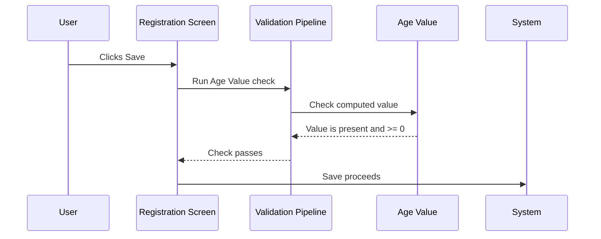

# Age Value Validation on Save

## Overview

When a registration request is saved, the system performs a final post-pipeline check on the computed **Age Value** of the patient. The Age Value is calculated server-side by comparing the Specimen Collection Date against the patient's Date of Birth. If the resulting value is null (i.e., could not be calculated) or is negative (e.g., the Date of Birth is entered as a future date relative to the collection date), the system blocks the save and prompts the user with message 4121. This check acts as a safety net for edge cases that slip past the earlier field-level validations for Date of Birth and Age.

---

## Related User Stories

- **[[CRST-535]]** - Registration - Pre-register: Patient Info Validation - Age Value

**Epic:** LISP-27 [CRST][DEV] Registration - Register Workflow

---

## Key Concepts

### Age Value
A numeric value representing the patient's computed age, calculated server-side by comparing the Specimen Collection Date/Time against the patient's Date of Birth. This is distinct from the **Age** field that the user may directly enter on the Registration screen. The Age Value is an internally computed figure used for downstream clinical and reporting purposes; it is not directly visible to the user as a labelled field.

### Post-Pipeline Check
This validation runs after all standard field-level checks (mandatory fields, format checks, range checks) have already passed. It is the last guard in the pre-save validation sequence, specifically checking the result of the server-side age computation rather than any user-entered value.

---

## Trigger Point

This validation is triggered when the user clicks **Save** on the Manual Registration screen. It is the last step in the pre-save validation pipeline and runs only after all earlier patient info and request info checks have completed successfully. It applies unconditionally — there is no configuration option that disables it.

---

## Workflow Scenarios

### Scenario 1: Age Value Is Valid — Save Proceeds

#### Prerequisites
- All earlier validations have passed.
- The server-side computation of Age Value (Specimen Collection Date vs Date of Birth) produces a non-null value that is zero or greater.

#### Process Flow



#### Step-by-Step Details

1. After all other validations complete, the system evaluates the computed Age Value.
2. The value is present and is zero or greater.
3. The check passes silently. No message is shown.
4. The save proceeds.

---

### Scenario 2: Age Value Is Null or Negative — Save Blocked (Message 4121)

#### Prerequisites
- All earlier field-level validations have passed (i.e., the Date of Birth format and future-date checks did not catch the problem).
- The server-side Age Value computation results in either a null value (calculation could not be performed) or a negative value (e.g., DOB is later than the Specimen Collection Date).

#### Process Flow

```mermaid
sequenceDiagram
    User->>Registration Screen: Clicks Save
    Registration Screen->>Validation Pipeline: Run Age Value check
    Validation Pipeline->>Age Value: Check computed value
    Age Value-->>Validation Pipeline: Value is null or < 0
    Validation Pipeline-->>Registration Screen: Validation fails — message 4121
    Registration Screen->>User: Show error "Age value is invalid. Please contact LIS support." (OK only)
    User->>Registration Screen: Clicks OK
    Registration Screen->>User: Returns focus; save is blocked
```

#### Step-by-Step Details

1. After all other validations complete, the system evaluates the computed Age Value.
2. The value is either null (could not be calculated) or negative.
3. The system displays message **4121**: *"Age value is invalid. Please contact LIS support."* with a single **OK** button.
4. The user clicks **OK** to dismiss the error.
5. The save operation is blocked. The user must correct the relevant date information (Date of Birth or Specimen Collection Date) and click Save again.

> The message text includes "Please contact LIS support" because a null or negative Age Value typically indicates a data entry inconsistency that requires investigation — most commonly, a Date of Birth that is later than the Specimen Collection Date.

---

## Summary Table

| Condition | Message | Severity | User Options | Blocks Save? |
|-----------|---------|----------|-------------|--------------|
| Age Value is present and ≥ 0 | *(none)* | — | — | No |
| Age Value is null or < 0 | 4121 | Hard stop | OK only | Yes |

---

## Data Sources

| Data | Source |
|------|--------|
| Age Value | Computed server-side by the system from Specimen Collection Date/Time and the patient's Date of Birth |

---

## Configuration

There are no configurable options that enable or disable the Age Value check. It runs unconditionally at the end of the pre-save validation pipeline whenever a save is attempted.

---

## Business Rules

1. The Age Value check is a **post-pipeline** step — it runs after all standard field-level validations have completed. It cannot be triggered in isolation; all earlier checks must pass first.
2. The check fires when the computed Age Value is **null** (not calculable) **or negative** (less than zero). Both conditions are treated identically — message 4121 is shown and the save is blocked.
3. An Age Value of **zero** is considered valid and does not trigger the check. This allows registration of newborns or patients whose DOB matches the Specimen Collection Date.
4. Message **4121** is a hard stop with a single **OK** button. There is no bypass option.
5. The Age Value is computed **server-side** using the Specimen Collection Date/Time and the patient's Date of Birth. It is not the same as the Age field the user manually enters on the screen.
6. The most common cause of this error is a Date of Birth that is set to a date after the Specimen Collection Date — a data entry error that the earlier format and future-date checks may not have caught if the DOB itself is technically valid as a date.

---

## Related Workflows

- [[Patient Info Validation on Save]] — This check is the final step in the full pre-save patient information validation pipeline; it is documented there as a post-pipeline check (Scenario 4).
- [[Patient Demographics Panel]] — The Date of Birth field on this panel is the primary input that, if incorrectly entered, can lead to a negative or invalid Age Value.
