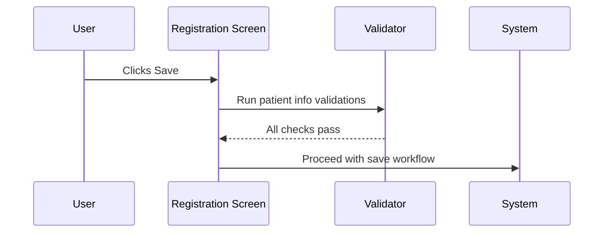

# Patient Info Validation on Save

## Overview

When a registration staff member clicks **Save** on the Manual Registration screen, the system validates the patient information fields before allowing the request to be saved. If any mandatory field is blank or contains an invalid value, the system displays an error message and prevents saving. The checks cover patient name, sex, age, age unit, patient category, race, date of birth, admission date/time, patient location, and primary report copy location. Some of these checks are conditional — they apply only when specific lab options are enabled, or only when certain field combinations are present. All hard-stop error messages are dismissed with a single **OK** button.

---

## Related User Stories

- **[[CRST-531]]** - Registration - Pre-register: Patient Info Validation - Mandatory & Validity
- **[[CRST-532]]** - Registration - Pre-register: Patient Info Validation - Patient Name
- **[[CRST-533]]** - Registration - Pre-register: Patient Info Validation *(related)*

**Epic:** LISP-27 [CRST][DEV] Registration - Register Workflow

---

## Key Concepts

### New Patient
A patient being registered for the first time — their record does not yet exist in the local system. Certain validations (e.g., patient name blank check and format check) apply only to new patients.

### Existing Patient
A patient retrieved from the local system or an external patient index. Their demographics are pre-populated. Patient location blank validation still applies to existing patients when the option is enabled.

### Mandatory vs. Validity Check
- A **mandatory check** ensures a required field is not left blank (message 490: "[Field] must not be blank.").
- A **validity check** ensures the value entered is acceptable/recognised (message 497: "Invalid [Field].").
- Some fields undergo both checks: first validity, then blank.

### Hard-Stop vs. Warning
- A **hard-stop** error (messages 490, 497, 1494, 4121) blocks the save entirely. The user must correct the field and click Save again.
- A **warning** (message 2514 for an inactive patient location) is non-blocking — the user is informed but the save can still proceed.

---

## Trigger Point

This workflow is triggered when the user clicks **Save** on the Manual Registration screen after a request number has been assigned. The validations run in sequence before the request data is submitted.

---

## Workflow Scenarios

### Scenario 1: All Patient Info Valid — Save Proceeds

#### Prerequisites
- A request number is assigned.
- All mandatory patient info fields are populated with valid values.
- All enabled mandatory fields satisfy their respective checks.

#### Process Flow



#### Step-by-Step Details

1. The user clicks **Save** on the Registration screen.
2. The system runs all patient info validations in sequence.
3. All checks pass.
4. The save workflow continues (request is submitted to the system).

---

### Scenario 2: A Mandatory or Validity Check Fails (Hard Stop)

#### Prerequisites
- A request number is assigned.
- One or more patient info fields are blank or contain an invalid value.

#### Process Flow

```mermaid
sequenceDiagram
    User->>Registration Screen: Clicks Save
    Registration Screen->>Validator: Run patient info validations
    Validator->>User: Shows error message (490, 497, or 1494)
    User->>Error Popup: Clicks OK
    Error Popup-->>Registration Screen: Message dismissed; save is blocked
    Registration Screen->>User: Focus returned to the invalid field
```

#### Step-by-Step Details

1. The user clicks **Save** on the Registration screen.
2. The system evaluates each patient info field in turn.
3. The first failing check triggers an error message popup (see the validation table below).
4. The user reads the message and clicks **OK**.
5. The popup closes. The save is blocked — the request is not submitted.
6. The user corrects the field and may attempt to save again.

> There is only one action button on any of these error messages: **OK**. Clicking OK simply dismisses the message box.

---

### Scenario 3: Inactive Patient Location Warning (Non-Blocking)

#### Prerequisites
- The user has clicked Save.
- The Patient Location field contains a location code that is recognised but marked as inactive in the system.

#### Step-by-Step Details

1. The system detects that the entered patient location is inactive.
2. The system displays message **2514** naming the inactive location.
3. This is a **warning only** — the user is informed but the save is **not blocked**.
4. The save pipeline continues after the warning is acknowledged.

---

### Scenario 4: Computed Age Value Invalid (Post-Pipeline Check)

#### Prerequisites
- All field-level validations have passed.
- The age value computed internally (e.g., derived from Date of Birth) is negative — an edge case that can arise from certain date entry combinations.

#### Process Flow

```mermaid
sequenceDiagram
    User->>Registration Screen: Clicks Save
    Registration Screen->>Validator: Run patient info validations
    Validator-->>Registration Screen: Field-level checks pass
    Registration Screen->>Validator: Run post-pipeline age value check
    Validator->>User: Shows message 4121
    User->>Error Popup: Clicks OK
    Error Popup-->>Registration Screen: Save blocked; user corrects DOB or Age
```

#### Step-by-Step Details

1. After all field-level validations pass, the system performs a final check on the internally computed age value.
2. If the computed age is negative (less than 0), the system displays message **4121**.
3. The user clicks **OK** on the prompt. The save operation is blocked.
4. The user must correct the Date of Birth or Age field and click Save again.

> This check uses message **4121**, not 497. It is a separate post-pipeline step and cannot be bypassed.

---

## Validation Rules

The following table lists every patient info validation performed at save time, in execution order.

| Field | Condition for Check to Run | Check Type | Error When | Message Code | Message Text |
|---|---|---|---|---|---|
| **Patient Name** | New patient only; `PATIENT_NAME_VALIDATION_ENABLED` option enabled | Blank | Field is empty | 490 | Patient Name must not be blank. |
| **Sex** | `PATIENT_SEX_MANDATORY` option enabled | Validity | Value is not a valid sex code | 497 | Invalid Sex. |
| **Sex** | `PATIENT_SEX_MANDATORY` option enabled | Blank | Field is empty | 490 | Sex must not be blank. |
| **Age Unit** | Age is supplied (DOB is absent and Age ≠ 0) | Validity | Value is not a valid age unit code | 497 | Invalid Age Unit. |
| **Age Unit** | Age is supplied (DOB is absent and Age ≠ 0) | Blank | Field is empty | 490 | Age Unit must not be blank. |
| **Patient Location** | `PATIENT_LOCATION_IS_MANDATORY` option enabled (applies to both new and existing patients) | Blank | Field is empty | 490 | Patient Location must not be blank. |
| **Patient Category** | Always | Validity | Value is not a valid patient category code | 497 | Invalid Patient Category. |
| **Patient Category** | Always | Blank | Field is empty | 490 | Patient Category must not be blank. |
| **Race** | Always | Validity | Value is not a valid race code | 1494 | Race Code is invalid. |
| **Age** | Always | Range | Age value is negative | 497 | Invalid Age. |
| **Date of Birth** | Always | Format | Date format is invalid | 497 | Invalid Date of Birth. |
| **Date of Birth** | Always | Range | DOB is in the future (after current date) | 497 | Invalid Date of Birth. |
| **Admission Date/Time** | Always | Format | Date/time format is invalid | 497 | Invalid Admission Date/Time. |
| **Admission Date/Time** | Always | Range | Admission date/time is in the future | 497 | Invalid Admission Date/Time. |
| **Patient Location** | Always | Validity | Location code is not recognised | 497 | Invalid Patient Location. |
| **Patient Location** | Always | Warning | Location is recognised but inactive | 2514 | *(inactive location name)* — warning only, non-blocking |
| **Primary Report Copy Location** | Primary report copies exist | Blank | Location field is empty | 490 | Primary Report Location (Patient Location / Report Location) must not be blank. |
| **Computed Age Value** | Post-pipeline; computed age < 0 | Range | Internal age value is negative | 4121 | *(age value prompt)* |

---

## Error Messages and System Prompts

| Message Code | Trigger | Blocking? | User Options |
|---|---|---|---|
| 490 | A mandatory field is left blank | Yes | OK (dismiss; must correct field) |
| 497 | A field contains an invalid or out-of-range value | Yes | OK (dismiss; must correct field) |
| 1494 | The patient race code is not recognised | Yes | OK (dismiss; must correct field) |
| 2514 | Patient location is recognised but inactive | No (warning only) | OK (save proceeds) |
| 4121 | Internally computed age value is negative | Yes | OK (dismiss; must correct DOB or Age) |

---

## Configuration

| Setting | Option Code | Purpose | Effect when enabled | Effect when disabled |
|---------|------------|---------|--------------------|-------------------|
| Patient Location is Mandatory | `PATIENT_LOCATION_IS_MANDATORY` | Controls whether Patient Location is a required field at save time | Patient Location blank check is active; save blocked if empty | Patient Location blank check is skipped; save is allowed even if field is empty |
| Patient Sex Mandatory | `PATIENT_SEX_MANDATORY` | Controls whether Patient Sex must be filled in and valid at save time | Sex validity and blank checks are both active; **Sex** field label is also marked as required (asterisk shown) | Both Sex checks are skipped regardless of whether the field is populated |
| Patient Name Validation | `PATIENT_NAME_VALIDATION_ENABLED` | Controls whether patient name blank check is active for new patients | Patient Name blank check is active for new patients | Patient Name blank check is skipped even for new patients |

> All three option codes belong to the `REQUEST_REGISTRATION` option group in the `LAB_OPTION` table.

---

## Business Rules

1. Patient info validations run only when the user clicks **Save** — they are not triggered on individual field focus-loss.
2. Patient Name blank validation applies to **new patients only**. Existing patient names retrieved from the system are not re-validated.
3. Patient Location blank validation applies to **both new and existing patients** when the option is enabled.
4. Sex validity and blank checks are only active when the `PATIENT_SEX_MANDATORY` lab option is enabled. When disabled, no sex check is performed.
5. Age Unit checks are conditional: they only run when a DOB is absent and an age value other than zero has been entered.
6. Race validity is always checked (no option to disable); if the race field contains an unrecognised code, message 1494 is shown. A blank race is permitted — there is no blank check for race.
7. Date of Birth and Admission Date/Time are each subject to two checks: format validity AND a future-date check. Both use message 497.
8. An inactive patient location generates a **warning** (message 2514) that does not block the save — the user is informed and can still proceed.
9. The Primary Report Copy Location is checked only when primary report copies exist; if they do, the location field must be populated.
10. The computed age value check (message 4121) is a final post-pipeline step that runs after all field-level validations pass. It guards against edge cases where date calculations produce a negative age.
11. Clicking **OK** on any hard-stop error message dismisses the popup only. The save is not retried automatically; the user must correct the field and click **Save** again.
12. These validations are not the only save-time checks — request info (requesting location, urgency, request date, etc.) is validated separately by the Request Info validation rules.

---

## Related Workflows

- [[Patient Name Validation on Save]] — Covers patient name format (comma structure) and length checks, which are part of the same save-time pipeline.
- [[Patient Location Validation on Save]] — Covers the location existence check (497), inactive location warning (2514), and downstream Primary Report Copy location check (490).
- [[Patient Demographics Modified Validation on Save]] — Covers the message 2192 confirmation prompt shown when PMI-sourced demographic fields are changed by a user with the Edit PMI Patient Data right.
- [[Request No. Generation]] — Request number generation is a separate save-time step that precedes patient info validation.
- [[Test Code Selection Behavior]] — Duplicate test code detection occurs at field level during data entry, independently of save-time patient info validations.
- [[Retrieve Patient by HKID]] — Patient demographics are populated by patient retrieval; the patient location blank check applies to retrieved patients as well.
- [[Create New Patient by HKID]] — For new patients, the patient name blank and format validations are active.
