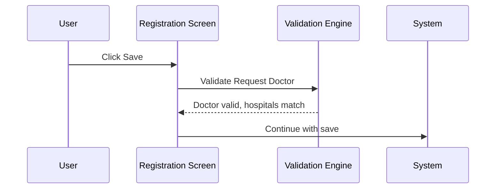

# Request Doctor Validation on Save

## Overview

When a lab request is saved on the Registration screen, the system performs two distinct checks on the Requesting Doctor field. First, it verifies that the doctor code entered is a valid, active doctor registered under the selected hospital. Second, it checks whether the hospital associated with the selected doctor matches the hospital of the selected request location. The validity check is a hard block; the hospital mismatch check is a dismissible warning that allows the user to choose whether to proceed or correct the entry.

---

## Related User Stories

- **[[CRST-536]]** - Registration - Pre-register: Request Info Validation - Request Doctor

**Epic:** LISP-27 [CRST][DEV] Registration - Register Workflow

---

## Key Concepts

### Doctor Input Component
The Requesting Doctor field is a two-part input: a **Hospital** sub-field and a **Doctor Code** sub-field. Both are required for validation. An entered doctor code is looked up against the doctor–hospital combination currently active in the location dictionary.

### Active vs Inactive Doctor
A doctor record with a deletion flag of `1` in the system is considered inactive. Entering an inactive doctor code is treated the same as entering an invalid code — the validity check fails and message 497 is shown.

### Multiple Doctor Not Ready Mode
When the `OFFICE_TABLE_MULTIPLE_DOCTOR_NOT_READY` configuration option is enabled, the system is operating in a transitional state where the doctor–hospital relationship is not yet fully established in the office table. In this mode, the hospital mismatch check (message 4064) is entirely suppressed. Additionally, the doctor lookup behaviour is adjusted to accommodate incomplete hospital assignments.

### Warning vs Hard Error
- Message **497** (invalid doctor) is a **hard error** — it blocks the save. The user must correct the doctor code before proceeding.
- Message **4064** (hospital mismatch) is a **warning** — the user may choose to continue or return to correct the entry. Selecting **Yes** allows the save to proceed; selecting **No** closes the message and returns focus so the user can re-edit the doctor or hospital.

---

## Trigger Point

These validations are executed during the save process, as part of the request information validation pass. They run after patient information validations.

---

## Workflow Scenarios

### Scenario 1: Doctor Code is Valid and Hospital Matches

#### Prerequisites
- A doctor code has been entered.
- The hospital sub-field is populated.
- The entered doctor code exists and is active in the doctor list for the selected hospital.
- The doctor's hospital matches the hospital of the selected request location.

#### Process Flow



#### Step-by-Step Details

1. The user clicks **Save** on the Registration screen.
2. The system looks up the entered doctor code and hospital combination in the active doctor list.
3. The doctor is found and is active (not deleted). The validity check passes.
4. The system checks whether the doctor's hospital matches the request location's hospital. They match.
5. The save proceeds without any message.

---

### Scenario 2: Doctor Code Does Not Exist or Is Inactive — Message 497

#### Prerequisites
- A doctor code has been entered.
- The entered doctor code is not found in the active doctor list for the selected hospital, or the doctor record is marked as inactive (deleted).

#### Process Flow

```mermaid
sequenceDiagram
    User->>Registration Screen: Click Save
    Registration Screen->>Validation Engine: Validate Request Doctor
    Validation Engine-->>Registration Screen: Doctor not found or inactive
    Registration Screen->>User: Show message 497 "Invalid Request Doctor."
    User->>Message: Click OK
    Message-->>Registration Screen: Message dismissed; save blocked
    Registration Screen->>User: Focus returned to Requesting Doctor field
```

#### Step-by-Step Details

1. The user clicks **Save**.
2. The system attempts to look up the doctor code and hospital combination in the active doctor list.
3. No matching active doctor record is found (either the code does not exist, or the doctor record is deleted/inactive).
4. Message **497** is displayed: *"Invalid Request Doctor."*
5. The user clicks **OK** to dismiss the message.
6. The save is blocked. Focus is returned to the Requesting Doctor field for correction.

---

### Scenario 3: Doctor's Hospital Mismatches Request Location Hospital — Message 4064 (Warning)

#### Prerequisites
- The entered doctor code is valid and active.
- The hospital associated with the doctor differs from the hospital of the selected request location.
- The `OFFICE_TABLE_MULTIPLE_DOCTOR_NOT_READY` configuration option is **not** enabled.

#### Process Flow

```mermaid
sequenceDiagram
    User->>Registration Screen: Click Save
    Registration Screen->>Validation Engine: Validate Request Doctor
    Validation Engine-->>Registration Screen: Doctor valid; hospital mismatch detected
    Registration Screen->>User: Show warning 4064 "Request Doctor Hosp. and Request Location Hosp. mismatched. Continue?"
    alt User selects Yes
        User->>Message: Click Yes
        Message-->>Registration Screen: Warning acknowledged; save continues
    else User selects No
        User->>Message: Click No
        Message-->>Registration Screen: Message closed; save cancelled
        Registration Screen->>User: User can re-edit Request Doctor Hospital and Doctor code
    end
```

#### Step-by-Step Details

1. The validity check passes — the doctor exists and is active.
2. The system then compares the hospital code of the selected doctor against the hospital code of the selected request location.
3. A mismatch is found.
4. Warning message **4064** is displayed: *"Request Doctor Hosp. and Request Location Hosp. mismatched. Continue?"*
5. **If the user clicks Yes:** The warning is acknowledged and the save proceeds normally.
6. **If the user clicks No:** The message box closes. The save is **not** submitted. The user can correct the hospital sub-field or change the doctor code before attempting to save again.

---

### Scenario 4: Hospital Mismatch Check Suppressed (Multiple Doctor Not Ready Mode)

#### Prerequisites
- The `OFFICE_TABLE_MULTIPLE_DOCTOR_NOT_READY` configuration option is **enabled**.

#### Step-by-Step Details

1. The validity check runs as normal (message 497 still applies if the doctor code is invalid).
2. The hospital mismatch check is entirely skipped.
3. No message 4064 is shown regardless of whether the doctor's hospital matches the request location's hospital.
4. The save proceeds without a hospital comparison warning.

---

## Summary Table — Validation Outcomes

| Condition | Check Type | Message | Blocking? | User Options |
|-----------|-----------|---------|-----------|-------------|
| Doctor code not found in active doctor list | Validity | 497 — "Invalid Request Doctor." | Yes | OK (must correct) |
| Doctor record is inactive (deleted) | Validity | 497 — "Invalid Request Doctor." | Yes | OK (must correct) |
| Doctor field blank at save time | Mandatory | 490 — "Req Doctor" | Yes | OK (must fill in) |
| Doctor's hospital ≠ request location hospital | Warning | 4064 — "Request Doctor Hosp. and Request Location Hosp. mismatched. Continue?" | No (warning) | Yes (proceed) / No (re-edit) |
| `OFFICE_TABLE_MULTIPLE_DOCTOR_NOT_READY` enabled | — | 4064 suppressed | — | Not shown |

---

## Configuration

| Setting | Option Code | Purpose | Effect when enabled | Effect when disabled |
|---------|------------|---------|--------------------|--------------------|
| Multiple Doctor Not Ready | `OFFICE_TABLE_MULTIPLE_DOCTOR_NOT_READY` | Indicates the doctor–hospital relationship in the office table is not yet fully established | Hospital mismatch warning (4064) is suppressed; doctor lookup adjusted to accommodate incomplete hospital assignments | Hospital mismatch is checked at save time; warning 4064 shown if doctor and location hospitals differ |

---

## Business Rules

1. The doctor code is validated against the combination of the entered doctor code **and** the selected hospital. A doctor code that is valid for one hospital is not automatically valid for another.
2. An inactive (deleted) doctor is treated as invalid. Message 497 is shown even if the doctor code previously existed in the system.
3. The mandatory check (message 490 — "Req Doctor") fires if the Doctor field is left blank. The validity check (message 497) fires only when a non-blank value has been entered that does not resolve to a valid active doctor.
4. The hospital mismatch check (message 4064) is classified as a **warning**. It does not block the save on its own — the user actively chooses whether to proceed by clicking **Yes** or to return and correct by clicking **No**.
5. When the user clicks **No** on message 4064, the save is abandoned but no field is automatically cleared. The user may freely re-edit the Hospital or Doctor Code sub-fields before trying to save again.
6. The hospital mismatch check is entirely suppressed when `OFFICE_TABLE_MULTIPLE_DOCTOR_NOT_READY` is enabled. In this mode, only the validity check (message 497) applies to the Requesting Doctor field.

---

## Related Workflows

- [[Request Info Validation on Save]] — Request Doctor validation is one of the request info validations executed at save time; the full set is documented there.
- [[Default Request Doctor]] — The Requesting Doctor field may be pre-populated by a default rule; save-time validation runs after defaults are applied.
