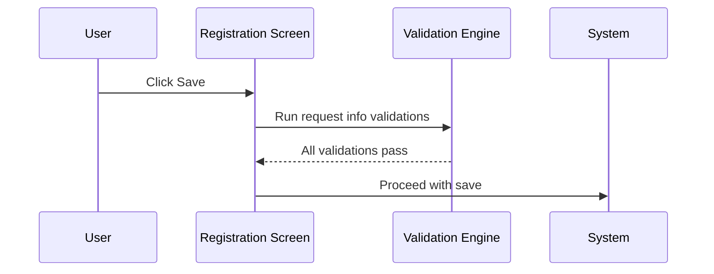
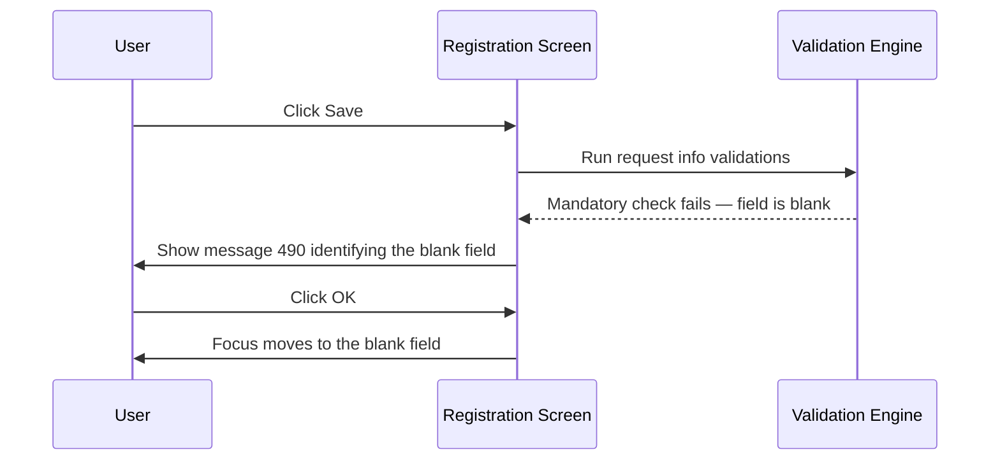
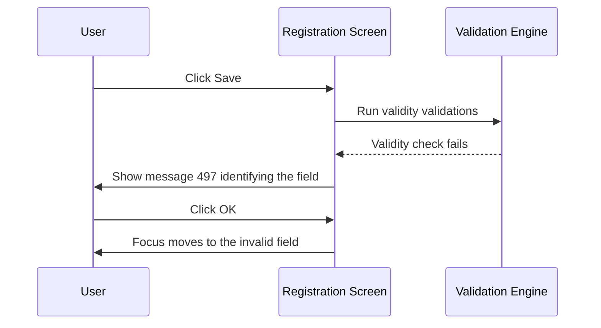
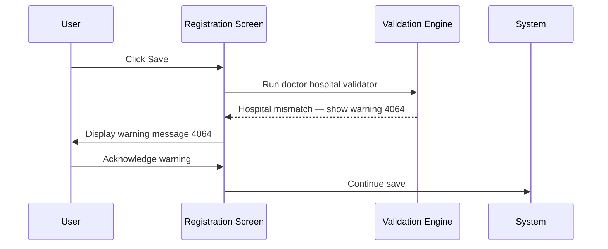

# Request Info Validation on Save

## Overview

When a registration is saved, the system validates the request information fields before the save is allowed to proceed. Validation falls into two categories: **mandatory checks** (the field must not be blank) and **validity checks** (the value entered must be a recognised, valid option). Some fields are always subject to validation; others are only validated when specific system configuration options are enabled. Where validation fails, the save is blocked and the user is presented with an error message identifying the affected field.

---

## Related User Stories

- **[[CRST-104]]** - Registration - Pre-register: Request Info Validation - Mandatory & Validity
- **[[CRST-536]]** - Registration - Pre-register: Request Info Validation - Request Doctor
- **[[CRST-501]]** - Registration - Pre-register: Request Info Validation - Clinical Detail / Reference / Request Comment
- **[[CRST-502]]** - Registration - Pre-register: Request Info Validation - Datetime

**Epic:** LISP-27

---

## Key Concepts

### Mandatory vs Validity Checks
A **mandatory check** (message 490) fires when a required field is left blank. A **validity check** (message 497) fires when a value has been entered but it is not a recognised or valid option — for example, a doctor code that does not exist in the system.

### Configuration-Gated Validation
Several fields are only validated when a corresponding system configuration option is enabled. Where validation is disabled, the field is optional and no error is shown regardless of its content.

### Date Attribute Configuration
The visibility, mandatory status, and field ordering of the Request Date, Arrival Date, and Collection Date fields are all controlled by a single `DATE_ATTRIBUTE` option. The option value is a comma-separated list of entries, one per date type. Each entry has the form `<Type><Visible><Optional>[<Default>]`, where:
- **Type** — `R` = Request Date, `A` = Arrival Date, `C` = Collection Date
- **Visible** — `0` = field hidden, `1` = field visible
- **Optional** — `0` = field is **mandatory**, `1` = field is **optional** (the third character in the string is the optional flag, so `0` means mandatory; the US description that states `R11` = "validity check + mandatory" maps to: position 2 visible=`1`, position 3 optional=`0` meaning NOT optional = mandatory, and validity check is implicitly always on when the field is visible)

> **Practical encoding:**
> - `R10` — Request Date visible, mandatory
> - `R11` — Request Date visible, optional
> - `C10` — Collection Date visible, mandatory
> - `C11` — Collection Date visible, optional

### Report Destination Interaction
The mandatory check for **Report Location** is additionally suppressed if a report destination has already been set on the request. If a report destination is recorded, the Report Location mandatory check is bypassed even when the `REPORT_LOCATION_MANDATORY` option is enabled.

### Doctor Hospital Mismatch Warning
The doctor–location hospital mismatch check (message 4064) is classified as a **warning**, not a hard validation error. A warning allows the user to acknowledge and proceed; a hard validation blocks save entirely.

---

## Trigger Point

These validations are executed during the save process, after basic patient information validations have completed. They run before the request is committed to the database.

---

## Validation Rules

The table below lists every request information field subject to save-time validation, the type of check performed, the configuration condition under which it is active, and the message shown when the check fails.

| Field | Check Type | Message | Active When | Notes |
|-------|-----------|---------|-------------|-------|
| **Clinical Detail** | Mandatory | 490 — "This request sendout to DH, clinical detail" | The request is a send-out to a Department of Health (DH) location configured to require clinical detail | Disabled for all other request types |
| **Clinical Detail** | Max 5 lines | 650 | Always (when Clinical Detail is visible) | The text must not exceed 5 lines (newline-delimited); the 6th line or more triggers the error |
| **Clinical Detail** | Max length | 3528 | Always | The text must not exceed the configured maximum character length |
| **Requesting Doctor** | Mandatory | 490 — "Req Doctor" | Always | Blank doctor field blocks save |
| **Requesting Doctor** | Validity | 497 — "Request Doctor" | Always | Entered doctor code must exist and be valid |
| **Requesting Doctor** | Hospital mismatch | 4064 *(warning)* | Only when the "Multiple Doctor Not Ready" configuration is **disabled** | Shown as a warning (not a hard block) when the doctor's hospital differs from the request location's hospital; user can acknowledge and proceed |
| **Request Location — Specialty** | Mandatory | 490 — "Specialty" | `REQUEST_LOCATION_SPECIALTY_IS_MANDATORY` = 1 | Specialty sub-field within the Request Location component |
| **Request Location** | Mandatory | 490 — "Requesting Location" | Always | |
| **Request Location** | Validity | 497 — "Request Location" | Always | Entered location must resolve to a valid location code |
| **Report Location** | Mandatory | 490 — "Report Location" | `REPORT_LOCATION_MANDATORY` = 1 **AND** no report destination already set | If a report destination is already recorded on the request, the mandatory check is bypassed |
| **Report Location** | Validity | 497 — "Report Location" | Always | Invalid input is also automatically cleared when the field loses focus |
| **Report Copy Location** | Validity | 497 — "Copy To" | Always | Invalid input is also automatically cleared when the field loses focus |
| **Confidential** | Mandatory | 490 — "Confidentiality" | Always | |
| **Confidential** | Validity | 497 — "Confidential" | Always | |
| **Bill** | Validity | 497 — "Bill" | Always | |
| **Urgency** | Mandatory | 490 — "Urgency" | Always | |
| **Urgency** | Validity | 497 — "Urgency" | Always | |
| **Lab Only** | Mandatory | 490 — "Lab Only" | `LAB_ONLY_REQUEST_ENABLED` = 1 | |
| **Lab Only** | Validity | 3935 | `LAB_ONLY_REQUEST_ENABLED` = 1 | Error message text is derived from the Lab Only field's current keyword description |
| **Request Date** | Mandatory | 490 — "Request Date/Time" | `DATE_ATTRIBUTE` option — Request Date entry has optional flag = `0` (not optional) | Field must also be visible |
| **Request Date** | Validity | 497 — "Request Date/Time" | `DATE_ATTRIBUTE` option — Request Date entry is visible | Format check on the date/time value |
| **Arrival Date** | Mandatory | 490 — "Arrival Date/Time" | `DATE_ATTRIBUTE` option — Arrival Date entry has optional flag = `0` (not optional) | Field must also be visible |
| **Arrival Date** | Validity | 497 — "Arrival Date/Time" | `DATE_ATTRIBUTE` option — Arrival Date entry is visible | Format check on the date/time value |
| **Collection Date** | Mandatory | 490 — "Collection Date/Time" | `DATE_ATTRIBUTE` option — Collection Date entry has optional flag = `0` (not optional) | Field must also be visible; Collection Date is optional by default if no `DATE_ATTRIBUTE` entry is present |
| **Collection Date** | Validity | 497 — "Collection Date/Time" | `DATE_ATTRIBUTE` option — Collection Date entry is visible | Format check on the date/time value |

---

## Workflow Scenarios

### Scenario 1: All Validations Pass

#### Prerequisites
- All mandatory fields are populated with valid values
- All configuration-gated mandatory fields either contain a valid value or the corresponding option is disabled
- No invalid inputs remain in location, doctor, or date/time fields

#### Process Flow

#### Step-by-Step Details

1. The user clicks **Save** (or equivalent confirmation action) on the Registration screen.
2. The system runs all active request information validations in sequence.
3. Each validation checks its corresponding field against the active condition (see table above).
4. If all checks pass, the save process continues to the next stage.

---

### Scenario 2: Mandatory Field Blank

#### Prerequisites
- A mandatory request information field has been left empty.

#### Process Flow

#### Step-by-Step Details

1. The system detects that a required field is blank.
2. Message 490 is displayed, identifying the field name (e.g., "Urgency", "Requesting Location", "Report Location").
3. The user clicks **OK** to dismiss the message.
4. Focus is returned to the blank field so the user can supply a value.
5. The save is blocked until the field is populated.

---

### Scenario 3: Invalid Value in Location, Doctor, or Date Field

#### Prerequisites
- The user has typed a value into a location, doctor, or date field, but the value does not resolve to a valid entry.

#### Process Flow

#### Step-by-Step Details

1. The system detects that a value has been entered in a location, doctor, or date field but does not match a valid option.
2. Message 497 is displayed, identifying the field (e.g., "Request Doctor", "Request Location", "Request Date/Time").
3. The user clicks **OK** to dismiss the message.
4. Focus is returned to the invalid field.
5. The save is blocked until the value is corrected or cleared.

> **Note for location fields:** Report Location and Report Copy Location automatically clear their contents when the field loses focus if an invalid value was entered. This means, in practice, these fields will rarely trigger message 497 at save time — the value will already have been removed on focus-out.

---

### Scenario 4: Clinical Detail Exceeds 5 Lines

#### Prerequisites
- The user has entered clinical detail text that spans more than 5 lines.

#### Step-by-Step Details

1. The system counts the number of line breaks in the Clinical Detail field.
2. If the text contains more than 5 lines, message 650 is displayed.
3. The save is blocked. The user must reduce the clinical detail text to 5 lines or fewer before saving.

---

### Scenario 5: Lab Only Blank or Invalid (when Lab Only is enabled)

#### Prerequisites
- The `LAB_ONLY_REQUEST_ENABLED` configuration is active.
- The Lab Only field is blank (message 490) or contains an unrecognised value (message 3935).

#### Step-by-Step Details

1. If the Lab Only field is blank, message 490 ("Lab Only") is shown and save is blocked.
2. If the Lab Only field contains an invalid selection, message 3935 is shown. The message text is determined by the current description of the Lab Only keyword.
3. If the user selects the "Yes" (lab only) indicator in the Lab Only field, an additional confirmation prompt (message 2599) is displayed asking the user to confirm the lab-only designation before the save proceeds.

---

### Scenario 6: Doctor's Hospital Does Not Match Request Location Hospital (Warning)

#### Prerequisites
- The "Multiple Doctor Not Ready" configuration is **not enabled**.
- The doctor selected belongs to a different hospital from the request location.

#### Process Flow

#### Step-by-Step Details

1. The system compares the hospital associated with the selected doctor against the hospital associated with the selected request location.
2. If they differ and the "Multiple Doctor Not Ready" option is not active, warning message 4064 is displayed.
3. Because this is a **warning** (not a hard error), the user can acknowledge it and the save proceeds.
4. If the "Multiple Doctor Not Ready" option **is** enabled, this hospital mismatch check is suppressed entirely.

---

## Summary Table — Conditional Validators

| Field | Validation Active When |
|-------|----------------------|
| Clinical Detail — mandatory | Send-out request to DH location flagged to require clinical detail |
| Request Location Specialty — mandatory | `REQUEST_LOCATION_SPECIALTY_IS_MANDATORY` = 1 |
| Report Location — mandatory | `REPORT_LOCATION_MANDATORY` = 1 **and** no report destination set |
| Lab Only — mandatory | `LAB_ONLY_REQUEST_ENABLED` = 1 |
| Lab Only — validity | `LAB_ONLY_REQUEST_ENABLED` = 1 |
| Request Date — mandatory | `DATE_ATTRIBUTE` request entry is visible and not optional |
| Arrival Date — mandatory | `DATE_ATTRIBUTE` arrival entry is visible and not optional |
| Collection Date — mandatory | `DATE_ATTRIBUTE` collection entry is visible and not optional (Collection Date is optional by default) |
| Doctor hospital mismatch warning | `OFFICE_TABLE_MULTIPLE_DOCTOR_NOT_READY` is **not** enabled |

---

## Configuration

| Setting | Option Code | Purpose | Effect when enabled | Effect when disabled |
|---------|------------|---------|--------------------|--------------------|
| Request Location Specialty Mandatory | `REQUEST_LOCATION_SPECIALTY_IS_MANDATORY` | Controls whether a specialty must be selected within the Request Location | Specialty sub-field is mandatory; message 490 shown if blank | Specialty is optional; no mandatory check |
| Report Location Mandatory | `REPORT_LOCATION_MANDATORY` | Controls whether the Report Location field must be filled | Report Location is mandatory (subject to report destination override); message 490 if blank | Report Location is optional |
| Lab Only Request | `LAB_ONLY_REQUEST_ENABLED` | Controls whether the Lab Only field is present and validated | Lab Only field is mandatory and validity-checked | No Lab Only validation |
| Date Attribute | `DATE_ATTRIBUTE` | Configures visibility, mandatory status, and display order for Request Date, Arrival Date, and Collection Date fields | Each date field individually controlled per the encoded string (see Key Concepts) | Date fields use their default behaviour (Collection Date optional by default; others mandatory by default) |
| Multiple Doctor Not Ready | `OFFICE_TABLE_MULTIPLE_DOCTOR_NOT_READY` | Controls whether the doctor–location hospital mismatch warning is suppressed | Hospital mismatch check is **suppressed** (no warning shown) | Hospital mismatch warning 4064 is shown as a warning on save |

---

## Business Rules

1. Mandatory validation (message 490) fires only when a field is completely blank; entering any value — even an invalid one — bypasses the blank check and triggers the validity check instead.
2. Validity validation (message 497) fires when a field contains a value that does not resolve to a recognised system entry.
3. The Clinical Detail mandatory check applies only when the request is a send-out to a specific Department of Health location that is configured to require clinical detail. It is not a general mandatory field.
4. Clinical Detail must not exceed 5 lines. Each newline character counts as a line break.
5. Report Location and Report Copy Location auto-clear their contents on focus-out if the entered value is not valid. As a result, these fields will typically be either empty or valid at save time.
6. The Report Location mandatory check is bypassed if a report destination is already set on the request, regardless of the `REPORT_LOCATION_MANDATORY` option setting.
7. The doctor–location hospital mismatch check (message 4064) is a **warning**, not a hard error. The user may proceed after acknowledging it.
8. When the `OFFICE_TABLE_MULTIPLE_DOCTOR_NOT_READY` option is enabled, the hospital mismatch check is entirely suppressed.
9. Collection Date is optional by default if no `DATE_ATTRIBUTE` configuration entry is present for it. Request Date and Arrival Date are mandatory by default.
10. When the Lab Only field is set to the "Yes" indicator, an additional confirmation prompt (message 2599) is shown before the save is allowed to continue.

---

## Related Workflows

- [[Patient Info Validation on Save]] — Patient information fields are validated in a separate pass that runs alongside or before request info validations.
- [[Request Doctor Validation on Save]] — Detailed breakdown of the doctor validity (497) and hospital mismatch warning (4064) checks.
- [[Clinical Detail and Text Field Length Validation on Save]] — Detailed breakdown of the max-length checks for Clinical Detail (510 chars, message 3528), Reference (255 chars, message 552), and Request Comment (255 chars, message 552).
- [[Specimen Datetime Validation on Save]] — Detailed breakdown of all datetime chronological checks and configurable future/expiry warnings for Request, Collection, and Arrival dates.
- [[Test Existence Validation on Save]] — First check in the test validation sequence; ensures at least one test is present before the save is allowed to proceed.
- [[Test Prefix Validation on Save]] — Second check in the test validation sequence; ensures send-out tests have a Send Out location before saving.
- [[Test Registrable Validation on Save]] — Third check in the test validation sequence; verifies each entered test exists in the registrable catalogue and is accessible for the current user.
- [[Test Valid Period Validation on Save]] — Fourth check in the test validation sequence; warns the user when the specimen collection time has exceeded a test's configured Valid Specimen Period.
- [[Test Duplication Validation on Save]] — Fifth check in the test validation sequence; warns when the same tests have already been registered for the patient within the configured duplication period.
- [[Test Validity Validation on Save]] — Sixth check in the test validation sequence; validates patient sex and age against each test's validity setup when SEX_AGE_TEST_CHECK_ENABLED is active.
- [[Default Request Location]] — Request Location is pre-populated by default rules; this validation runs after defaults have been applied.
- [[Default Request Doctor]] — Requesting Doctor is pre-populated by default rules; this validation runs after defaults have been applied.
