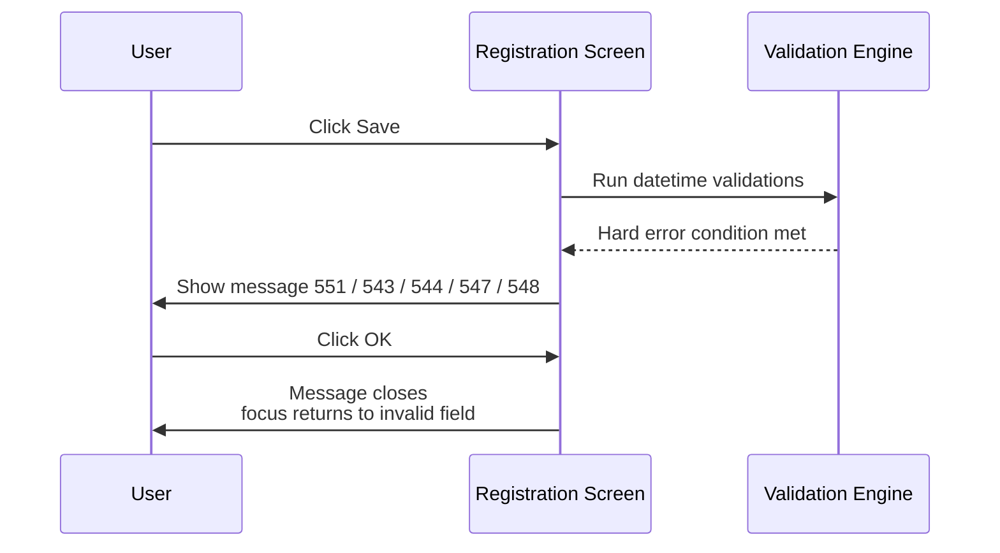
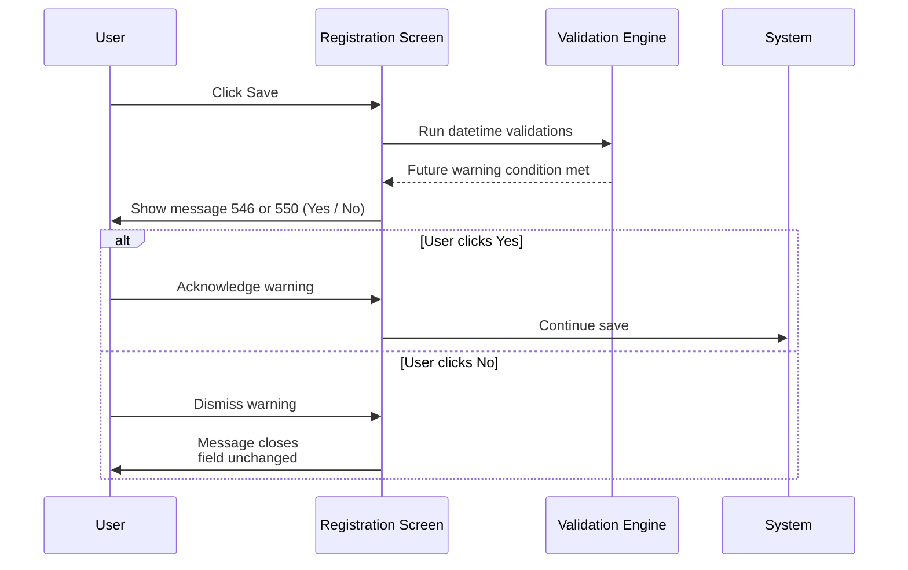
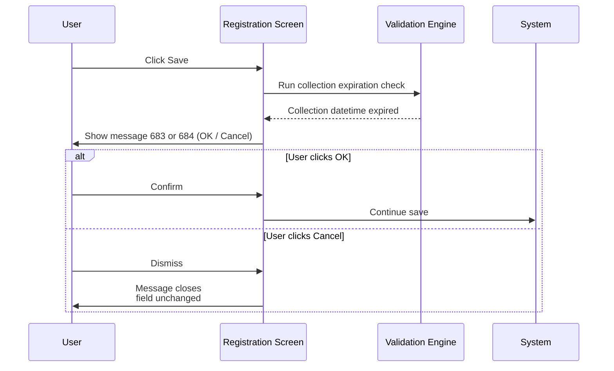
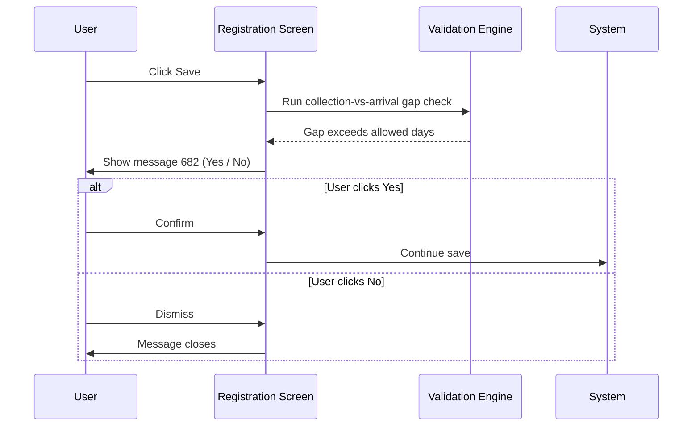

# Specimen Datetime Validation on Save

## Overview

When a registration is saved, the system validates the specimen datetime fields — Request Date/Time, Collection Date/Time, and Arrival Date/Time — to enforce a set of chronological and business rules. These checks ensure that dates are logically consistent with each other, do not lie unreasonably in the future, and do not predate the patient's date of birth. Some checks are hard errors that block the save outright; others are configurable warnings that ask the user to confirm before proceeding.

---

## Related User Stories

- **[[CRST-502]]** - Registration - Pre-register: Request Info Validation - Datetime

**Epic:** LISP-27 [CRST][DEV] Registration - Register Workflow

---

## Key Concepts

### Hard Error vs Warning
A **hard error** blocks the save entirely. The user must dismiss the message and correct the field before saving can proceed.

A **warning** allows the user to acknowledge and continue. Warning messages present a **Yes / No** (or **OK / Cancel**) choice; choosing to proceed allows the save to continue without further correction.

### Field Visibility Prerequisite
All datetime validations apply only when the respective field is visible and editable. Field visibility is controlled by the `DATE_ATTRIBUTE` configuration (see [[Request Info Validation on Save]]). If a field is hidden, its datetime validations do not fire.

### Allow Future Specimen Mode
When the `ALLOW_FUTURE_SPECIMEN` option is enabled, the system permits specimen dates beyond the current server time, up to a configurable number of hours ahead. In this mode, the hard "cannot be later than Now" errors for Collection and Arrival dates are replaced by the "cannot be later than N hours" errors.

### Future Specimen Warning Mode
When `FUTURE_SPECIMEN_WARNING_ENABLED` is active, future-dated Collection and Arrival datetimes are not blocked — instead, a Yes / No confirmation is shown. This mode is only relevant when `ALLOW_FUTURE_SPECIMEN` is **not** active.

### Collection Expiration Check
When `COLLECTION_DATE_EXPIRE_CHECK_CRITERIA` is configured, the system checks whether the Collection Date/Time is too far in the past (i.e., it has "expired"). The check fires only when the collection datetime is already earlier than the current time. The configuration controls both the expiry threshold (in hours) and which button is focused by default on the confirmation prompt.

---

## Trigger Point

These validations are executed during the save process, after the basic request information validations have completed and before the request is committed to the database.

---

## Validation Rules

### Request Date/Time Checks

| Check | Condition | Message | Type |
|-------|-----------|---------|------|
| Future datetime | Request Date/Time > Current server datetime | 551 — "Invalid datetime: Request Date/Time cannot be greater than Now." | Hard error |
| Later than Arrival | Request Date/Time > Arrival Date/Time | 551 — "Invalid datetime: Request date cannot later than Arrival date." | Hard error |

### Collection Date/Time Checks

| Check | Condition | Message | Type |
|-------|-----------|---------|------|
| Future datetime (standard) | Collection Date/Time > Current server datetime, and `ALLOW_FUTURE_SPECIMEN` is **not** enabled | 543 — "Collection Date/Time cannot later than Now." | Hard error |
| Future datetime (with allow-future) | Collection Date/Time > Current server datetime + allowed hours, and `ALLOW_FUTURE_SPECIMEN` **is** enabled | 544 — "Collection Date/Time cannot later than *N* hours." | Hard error |
| Future warning | Collection Date/Time > Current server datetime, and `FUTURE_SPECIMEN_WARNING_ENABLED` **is** enabled | 546 — "Collection Date/Time later than Now, do you want to continue?" | Warning (Yes / No) |
| Later than Arrival | Collection Date/Time > Arrival Date/Time | 551 — "Invalid datetime: Collection date cannot later than Arrival date." | Hard error |
| Earlier than DOB | Collection Date/Time < Patient's Date of Birth | 551 — "Invalid datetime: Collection date cannot earlier than Patient's day of birth." | Hard error |
| Collection expired (OK default) | Collection Date/Time is in the past and exceeds the configured expiry threshold, and `COLLECTION_DATE_EXPIRE_CHECK_CRITERIA` `option_text` ends with `/1` | 683 — "Collection Date/Time is *N* hours before. Do you want to proceed registration?" | Warning (OK / Cancel) — **OK focused** |
| Collection expired (Cancel default) | Collection Date/Time is in the past and exceeds the configured expiry threshold, and `COLLECTION_DATE_EXPIRE_CHECK_CRITERIA` `option_text` ends with `/2` | 684 — "Collection Date/Time is *N* hours before. Do you want to proceed registration?" | Warning (OK / Cancel) — **Cancel focused** |

### Arrival Date/Time Checks

| Check | Condition | Message | Type |
|-------|-----------|---------|------|
| Future datetime (standard) | Arrival Date/Time > Current server datetime, and `ALLOW_FUTURE_SPECIMEN` is **not** enabled | 547 — "Arrival Date/Time cannot later than Now." | Hard error |
| Future datetime (with allow-future) | Arrival Date/Time > Current server datetime + allowed hours, and `ALLOW_FUTURE_SPECIMEN` **is** enabled | 548 — "Arrival Date/Time cannot later than *N* hours." | Hard error |
| Future warning | Arrival Date/Time > Current server datetime, and `FUTURE_SPECIMEN_WARNING_ENABLED` **is** enabled | 550 — "Arrival Date/Time later than Now, do you want to continue?" | Warning (Yes / No) |
| Collection–Arrival gap exceeds limit | Arrival Date/Time is more than the configured number of days after Collection Date/Time, and `DAYS_ALLOWED_SINCE_SPECIMEN_COLLECTION` **is** configured | 682 — "Collection date is more than *N* day(s) earlier than Arrival date! Continue Registration?" | Warning (Yes / No) |

---

## Workflow Scenarios

### Scenario 1: Hard Error — Date is in the Future or Chronologically Invalid

#### Prerequisites
- A datetime field contains a value that violates one of the hard-error rules in the table above.
- The relevant field is visible and editable.

#### Process Flow

#### Step-by-Step Details

1. The system evaluates each visible datetime field against the applicable chronological rules.
2. The first violation found causes the corresponding message (551, 543, 544, 547, or 548) to be displayed.
3. The user clicks **OK** to dismiss the message.
4. The save is blocked and focus returns to the field in error.
5. The user must correct the value before the save can proceed.

---

### Scenario 2: Warning — Future Collection or Arrival Datetime

#### Prerequisites
- `FUTURE_SPECIMEN_WARNING_ENABLED` is enabled.
- `ALLOW_FUTURE_SPECIMEN` is **not** enabled.
- Collection Date/Time or Arrival Date/Time is later than the current server datetime.

#### Process Flow

#### Step-by-Step Details

1. The system detects that Collection Date/Time or Arrival Date/Time is later than now, and the warning mode is active.
2. Message 546 (Collection) or 550 (Arrival) is displayed with **Yes** and **No** buttons.
3. If the user clicks **Yes**, the save proceeds.
4. If the user clicks **No**, the message closes and the field remains at its current value. The user may edit it before retrying the save.

---

### Scenario 3: Warning — Collection Date Expired

#### Prerequisites
- `COLLECTION_DATE_EXPIRE_CHECK_CRITERIA` is configured with `option_value` = 1 or 2, and a threshold in hours is set via `option_text`.
- Collection Date/Time is in the past and the gap between the Collection datetime and the current time exceeds the configured expiry threshold.

#### Process Flow

#### Step-by-Step Details

1. The system checks whether the Collection Date/Time, once the configured expiry hours are added, still falls before the current server datetime. If so, the collection is considered "expired."
2. If the expiry confirmation is configured with default button = 1 (encoded as `/1` in `option_text`), message 683 is shown with **OK** as the default focused button.
3. If the expiry confirmation is configured with default button = 2 (encoded as `/2` in `option_text`), message 684 is shown with **Cancel** as the default focused button.
4. Clicking **OK** on either message allows the save to proceed.
5. Clicking **Cancel** closes the message without saving; the field remains unchanged.

---

### Scenario 4: Warning — Collection–Arrival Gap Exceeds Limit

#### Prerequisites
- `DAYS_ALLOWED_SINCE_SPECIMEN_COLLECTION` is configured with a number of days as `option_value`.
- The difference between Arrival Date and Collection Date (measured in calendar days) exceeds the configured limit.

#### Process Flow

#### Step-by-Step Details

1. The system computes the difference in calendar days between the Arrival Date and the Collection Date.
2. If this difference exceeds the configured maximum, message 682 is displayed: "Collection date is more than *N* day(s) earlier than Arrival date! Continue Registration?"
3. Clicking **Yes** allows the save to proceed.
4. Clicking **No** closes the message without saving.

---

## Summary Table — Message Reference

| Message | Text | Type | User Options | Condition |
|---------|------|------|-------------|-----------|
| 543 | "Collection Date/Time cannot later than Now." | Hard error | OK | Collection > Now; `ALLOW_FUTURE_SPECIMEN` not enabled |
| 544 | "Collection Date/Time cannot later than *N* hours." | Hard error | OK | Collection > Now + N hours; `ALLOW_FUTURE_SPECIMEN` enabled |
| 546 | "Collection Date/Time later than Now, do you want to continue?" | Warning | Yes / No | Collection > Now; `FUTURE_SPECIMEN_WARNING_ENABLED` enabled |
| 547 | "Arrival Date/Time cannot later than Now." | Hard error | OK | Arrival > Now; `ALLOW_FUTURE_SPECIMEN` not enabled |
| 548 | "Arrival Date/Time cannot later than *N* hours." | Hard error | OK | Arrival > Now + N hours; `ALLOW_FUTURE_SPECIMEN` enabled |
| 550 | "Arrival Date/Time later than Now, do you want to continue?" | Warning | Yes / No | Arrival > Now; `FUTURE_SPECIMEN_WARNING_ENABLED` enabled |
| 551 | "Invalid datetime: Request Date/Time cannot be greater than Now." | Hard error | OK | Request > Now |
| 551 | "Invalid datetime: Request date cannot later than Arrival date." | Hard error | OK | Request > Arrival |
| 551 | "Invalid datetime: Collection date cannot later than Arrival date." | Hard error | OK | Collection > Arrival |
| 551 | "Invalid datetime: Collection date cannot earlier than Patient's day of birth." | Hard error | OK | Collection < Patient DOB |
| 682 | "Collection date is more than *N* day(s) earlier than Arrival date! Continue Registration?" | Warning | Yes / No | Arrival – Collection > N days; `DAYS_ALLOWED_SINCE_SPECIMEN_COLLECTION` configured |
| 683 | "Collection Date/Time is *N* hours before. Do you want to proceed registration?" | Warning | OK (default) / Cancel | Collection expired; `COLLECTION_DATE_EXPIRE_CHECK_CRITERIA` with `/1` default button |
| 684 | "Collection Date/Time is *N* hours before. Do you want to proceed registration?" | Warning | OK / Cancel (default) | Collection expired; `COLLECTION_DATE_EXPIRE_CHECK_CRITERIA` with `/2` default button |

---

## Configuration

| Setting | Option Code | Purpose | Effect when enabled | Effect when disabled |
|---------|------------|---------|--------------------|--------------------|
| Allow Future Specimen | `ALLOW_FUTURE_SPECIMEN` | Permits future-dated Collection and Arrival datetimes up to a configured number of hours; `option_value` = 1 enables the mode, `option_text` = the number of hours allowed | Hard "cannot be later than Now" errors (543, 547) are replaced by "cannot be later than N hours" errors (544, 548) | Future datetimes trigger hard errors 543 / 547 immediately |
| Future Specimen Warning | `FUTURE_SPECIMEN_WARNING_ENABLED` | When `ALLOW_FUTURE_SPECIMEN` is not active, shows a Yes / No warning instead of hard-blocking future Collection and Arrival datetimes | Messages 546 and 550 are shown as warnings; user may confirm and proceed | No warning; future datetimes are hard-blocked (if `ALLOW_FUTURE_SPECIMEN` is also inactive) |
| Collection Date Expiry Check | `COLLECTION_DATE_EXPIRE_CHECK_CRITERIA` | Warns when a past-dated Collection datetime has exceeded a configured age threshold; `option_value` = 1 or 2 enables the check; `option_text` = `<hours>/<default button>` where button `1` = OK default, button `2` = Cancel default | Messages 683 or 684 are shown when collection datetime is expired | No expiry check performed |
| Days Allowed Since Specimen Collection | `DAYS_ALLOWED_SINCE_SPECIMEN_COLLECTION` | Sets the maximum permitted gap (in calendar days) between Collection Date and Arrival Date; `option_value` = the maximum number of days | Message 682 is shown when the gap exceeds the limit | No gap check performed |

---

## Business Rules

1. All datetime validations apply only to fields that are visible and editable. Hidden datetime fields are not validated.
2. Hard errors block the save entirely; the user must correct the field before retrying.
3. Warning messages (546, 550, 682, 683, 684) present a confirmation choice. Choosing to proceed allows the save to continue without field correction.
4. When `ALLOW_FUTURE_SPECIMEN` is enabled, the standard "cannot be later than Now" hard errors for Collection and Arrival dates (543, 547) are replaced by the N-hour threshold errors (544, 548). The two modes are mutually exclusive per field.
5. The `FUTURE_SPECIMEN_WARNING_ENABLED` mode is only meaningful when `ALLOW_FUTURE_SPECIMEN` is **not** active. If both options were active simultaneously, the allow-future hard limit (544 / 548) would take precedence.
6. Messages 683 and 684 are the same textual prompt; they differ only in which button is focused by default. The default button is controlled by the `/1` or `/2` suffix in the `COLLECTION_DATE_EXPIRE_CHECK_CRITERIA` option text.
7. The collection–arrival gap check (message 682) is expressed in calendar days, not hours or minutes.
8. Request Date/Time and Collection Date/Time must both be no later than Arrival Date/Time. A Request or Collection datetime that exceeds the Arrival datetime is always a hard error, regardless of future-specimen configuration.
9. Collection Date/Time must not be earlier than the patient's recorded Date of Birth. This check is always active when the Collection Date field is visible.

---

## Related Workflows

- [[Request Info Validation on Save]] — Parent validation pass; datetime checks run as part of the request information validation sequence. Field visibility (via `DATE_ATTRIBUTE`) is also documented there.
