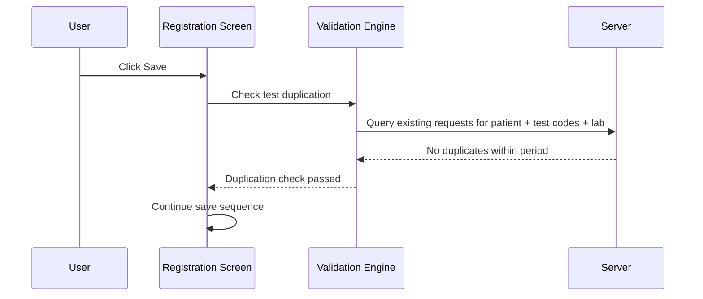
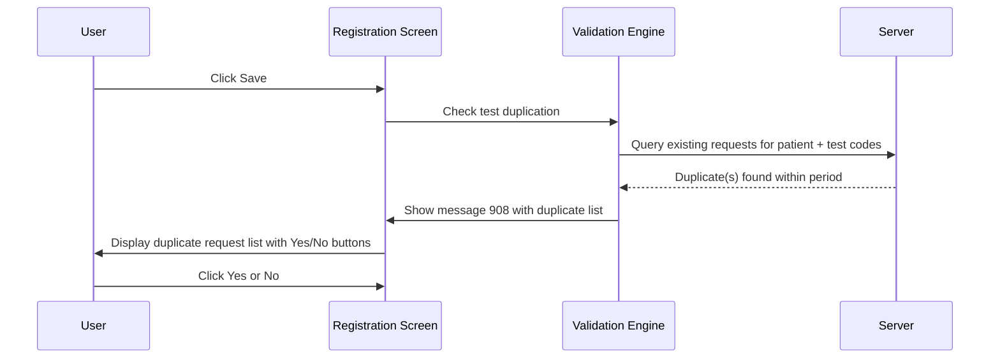

# Test Duplication Validation on Save

## Overview

When a registration is saved for an existing patient, the system checks whether any of the requested tests have already been registered for the same patient within a configurable duplication period. If duplicate requests are found within that window, message **908** is displayed listing the conflicting requests and asking the user whether to proceed. This validation prevents accidental duplicate test registrations within a defined time window.

---

## Related User Stories

- **[[CRST-507]]** - Registration - Pre-register: Test Validation - Test Duplication

**Epic:** LISP-27 [CRST][DEV] Registration - Register Workflow

---

## Key Concepts

### Duplication Period
A configurable threshold, expressed in a time unit defined per test profile setup, that defines how long after a prior registration of the same test the system should flag a duplicate. A value of zero means no duplication check applies to that test.

### Comparison Date Type
The system can compare either the **Arrival Date** or the **Registered Date** of existing requests against the new request's corresponding date, depending on the `TEST_DUPLICATION_CHECK_CRITERIA` lab option:

| Option Value | Comparison Date Used |
|---|---|
| `1` | **Arrival Date** |
| `0` or not configured | **Registered Date** (default) |

### IMS / MBS vs Other Labs
The format of the duplicate warning message differs depending on whether the test belongs to IMS (Immunology) or MBS (Microbiology) labs versus all other labs. IMS and MBS messages include the specimen type; other lab messages do not.

---

## Trigger Point

This validation runs as part of the pre-register save sequence, after the Test Valid Period check. It is only executed when the patient has an existing HKID record in the system (i.e., the patient is a known existing patient). New patients without an HKID key bypass this check entirely.

---

## Workflow Scenarios

### Scenario 1: Patient Has No HKID Key (New or Unknown Patient) — Check Skipped

#### Prerequisites
- The patient does not have an HKID key resolved on the current registration (e.g., new patient).

#### Step-by-Step Details

1. The system detects no HKID key is present for the patient.
2. The duplication check is skipped entirely.
3. The save sequence continues to the next validation.

---

### Scenario 2: No Duplicate Requests Found — Validation Passes

#### Prerequisites
- The patient is an existing patient with a resolved HKID key.
- No prior requests for the same test profiles exist within the duplication period.

#### Process Flow

#### Step-by-Step Details

1. For each test panel that has a test code, a lab, a non-zero Duplication Period, and is not marked to skip validation, the system queries the server for any existing requests for the same patient (matched by HKID key) and test code combination within the duplication period.
2. If no conflicting requests are found for any test, the check passes.
3. The save sequence continues.

---

### Scenario 3: Duplicate Requests Found — Warning Shown

#### Prerequisites
- The patient is an existing patient with a resolved HKID key.
- One or more prior requests for the same tests exist within the configured duplication period.

#### Process Flow

#### Step-by-Step Details

1. The server returns one or more existing requests that match the patient's HKID key and the requested test codes within the duplication period.
2. The system constructs a message listing each duplicate request. The format of each line depends on the lab and the comparison date type (see Message Format table below).
3. All duplicate entries across all labs are concatenated into a single message.
4. **Message 908** is displayed with **Yes** and **No** buttons.
5. If the user clicks **Yes**: the dialogue closes and the save proceeds.
6. If the user clicks **No**: the dialogue closes, **all values in the Registration screen are cleared**, and the save is aborted.

---

## Message Format

The content of message 908 is constructed per duplicate request entry. The format varies by lab group and comparison date type:

| Lab | Comparison Date | Message Line Format |
|-----|----------------|---------------------|
| IMS or MBS | Arrival Date | `[Request No] with test code: [Test Code] arrived at: [Arrival Datetime] with specimen: [Specimen Type]` |
| IMS or MBS | Registered Date | `[Request No] with test code: [Test Code] registered at: [Registered Datetime] with specimen: [Specimen Type]` |
| Other labs | Arrival Date | `[Request No] with Arrival Datetime [Arrival Datetime] has already registered the profile: [Test Code]` |
| Other labs | Registered Date | `[Request No] has already registered the profile: [Test Code] at [Registered Datetime]` |

Multiple duplicate entries are displayed as separate lines within the same message 908 prompt.

> **Known issue in current system:** For the "Other labs / Registered Date" message format, the current system has the Test Code and Registered Datetime parameters in the wrong positions. The correct intended format (as specified above) places Test Code before Registered Datetime, but the current implementation displays them in the reverse order. This is a known defect to be corrected in the system revamp.

---

## Summary Tables

### Validation Conditions

| Condition | Duplication Check Applied? |
|---|---|
| Patient has no HKID key | No — check skipped |
| Test panel is marked to skip validation | No — excluded |
| Test Duplication Period = 0 | No — test excluded from check |
| No duplicate requests found within period | No failure — passes |
| Duplicate request(s) found within period | Yes — message 908 shown |

### Button Actions

| Button | Action |
|---|---|
| **Yes** | Closes the dialogue; save proceeds |
| **No** | Closes the dialogue; all Registration screen values are cleared; save is aborted |

---

## Configuration

| Setting | Option Code | Purpose | Effect when `option_value = 1` | Effect when `option_value = 0` or not configured |
|---------|------------|---------|-------------------------------|--------------------------------------------------|
| Test Duplication Check Criteria | `TEST_DUPLICATION_CHECK_CRITERIA` | Determines whether Arrival Date or Registered Date is used as the reference point for the duplication comparison | **Arrival Date** is used | **Registered Date** is used (default) |

---

## Business Rules

1. The duplication check only applies to existing patients — if no HKID key is present, the check is skipped entirely.
2. A test panel is only checked for duplication if it has a test code assigned, a lab resolved, a non-zero Duplication Period configured in test profile setup, and is not marked to skip validation.
3. The server is queried separately per lab. Results from all labs are combined before the message is constructed.
4. All duplicate entries found — across all labs and test codes — are included in the single message 908 prompt. This is unlike the Test Valid Period check which also collects all failures, but unlike the hard-error checks (registrable, prefix) which stop at the first failure.
5. Clicking **No** clears the entire Registration screen — this is a full reset, not just a field focus.
6. By default (when `TEST_DUPLICATION_CHECK_CRITERIA` is not configured), the Registered Date of existing requests is used for comparison.
7. The IMS and MBS labs use a distinct message format that includes specimen type; all other labs use a format without specimen type.

---

## Related Workflows

- [[Test Valid Period Validation on Save]] — Runs immediately before this check; warns when the specimen collection time exceeds a test's Valid Specimen Period.
- [[Test Validity Validation on Save]] — Runs after this check; validates patient sex and age against each test's validity setup when SEX_AGE_TEST_CHECK_ENABLED is active.
- [[Test Existence Validation on Save]] — First check in the test validation sequence.
- [[Request Info Validation on Save]] — Parent validation flow that coordinates all pre-register save checks, including the test validation sequence.
