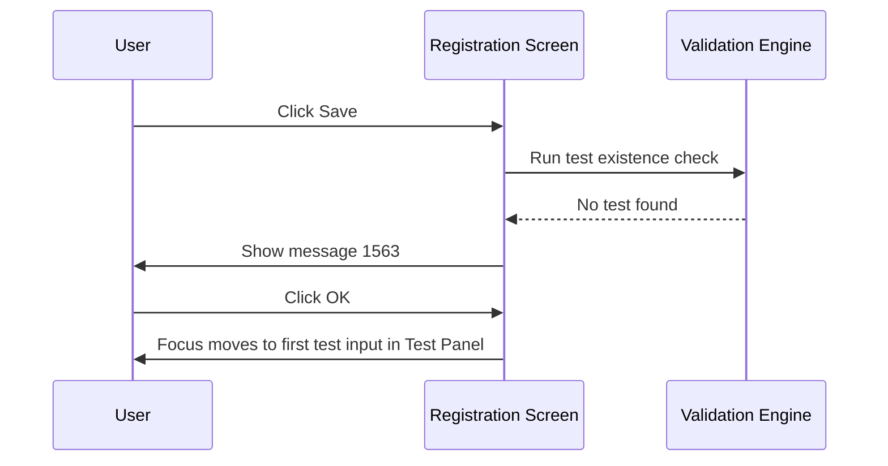

# Test Existence Validation on Save

## Overview

When a registration is saved, the system checks that at least one test has been selected before the request is committed. If no test is present, the save is blocked and the user is prompted to add a test before proceeding. This validation ensures that a lab request always carries at least one requested test.

---

## Related User Stories

- **[[CRST-503]]** - Registration - Pre-register: Test Validation - Test Existence

**Epic:** LISP-27 [CRST][DEV] Registration - Register Workflow

---

## Trigger Point

This validation is the first in the test validation sequence. It runs during the save process, after request information validations have completed and before any further test-level checks (such as prefix, validity period, or duplication checks) are performed.

---

## Workflow Scenarios

### Scenario 1: No Test Selected — Save Blocked

#### Prerequisites
- No test has been entered in any Test Panel on the Registration screen.
- All other required request information fields are populated correctly.

#### Process Flow

#### Step-by-Step Details

1. The user clicks **Save** on the Registration screen.
2. The system checks whether any test has been entered across all Test Panels.
3. If no test is found, message 1563 is displayed.
4. The user clicks **OK** to dismiss the message.
5. Focus moves to the first test input field in the Test Panel so the user can enter a test code.
6. The save is blocked until at least one test is present.

---

### Scenario 2: At Least One Test Present — Validation Passes

#### Prerequisites
- One or more tests have been entered in the Test Panel(s).

#### Step-by-Step Details

1. The system detects that at least one test is present.
2. The test existence check passes immediately.
3. The save process continues to the next validation stage.

---

## Summary Table — Messages

| Message | Text | Type | User Options | Condition |
|---------|------|------|-------------|-----------|
| 1563 | *(No test selected — exact message text from system)* | Hard error | OK | No test has been entered in any Test Panel |

---

## Business Rules

1. At least one test must be present before a registration can be saved. A request with no tests is always invalid.
2. After dismissing message 1563, focus is returned to the first test input field in the Test Panel so the user can immediately enter a test code.
3. Test entries that are marked to skip validation are excluded from the existence check. Only entries with a resolvable test code count as present.

---

## Related Workflows

- [[Test Prefix Validation on Save]] — The next check in the test validation sequence; runs only after the existence check passes.
