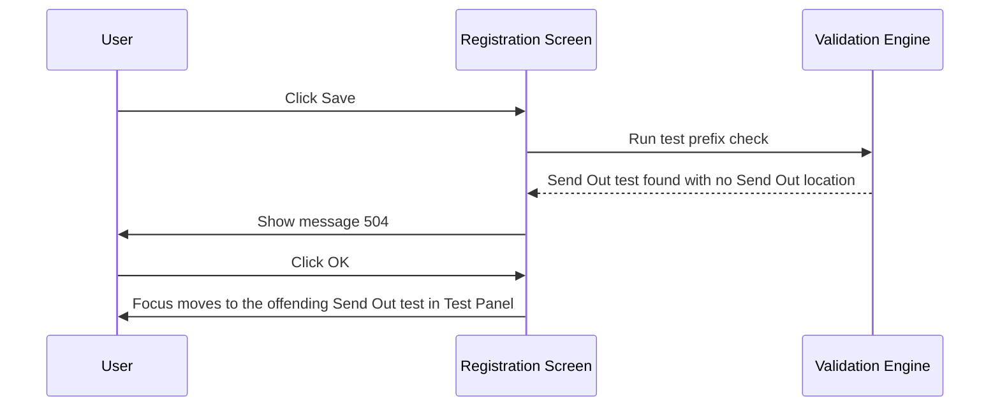

# Test Prefix Validation on Save

## Overview

When a registration is saved, the system checks whether any requested test carries a Send Out test prefix but no Send Out location has been provided. This ensures that any test requiring a send-out destination is not submitted without the necessary routing information. If the condition is met, the save is blocked and the user is directed back to supply the missing Send Out location.

---

## Related User Stories

- **[[CRST-504]]** - Registration - Pre-register: Test Validation - Test Prefix

**Epic:** LISP-27 [CRST][DEV] Registration - Register Workflow

---

## Key Concepts

### Send Out Test Prefix
A configurable prefix string that identifies which test codes are classified as send-out tests. Any test whose code begins with this prefix is subject to the send-out location requirement. The prefix is defined in the `SEND_OUT_TEST_PREFIX` lab option (`option_text`).

### Send Out Location
The destination to which a send-out test is routed. The Send Out location must be explicitly set before a request containing send-out tests can be saved. A location value of zero (unselected) is treated the same as no location being set.

### Send Out Checkbox
In the Registration screen, a **Send Out** checkbox controls whether send-out routing applies to the request. The prefix check only applies when this checkbox is checked and the Send Out location has not been provided.

---

## Trigger Point

This validation runs as the second check in the test validation sequence, immediately after the [[Test Existence Validation on Save]] has passed. It iterates over all requested test profiles and stops at the first one found to be in violation.

---

## Workflow Scenarios

### Scenario 1: Send Out Test Present Without Send Out Location — Save Blocked

#### Prerequisites
- At least one requested test code begins with the configured Send Out test prefix.
- The **Send Out** checkbox is checked on the Registration screen.
- No Send Out location has been provided (or the location is set to the unselected value).

#### Process Flow

#### Step-by-Step Details

1. The user clicks **Save** on the Registration screen.
2. The system iterates through each requested test profile in order.
3. For each test (that is not marked to skip validation), the system checks whether the test code begins with the configured Send Out prefix.
4. If the test code matches the prefix and no Send Out location is set, message 504 is displayed.
5. The user clicks **OK** to dismiss the message.
6. Focus moves to the test input on the Test Panel that triggered the error so the user can address the missing location.
7. The save is blocked until the Send Out location is provided or the offending test is removed.

---

### Scenario 2: Send Out Test Present With Send Out Location — Validation Passes

#### Prerequisites
- At least one requested test code begins with the configured Send Out test prefix.
- The **Send Out** checkbox is checked.
- A valid Send Out location has been entered.

#### Step-by-Step Details

1. The system checks each test profile and finds the send-out prefix test.
2. Because a Send Out location is present, the check passes for that test.
3. The validation continues with the next test in the list.
4. If all tests pass, the test prefix validation is complete and the save process proceeds to the next stage.

---

### Scenario 3: No Send Out Test Present — Validation Passes Immediately

#### Prerequisites
- None of the requested test codes begin with the configured Send Out test prefix.

#### Step-by-Step Details

1. The system iterates through all test profiles and finds no send-out prefix matches.
2. The test prefix validation passes immediately.
3. The save process proceeds to the next validation stage.

---

## Summary Table — Messages

| Message | Text | Type | User Options | Condition |
|---------|------|------|-------------|-----------|
| 504 | *(Send Out location not provided — exact message text from system)* | Hard error | OK | A test with the Send Out prefix is present but no Send Out location has been set |

---

## Configuration

| Setting | Option Code | Purpose | Effect when configured | Effect when not configured |
|---------|------------|---------|----------------------|--------------------------|
| Send Out Test Prefix | `SEND_OUT_TEST_PREFIX` | Defines the prefix string that identifies send-out test codes; stored in `option_text` | Any test code beginning with this prefix triggers the send-out location check | No tests are subject to the send-out prefix check; validation always passes |

---

## Business Rules

1. The check applies only to test profiles that are not marked to skip validation.
2. A test is considered a send-out test if and only if its code begins with the configured Send Out prefix string.
3. The validation fails on the **first** send-out test found without a location. Remaining tests are not checked once a failure is detected.
4. A Send Out location value of zero (unselected) is treated the same as no location being provided — the error is still triggered.
5. After dismissing message 504, focus is placed on the test input associated with the first offending test in the Test Panel.
6. If the `SEND_OUT_TEST_PREFIX` option is not configured, this validation is skipped entirely and the save proceeds to the next check.

---

## Related Workflows

- [[Test Existence Validation on Save]] — Runs immediately before this check; confirms at least one test is present.
- [[Test Registrable Validation on Save]] — Runs after this check; verifies each entered test is registrable and accessible for the current user.
