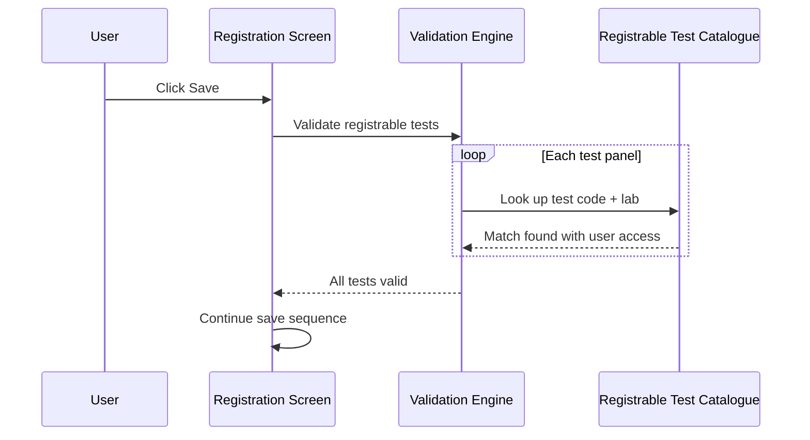
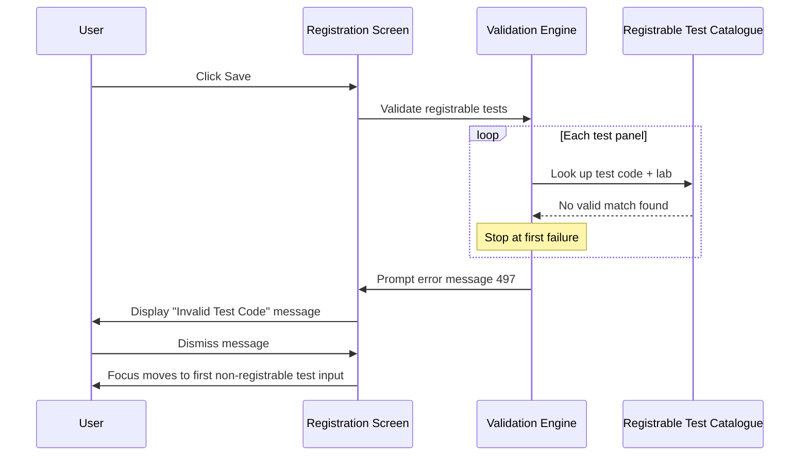

# Test Registrable Validation on Save

## Overview

When the user saves a registration request, the system validates that every test entered on the request is **registrable** — meaning the test exists in the system's registrable test catalogue and the current user has access rights to register it. If any test fails this check, an error is displayed and the user is directed to the first offending test input. This validation prevents requests from being submitted with inactive or access-restricted tests.

---

## Related User Stories

- **[[CRST-505]]** - Registration - Pre-register: Test Validation - Test Registrable

**Epic:** LISP-23 [CRST][DEV] Registration - Patient Handling

---

## Key Concepts

### Registrable Test
A test that exists in the system's registrable test catalogue and is marked as accessible for the current logged-in user. A test code may exist in the LIS but still be non-registrable if it is inactive or if the current user's access rights do not include that test.

### User Access Check
Each test in the registrable test catalogue carries a user access flag. A test is only considered registrable for a given user if this flag is active for their profile. The system skips this access check for tests whose code was populated by the system (rather than typed manually by the user).

---

## Trigger Point

This validation is executed as part of the pre-register save sequence, after test existence has been confirmed. It applies to every test panel on the request that has not been excluded from validation.

---

## Workflow Scenarios

### Scenario 1: All Tests Are Registrable

#### Prerequisites
- At least one test has been entered on the request.
- Every entered test exists in the registrable test catalogue with an active user access flag for the current user.

#### Process Flow

#### Step-by-Step Details

1. For each test panel on the request, the system looks up the entered test code and lab in the registrable test catalogue.
2. If a matching entry is found and the current user has access to it, the test passes validation.
3. Once all test panels have been checked without failure, the save sequence continues.

---

### Scenario 2: One or More Tests Are Non-Registrable

#### Prerequisites
- At least one test panel contains a test code that either does not exist in the registrable test catalogue for the relevant lab, or exists but is inactive / inaccessible for the current user.

#### Process Flow

#### Step-by-Step Details

1. For each test panel on the request, the system looks up the entered test code and lab in the registrable test catalogue.
2. If no match is found — either because the test is inactive, or because the current user does not have access to it — the test fails validation.
3. The system stops checking at the **first** failing test panel.
4. Error message **497** is displayed: **"Invalid Test Code"**, with the field label "Test Code" as the parameter.
5. After the user dismisses the error, focus moves to the first test input that failed validation.
6. The save is halted; the user must correct the test entry before proceeding.

> **Note:** Tests whose code was populated automatically by the system (not typed by the user) are validated against the full catalogue without the user access check. This prevents false failures when the system resolves test codes on behalf of the user.

---

## Summary Tables

### Validation Outcome Matrix

| Test code entered | Test exists in catalogue | User has access | Outcome |
|---|---|---|---|
| Empty | N/A | N/A | Skipped (no validation — handled by [[Test Existence Validation on Save]]) |
| Non-empty | No | N/A | Error — message 497 |
| Non-empty | Yes | No | Error — message 497 |
| Non-empty | Yes | Yes | Valid — save continues |

### Error Messages

| Message No. | Text | Trigger | User Options |
|---|---|---|---|
| 497 | "Invalid Test Code" | Test code is non-registrable or inaccessible for the current user | OK (dismiss) |

---

## Business Rules

1. A test is registrable only when it exists in the registrable test catalogue **and** the current user's access rights include that test.
2. Validation stops at the first non-registrable test — the system does not accumulate a list of all failures.
3. After dismissing the error, focus is placed on the first test panel that failed, not necessarily the one the user was editing.
4. Tests panels marked to skip validation are excluded from this check entirely.
5. When the test code on a panel was populated by the system rather than manually entered by the user, the user access check is bypassed — only catalogue existence is checked.

---

## Related Workflows

- [[Test Existence Validation on Save]] — Runs before this validation; confirms at least one test has been entered.
- [[Test Prefix Validation on Save]] — Runs in the same validation sequence; checks Send Out prefix rules.
- [[Test Valid Period Validation on Save]] — Runs after this check; warns the user when the specimen collection time has exceeded a test's configured Valid Specimen Period.
