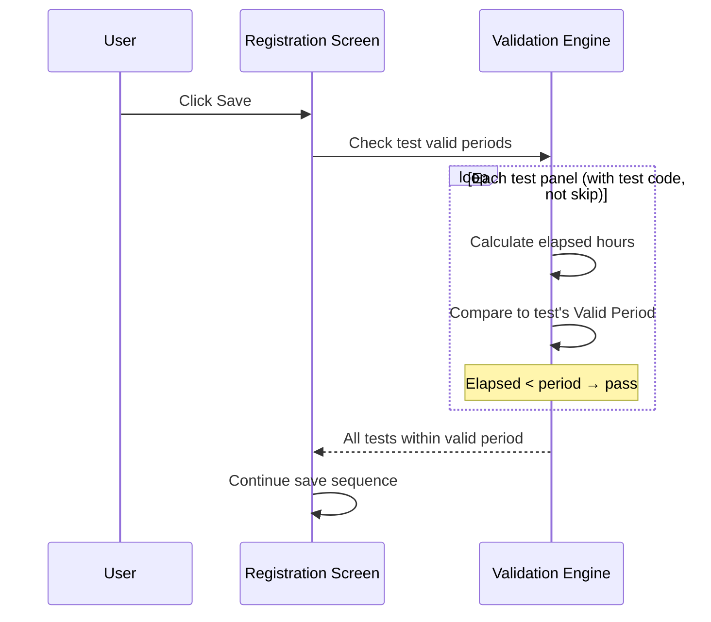
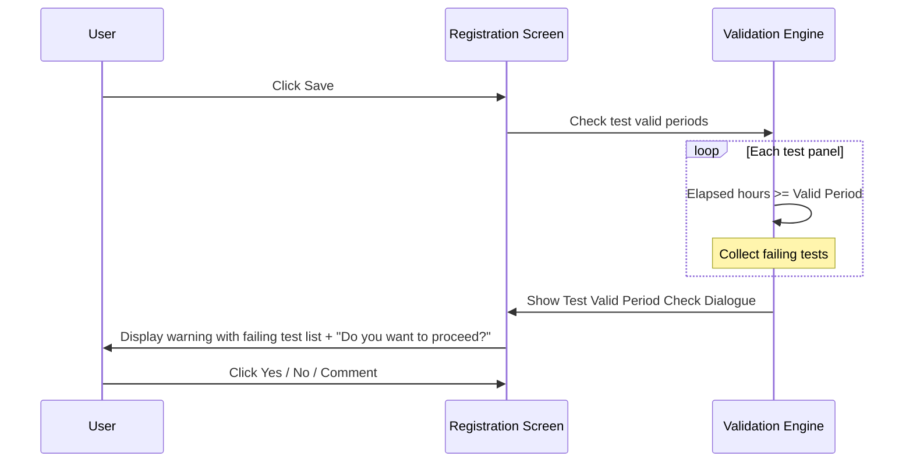

# Test Valid Period Validation on Save

## Overview

When a registration is saved, the system checks whether the specimen collected for each requested test is still within the test's defined Valid Specimen Period. If the Collection Date is older than the allowed threshold for one or more tests, the user is presented with a warning dialogue listing the affected tests and asked whether to proceed. This validation acts as a safeguard to prevent out-of-date specimens from being registered against time-sensitive test profiles.

---

## Related User Stories

- **[[CRST-506]]** - Registration - Pre-register: Test Validation - Test Valid Period

**Epic:** LISP-27 [CRST][DEV] Registration - Register Workflow

---

## Key Concepts

### Valid Specimen Period
A configurable threshold, expressed in **hours**, set on each test profile. It defines the maximum allowable age of a specimen at the time of registration. A value of zero means no valid period check applies to that test.

### Collection Date Elapsed Time
The elapsed time is calculated as the difference in milliseconds between the **Collection Date** on the request and the **current system date/time**, converted to hours:
$$\text{Elapsed hours} = \frac{\text{Current Date} - \text{Collection Date (ms)}}{1000 \times 60 \times 60}$$

A test fails the check when:
$$\text{Elapsed hours} \geq \text{Valid Specimen Period (hours)}$$

### Modified Collection Date
This validation only triggers when the Collection Date field has been **actively changed** during the current session. If the Collection Date was not modified by the user, the check is skipped entirely — even if the elapsed time would otherwise exceed the threshold.

---

## Trigger Point

This validation runs as part of the pre-register save sequence, after the registrable test check has passed. It applies to every test panel whose test code is non-blank and is not marked to skip validation.

---

## Workflow Scenarios

### Scenario 1: Collection Date Not Modified — Validation Skipped

#### Prerequisites
- The Collection Date field was not changed in the current session (or is empty).

#### Step-by-Step Details

1. At save time, the system detects that the Collection Date has not been modified.
2. The valid period check is skipped entirely for all tests.
3. The save sequence proceeds to the next validation.

---

### Scenario 2: All Tests Within Valid Period — Validation Passes

#### Prerequisites
- The Collection Date has been modified.
- For every test with a non-zero Valid Specimen Period, the elapsed time is less than the configured threshold.

#### Process Flow

#### Step-by-Step Details

1. The system calculates the elapsed time between the Collection Date and the current date/time.
2. For each test panel (with a test code, not skipping validation), if the test has a Valid Specimen Period configured (non-zero), the elapsed hours are compared to the threshold.
3. If elapsed hours are less than the threshold for every test, all checks pass.
4. The save sequence continues.

---

### Scenario 3: One or More Tests Exceed Valid Period — Warning Dialogue Shown

#### Prerequisites
- The Collection Date has been modified.
- At least one test has a non-zero Valid Specimen Period, and the elapsed time since collection equals or exceeds that period.

#### Process Flow

#### Step-by-Step Details

1. The system collects all test panels where the elapsed hours meet or exceed the configured Valid Specimen Period.
2. **Unlike the registrable test check**, the system does **not** stop at the first failure — it collects **all** failing tests before showing the dialogue.
3. The **Test Valid Period Check Dialogue** is displayed with:
   - One line per failing test: `Collection time of test: [Test Name] > [Valid Period] hours ago!`
   - A final line: `Do you want to proceed?`
   - Three buttons: **Yes**, **No**, and **Comment**
4. The **Comment** button is visible when the dialogue is triggered from the Registration screen (it may be hidden in other contexts).
5. The default focused button is determined by message **3934** setup (see Configuration section). If no message 3934 is configured, **No** is the default button.

---

## Test Valid Period Check Dialogue

### Button Actions

| Button | Action |
|--------|--------|
| **Yes** | Closes the dialogue and allows the save to proceed. The valid period check is marked as bypassed. |
| **No** | Closes the dialogue and returns the user to the Registration screen. The save is cancelled. |
| **Comment** | Opens the **Comment Input Dialogue** for the user to enter a reason. After the Comment Input Dialogue closes, the user must still click **Yes** to proceed. |

### Comment Input Dialogue

When the user clicks **Comment**:

1. A free-text Comment Input Dialogue is opened.
2. If the user enters a comment and clicks **OK**, the comment text is stored.
3. If the user clicks **Cancel**, no comment is stored.
4. After either action, the Test Valid Period Check Dialogue remains open — the user must still click **Yes** or **No** to proceed.
5. If the user ultimately clicks **Yes** and a comment was entered, the comment is saved to the **Request Comment** field when the request is registered.
6. If the user clicks **Yes** without entering a comment (or after cancelling the comment input), the save proceeds with no comment recorded from this step.

### Default Button Behaviour

| Message 3934 Setup | Default Button |
|---|---|
| Configured for current hospital with default = "YES" | **Yes** button is focused |
| Configured for "ALL" hospitals with default = "NO" | **No** button is focused |
| Not configured | **No** button is focused (system default) |

> The system checks for a message 3934 setup for the current hospital first. If none is found, it falls back to the "ALL" hospital configuration. If neither exists, **No** is focused by default.

---

## Summary Tables

### Validation Conditions

| Condition | Valid Period Check Applied? |
|---|---|
| Collection Date is empty | No — check skipped |
| Collection Date was not modified this session | No — check skipped |
| Collection Date modified, test Valid Period = 0 | No — test excluded from check |
| Collection Date modified, elapsed hours < Valid Period | No failure — test passes |
| Collection Date modified, elapsed hours ≥ Valid Period | Yes — test included in warning dialogue |

### Difference from Other Test Validations

| Validation | Stops at first failure? | Outcome on failure | User can bypass? |
|---|---|---|---|
| [[Test Existence Validation on Save]] | Yes | Hard error (message 1563) | No |
| [[Test Prefix Validation on Save]] | Yes | Hard error (message 504) | No |
| [[Test Registrable Validation on Save]] | Yes | Hard error (message 497) | No |
| Test Valid Period Validation (this) | No — all failures collected | Warning dialogue (message 3934) | Yes — click Yes to proceed |

---

## Business Rules

1. The valid period check is skipped entirely if the Collection Date field was not modified during the current registration session, regardless of how old the specimen may be.
2. A test is only subject to the valid period check if its Valid Specimen Period is set to a non-zero value.
3. All failing tests are collected before the warning dialogue is shown — the user sees a complete list, not just the first violation.
4. The elapsed time is calculated as the time from the Collection Date to the **current system date/time** (not the Request Date or Arrival Date).
5. The threshold is inclusive: elapsed hours **equal to** the Valid Specimen Period also trigger the warning.
6. The user may bypass the warning by clicking **Yes** — this is a confirmation warning, not a hard block.
7. Clicking **No** cancels the save entirely and returns the user to the Registration screen.
8. A comment entered via the Comment button is only saved to the **Request Comment** field if the user subsequently clicks **Yes** to proceed. Cancelling the comment input does not affect the warning dialogue.
9. The **Comment** button is visible in the Registration context by default. Other contexts (e.g., Add/Delete Test screen) may suppress it.
10. The default focused button in the dialogue follows message 3934 configuration. If not configured, **No** is focused by default — requiring explicit confirmation to bypass.

---

## Related Workflows

- [[Test Registrable Validation on Save]] — Runs immediately before this check; verifies each test is in the registrable catalogue.
- [[Test Existence Validation on Save]] — First check in the test validation sequence.
- [[Request Info Validation on Save]] — Parent validation flow that coordinates all pre-register save checks, including the test validation sequence.
