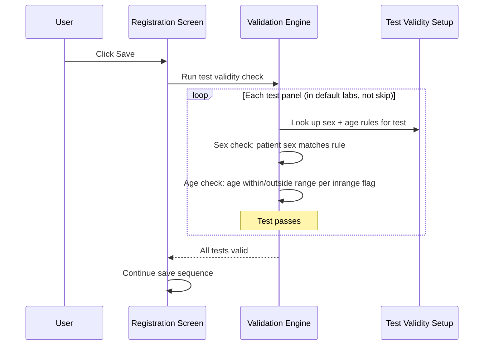
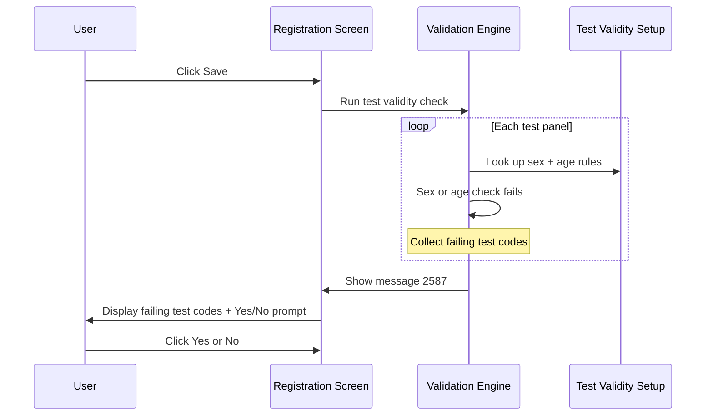

# Test Validity Validation on Save

## Overview

When a registration is saved, the system can optionally check whether each requested test is valid for the patient's sex and age. If any test's validity setup does not match the patient's sex or falls outside the permitted age range, message **2587** is displayed listing all failing test codes. The user may choose to proceed or return to the Registration screen. This check is disabled by default and must be explicitly enabled via the `SEX_AGE_TEST_CHECK_ENABLED` lab option.

---

## Related User Stories

- **[[CRST-508]]** - Registration - Pre-register: Test Validation - Test Validity

**Epic:** LISP-27 [CRST][DEV] Registration - Register Workflow

---

## Key Concepts

### Test Validity Setup
Each test profile can have one or more validity records configured in the system, each specifying a permitted sex and an age range. If no validity setup exists for a test, the test is not subject to this check (it passes by default).

### Sex Values
Validity records use the following sex codes:
- **M** — Male only
- **F** — Female only
- **A** — All sexes (matches any patient sex)

### Age Range Check — `testval_inrange` Flag
Each validity record has an `inrange` flag that determines how the age range is interpreted:

| `inrange` Value | Meaning | Patient Age is VALID when… |
|---|---|---|
| `1` (In-range) | Age must fall **within** the defined bounds | `Age LB ≤ patient age ≤ Age UB` |
| `0` (Out-of-range) | Age must fall **outside** the defined bounds | `patient age < Age LB` **or** `patient age > Age UB` |

### Default Labs Scope
The test validity check only applies to tests belonging to the Registration screen's configured default labs. Tests assigned to a lab not in this set are excluded from the check even if a validity setup exists.

---

## Trigger Point

This validation runs as part of the pre-register save sequence, after the Test Duplication check. It is entirely skipped if the `SEX_AGE_TEST_CHECK_ENABLED` option is not enabled.

---

## Workflow Scenarios

### Scenario 1: Test Validity Check Disabled — Skipped Entirely

#### Prerequisites
- `SEX_AGE_TEST_CHECK_ENABLED` option is `0` or not configured.

#### Step-by-Step Details

1. At save time, the system reads the `SEX_AGE_TEST_CHECK_ENABLED` setting.
2. Because it is not enabled, the entire test validity check is skipped.
3. The save sequence continues.

---

### Scenario 2: All Tests Pass Validity Check

#### Prerequisites
- `SEX_AGE_TEST_CHECK_ENABLED` is enabled (`option_value = 1`).
- For every test with a validity setup, the patient's sex and age fall within the permitted values.

#### Process Flow

#### Step-by-Step Details

1. For each test panel that has a test key, belongs to a default lab, and is not marked to skip validation:
   - The system retrieves all validity records for that test and lab.
   - If no validity records exist for this test, the test passes by default.
2. **Sex check:** The system filters validity records to those matching the patient's sex (`M`, `F`) or the "All" sex (`A`). If at least one matching record is found, the test passes the sex check.
3. **Age check:** For each sex-matching record, the system checks the patient's age against the defined age bounds using the `inrange` rule. If at least one age record passes, the test is valid.
4. If all tests pass, the save continues.

---

### Scenario 3: One or More Tests Fail Validity Check — Message 2587 Shown

#### Prerequisites
- `SEX_AGE_TEST_CHECK_ENABLED` is enabled.
- At least one test fails either the sex check or the age check.

#### Process Flow

#### Step-by-Step Details

1. **Sex check failure:** If no validity records exist for the patient's sex (and no "All" sex records exist either), the test fails immediately. It is added to the list of failing tests.
2. **Age check failure:** If sex-matching records are found, each is evaluated for the age range using the `inrange` flag. If **none** of the matching records yield a valid age result, the test is added to the failing list and the system moves on to the next test panel.
3. The system collects **all** failing tests before showing the message — this is not a stop-at-first-failure check.
4. **Message 2587** is displayed showing all failing test codes concatenated with spaces between them.
5. The message includes **Yes** and **No** buttons.
6. If the user clicks **Yes**: the dialogue closes, the bypass is recorded, and the save proceeds.
7. If the user clicks **No**: the dialogue closes, and focus moves to the first invalid test code in the Test Panel.

---

## Sex Check Logic Summary

| Patient Sex | Validity Record Sex | Sex Check Result |
|---|---|---|
| M | M | ✅ Pass |
| M | F | ❌ Fail (filtered out) |
| M | A | ✅ Pass |
| F | F | ✅ Pass |
| F | M | ❌ Fail (filtered out) |
| F | A | ✅ Pass |
| Any | No records at all | ✅ Pass (no setup = not checked) |
| Any | Records exist but none match patient sex or "A" | ❌ Fail |

---

## Age Range Check Logic Summary

| `inrange` Flag | Condition for Patient Age to be VALID | Condition for FAILURE |
|---|---|---|
| `1` (must be within range) | `Age LB ≤ age ≤ Age UB` | `age < Age LB` or `age > Age UB` |
| `0` (must be outside range) | `age < Age LB` or `age > Age UB` | `Age LB ≤ age ≤ Age UB` |

---

## Button Actions

| Button | Action |
|---|---|
| **Yes** | Closes message 2587; save proceeds. The validity check bypass flag is recorded for the bypassed test codes. |
| **No** | Closes message 2587; focus moves to the first invalid test code in the Test Panel. Save is cancelled. |

---

## Configuration

| Setting | Option Code | Purpose | Effect when `option_value = 1` | Effect when `option_value = 0` or not configured |
|---------|------------|---------|-------------------------------|--------------------------------------------------|
| Sex/Age Test Validity Check | `SEX_AGE_TEST_CHECK_ENABLED` | Controls whether patient sex and age are validated against each test's validity setup on save | Validity check is performed for all eligible tests | Entire validity check is skipped (default) |

---

## Business Rules

1. The entire validity check is skipped when `SEX_AGE_TEST_CHECK_ENABLED` is not enabled. This is the **default** behaviour.
2. A test with no validity records in the system is not subject to this check — it passes automatically.
3. The validity check applies only to tests belonging to the Registration screen's default labs. Tests outside the default lab set are excluded.
4. The sex check is evaluated first. If no validity records match the patient's sex (including "All"), the test fails immediately and the age check is not evaluated.
5. The "All" sex code (`A`) matches any patient sex and satisfies the sex check for any patient.
6. If **any** of the sex-matching age records yields a valid age result, the test passes the age check. All matching records are evaluated — the test only fails if **none** of them produce a valid age result.
7. All failing tests are collected before showing the message — the user sees a complete list of failing test codes in a single prompt.
8. Clicking **No** focuses on the first invalid test code in the Test Panel, not the one the user was editing.
9. Clicking **Yes** records a bypass against the failing test codes, which are passed forward in the save process.

---

## Related Workflows

- [[Test Duplication Validation on Save]] — Runs immediately before this check.
- [[Test Existence Validation on Save]] — First check in the test validation sequence.
- [[Request Info Validation on Save]] — Parent validation flow that coordinates all pre-register save checks, including the test validation sequence.
