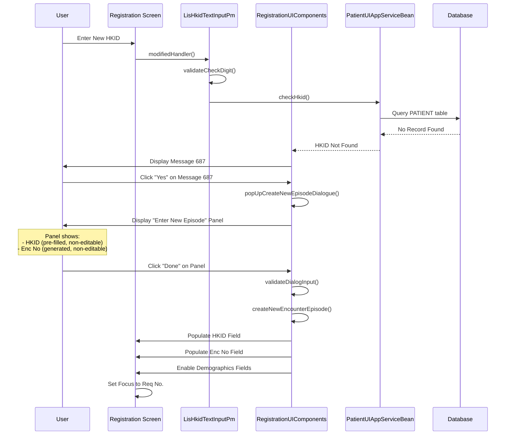
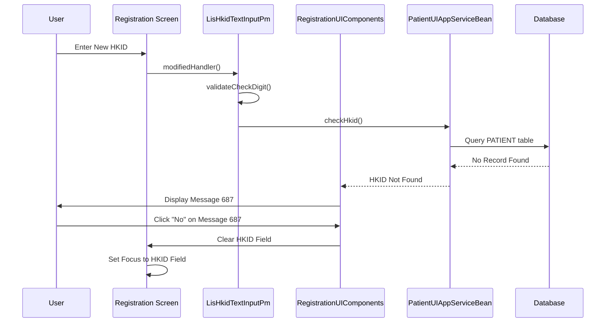
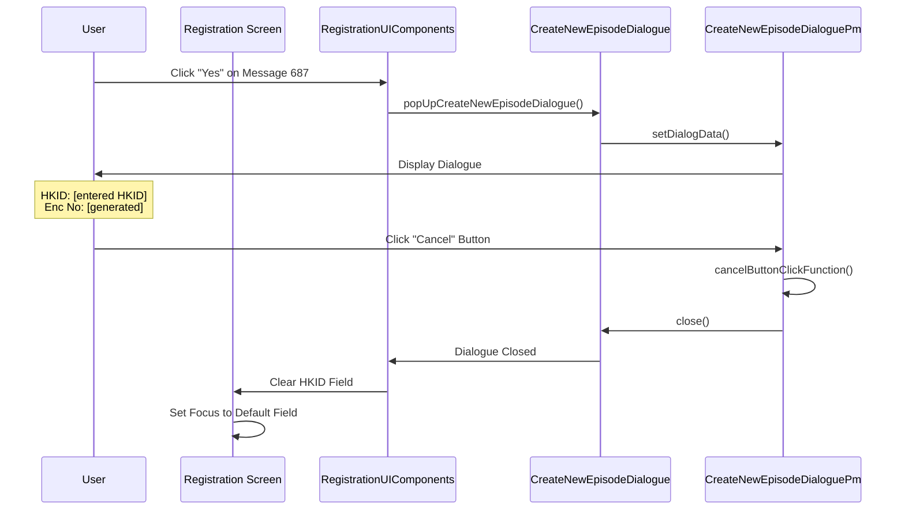
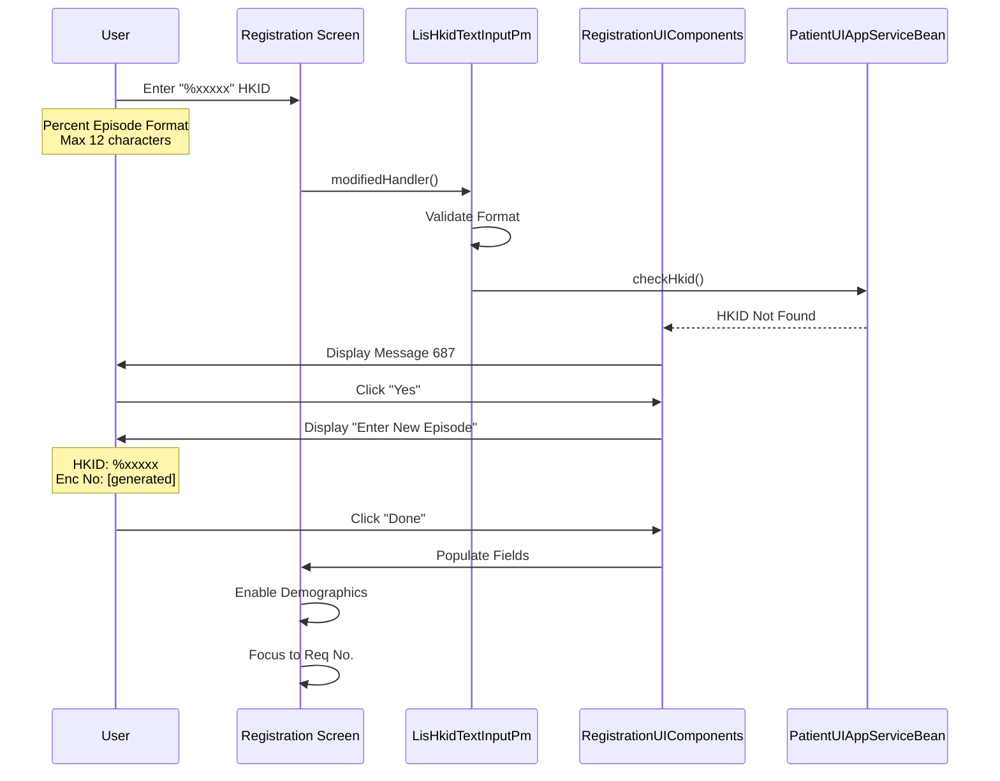

# Create New Patient by HKID

## Overview

This workflow describes how the LIS system creates a new patient record when a user enters a Hong Kong Identity Card (HKID) number that does not exist in the PATIENT table. The system guides the user through creating a new episode (encounter number) and establishing a new patient record.

**Related User Stories:**
- [[CRST-95]] - Registration - Create New Patient by HKID
- [[CRST-114]] - Registration - Detailed Create New Patient by HKID (referenced)

**Epic:** LISP-23 [CRST][DEV] Registration - Patient Handling

**Entry Point:** Registration screen - HKID field

**Purpose:** Enable registration staff to create new patient records for patients not previously registered in the LIS system, establishing their demographics and generating an encounter number for lab test registration.

---

## Key Concepts

### New Patient Definition
- **New Patient:** Patient whose HKID does not exist in the PATIENT table (`PATIENT.pat_pid`)
- Distinguished from existing patients whose records already exist locally or in PMI
- Requires manual entry of demographics and encounter number generation

### Encounter Number Generation
- System automatically generates new encounter number
- Format is hospital-specific
- Encounter number is **non-editable** in "Enter new episode" dialogue
- Links patient HKID to specific hospital encounter

### Special HKID Format: Percent Episode (%)
- System supports temporary HKID format: `%xxxxx`
- Used for patients without valid HKID (e.g., visitors, newborns)
- Percent symbol indicates temporary/placeholder identifier
- Maximum 12 characters allowed for HKID input

---

## Workflow Scenarios

### Scenario 1: Create New Patient - User Confirms

**Prerequisites:**
- HKID entered does not exist in PATIENT table
- HKID format is valid (passes check digit validation)
- User has rights to create new patient

**Trigger:** User enters new HKID in Registration screen

#### Process Flow



#### Step-by-Step Details

1. **HKID Input & Validation**
   - User enters HKID in HKID field on Registration screen
   - Maximum 12 characters allowed
   - `LisHkidTextInputPm.modifiedHandler()` triggered
   - System validates check digit
   - `LisHkidTextInputPm.validateCheckDigit()` called

2. **Check HKID Existence**
   - System dispatches `HkidTextInputEvent.CHECK_HKID`
   - `HkidTextInputCommand.checkHkid()` calls remote service
   - `PatientUIAppServiceBean.checkHkid()` invoked with:
     - `hkid` - The HKID string
     - `isCheckPatientAmendLogNeeded` - Boolean flag
     - `serviceParameter` - Service context
   
3. **Database Query**
   - `PatientUIAppServiceImpl.checkHkid()` queries PATIENT table:
     ```sql
     SELECT * FROM PATIENT WHERE pat_pid = ?
     ```
   - Query returns no results (HKID not found)
   - System confirms this is a new patient

4. **Display Confirmation Message 687**
   - System displays **Message 687**: "Create new Encounter case?"
   - User prompted to confirm creation of new patient record
   - Modal message with "Yes" and "No" buttons

5. **User Confirms - Click "Yes"**
   - User clicks "Yes" button on Message 687
   - `RegistrationUIComponents.hkidModifiedFunction()` processes confirmation
   - System proceeds to episode creation dialogue

6. **Display "Enter New Episode" Dialogue**
   - `RegistrationUIComponents.popUpCreateNewEpisodeDialogue()` invoked
   - Modified in: CEO69621
   - System displays modal dialogue: "Enter new episode"
   - Dialogue components managed by `CreateNewEpisodeDialoguePm`
   
   **Dialogue Fields:**
   - **HKID Field:**
     - Pre-filled with entered HKID
     - **Non-editable** (`hkidPm.editable = false`)
     - Display only
   
   - **Enc No Field:**
     - Pre-filled with system-generated encounter number
     - **Non-editable** (controlled by `isManuallyGeneratePatientEncounterAllowed`)
     - Hospital-specific format
     - Unique per patient per hospital
   
   - **Buttons:**
     - "Done" - Confirm and create episode
     - "Cancel" - Abort operation

7. **Encounter Number Generation**
   - System automatically generates new encounter number
   - Generation logic in `CreateNewEpisodeDialoguePm.setDialogData()`
   - Parameters:
     - `acceptenceHospitalsInEncounterNumber` - Array of valid hospitals
     - `encounterNo` - Generated encounter number
     - `isManuallyGeneratePatientEncounterAllowed` - Boolean (typically false)
     - `hkid` - The patient HKID
     - `patientHospitalAsDeterminedFromEncounter` - Hospital code

8. **User Clicks "Done" on Dialogue**
   - User reviews pre-filled data
   - Clicks "Done" button
   - `CreateNewEpisodeDialoguePm.doneButtonClickFunction()` invoked
   - Modified in: CEO-45179
   
   **Validation Steps:**
   1. Disable Done/Cancel buttons (prevent double-click)
   2. Verify HKID not empty
   3. Verify HKID check digit: `hkidPm.verifyCheckDigit()`
   4. Check encounter number modification: `isEncounterNoModified()`
   5. Validate HKID matches encounter: `checkHkidOfEncounterNo()`
      - Modified in: PMH-BBS-B-000068

9. **HKID and Encounter Number Validation**
   - `CreateNewEpisodeDialoguePm.checkHkidOfEncounterNoHandler()` processes validation
   - Modified in: CEO-76657
   - Checks for:
     - **NOT_FOUND**: HKID/Encounter not in PMI (expected for new patient)
     - **NOT_MATCHED**: HKID doesn't match encounter hospital
     - **EXIST**: Encounter already exists
     - **SUCCESS**: All validations passed
   
10. **Create New Patient Episode**
    - `CreateNewEpisodeDialoguePm.validateDialogInput()` called
    - Sets `isInputted = true`
    - Calls `itemInputtedFunction(encNo, hkid, isPmiServiceNotAvailable)`
    - `RegistrationUIComponents.createNewEncounterEpisode()` processes new episode
    - Modified in: TKO-BBS-B-00055
    - Dialogue closes

11. **Populate Registration Screen**
    - `RegistrationUIComponents.processCreateNewEncounterEpisode()` executed
    - System populates fields:
      - **HKID Field** = entered HKID
      - **Enc No Field** = generated encounter number
      - **Patient Hospital** = current hospital
      - **Patient Unit** = default or selected unit
      - **Patient Location** = default or selected location
    
12. **Enable Demographics Fields**
    - All patient demographic fields become **editable**:
      - **Name** (English)
      - **Name (in Chinese)**
      - **Sex**
      - **DOB** (Date of Birth)
      - **Age** (calculated from DOB)
      - **Pay Code**
      - **Category**
      - **Loc Hosp** (Location Hospital)
      - **Loc Specialty** (Location Unit)
      - **Loc Ward/Clinic**
      - **Bed**
      - **Admitted** (Admission Date)
      - **MRN** (Medical Record Number)
      - **Race**
    - User must manually enter patient demographics
    - Modified in: NDH-GEN-MS-00049

13. **Focus Management**
    - System sets focus to **Request No.** field
    - `RegistrationUIComponents.setDefaultFocusWhenRequestNoReadyToProceed()` called
    - Modified in: RD-APS-140825-01
    - User can proceed with test registration

**Result:** New patient record created with HKID and encounter number, demographics ready for entry

---

### Scenario 2: Create New Patient - User Cancels at Message 687

**Prerequisites:**
- HKID entered does not exist in PATIENT table
- HKID format is valid
- Message 687 displayed

**Trigger:** User clicks "No" on Message 687

#### Process Flow



#### Step-by-Step Details

1. **HKID Input & Validation**
   - User enters new HKID (not in PATIENT table)
   - System validates check digit
   - System confirms HKID not found

2. **Display Message 687**
   - System displays: "Create new Encounter case?"
   - User decides not to create new patient

3. **User Clicks "No"**
   - User clicks "No" button on Message 687
   - `RegistrationUIComponents.hkidModifiedFunction()` processes cancellation

4. **Clear HKID Field**
   - System clears HKID field: `hkidPm.text = ""`
   - All demographics fields remain empty
   - No encounter number generated

5. **Reset Focus**
   - Focus returns to HKID field (or default patient ID field)
   - User can enter different HKID or use alternative lookup

**Result:** Operation cancelled, HKID cleared, user can retry

---

### Scenario 3: Create New Patient - User Cancels at "Enter New Episode" Dialogue

**Prerequisites:**
- User clicked "Yes" on Message 687
- "Enter new episode" dialogue displayed
- HKID and encounter number pre-filled

**Trigger:** User clicks "Cancel" on dialogue

#### Process Flow



#### Step-by-Step Details

1. **Dialogue Displayed**
   - "Enter new episode" dialogue shown
   - HKID pre-filled (non-editable)
   - Encounter number pre-filled (non-editable)
   - User reviews information

2. **User Clicks "Cancel"**
   - User decides not to proceed
   - Clicks "Cancel" button on dialogue
   - `CreateNewEpisodeDialoguePm.cancelButtonClickFunction()` invoked

3. **Close Dialogue**
   - Dialogue closes immediately
   - No data saved
   - `this.close()` called in presentation model

4. **Clear HKID Field**
   - System clears HKID field on Registration screen
   - `RegistrationUIComponents` handles post-dialogue cleanup
   - All demographics fields remain empty

5. **Reset Focus**
   - Focus returns to default patient ID field
   - Typically HKID field or first patient identifier field
   - User can start new patient lookup

**Result:** Operation cancelled, dialogue closed, HKID cleared

---

### Scenario 4: Create New Patient with Percent Episode (%) HKID

**Prerequisites:**
- Patient without valid HKID (e.g., visitor, newborn)
- Need to use temporary identifier
- User enters HKID in format: `%xxxxx`

**Trigger:** User enters HKID starting with `%` character

#### Process Flow



#### Step-by-Step Details

1. **Enter Percent Episode HKID**
   - User enters HKID starting with `%` character
   - Format: `%xxxxx` (where xxxxx = any characters)
   - Maximum length: 12 characters total
   - Example: `%12345`, `%ABC123`

2. **Validation**
   - System accepts `%` as valid HKID prefix
   - Check digit validation may be skipped for percent episodes
   - System checks PATIENT table for existence

3. **Process as New Patient**
   - Percent episode HKID not found (expected)
   - System follows standard new patient workflow:
     - Display Message 687
     - User confirms with "Yes"
     - Display "Enter new episode" dialogue
     - Generate encounter number
     - User clicks "Done"

4. **Complete Registration**
   - HKID field populated with `%xxxxx`
   - Encounter number populated
   - Demographics fields enabled for manual entry
   - Focus set to Request No. field

**Result:** Temporary patient record created with percent episode HKID

**Use Cases:**
- Newborn patients (before HKID issued)
- Visitors without HKID
- Emergency cases requiring immediate registration
- Temporary identification pending proper HKID

---

## Technical Implementation

### Frontend Components

**File:** `RegistrationUIComponents.as`

**Key Components:**
- `hkidPm: LisHkidTextInputPm` - HKID input field
- `encNoPm: LisEncounterNoTextInputPm` - Encounter number field
- `patientNamePm: LisTextInputPm` - Patient name field
- `cNameTextInputPm: LisCnameTextInputPm` - Chinese name field
- `dobAndAgePm: LisDobAndAgeManipulationPm` - DOB and age fields
- `sexPm: LisKeywordComboBoxPm` - Sex dropdown
- `patientCategoryPm: LisKeywordComboBoxPm` - Patient category
- `patientLocationPm: LisLocationTextInputPm` - Location fields

**Key Methods:**

1. **`hkidModifiedFunction(event:LisComponentEvent):void`**
   - Triggered when HKID field is modified
   - Initiates patient lookup or new patient creation
   - Handles callback for Message 687 response

2. **`popUpCreateNewEpisodeDialogue():void`**
   - Displays "Enter new episode" dialogue
   - Creates `CreateNewEpisodeDialoguePm` instance
   - Sets dialogue data with HKID and generated encounter number
   - Modified in: CEO69621

3. **`createNewEncounterEpisode():void`**
   - Callback function when user confirms episode creation
   - Called from "Enter new episode" dialogue
   - Processes new episode data

4. **`processCreateNewEncounterEpisode(encNo:String, hkid:String, isPmiServiceNotAvailable:Boolean):void`**
   - Processes new episode after dialogue confirmation
   - Populates HKID and Enc No fields
   - Sets up demographics fields for manual entry
   - Modified in: TKO-BBS-B-00055

5. **`enableComponents():void`**
   - Manages field enable/disable states
   - Enables demographics fields for new patient
   - Sets patient category editable for new patient
   - Modified in: UCH-BBS-B-00024, UCH-BBS-B-00045, NDH-GEN-MS-00049

6. **`setDefaultFocusWhenRequestNoReadyToProceed():void`**
   - Sets focus to Request No. field after patient creation
   - Called after demographics setup complete
   - Modified in: RD-APS-140825-01

### Dialogue Component

**File:** `CreateNewEpisodeDialogue.mxml`

**Presentation Model:** `CreateNewEpisodeDialoguePm.as`

**Key Properties:**
- `hkidPm: LisHkidTextInputPm` - HKID input component
- `encNoPm: LisEncounterNoTextInputPm` - Encounter number component
- `doneButtonPm: LisButtonPm` - Done button
- `cancelButtonPm: LisButtonPm` - Cancel button
- `itemInputtedFunction: Function` - Callback after confirmation
- `isInputted: Boolean` - Flag indicating data inputted
- `isPmiServiceNotAvailable: Boolean` - PMI service status flag

**Key Methods:**

1. **`setDialogData(acceptenceHospitalsInEncounterNumber:Array, encounterNo:String, isManuallyGeneratePatientEncounterAllowed:Boolean, hkid:String=null, patientHospitalAsDeterminedFromEncounter:String=null):void`**
   - Initializes dialogue with pre-filled data
   - Sets HKID field (non-editable)
   - Sets encounter number (editable based on parameter)
   - Sets button states
   - Modified in: Multiple modifications for PMI handling

2. **`doneButtonClickFunction(event:MouseEvent):void`**
   - Handles "Done" button click
   - Disables buttons to prevent double-click
   - Validates HKID presence and check digit
   - Checks encounter number modification
   - Validates HKID/encounter matching
   - Modified in: CEO-45179, PMH-BBS-B-000068

3. **`validateDialogInput():void`**
   - Final validation before accepting input
   - Sets `isInputted = true`
   - Calls `itemInputtedFunction` callback
   - Closes dialogue

4. **`isEncounterNoModified():Boolean`**
   - Checks if encounter number was changed by user
   - Compares current value to original
   - Triggers hospital validation if modified
   - Modified in: PMH-BBS-B-000068

5. **`checkHkidOfEncounterNoHandler(state:int):void`**
   - Handles HKID/encounter validation result
   - Processes states: NOT_FOUND, NOT_MATCHED, EXIST, SUCCESS
   - Displays appropriate messages based on state
   - Modified in: CEO-76657

6. **`errorHkidOfEncounterNoHandler(fault:FaultEvent, trigger:EncounterNoTextInputEvent):void`**
   - Handles PMI service errors during validation
   - Displays message about PMI unavailability
   - Sets `isPmiServiceNotAvailable = true`
   - Proceeds with local creation
   - Added in: PMH-BBS-B-000068

7. **`cancelButtonClickFunction(event:MouseEvent):void`**
   - Handles "Cancel" button click
   - Closes dialogue without saving
   - No callbacks triggered

8. **`creationCompleteHandler(event:FlexEvent):void`**
   - Handles dialogue creation complete event
   - Sets focus to appropriate field
   - If HKID editable: focus to HKID
   - If HKID non-editable: focus to Enc No

9. **`promptMessageCallbackHandler(event:LisComponentEvent):void`**
   - Handles prompt message completion
   - Re-enables Done/Cancel buttons
   - Allows user to retry after error

### Backend Services

**File:** `PatientUIAppServiceBean.java` / `PatientUIAppServiceImpl.java`

**Key Methods:**

1. **`checkHkid(String hkid, boolean isCheckPatientAmendLogNeeded, ServiceParameterVo serviceParameter):PatientUIRo`**
   - Checks if HKID exists in PATIENT table
   - Returns empty result for new patient
   - Checks for merged HKID records
   - Checks patient amendment log if requested

2. **`createNewPatientEpisode(String hkid, String encounterNo, String hospital, ServiceParameterVo serviceParameter):ResponseObject`**
   - Creates new patient record in PATIENT table
   - Generates new episode entry
   - Validates uniqueness of HKID/encounter combination
   - Returns success/failure status

### Events Managed

**Events Dispatched:**
- `HkidTextInputEvent.CHECK_HKID` - Verify HKID existence
- `EncounterNoTextInputEvent.VALIDATE_ENCOUNTER_NO` - Validate encounter number
- `RegistrationEvent.CREATE_NEW_PATIENT` - Create new patient record

**Events Handled:**
- `HkidTextInputEvent.HKID_CHECKED` - HKID verification result
- `EncounterNoTextInputEvent.ENCOUNTER_NO_VALIDATED` - Encounter validation result

---

## Field Specifications

### HKID Field

**Type:** Text input with check digit validation

**Properties:**
- **Maximum Length:** 12 characters
- **Format:** 
  - Standard: 1-2 letters + 6 digits + 1 check digit
  - Percent Episode: `%` + up to 11 characters
- **Validation:** Check digit algorithm (skipped for percent episodes)
- **Editable:** Yes (during input), No (in dialogue)

### Encounter Number Field

**Type:** Text input (system-generated)

**Properties:**
- **Generation:** Automatic by system
- **Format:** Hospital-specific
- **Editable:** Typically No (`isManuallyGeneratePatientEncounterAllowed` = false)
- **Uniqueness:** Must be unique per hospital

### Demographics Fields (After New Patient Creation)

**State:** All fields **enabled** and **editable**

| Field | Required | Description |
|-------|----------|-------------|
| **Name** | Yes | Patient English name |
| **Name (in Chinese)** | No | Patient Chinese name |
| **Sex** | Yes | Male/Female/Unknown |
| **DOB** | Yes | Date of birth |
| **Age** | Auto | Calculated from DOB |
| **Pay Code** | Yes | Payment category |
| **Category** | Yes | Patient category (Editable for new patient) |
| **Loc Hosp** | Yes | Location hospital |
| **Loc Specialty** | Yes | Location unit/specialty |
| **Loc Ward/Clinic** | Yes | Ward or clinic location |
| **Bed** | No | Bed number |
| **Admitted** | No | Admission date/time |
| **MRN** | No | Medical record number |
| **Race** | No | Race code |

---

## Configuration Requirements

### System Parameters

**LAB_OPTION Table:**
- `isManuallyGeneratePatientEncounterAllowed` - Controls whether encounter number is user-editable
- Typically set to `false` for automatic generation

**Hospital Configuration:**
- Each hospital has unique encounter number format
- Encounter number generation rules per hospital
- Check digit algorithm configured per hospital

**User Access Rights:**
- User must have permission to create new patient
- Function ID: Registration or Request Entry
- Security level may restrict new patient creation

---

## Validation Rules

### HKID Validation

1. **Format Check**
   - Standard HKID: 8-9 characters (letters + digits + check digit)
   - Percent Episode: Starts with `%`, up to 12 characters total

2. **Check Digit Validation** (Standard HKID only)
   - Calculated using weighted sum algorithm
   - Check digit can be 0-9 or 'A'
   - Validation performed by `LisHkidTextInputPm.validateCheckDigit()`

3. **Uniqueness Check**
   - HKID must not exist in PATIENT table
   - Query: `SELECT * FROM PATIENT WHERE pat_pid = ?`
   - If exists: Follow existing patient workflow

4. **Maximum Length**
   - 12 characters maximum
   - Enforced at component level

### Encounter Number Validation

1. **Format Check**
   - Must match hospital-specific format
   - Check digit validation

2. **Uniqueness Check**
   - Encounter number must be unique within hospital
   - System validates before creation

3. **Hospital Match**
   - Encounter number must match current hospital
   - Validated by `checkHospitalOfEncounterNo()`

---

## Error Handling

### Error Code 687: Create New Encounter Case

**Message:** "Create new Encounter case?"

**Trigger:** HKID not found in PATIENT table

**User Options:**
- **Yes:** Proceed to create new patient episode
- **No:** Cancel operation, clear HKID field

### Error Code 718: HKID Required

**Message:** "RRNEV1" / "HKID is required"

**Error Code:** `0000718`

**Trigger:** User clicks "Done" with empty HKID field

**Action:** Prompt error message, focus remains on dialogue

### Error Code 719: HKID Not Matched

**Message:** "HKID does not match encounter number"

**Error Code:** `0000719`

**Trigger:** HKID doesn't match hospital of encounter number

**Action:** 
- Display error message
- Set focus to HKID field (if editable) or Enc No field
- User must correct mismatch

### Error Code 716: Episode Exists

**Message:** "Episode already exists"

**Error Code:** `0000716`

**Trigger:** Encounter number already exists in database

**Action:**
- Display error message
- Set focus to Enc No field
- User must use different encounter number (if editable)

### Error Code 3482: PMI Service Unavailable

**Message:** "Due to the unavailability of PMI service, the system cannot retrieve patient details for entered HKID at this moment."

**Error Code:** `0003482`

**Trigger:** PMI service fails during HKID/encounter validation

**Action:**
- Display message with Yes/No options
- Yes: Proceed with local creation (`isPmiServiceNotAvailable = true`)
- No: Re-enable buttons, allow user to retry

### Invalid Check Digit

**Scenario:** HKID check digit validation fails

**Action:**
- Error message displayed by `LisHkidTextInputPm`
- Focus set to HKID field
- User must correct HKID

---

## Database Schema Reference

### PATIENT Table

**Key Columns for New Patient:**
- `pat_pid` - Patient HKID (primary identifier) - **INSERT**
- `pat_encounter` - Encounter number - **INSERT**
- `pat_hospital` - Hospital code - **INSERT**
- `pat_unit` - Specialty/Unit code - INSERT (default or user-selected)
- `pat_location` - Ward/Clinic location - INSERT (default or user-selected)
- `pat_name` - Patient name (English) - **User Entry Required**
- `pat_cname` - Patient name (Chinese) - User Entry
- `pat_sex` - Sex - **User Entry Required**
- `pat_dob` - Date of birth - **User Entry Required**
- `pat_age` - Age value - Calculated from DOB
- `pat_age_unit` - Age unit - Calculated from DOB
- `pat_cat` - Patient category - **User Entry Required**
- `pat_type` - Patient type/Pay code - **User Entry Required**
- `pat_mrn` - Medical Record Number - User Entry
- `pat_race` - Race code - User Entry
- `pat_bed` - Bed number - User Entry
- `pat_adm_date` - Admission date - User Entry
- `pat_address` - Address - User Entry
- Additional demographic fields as needed

**Insert Pattern:**
```sql
INSERT INTO PATIENT (
    pat_pid, pat_encounter, pat_hospital, pat_unit, pat_location,
    pat_name, pat_cname, pat_sex, pat_dob, pat_age, pat_age_unit,
    pat_cat, pat_type, pat_mrn, pat_race, pat_bed, pat_adm_date
) VALUES (?, ?, ?, ?, ?, ?, ?, ?, ?, ?, ?, ?, ?, ?, ?, ?, ?)
```

---

## User Interface Elements

### Message 687 Dialogue

- **Type:** Modal confirmation dialogue
- **Title:** Confirmation
- **Message:** "Create new Encounter case?"
- **Buttons:** 
  - "Yes" - Proceed to create new episode
  - "No" - Cancel operation
- **Default Focus:** "Yes" button

### "Enter New Episode" Dialogue

- **Type:** Modal input dialogue
- **Title:** Enter new episode
- **Size:** Standard dialogue size
- **Fields:**
  - **HKID:** Display only (non-editable), pre-filled
  - **Enc No:** Display only (typically non-editable), pre-filled
- **Buttons:**
  - "Done" - Confirm and create episode
  - "Cancel" - Abort operation
- **Default Focus:** HKID field (if editable) or Enc No field
- **Validation:** Real-time on "Done" click

### Registration Screen Post-Creation

- **HKID Field:** Populated, dimmed (non-editable)
- **Enc No Field:** Populated, dimmed (non-editable)
- **Demographics Fields:** Enabled, editable, **focus ready**
- **Request No. Field:** Enabled, **focus set**

---

## Test Scenarios

### Test 1: Create New Patient - Standard HKID
**Given:** HKID does not exist in PATIENT table
**When:** 
- User enters valid HKID (e.g., A123456(7))
- User clicks "Yes" on Message 687
- User clicks "Done" on "Enter new episode" dialogue
**Expected:**
- HKID and Enc No fields populated
- Demographics fields enabled and editable
- Focus moves to Request No. field

### Test 2: Create New Patient - Percent Episode HKID
**Given:** User needs temporary patient ID
**When:**
- User enters percent episode HKID (e.g., %12345)
- User confirms creation
**Expected:**
- System accepts percent episode format
- New patient created with temporary ID
- Same workflow as standard HKID

### Test 3: Cancel at Message 687
**Given:** Message 687 displayed
**When:** User clicks "No"
**Expected:**
- HKID field cleared
- Focus returns to HKID field
- No patient record created

### Test 4: Cancel at "Enter New Episode" Dialogue
**Given:** "Enter new episode" dialogue displayed
**When:** User clicks "Cancel"
**Expected:**
- Dialogue closes
- HKID field cleared
- Focus returns to default field
- No patient record created

### Test 5: Maximum HKID Length
**Given:** User enters HKID
**When:** User tries to enter more than 12 characters
**Expected:**
- Input prevented beyond 12 characters
- No error message
- Field enforces maximum length

### Test 6: Invalid HKID Check Digit
**Given:** User enters HKID with invalid check digit
**When:** User tabs out or continues
**Expected:**
- Check digit validation fails
- Error message displayed
- Cannot proceed to Message 687

### Test 7: HKID Already Exists
**Given:** HKID exists in PATIENT table
**When:** User enters existing HKID
**Expected:**
- System does NOT display Message 687
- System retrieves existing patient
- Follows "Retrieve Patient by HKID" workflow

### Test 8: PMI Service Unavailable During Validation
**Given:** "Enter new episode" dialogue displayed
**When:** 
- User clicks "Done"
- PMI service is down during validation
**Expected:**
- Error message 3482 displayed
- User can choose to proceed locally
- `isPmiServiceNotAvailable` flag set

### Test 9: Empty HKID in Dialogue
**Given:** "Enter new episode" dialogue displayed (edge case)
**When:** HKID field is empty and user clicks "Done"
**Expected:**
- Error message 718 displayed
- Focus remains on dialogue
- User cannot proceed

### Test 10: Encounter Number Already Exists
**Given:** Generated encounter number already exists (rare)
**When:** System attempts to create patient
**Expected:**
- Error message 716 displayed
- System may regenerate encounter number
- User notified of issue

### Test 11: Required Demographics Fields
**Given:** New patient created, demographics enabled
**When:** User attempts to save without required fields
**Expected:**
- Validation errors on required fields:
  - Name (English)
  - Sex
  - DOB
  - Pay Code
  - Category
- Cannot proceed to test registration

### Test 12: Patient Category Editable for New Patient
**Given:** New patient created
**When:** User accesses Category field
**Expected:**
- Category field is editable
- User can select from dropdown
- Condition: `isNewPatient = true` AND `isExistingPatientDemoDisabled = false`
- Reference: YCH-BBS-B-00041, NDH-GEN-MS-00049

---

## Business Rules

1. **New Patient Definition:** HKID not existing in PATIENT table (`pat_pid`)
2. **Mandatory Confirmation:** User MUST confirm creation via Message 687
3. **Automatic Generation:** Encounter number generated by system (typically non-editable)
4. **Percent Episode Support:** System accepts `%xxxxx` format for temporary IDs
5. **Maximum HKID Length:** 12 characters enforced at component level
6. **Demographics Required:** User must manually enter patient demographics before test registration
7. **Category Editability:** Patient category editable ONLY for new patients with appropriate settings
8. **Focus Management:** After creation, focus MUST move to Request No. field
9. **Uniqueness Enforcement:** System prevents duplicate HKID or encounter number creation
10. **PMI Fallback:** When PMI unavailable, system proceeds with local creation
11. **Cancellation Cleanup:** Any cancellation clears HKID field and resets focus

---

## Related Documentation

- [[_Registration_Overview]] - Main Registration screen layout
- [[LisHkidTextInputPm]] - HKID input component
- [[LisEncounterNoTextInputPm]] - Encounter number component
- [[Retrieve Patient by HKID]] - Existing patient retrieval workflow
- [[Retrieve Patient by Encounter Number]] - Alternative patient lookup
- [[Create New Episode]] - Episode creation details (CRST-114)
- [[Patient Demographics Entry]] - Demographics field specifications

---

## Notes

- This workflow creates **local patient records only** - not PMI records
- Percent episode format (`%xxxxx`) is critical for emergency/temporary registration
- The 12-character limit accommodates both standard and percent episode formats
- Demographics fields are **fully editable** for new patients (unlike existing patients where they're dimmed)
- Patient category editable ONLY for new patients (special handling for unknown category)
- System generates encounter number automatically in most hospital configurations
- PMI service unavailability does not block new patient creation (local fallback)
- All cancellations properly clean up and reset focus for user retry
- After new patient creation, user MUST manually enter demographics before test registration
- Workflow is critical for first-time patient registration in LIS system
