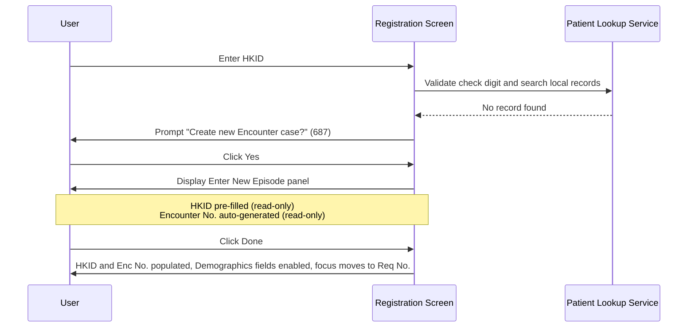
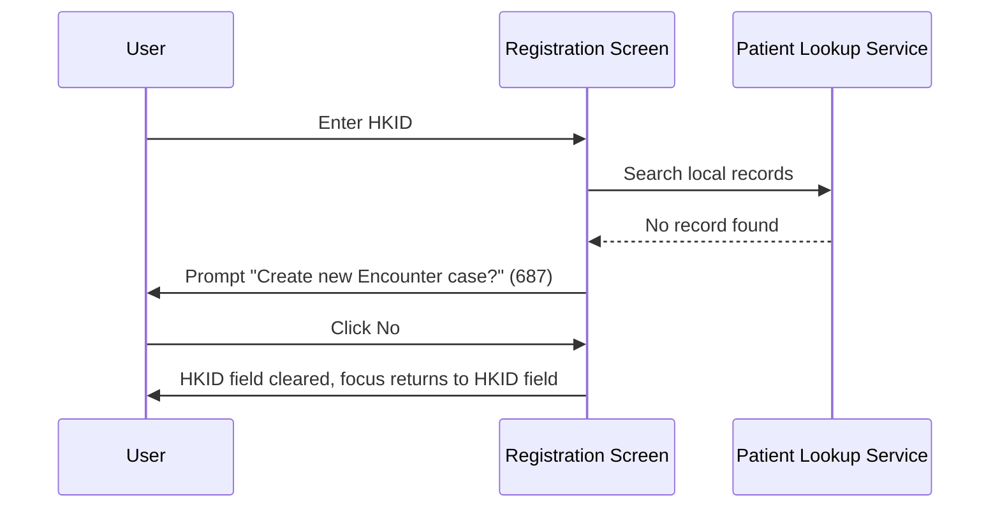
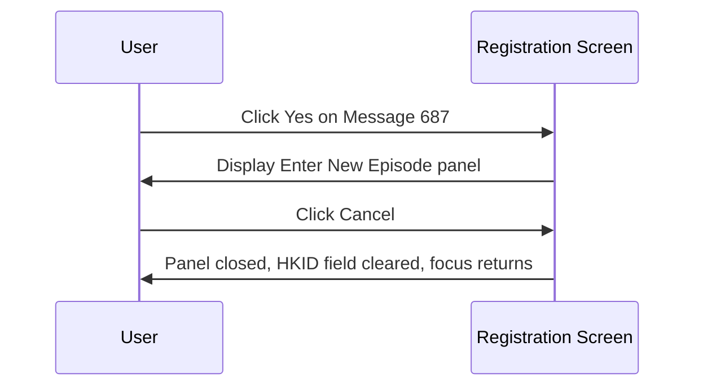
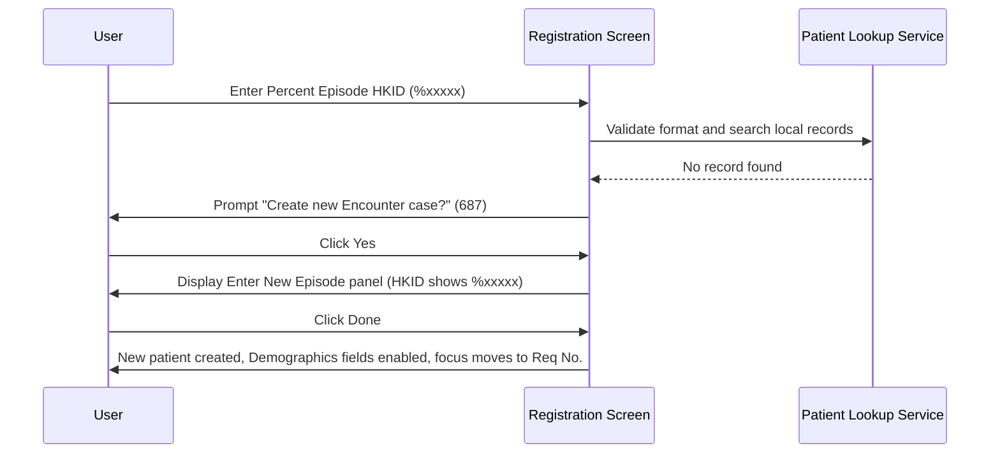

# Create New Patient by HKID

## Overview

This workflow allows registration staff to register a brand new patient when the HKID they enter is not found in the system. The user is prompted to confirm the creation of a new patient record. Once confirmed, a new encounter number is automatically generated, and the patient's demographic fields are made available for manual entry. This workflow is the primary path for first-time patient registration in the LIS system.

---

## Related User Stories

- **[[CRST-95]]** - Registration - Create New Patient by HKID
- **[[CRST-114]]** - Registration - Detailed Create New Patient by HKID

**Epic:** LISP-23 [CRST][DEV] Registration - Patient Handling

---

## Key Concepts

### New Patient
A patient whose HKID does not yet exist in the local patient records. The system identifies a new patient when the HKID lookup returns no results.

### Encounter Number Generation
When a new patient is created, the system automatically generates a new, unique encounter number for that patient at the current hospital. The encounter number is pre-filled in the **Enter New Episode** dialogue and is typically not editable by the user.

### Percent Episode HKID
A temporary patient identifier used when the patient does not have a valid Hong Kong Identity Card (HKID). It is entered in the format `%xxxxx` (starting with a `%` character, up to 12 characters total). Common use cases include newborns, visitors, or emergency registrations before a proper HKID is available.

### Demographics Entry for New Patients
Unlike existing patients whose demographics are retrieved from records and displayed as read-only, a new patient's demographic fields are fully editable after creation. The registration staff must manually enter all required demographic information.

---

## Trigger Point

This workflow begins after the registration staff enters a valid HKID into the **HKID** field on the Registration screen and the system determines that no matching patient record exists.

---

## Workflow Scenarios

### Scenario 1: New Patient Created — User Confirms

#### Prerequisites

- The entered HKID has a valid check digit (or is a valid Percent Episode HKID).
- No patient record matching the entered HKID exists in local patient records.

#### Process Flow

#### Step-by-Step Details

1. **HKID entry and validation**
   The user types an HKID into the **HKID** field. The system validates the check digit. If the check digit is invalid, an error is displayed and the user cannot proceed.

2. **Local record search finds nothing**
   The system searches local patient records and finds no match for the entered HKID. The system identifies this as a new patient.

3. **Confirmation prompt**
   Message **687** ("Create new Encounter case?") is displayed. The user must choose:
   - **Yes** — proceed to create the new patient record (continue to Step 4)
   - **No** — cancel the operation (see [Scenario 2](#scenario-2-user-cancels-at-the-confirmation-prompt))

4. **Enter New Episode panel displayed**
   The system opens the **Enter New Episode** modal panel. It contains two pre-filled, read-only fields:
   - **HKID** — the HKID as entered by the user (not editable)
   - **Enc No.** — a system-generated encounter number for the current hospital (not editable)

   The panel provides:
   - **Done** — confirm and create the new patient episode
   - **Cancel** — abort the operation (see [Scenario 3](#scenario-3-user-cancels-at-the-enter-new-episode-panel))

5. **User clicks Done**
   The user reviews the pre-filled HKID and encounter number, then clicks **Done**. The system validates the data before proceeding:
   - Confirms the HKID field is not empty.
   - Confirms the HKID check digit is valid.
   - Confirms the encounter number is consistent with the hospital.
   - If the encounter number already exists in the system, error **716** ("Episode already exists") is displayed and the user cannot proceed.
   - If the HKID does not match the hospital associated with the encounter number, error **719** ("HKID does not match encounter number") is displayed.

6. **New patient episode created**
   All validations pass. The panel closes and the new patient record is created. The Registration screen is updated:
   - The **HKID** field is populated with the entered HKID.
   - The **Enc No.** field is populated with the generated encounter number.

7. **Demographics fields enabled for manual entry**
   All patient demographic fields are enabled and editable so the registration staff can enter the patient's details. The following fields are available:
   - **Name**
   - **Name (Chinese)**
   - **Sex**
   - **Date of Birth**
   - **Age / Age Unit** *(calculated from Date of Birth once entered)*
   - **Pay Code**
   - **Category**
   - **Loc Hospital**
   - **Loc Specialty**
   - **Loc Ward/Clinic**
   - **Bed**
   - **Admitted**
   - **MRN**
   - **Race**

8. **Focus moves to Req No.**
   After the demographic fields are set up, focus automatically moves to the **Req No.** field so the user can proceed to enter the lab request.

---

### Scenario 2: User Cancels at the Confirmation Prompt

#### Prerequisites

- The HKID was not found in local patient records.
- Message **687** ("Create new Encounter case?") is displayed.

#### Process Flow

#### Step-by-Step Details

1. **Confirmation prompt displayed**
   Message **687** is shown asking the user whether to create a new encounter.

2. **User clicks No**
   The user declines to create a new patient record.

3. **HKID field cleared**
   The **HKID** field is cleared. No patient record is created. The demographics fields remain empty and disabled.

4. **Focus returns**
   Focus returns to the **HKID** field (or the default patient identification field). The user can re-enter a different HKID or use an alternative lookup method.

---

### Scenario 3: User Cancels at the Enter New Episode Panel

#### Prerequisites

- The user clicked **Yes** on Message **687**.
- The **Enter New Episode** panel is displayed with HKID and encounter number pre-filled.

#### Process Flow

#### Step-by-Step Details

1. **Enter New Episode panel displayed**
   The panel shows the pre-filled HKID and generated encounter number.

2. **User clicks Cancel**
   The user decides not to proceed. The panel closes immediately without creating any record.

3. **HKID field cleared**
   The **HKID** field on the Registration screen is cleared. The demographics fields remain empty and disabled. No encounter number is saved.

4. **Focus returns**
   Focus returns to the default patient identification field. The user can begin a new lookup or enter a different HKID.

---

### Scenario 4: New Patient with Percent Episode HKID

#### Prerequisites

- The patient does not have a valid HKID (e.g., newborn, visitor, emergency case).
- The user enters a Percent Episode HKID in the format `%xxxxx`.

#### Process Flow

#### Step-by-Step Details

1. **Percent Episode HKID entered**
   The user enters an identifier starting with `%` (e.g., `%12345`). The maximum length is 12 characters. The standard HKID check digit validation does not apply to this format.

2. **Local record search finds nothing**
   The system checks local patient records for the entered identifier and finds no match (as expected for a new temporary patient).

3. **Rest of the workflow is identical to Scenario 1**
   Message **687** is shown, the user confirms, the **Enter New Episode** panel displays with the Percent Episode HKID pre-filled, the encounter number is generated, and the user clicks **Done** to complete the creation.

4. **New patient created**
   The HKID and Enc No. fields are populated. Demographics fields are enabled for manual entry. Focus moves to the **Req No.** field.

---

### Scenario 5: PMI Service Unavailable During Validation

#### Prerequisites

- The user has opened the **Enter New Episode** panel and clicked **Done**.
- The PMI service is unreachable or returns an error during the encounter number validation step.

#### Step-by-Step Details

1. **Validation triggers a PMI check**
   When the user clicks **Done**, the system attempts to validate the encounter number and HKID combination against the PMI service.

2. **PMI service fails**
   The PMI service does not respond or returns an error.

3. **User prompted to proceed locally**
   The system displays a message informing the user that PMI is unavailable and asking whether to proceed with local creation. The user can choose:
   - **Yes** — the new patient record is created using local data only. The PMI unavailability is noted internally.
   - **No** — the **Done** and **Cancel** buttons are re-enabled. The user can retry or cancel.

4. **Local creation proceeds**
   If the user confirms, the workflow continues as in Scenario 1 from Step 6 onwards. The patient is created in the local system without PMI validation.

---

## Field States After New Patient Creation

### Patient Demographics Fields

| Field | State After Creation | Editable | Notes |
|---|---|---|---|
| Name | Enabled, empty | Yes | User must enter |
| Name (Chinese) | Enabled, empty | Yes | Optional |
| Sex | Enabled, empty | Yes | User must enter |
| Date of Birth | Enabled, empty | Yes | User must enter |
| Age / Age Unit | Enabled, calculated | Yes (indirectly) | Auto-calculated from Date of Birth |
| Pay Code | Enabled, empty | Yes | User must enter |
| Category | Enabled, empty | Yes | Editable for new patients |
| Loc Hospital | Enabled, pre-filled | Yes | Defaults to current hospital |
| Loc Specialty | Enabled, empty | Yes | User must enter |
| Loc Ward/Clinic | Enabled, empty | Yes | User must enter |
| Bed | Enabled, empty | Yes | Optional |
| Admitted | Enabled, empty | Yes | Optional |
| MRN | Enabled, empty | Yes | Optional |
| Race | Enabled, empty | Yes | Optional |

> **Note:** Demographics fields for a new patient are fully editable — the opposite of an existing patient lookup where all fields are dimmed and read-only.

### Patient Registration Key Fields

| Field | State After Creation | Editable |
|---|---|---|
| HKID | Populated, dimmed | No |
| Enc No. | Populated, dimmed | No |
| Req No. | Focused, empty | Yes |

---

## Error and Message Reference

| Message Code | Text | Trigger | User Options |
|---|---|---|---|
| 687 | "Create new Encounter case?" | HKID not found in local patient records | Yes (create) / No (cancel) |
| 716 | Episode already exists | Generated encounter number already exists in the system | Retry or cancel |
| 718 | HKID is required | User clicks Done with the HKID field empty | Correct and retry |
| 719 | HKID does not match encounter number | HKID hospital does not match the encounter number's hospital | Correct and retry |
| *(PMI unavailable)* | PMI service unavailable — proceed with local creation? | PMI service unreachable during validation | Yes (proceed locally) / No (retry) |

---

## Data Sources

| Data | Source |
|---|---|
| HKID existence check | Local patient records — queried on HKID entry |
| New encounter number | System-generated — based on current hospital configuration |
| Patient demographics | Manually entered by registration staff after new patient creation |
| PMI validation (optional) | PMI service — used during Enter New Episode validation if PMI is enabled |

---

## Business Rules

1. A new patient is defined as one whose HKID does not exist in the local patient records. The system always performs a local lookup before treating the HKID as new.
2. The user must explicitly confirm the creation of a new patient by responding **Yes** to Message **687**. The system will not create a record without this confirmation.
3. The encounter number is automatically generated by the system and is presented as read-only in the **Enter New Episode** panel. The user cannot edit it in the standard configuration.
4. The **Enter New Episode** panel cannot be submitted with an empty HKID field.
5. The system validates that the HKID and the generated encounter number are consistent with the same hospital before creating the record.
6. If an encounter number has already been assigned to another patient, the creation is blocked and the user is notified.
7. The Percent Episode format (`%xxxxx`, up to 12 characters) is a supported HKID format for patients without a valid HKID. Standard check digit validation does not apply to this format.
8. After a new patient is created, all patient demographic fields are fully editable. The registration staff must manually enter the patient's details before proceeding with request registration.
9. The **Category** field is always editable for new patients, regardless of hospital configuration settings.
10. When PMI is unavailable during encounter validation, the system allows the user to proceed with local-only creation so that registration is not blocked.
11. Any cancellation — whether at the confirmation prompt or at the Enter New Episode panel — clears the **HKID** field and resets focus so the user can start a new lookup.
12. After a new patient record is created and demographics fields are set up, focus automatically moves to the **Req No.** field.

---

## Related Workflows

- [[Retrieve Patient by HKID]] — The workflow that leads into this one: if the HKID lookup finds an existing patient, that workflow handles the retrieval instead.
- [[Retrieve Patient by Encounter Number]] — Alternative patient lookup; may also trigger new episode creation when no local or PMI record is found.
- [[Patient Tag Alert]] — Evaluated after a patient is loaded. For new patients, no tags will exist yet, so no alert is triggered.
- [[Default Patient Category]] — Describes the Patient Category default applied when a request number is assigned; for brand-new patients, this always defaults to In-Patient.
- [[Default Request Doctor]] — Describes the Req Doctor default applied at the same event; for brand-new patients, the Doctor Code defaults to blank (or the configured default doctor if set) because no attending doctor record exists.
- [[Default Request Location]] — Describes the Request Specialty and Request Location defaults applied at the same event; for brand-new patients, both fields default to blank because no patient location record exists.
