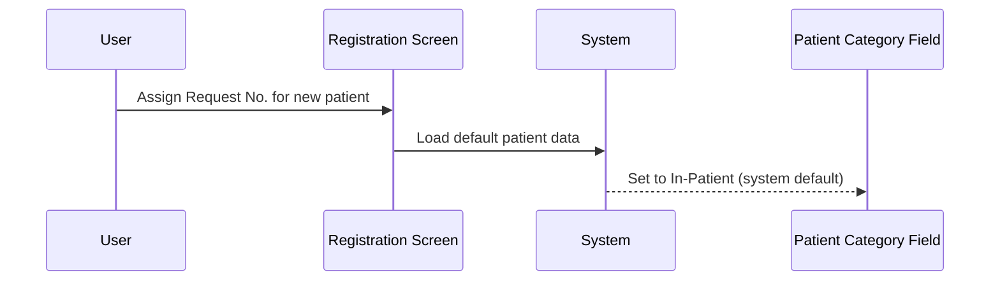
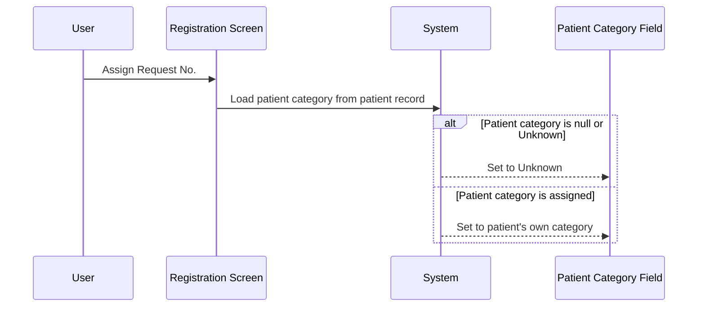
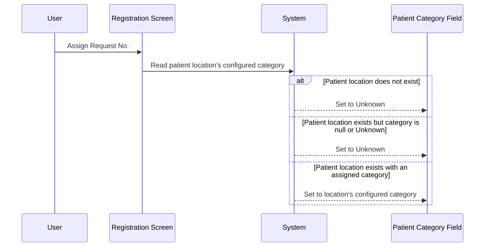

# Default Patient Category

## Overview

When a request number is assigned during Manual Registration, the system automatically sets a default value for the **Patient Category** field. The default is determined by two lab-level configuration options and by whether the patient is new or existing. For most existing patients, the category is derived either from the patient's own record or from the patient's current location. For brand-new patients with no prior data, the system always defaults to **In-Patient**. The intent is to pre-populate the field with the most clinically appropriate category so that staff do not have to select it manually for the common case.

---

## Related User Stories

- **[[CRST-611]]** - Registration - Default Patient Category

**Epic:** LISP-25 [CRST][DEV] Registration - Screen Object Enablement

---

## Key Concepts

### Patient Category
A classification of the patient's clinical status for the purpose of the laboratory request (e.g., In-Patient, Out-Patient, Accident & Emergency, Unknown). The field is a dropdown selector on the Registration screen.

### Unknown Category
A special sentinel value indicating that the patient's category cannot be determined. It is used when the relevant data source (patient record or patient location) does not carry a category, or when no matching category can be found.

### Patient Location
The ward or clinic where the patient is currently admitted or attending. Each location may be configured with a default patient category in the location directory.

### New Patient (non-PMI)
A patient whose Hong Kong Identity Card (HKID) or Encounter Number does not exist in the local patient database and who was not pre-populated from an external Patient Master Index (PMI). No prior clinical data is available.

### New PMI Patient
A patient who is new to the local database but whose data (including patient category) has been retrieved from an external Patient Master Index.

### Existing Patient
A patient whose record already exists in the local patient database and has been retrieved during the registration key validation step.

---

## Trigger Point

This workflow is applied when the request number is successfully assigned during Manual Registration — specifically, as part of the data loading step that follows request number validation. It runs each time a new request is started, resetting the Patient Category field to the appropriate default.

---

## Workflow Scenarios

### Scenario 1: Brand-New Patient (No Prior Record, No PMI Data)

#### Prerequisites
- The patient is entirely new — no local record and no PMI data.
- The user has entered a new HKID or Encounter Number.

#### Process Flow

#### Step-by-Step Details

1. The user assigns a request number for a brand-new patient with no prior record and no PMI data.
2. The system resets the **Patient Category** field to its baseline default: **In-Patient**.
3. No further derivation logic is applied — the field is left as In-Patient.

---

### Scenario 2: Derive Patient Category from Patient Record

#### Prerequisites
- `REQ_PAT_CAT_DERIVED_BY_REQ_LOCN_ENABLED` is **disabled** (option value = 0).
- `DEFAULT_PAT_CAT_FROM_PATIENT_ENABLED` is **enabled** (option value = 1).
- The patient is an existing patient, OR is a new PMI patient (whose data came from an external Patient Master Index).

#### Process Flow

#### Step-by-Step Details

1. The user assigns a request number. The system reads the patient category stored in the patient's own record (the category recorded against the patient's encounter).
2. If the patient's recorded category is null or is the **Unknown** sentinel value, the **Patient Category** field is set to **Unknown**.
3. If the patient's recorded category is a valid, assigned value, the **Patient Category** field is set to that value.

> This scenario also applies to new PMI patients: when a new patient's data was retrieved from the external Patient Master Index, the system reads the category from the PMI data in the same way.

---

### Scenario 3: Derive Patient Category from Patient Location

#### Prerequisites
- `REQ_PAT_CAT_DERIVED_BY_REQ_LOCN_ENABLED` is **enabled** (option value = 1), OR both `REQ_PAT_CAT_DERIVED_BY_REQ_LOCN_ENABLED` and `DEFAULT_PAT_CAT_FROM_PATIENT_ENABLED` are **disabled**.
- The patient is an existing patient.

#### Process Flow

#### Step-by-Step Details

1. The user assigns a request number. The system looks up the category configured against the patient's current location (ward/clinic) in the location directory.
2. If the patient has no location recorded, the **Patient Category** field is set to **Unknown**.
3. If the patient's location exists but its configured category is null or is the **Unknown** sentinel value, the **Patient Category** field is set to **Unknown**.
4. If the patient's location exists and has a valid assigned category, the **Patient Category** field is set to that category.

---

### Scenario 4: Both Options Enabled — Patient Record Takes Precedence

#### Prerequisites
- Both `REQ_PAT_CAT_DERIVED_BY_REQ_LOCN_ENABLED` **and** `DEFAULT_PAT_CAT_FROM_PATIENT_ENABLED` are **enabled** (both option values = 1).
- The patient is an existing patient.

#### Step-by-Step Details

When both options are enabled simultaneously, the system derives the patient category from the **patient's own record**, not from the patient location. The behaviour is identical to Scenario 2.

> This means `DEFAULT_PAT_CAT_FROM_PATIENT_ENABLED` (patient record) takes precedence over `REQ_PAT_CAT_DERIVED_BY_REQ_LOCN_ENABLED` (patient location) when both are active.

---

## Summary Table — Default Category Logic

| `REQ_PAT_CAT_DERIVED_BY_REQ_LOCN_ENABLED` | `DEFAULT_PAT_CAT_FROM_PATIENT_ENABLED` | Patient Type | Category Source |
|---|---|---|---|
| Disabled | Disabled | Existing patient | Patient Location (OFFICE.office_patient_category) |
| Disabled | Disabled | New non-PMI patient | In-Patient (system default) |
| Disabled | Enabled | Existing patient | Patient Record (PATIENT.pat_cat) |
| Disabled | Enabled | New PMI patient | PMI patient category |
| Disabled | Enabled | New non-PMI patient | In-Patient (system default) |
| Enabled | Disabled | Existing patient | Patient Location (OFFICE.office_patient_category) |
| Enabled | Enabled | Existing patient | Patient Record (PATIENT.pat_cat) |

**In all location-derived cases:** If the patient has no location, or the location has no configured category, the result is **Unknown**.  
**In all patient-record-derived cases:** If the patient's own category is null or Unknown, the result is **Unknown**.

---

## Dynamic Update on Location Change

In addition to the default applied at request number assignment, the **Patient Category** field is also updated in real time whenever the user changes the **Patient Location** field on screen — but only when the `DERIVE_PAT_CAT_FROM_PAT_LOCN_ENABLED` option is enabled. When this option is enabled, selecting a new location causes the system to read the category configured against that location and update the Patient Category field immediately.

> `DERIVE_PAT_CAT_FROM_PAT_LOCN_ENABLED` controls the real-time location-change update only. It is separate from `REQ_PAT_CAT_DERIVED_BY_REQ_LOCN_ENABLED`, which controls the initial default applied at request number assignment.

---

## Configuration

| Setting | Option Code | Purpose | Effect when enabled | Effect when disabled |
|---------|------------|---------|--------------------|--------------------|
| Derive patient category from patient location (at Req No. assignment) | `REQ_PAT_CAT_DERIVED_BY_REQ_LOCN_ENABLED` | Controls whether the Patient Category default at request number assignment is taken from the patient's location record | Category derived from OFFICE.office_patient_category of the patient's location | Category falls back to patient record or system default |
| Default patient category from patient record | `DEFAULT_PAT_CAT_FROM_PATIENT_ENABLED` | Controls whether the Patient Category default at request number assignment is taken from the patient's own record (PATIENT.pat_cat) | Category derived from patient's own record (or PMI data for new PMI patients) | Category derived from patient location (if REQ_PAT_CAT_DERIVED_BY_REQ_LOCN_ENABLED is also off) |
| Derive patient category from patient location (real-time update) | `DERIVE_PAT_CAT_FROM_PAT_LOCN_ENABLED` | Controls whether changing the Patient Location field on screen immediately updates the Patient Category field | Patient Category updates dynamically when the user changes the patient location | Patient Category is not updated when the user changes the patient location |

---

## Business Rules

1. A brand-new patient (with no local record and no PMI data) always receives **In-Patient** as the default Patient Category, regardless of the lab option configuration.
2. When `REQ_PAT_CAT_DERIVED_BY_REQ_LOCN_ENABLED` is enabled and `DEFAULT_PAT_CAT_FROM_PATIENT_ENABLED` is disabled, the Patient Category is derived from the patient location's configured category.
3. When `DEFAULT_PAT_CAT_FROM_PATIENT_ENABLED` is enabled and `REQ_PAT_CAT_DERIVED_BY_REQ_LOCN_ENABLED` is disabled, the Patient Category is derived from the patient's own record.
4. When both options are enabled simultaneously, the patient's own record takes precedence over the patient location.
5. When both options are disabled, the patient location's configured category is used (same outcome as rule 2).
6. If the relevant data source (patient record or patient location) contains a null or Unknown category, the result is always **Unknown** — the system does not fall back to a secondary source.
7. For new PMI patients, when `DEFAULT_PAT_CAT_FROM_PATIENT_ENABLED` is enabled, the category is read from the PMI data rather than the local patient record (since no local record exists yet).
8. The `DERIVE_PAT_CAT_FROM_PAT_LOCN_ENABLED` option controls only the real-time update when the user changes the patient location field. It is independent of the initial default applied at request number assignment.
9. All three configuration options are evaluated per lab number — the lab number of the request number prefix determines which set of options applies.

---

## Related Workflows

- [[Default Request Info]] — Describes the broader set of default values loaded at request number assignment, of which Patient Category is one component.
- [[Request No. Enablement after Registration Key Input]] — Describes the state transition that triggers the loading of default request data, including the Patient Category default.
- [[Retrieve Patient by HKID]] — The patient retrieval pathway that provides the patient record used in Scenario 2.
- [[Retrieve Patient by Encounter Number]] — The patient retrieval pathway that provides the patient record used in Scenario 2.
- [[Create New Patient by HKID]] — The new patient pathway that results in the In-Patient default (Scenario 1).
- [[Default Request Doctor]] — Describes the parallel default applied to the Req Doctor field at the same request number assignment event; also shares the `REQ_PAT_CAT_DERIVED_BY_REQ_LOCN_ENABLED` option.
