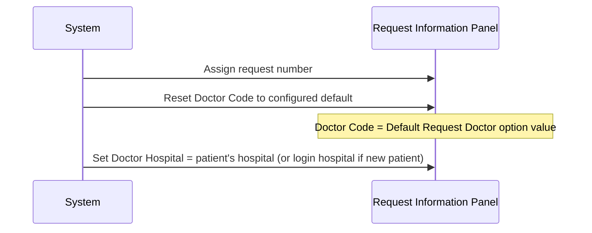
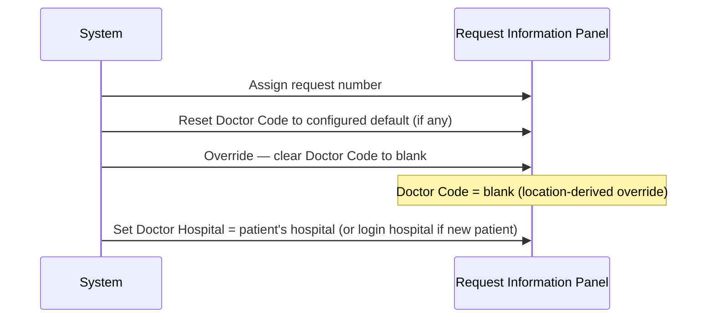
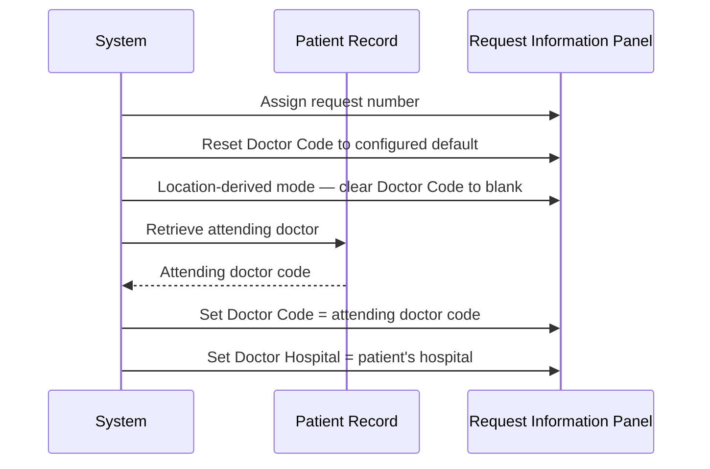
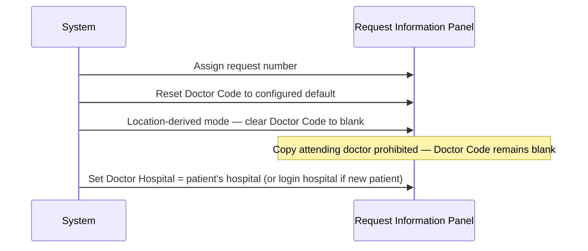
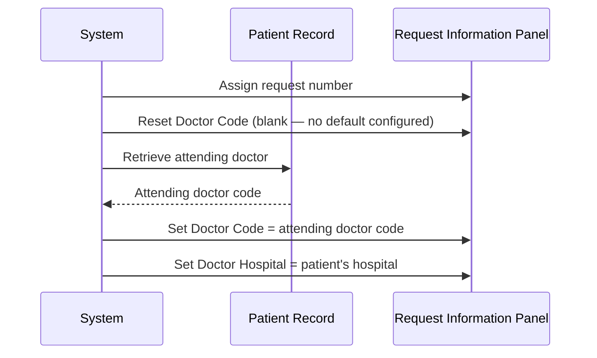
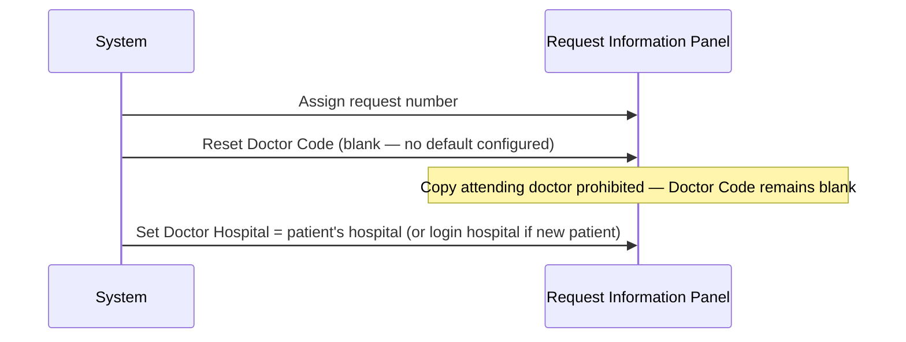

# Default Request Doctor

## Overview

When a request number is assigned to a patient in the Registration screen, the system automatically populates the **Req Doctor** field with a default doctor code and hospital. The default doctor code is derived from one of three sources — a site-configured default doctor, the patient's attending doctor on record, or a blank value — depending on a combination of system configuration options and whether the patient is new or existing. The Doctor Hospital sub-field defaults to the patient's hospital for existing patients, or the login hospital for new patients.

---

## Related User Stories

- **[[CRST-612]]** - Registration - Default Request Doctor

**Epic:** LISP-23 [CRST][DEV] Registration - Patient Handling

---

## Key Concepts

### Req Doctor Field
A two-part field on the Request Information Panel consisting of a **Doctor Code** (the requesting doctor's identifier) and a **Doctor Hospital** (the hospital to which the doctor belongs). Both sub-fields are set automatically at the point of request number assignment.

### Default Request Doctor Option
A site-level configuration that stores a specific doctor code. When set and when location-derived mode is not active, this code is pre-filled as the default doctor for every new request.

### Attending Doctor
The doctor associated with the patient's current or most recent encounter as stored in the patient record. This value is used as a fallback default unless copying is explicitly disabled.

### Location-Derived Mode
A system mode (controlled by a separate lab option) in which patient category, specialty, and location are derived from the request location rather than the patient's own record. When this mode is active, it also affects how the default doctor code is determined.

---

## Trigger Point

This workflow is triggered immediately after the request number is successfully assigned to the patient, as part of the automatic population of request information fields.

---

## Workflow Scenarios

### Scenario 1: Default Doctor Code from Configuration (Location-Derived Mode Off)

#### Prerequisites
- The **Default Request Doctor** lab option (`DEFAULT_REQUEST_DOCTOR`) is configured with a doctor code.
- The **Location-Derived Mode** (`REQ_PAT_CAT_DERIVED_BY_REQ_LOCN_ENABLED`) is **disabled**.

#### Process Flow

#### Step-by-Step Details

1. At the point of request number assignment, the system resets the **Doctor Code** field to the value configured in the **Default Request Doctor** option.
2. Because location-derived mode is not active, the configured default doctor code is not overridden by any other rule.
3. Even if the patient has an attending doctor on record, the configured default takes precedence — the attending doctor copy step only applies when the field is blank after the reset.
4. The **Doctor Hospital** is set to the patient's hospital (for an existing patient) or the login hospital (for a new patient).

---

### Scenario 2: Location-Derived Mode On — New Patient or Non-IP/A&E Patient

#### Prerequisites
- The **Location-Derived Mode** (`REQ_PAT_CAT_DERIVED_BY_REQ_LOCN_ENABLED`) is **enabled**.
- The patient is new (no existing patient record), **OR** the patient is an existing patient whose category is not In-Patient or Accident & Emergency.

#### Process Flow

#### Step-by-Step Details

1. The system first resets the **Doctor Code** to the configured default value (if any).
2. Because location-derived mode is active and the patient is not an In-Patient or A&E patient, the system immediately overrides this by setting the **Doctor Code** to blank.
3. No further fallback to the patient's attending doctor takes place.
4. The **Doctor Hospital** is set to the patient's hospital (for an existing patient) or the login hospital (for a new patient).

---

### Scenario 3: Location-Derived Mode On — Existing IP/A&E Patient, Attending Doctor Copy Allowed

#### Prerequisites
- The **Location-Derived Mode** (`REQ_PAT_CAT_DERIVED_BY_REQ_LOCN_ENABLED`) is **enabled**.
- The patient is an existing **In-Patient** or **Accident & Emergency** patient.
- The **Copy Attending Doctor to Request Doctor Disabled** option (`COPY_ATTENTION_DOC_TO_REQ_DOC_DISABLED`) is **disabled** (copy is allowed).
- The patient's attending doctor is recorded in the patient record.

#### Process Flow

#### Step-by-Step Details

1. The system resets the **Doctor Code** to the configured default, then clears it to blank (location-derived override).
2. Because the doctor code is now blank and copying is allowed, the system retrieves the patient's attending doctor code from the patient record.
3. If the attending doctor code is present and non-blank, it is written into the **Doctor Code** field.
4. If the attending doctor code is absent or blank, the **Doctor Code** remains blank.
5. The **Doctor Hospital** is set to the patient's hospital.

---

### Scenario 4: Location-Derived Mode On — Copy Attending Doctor Disabled

#### Prerequisites
- The **Location-Derived Mode** (`REQ_PAT_CAT_DERIVED_BY_REQ_LOCN_ENABLED`) is **enabled**.
- The **Copy Attending Doctor to Request Doctor Disabled** option (`COPY_ATTENTION_DOC_TO_REQ_DOC_DISABLED`) is **enabled** (copy is prohibited).
- The patient may or may not have an attending doctor on record.

#### Process Flow

#### Step-by-Step Details

1. The system resets the **Doctor Code** and then clears it to blank (location-derived override).
2. Because copying the attending doctor is prohibited, no further population of the **Doctor Code** field takes place — it remains blank regardless of whether the patient has an attending doctor.
3. The **Doctor Hospital** is set as normal.

---

### Scenario 5: Location-Derived Mode Off, No Default Doctor Configured — Copy Attending Doctor Allowed

#### Prerequisites
- The **Location-Derived Mode** (`REQ_PAT_CAT_DERIVED_BY_REQ_LOCN_ENABLED`) is **disabled**.
- No value is configured in the **Default Request Doctor** option (field resets to blank).
- The **Copy Attending Doctor to Request Doctor Disabled** option (`COPY_ATTENTION_DOC_TO_REQ_DOC_DISABLED`) is **disabled** (copy is allowed).
- The patient is an existing patient with an attending doctor on record.

#### Process Flow

#### Step-by-Step Details

1. The system resets the **Doctor Code** to the configured default; because no default is configured, the field becomes blank.
2. Because copying is allowed and the field is blank, the system retrieves the patient's attending doctor code from the patient record.
3. If the attending doctor code is present and non-blank, it is written into the **Doctor Code** field.
4. If the attending doctor code is absent or blank, the **Doctor Code** remains blank.
5. The **Doctor Hospital** is set to the patient's hospital.

---

### Scenario 6: Location-Derived Mode Off, No Default Doctor Configured — Copy Attending Doctor Disabled

#### Prerequisites
- The **Location-Derived Mode** (`REQ_PAT_CAT_DERIVED_BY_REQ_LOCN_ENABLED`) is **disabled**.
- No value is configured in the **Default Request Doctor** option.
- The **Copy Attending Doctor to Request Doctor Disabled** option (`COPY_ATTENTION_DOC_TO_REQ_DOC_DISABLED`) is **enabled** (copy is prohibited).

#### Process Flow

#### Step-by-Step Details

1. The system resets the **Doctor Code** to blank (no default configured).
2. Copying of the attending doctor is prohibited, so the **Doctor Code** remains blank.
3. The **Doctor Hospital** is set as normal.

---

### Scenario 7: New Patient (All Configurations)

#### Prerequisites
- No patient record has been retrieved — the request is being created for a new patient.

#### Step-by-Step Details

1. Because there is no patient record, there is no attending doctor to copy. The **Doctor Code** field is set to blank (or to the configured default doctor if one is set and location-derived mode is off).
2. The **Doctor Hospital** defaults to the **login hospital** (the hospital the user is currently logged into), not the patient's hospital (which does not yet exist).

---

## Summary Tables

### Doctor Code Default Decision Matrix

| Location-Derived Mode | Default Doctor Configured | Copy Attending Doctor Disabled | Patient Attending Doctor | Doctor Code Default |
|---|---|---|---|---|
| Off | Yes | N/A | N/A | Configured default doctor code |
| Off | No | No | Assigned | Patient's attending doctor code |
| Off | No | No | Not assigned | Blank |
| Off | No | Yes | N/A | Blank |
| On | N/A | N/A | N/A (new patient or non-IP/A&E) | Blank |
| On | N/A | No | Assigned (IP/A&E patient) | Patient's attending doctor code |
| On | N/A | No | Not assigned (IP/A&E patient) | Blank |
| On | N/A | Yes | N/A (IP/A&E patient) | Blank |

### Doctor Hospital Default

| Patient Status | Doctor Hospital Default |
|---|---|
| New patient | Login hospital |
| Existing patient | Patient's hospital |

---

## Data Sources

| Data | Source |
|---|---|
| Default Request Doctor code | Lab option `DEFAULT_REQUEST_DOCTOR` — read once at dictionary load time |
| Copy Attending Doctor prohibition flag | Lab option `COPY_ATTENTION_DOC_TO_REQ_DOC_DISABLED` — read once at dictionary load time |
| Location-Derived Mode flag | Lab option `REQ_PAT_CAT_DERIVED_BY_REQ_LOCN_ENABLED` — shared with Default Patient Category workflow |
| Patient's attending doctor | Retrieved with patient data when the patient is looked up |
| Patient's hospital | Derived from the patient location set when the patient is retrieved |
| Login hospital | Session context — the hospital the user logged in with |

---

## Configuration

| Setting | Option Code | Purpose | Effect when enabled | Effect when disabled |
|---|---|---|---|---|
| Default Request Doctor | `DEFAULT_REQUEST_DOCTOR` (option_text) | Specifies a fixed doctor code to pre-fill in the Doctor Code field | Doctor Code defaults to the configured code (when location-derived mode is off) | No fixed default; field falls back to attending doctor or blank |
| Copy Attending Doctor to Request Doctor Disabled | `COPY_ATTENTION_DOC_TO_REQ_DOC_DISABLED` | Controls whether the patient's attending doctor is copied into the Doctor Code field | Attending doctor is never copied; Doctor Code defaults to blank (or configured default if set) | Attending doctor is copied when Doctor Code would otherwise be blank |
| Location-Derived Mode | `REQ_PAT_CAT_DERIVED_BY_REQ_LOCN_ENABLED` | Shared option that drives location-derived defaults; also forces Doctor Code to blank for non-IP/A&E patients | Doctor Code cleared to blank first; attending doctor may still be copied for IP/A&E patients if copy is allowed | Configured default doctor takes precedence; attending doctor fallback applies normally |

> All three options belong to `option_group = 'REQUEST_REGISTRATION'` in the `LAB_OPTION` table. `DEFAULT_REQUEST_DOCTOR` uses `option_text` (not `option_value`) for its value.

---

## Business Rules

1. The **Doctor Code** and **Doctor Hospital** fields are set automatically at the point of request number assignment; no user interaction is required to trigger this behaviour.
2. When the **Default Request Doctor** option is configured and location-derived mode is off, the configured doctor code is always used — the patient's attending doctor is only considered when the field is blank after the reset.
3. When location-derived mode is active, the configured default doctor (if any) is immediately overridden by a blank value for patients who are not In-Patient or Accident & Emergency.
4. The **Copy Attending Doctor to Request Doctor Disabled** option acts as a hard block: when enabled, the patient's attending doctor is never copied regardless of other settings.
5. For a new patient, the **Doctor Hospital** always defaults to the login hospital because no patient hospital record exists yet.
6. For an existing patient, the **Doctor Hospital** always defaults to the patient's own hospital as retrieved from the patient record.
7. If both the configured default and the attending doctor copy mechanism yield a blank value, the Doctor Code field remains blank and the user may enter a value manually.

---

## Related Workflows

- [[Default Patient Category]] — Shares the `REQ_PAT_CAT_DERIVED_BY_REQ_LOCN_ENABLED` option and is triggered by the same request number assignment event.
- [[Default Request Info]] — Documents the broader set of field defaults applied at request number assignment, of which the doctor default is one part.
- [[Retrieve Patient by HKID]] — The patient's attending doctor is retrieved as part of this workflow and becomes available for the doctor default logic.
- [[Retrieve Patient by Encounter Number]] — The patient's attending doctor is also retrieved via this alternative lookup path.
- [[Create New Patient by HKID]] — When a new patient is created, no attending doctor exists; doctor defaults to blank (or configured default).
