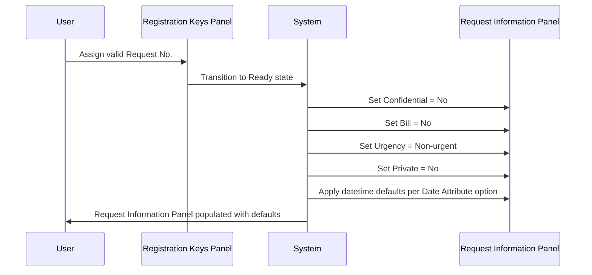
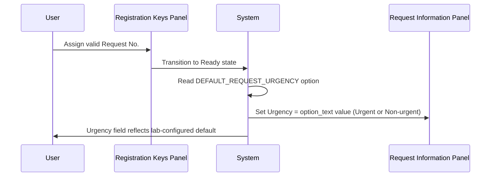
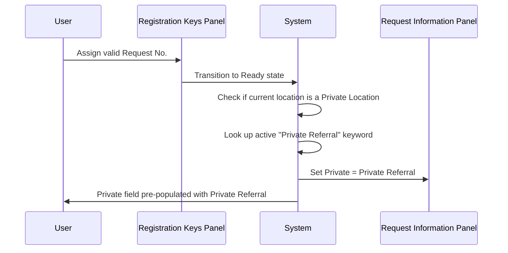

# Default Request Info

## Overview

When a valid request number is assigned during Manual Registration, the system populates the Request Information Panel with a set of default values. These defaults cover the **Confidential**, **Bill**, **Urgency**, and **Private** selection fields, as well as the **Request Date/Time**, **Collection Date/Time**, and **Arrival Date/Time** fields. The default values for the datetime fields are driven by the **Date Attribute** lab option. Additionally, if the registered patient's location is a Private Location, the **Private** field is automatically set to **Private Referral**. After defaults are applied, the system may also recalculate the patient's age based on the collection datetime if the relevant option is configured.

---

## Related User Stories

- **[[CRST-530]]** - Registration - Default Request Info

**Epic:** LISP-25 [CRST][DEV] Registration - Screen Object Enablement

---

## Key Concepts

### Private Location
A clinical location (office/ward) configured with the private location flag set. When a patient is retrieved with such a location, the **Private** field is automatically set to **Private Referral** to reflect the patient's billing context.

### Private Referral
A keyword value in the **Private** field indicating the request is a private referral case. The system resolves this value first by looking up the active keyword list entry with the description "Private Referral"; if that entry is inactive or absent, it falls back to the built-in programme constant for the Private Referral description.

### Date Attribute (option code `DATE_ATTRIBUTE`)
A lab option whose `option_text` encodes three sets of behaviour flags — one each for the Request, Arrival, and Collection datetime fields. The format is `R<flags>,A<flags>,C<flags>` where each set of four digits controls: visibility (digit 1), mandatory/optional (digit 2), default-as-blank (digit 3 indirectly via option_value), and default datetime format (digits 3–4). See the **Datetime Default Behaviour Matrix** below.

### Datetime Default Formats
The last two digits of each DATE_ATTRIBUTE field code determine the default value placed in the datetime field:
- `00` — Blank (no default value)
- `10` — Current date at 00:00
- `11` — Current server date and time

> If both "current date at 00:00" and "current server date/time" are configured, current server date/time takes precedence.

### Age Recalculation
When the **Derive Age and Age Unit Criteria** option is enabled, the system recalculates the patient's displayed age and age unit using the Collection Date/Time as the reference point, provided a collection datetime has been set.

---

## Trigger Point

This workflow is triggered immediately after a valid request number has been assigned and the screen transitions to the Ready state. The default values are loaded as part of the Ready state initialisation sequence.

---

## Workflow Scenarios

### Scenario 1: Standard defaults applied on request number assignment

#### Prerequisites
- The Manual Registration screen is in the Ready state (valid request number assigned).
- The patient's location is not a Private Location.
- No special urgency default option is configured.

#### Process Flow

#### Step-by-Step Details

1. After the request number is accepted, the screen enters the Ready state and initialises the Request Information Panel with the following defaults:
   - **Confidential** → No
   - **Bill** → No
   - **Urgency** → Non-urgent (system default)
   - **Private** → No
2. The system applies default datetime values to the **Request Date/Time**, **Arrival Date/Time**, and **Collection Date/Time** fields according to the **Date Attribute** option (see Configuration section below).
3. If the **Derive Age and Age Unit Criteria** option is enabled and a Collection Date/Time default has been set, the patient's age and age unit are recalculated using the collection datetime.

---

### Scenario 2: Urgency default overridden by lab option

#### Prerequisites
- `LAB_OPTION [option_group = 'REQUEST_REGISTRATION', option_code = 'DEFAULT_REQUEST_URGENCY', option_enable = 'Y']` exists.
- The option's `option_text` is either `Urgent` or `Non-urgent`.

#### Process Flow

#### Step-by-Step Details

1. When the Ready state initialisation loads the default urgency value, the system reads the `DEFAULT_REQUEST_URGENCY` lab option.
2. If the option is enabled and its text is set to `Urgent`, the **Urgency** field defaults to **Urgent**.
3. If the option is enabled and its text is set to `Non-urgent`, the **Urgency** field defaults to **Non-urgent**.
4. If the option is disabled or absent, the system falls back to the system-level default of **Non-urgent**.

> **Note:** If the assigned request prefix is itself an urgent-flagged prefix, the urgency is overridden to **Urgent** regardless of the option setting.

---

### Scenario 3: Private Referral applied for Private Location

#### Prerequisites
- The patient has been retrieved with a location that is configured as a **Private Location** (`OFFICE.office_private_location = 'Y'`).
- A valid request number has been assigned.

#### Process Flow

#### Step-by-Step Details

1. After the request number is accepted, the system checks whether the patient's current Request Location is a Private Location.
2. If it is a Private Location, the system looks for an active keyword list entry with the description "Private Referral".
   - If found and active, the **Private** field is set to the matching **Private Referral** keyword.
   - If the keyword list entry is inactive or absent, the system uses the built-in programme constant for the "Private Referral" description to set the **Private** field.
3. If the location is not a Private Location, the **Private** field remains at its default value of **No**.

---

## Datetime Default Behaviour Matrix

The **Date Attribute** option (`DATE_ATTRIBUTE`) controls visibility, mandatory status, and default value for each datetime field. The `option_text` value uses the format `R<code>,A<code>,C<code>` where R = Request Date/Time, A = Arrival Date/Time, C = Collection Date/Time.

| Code | Visibility | Mandatory | Default Value |
|------|-----------|-----------|---------------|
| `x000` | Visible | Optional | Blank |
| `x100` | Visible | Mandatory | Blank |
| `x010` | Visible | Optional | Current date at 00:00 |
| `x011` | Visible | Optional | Current server date and time |
| `x110` | Visible | Mandatory | Current date at 00:00 |
| `x111` | Visible | Mandatory | Current server date and time |

> The first digit (x) in each code controls visibility (1 = visible, 0 = invisible).
> The second digit controls mandatory status (1 = mandatory, 0 = optional).
> The third and fourth digits together determine the default datetime format.
> If a field is optional and the "default as empty if optional" flag is set in the option value, the field defaults to blank regardless of the format digits.
> If both "current date at 00:00" (digit code `10`) and "current server date/time" (digit code `11`) are applicable, current server date/time takes precedence.

**Examples:**

| option_text value | Request Date/Time | Arrival Date/Time | Collection Date/Time |
|---|---|---|---|
| `R1000,A1000,C1000` | Visible, optional, blank | Visible, optional, blank | Visible, optional, blank |
| `R1100,A1000,C1000` | Visible, **mandatory**, blank | Visible, optional, blank | Visible, optional, blank |
| `R1010,A1010,C1010` | Visible, optional, current date 00:00 | Visible, optional, current date 00:00 | Visible, optional, current date 00:00 |
| `R1011,A1011,C1011` | Visible, optional, current server datetime | Visible, optional, current server datetime | Visible, optional, current server datetime |

---

## Configuration

| Setting | Option Code | Purpose | Effect when enabled | Effect when disabled |
|---|---|---|---|---|
| Default Request Urgency | `DEFAULT_REQUEST_URGENCY` | Overrides the system default urgency value applied when a request number is assigned | Urgency defaults to the value set in `option_text` (Urgent or Non-urgent) | Urgency defaults to Non-urgent (system default) |
| Date Attribute | `DATE_ATTRIBUTE` | Controls visibility, mandatory status, and default datetime value for the Request, Arrival, and Collection Date/Time fields | Datetime fields behave per the encoded field flags in `option_text` | All datetime fields default to current server date/time; Collection Date/Time is optional |
| Derive Age and Age Unit Criteria | `DERIVE_AGE_AND_AGE_UNIT_CRITERIA` | Controls whether the patient's age is recalculated using Collection Date/Time when a request is initialised | Age and age unit are recalculated from Collection Date/Time at request initialisation | Age is not recalculated; the value from the patient record is used as-is |

---

## Business Rules

1. When a request number is assigned, the system always resets the **Confidential**, **Bill**, **Urgency**, and **Private** fields to their configured defaults before loading the request information.
2. The default urgency is **Non-urgent** unless overridden by the `DEFAULT_REQUEST_URGENCY` lab option or by an urgent-flagged request prefix.
3. An urgent-flagged request prefix takes precedence over the `DEFAULT_REQUEST_URGENCY` option; if the prefix is urgent, the urgency is set to **Urgent** regardless of the option.
4. The default for **Confidential** is always **No**; the default for **Bill** is always **No**. Neither has a configurable override.
5. If the patient's current Request Location is a Private Location, the **Private** field is automatically set to **Private Referral**, overriding the default of **No**.
6. The system resolves the "Private Referral" value first from the active keyword list; if the entry is absent or inactive, it falls back to the built-in programme constant.
7. Datetime field defaults are entirely controlled by the `DATE_ATTRIBUTE` lab option. In the absence of this option, all three datetime fields default to the current server date/time.
8. If a datetime field is optional and the "default as empty if optional" flag is active in the option, the field is left blank regardless of the configured default format.
9. If both "current date at 00:00" and "current server date/time" formats are configured for the same field, current server date/time takes precedence.
10. Age recalculation from collection datetime occurs only when the `DERIVE_AGE_AND_AGE_UNIT_CRITERIA` option is enabled **and** the collection datetime field has a non-null default value after initialisation.

---

## Related Workflows

- [[Request No. Enablement after Registration Key Input]] — This workflow is triggered as part of the same Ready state transition in which default request info is loaded.
- [[Request Information Panel]] — Documents the full layout, field states, and interaction rules of the Request Information Panel that receives these defaults.
