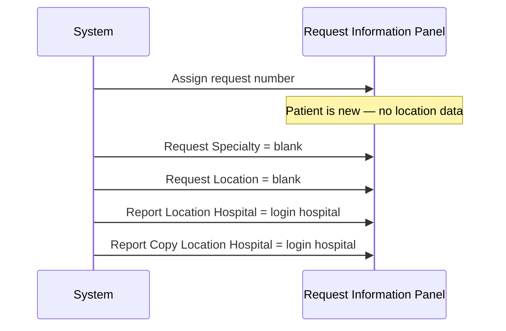
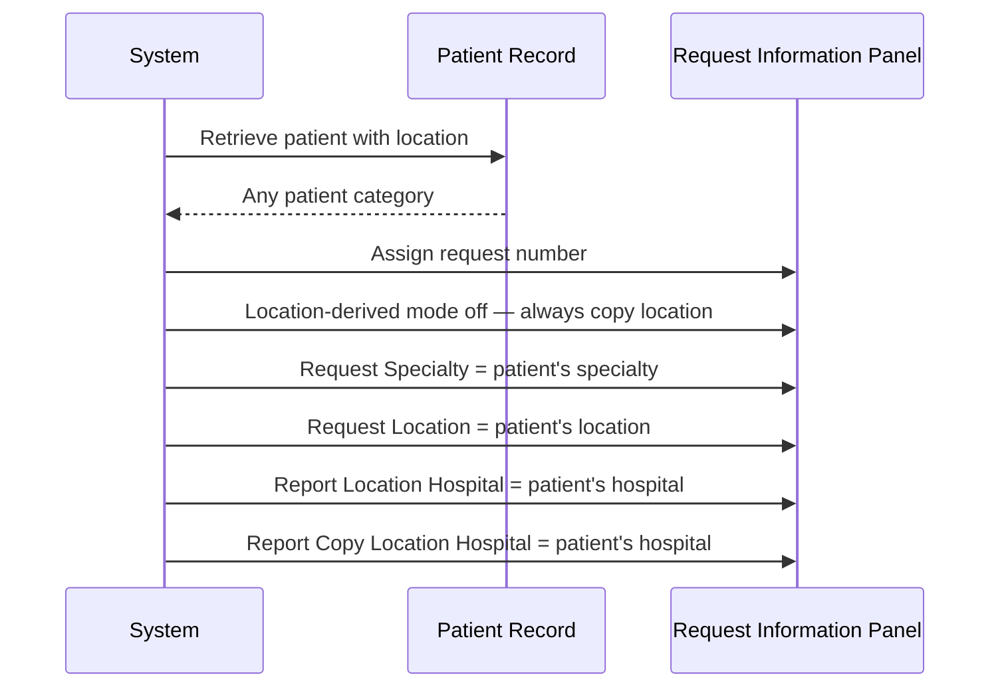

# Default Request Location

## Overview

When a request number is assigned during Manual Registration, the system automatically populates the **Request Location** fields — comprising the **Hospital**, **Specialty**, and **Ward/Clinic** sub-fields — with default values derived from the patient's own location. The defaulting logic is controlled by one key configuration option and by whether the patient is new or existing. In addition, the **Hospital** sub-field for both the **Report Location** and **Report Copy Location** panels always defaults to the patient's location hospital, regardless of other settings.

---

## Related User Stories

- **[[CRST-613]]** - Registration - Default Request Location

**Epic:** LISP-25 [CRST][DEV] Registration - Screen Object Enablement

---

## Key Concepts

### Request Location
A three-part field on the Request Information Panel that captures the **Hospital**, **Specialty**, and **Ward/Clinic** of the requesting clinical location. It defaults from the patient's own location at the point of request number assignment.

### Patient Location
The ward, clinic, or unit where the patient is currently admitted or attending. It is retrieved from the patient record when the patient is looked up and populates the Patient Location fields on the Registration screen.

### Report Location and Report Copy Location
Separate location sub-panels on the Request Information Panel used to direct where the report and any copies are sent. Only the **Hospital** sub-field of each is automatically defaulted during this workflow; the Specialty and Ward/Clinic fields are not defaulted here.

### Location-Derived Mode
A system-wide option (`REQ_PAT_CAT_DERIVED_BY_REQ_LOCN_ENABLED`) that, when enabled, causes Request Location to be derived from the patient's location only for In-Patient and Accident & Emergency patients. For all other patient categories, the Request Location defaults to blank when this mode is active.

---

## Trigger Point

This workflow is triggered immediately after the request number is successfully assigned to the patient, as part of the automatic population of request information fields.

---

## Workflow Scenarios

### Scenario 1: Brand-New Patient (No Prior Record, No PMI Data)

#### Prerequisites
- The patient is entirely new — no local record and no PMI data.
- The patient's Specialty and Location are blank (no patient location has been established).

#### Process Flow



#### Step-by-Step Details

1. Because the patient is brand new, no patient location data is available.
2. The **Request Specialty** field defaults to blank.
3. The **Request Location** (Ward/Clinic) field defaults to blank.
4. The **Request Hospital** field defaults to the login hospital (set as part of the broader hospital defaulting that applies to all location panels).
5. The **Report Location Hospital** and **Report Copy Location Hospital** also default to the patient location hospital — which, for a new patient, resolves to the login hospital.

---

### Scenario 2: Existing Patient — Location-Derived Mode On — Non-IP/A&E Category

#### Prerequisites
- The **Location-Derived Mode** (`REQ_PAT_CAT_DERIVED_BY_REQ_LOCN_ENABLED`) is **enabled** (option value = 1).
- An existing patient has been retrieved with a patient location assigned.
- The patient's category is **not** In-Patient or Accident & Emergency (e.g., Out-Patient, Day Case).

#### Process Flow

```mermaid
sequenceDiagram
    participant System
    participant PatientRecord as Patient Record
    participant ReqInfoPanel as Request Information Panel

    System->>PatientRecord: Retrieve patient with location
    PatientRecord-->>System: Patient category = Out-Patient (or similar)
    System->>ReqInfoPanel: Assign request number
    System->>ReqInfoPanel: Location-derived mode active; category is not IP/A&E
    System->>ReqInfoPanel: Request Specialty = blank
    System->>ReqInfoPanel: Request Location = blank
    System->>ReqInfoPanel: Report Location Hospital = patient's hospital
    System->>ReqInfoPanel: Report Copy Location Hospital = patient's hospital
```

#### Step-by-Step Details

1. At request number assignment, the system evaluates the location-derived mode flag and the patient's category.
2. Because the category is not In-Patient or Accident & Emergency, the `isDefaultAsEmpty` flag is set to true.
3. The **Request Specialty** field is set to blank (the patient's specialty is not copied).
4. The **Request Location** (Ward/Clinic) field is set to blank (the patient's location is not copied).
5. The **Report Location Hospital** and **Report Copy Location Hospital** are set to the patient's own hospital, regardless of the `isDefaultAsEmpty` flag.

---

### Scenario 3: Existing Patient — Location-Derived Mode On — IP or A&E Category

#### Prerequisites
- The **Location-Derived Mode** (`REQ_PAT_CAT_DERIVED_BY_REQ_LOCN_ENABLED`) is **enabled** (option value = 1).
- An existing patient has been retrieved with a patient location assigned.
- The patient's category **is** In-Patient or Accident & Emergency.

#### Process Flow

```mermaid
sequenceDiagram
    participant System
    participant PatientRecord as Patient Record
    participant ReqInfoPanel as Request Information Panel

    System->>PatientRecord: Retrieve patient with location
    PatientRecord-->>System: Patient category = In-Patient or A&E
    System->>ReqInfoPanel: Assign request number
    System->>ReqInfoPanel: Location-derived mode active; category is IP/A&E — copy location
    System->>ReqInfoPanel: Request Specialty = patient's specialty
    System->>ReqInfoPanel: Request Location = patient's location
    System->>ReqInfoPanel: Report Location Hospital = patient's hospital
    System->>ReqInfoPanel: Report Copy Location Hospital = patient's hospital
```

#### Step-by-Step Details

1. The system evaluates the location-derived mode flag and the patient's category.
2. Because the category is In-Patient or Accident & Emergency, the `isDefaultAsEmpty` flag is **not** set.
3. The **Request Specialty** field is set to the patient's specialty as recorded in their patient location.
4. The **Request Location** (Ward/Clinic) field is set to the patient's location (Ward/Clinic) as recorded in their patient location.
5. The **Report Location Hospital** and **Report Copy Location Hospital** are set to the patient's hospital.

---

### Scenario 4: Existing Patient — Location-Derived Mode Off

#### Prerequisites
- The **Location-Derived Mode** (`REQ_PAT_CAT_DERIVED_BY_REQ_LOCN_ENABLED`) is **disabled** (option value = 0).
- An existing patient has been retrieved with a patient location assigned.
- The patient's category may be any value (IP, A&E, Out-Patient, Day Case, etc.).

#### Process Flow



#### Step-by-Step Details

1. Because location-derived mode is disabled, the `isDefaultAsEmpty` flag is never set regardless of the patient's category.
2. The **Request Specialty** field is set to the patient's specialty from their patient location record.
3. The **Request Location** (Ward/Clinic) field is set to the patient's location from their patient location record.
4. The **Report Location Hospital** and **Report Copy Location Hospital** are set to the patient's hospital.

> This means that even an Out-Patient or Day Case patient's location is used to pre-fill the Request Location when location-derived mode is off.

---

## Summary Tables

### Request Specialty and Location Default Decision Matrix

| Location-Derived Mode | Patient Type | Patient Category | Request Specialty Default | Request Location Default |
|---|---|---|---|---|
| Off | New (no PMI) | N/A (blank) | Blank | Blank |
| Off | Existing | Any | Patient's specialty | Patient's location |
| On | New (no PMI) | N/A (blank) | Blank | Blank |
| On | Existing | In-Patient or A&E | Patient's specialty | Patient's location |
| On | Existing | Not In-Patient or A&E | Blank | Blank |

### Report Location and Report Copy Location Hospital Default

The **Hospital** field of both Report Location and Report Copy Location always defaults to the patient's location hospital, regardless of location-derived mode or patient category.

| Patient Status | Report Location Hospital | Report Copy Location Hospital |
|---|---|---|
| New patient (no prior record) | Login hospital | Login hospital |
| Existing patient | Patient's location hospital | Patient's location hospital |

> The Specialty and Ward/Clinic sub-fields of Report Location and Report Copy Location are **not** automatically defaulted by this workflow; only the Hospital field is set.

---

## Data Sources

| Data | Source |
|---|---|
| Location-Derived Mode flag | Lab option `REQ_PAT_CAT_DERIVED_BY_REQ_LOCN_ENABLED` — shared with Default Patient Category and Default Request Doctor workflows |
| Patient's specialty | Retrieved with the patient's episode when the patient is looked up |
| Patient's location (Ward/Clinic) | Retrieved with the patient's episode when the patient is looked up |
| Patient's location hospital | Retrieved with the patient's episode; used for Report Location and Report Copy Location hospital defaults |
| Login hospital | Session context — used as fallback for new patients with no established location |

---

## Configuration

| Setting | Option Code | Purpose | Effect when enabled | Effect when disabled |
|---|---|---|---|---|
| Location-Derived Mode | `REQ_PAT_CAT_DERIVED_BY_REQ_LOCN_ENABLED` | Controls whether Request Location defaults from the patient's location only for In-Patient and A&E categories | Request Specialty and Location are blank for non-IP/A&E patients; copied from patient for IP/A&E patients | Request Specialty and Location always copied from the patient's location for all existing patients |

> The option belongs to `option_group = 'REQUEST_REGISTRATION'` in the `LAB_OPTION` table. This is the same option that governs the Default Patient Category and Default Request Doctor workflows.

---

## Business Rules

1. For a brand-new patient with no prior record, both the **Request Specialty** and **Request Location** fields default to blank at request number assignment.
2. When location-derived mode is disabled, the patient's specialty and location are always copied into the Request Location fields for any existing patient, regardless of their patient category.
3. When location-derived mode is enabled, the patient's specialty and location are copied into the Request Location fields only if the patient's category is In-Patient or Accident & Emergency.
4. When location-derived mode is enabled and the patient's category is neither In-Patient nor Accident & Emergency, both the Request Specialty and Request Location fields are set to blank.
5. The **Hospital** sub-field of both Report Location and Report Copy Location always defaults to the patient's location hospital — this rule is independent of location-derived mode and patient category.
6. The Specialty and Ward/Clinic sub-fields of Report Location and Report Copy Location are not automatically defaulted as part of this workflow.
7. The `REQ_PAT_CAT_DERIVED_BY_REQ_LOCN_ENABLED` option also affects the Default Patient Category and Default Request Doctor workflows — all three are evaluated using the same flag during request number assignment.

---

## Related Workflows

- [[Default Patient Category]] — Shares the `REQ_PAT_CAT_DERIVED_BY_REQ_LOCN_ENABLED` option; the same In-Patient/A&E category check drives both that workflow and this one.
- [[Default Request Doctor]] — Also shares the `REQ_PAT_CAT_DERIVED_BY_REQ_LOCN_ENABLED` option; all three location-related defaults are evaluated together at request number assignment.
- [[Default Request Info]] — Documents the broader set of field defaults applied at request number assignment, of which Request Location is one part.
- [[Retrieve Patient by HKID]] — The patient's location is retrieved as part of this workflow and becomes the data source for the location defaults.
- [[Retrieve Patient by Encounter Number]] — Alternative patient retrieval path; the patient's location from this path is used in the same way.
- [[Create New Patient by HKID]] — When a new patient is created, no patient location exists; Request Location defaults to blank.
- [[Request Information Panel]] — Documents the full layout and field states of the panel that receives these defaults.
