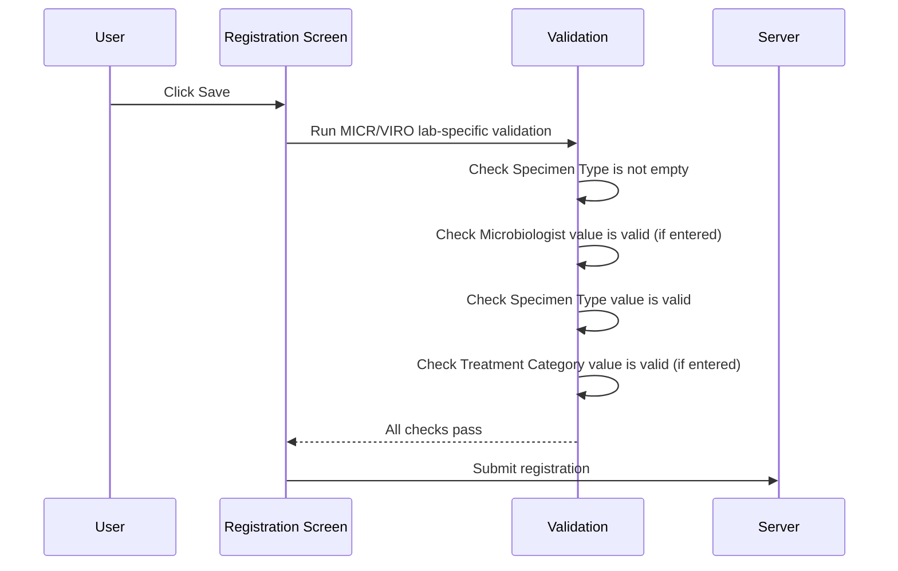
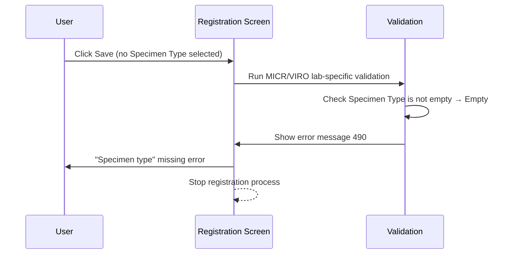
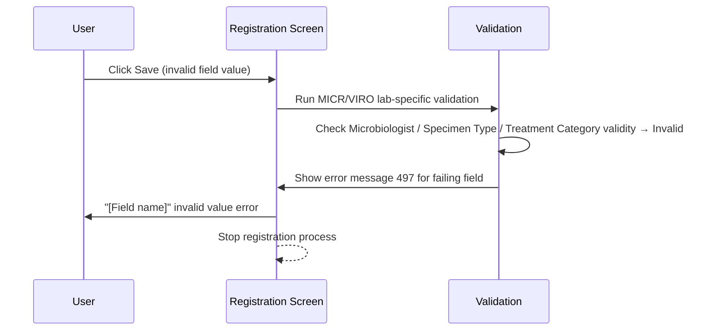

# MICR VIRO Validation

## Overview

When a Microbiology (MICR) or Virology (VIRO) lab request is saved, the system applies additional lab-specific validation checks on top of the standard registration validation. These checks ensure that the Specimen Type, Microbiologist, and Treatment Category fields contain valid values before the request is written to the database. If any check fails, an error message is shown and the registration process is halted.

---

## Related User Stories

- **[[CRST-497]]** — Registration - MICR/VIRO Validation
- **[[CRST-459]]** — Registration - MICR/VIRO Panel
- **[[CRST-124]]** — Registration - Register MICR/VIRO Request

**Epic:** LISP-32 [CRST][DEV] Registration - Special Lab Workflow (MICR/VIRO)

---

## Trigger Point

This validation runs as part of the save sequence when the user clicks **Save** on the Registration screen for a MICR or VIRO request, after the standard registration validations have passed.

---

## Workflow Scenarios

### Scenario 1: All Fields Valid — Registration Proceeds

#### Prerequisites
- The Registration screen is open for a MICR or VIRO lab request.
- The user has entered all required fields including Specimen Type.
- The Microbiologist and Treatment Category fields, if populated, contain valid keyword values.
- The user clicks **Save**.

#### Process Flow

#### Step-by-Step Details

1. The system first checks whether the **Specimen Type** field is empty (no selection made). If it is empty, validation fails immediately (see Scenario 2).
2. If Specimen Type is not empty, the system then runs keyword validity checks on three fields: **Microbiologist**, **Specimen Type**, and **Treatment Category**. A field fails this check if it contains a value that does not correspond to a valid keyword entry (e.g., the user typed a value that does not exist in the keyword list).
3. If all fields pass, the validation step completes successfully and the registration process continues.

---

### Scenario 2: Specimen Type is Empty

#### Prerequisites
- The user did not select a Specimen Type before clicking **Save**.

#### Process Flow

#### Step-by-Step Details

1. The system detects that no Specimen Type has been selected.
2. An error message is shown on the **Specimen Type** field (message code 490, "Specimen type" missing).
3. The registration process stops. No data is saved.
4. The user must select a valid Specimen Type before attempting to save again.

---

### Scenario 3: Microbiologist, Specimen Type, or Treatment Category Contains an Invalid Value

#### Prerequisites
- The user entered or selected a value in one of the dropdown fields (Microbiologist, Specimen Type, or Treatment Category) that does not correspond to a valid keyword.

#### Process Flow

#### Step-by-Step Details

1. The system runs keyword validity checks on Microbiologist, Specimen Type, and Treatment Category in sequence.
2. For the first field found to contain an invalid value, an error message is shown (message code 497, identifying the field by name).
3. The registration process stops. No data is saved.
4. The user must correct the invalid field before attempting to save again.

---

## Summary Tables

### Validation Rules

| Check | Field | Condition that fails | Error Message Code | Effect |
|-------|-------|---------------------|-------------------|--------|
| Specimen Type not empty | Specimen Type | No value selected | 490 | Registration stopped |
| Microbiologist valid | Microbiologist | Value entered is not a valid keyword | 497 | Registration stopped |
| Specimen Type valid | Specimen Type | Value entered is not a valid keyword | 497 | Registration stopped |
| Treatment Category valid | Treatment Category | Value entered is not a valid keyword | 497 | Registration stopped |

---

## Error Messages and System Prompts

| Message Code | Description | Trigger | User Options |
|--------------|-------------|---------|-------------|
| 0000490 | Missing required field: Specimen Type | Specimen Type field is empty on save | OK (dismiss; field retains focus) |
| 0000497 | Invalid value in field | Microbiologist, Specimen Type, or Treatment Category contains an invalid keyword value | OK (dismiss; registration stops) |

---

## Business Rules

1. Specimen Type must be selected before a MICR/VIRO request can be saved; an empty Specimen Type always fails validation.
2. The validity check on Microbiologist, Specimen Type, and Treatment Category applies to the keyword value itself — if the user types a string that does not match any keyword in the list, the field is considered invalid.
3. These lab-specific validation checks run in addition to the standard registration validations, not instead of them.
4. Validation is evaluated in order: empty check first, then validity checks. The first failure stops the process.

---

## Related Workflows

- [[MICR VIRO Panel]] — The panel whose fields are validated by this workflow.
- [[Register MICR VIRO Request]] — The data conversion step that follows successful validation.
