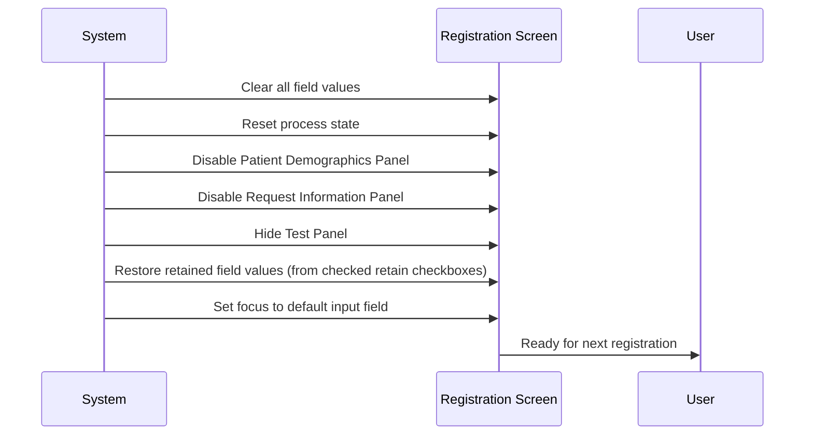
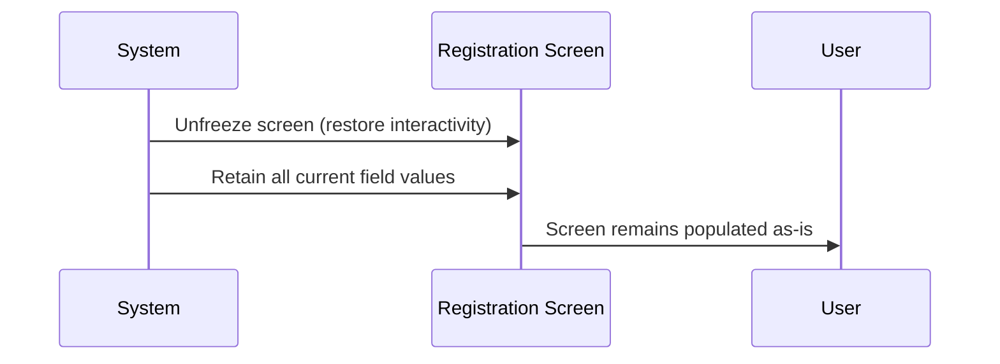

# Clear Screen

## Overview

After a request has been successfully registered and saved, the Registration screen clears itself to allow the user to register the next request. All fields are cleared except those whose corresponding retain checkboxes are ticked. The screen is then reset to its default opening state — panels disabled, fields blank and in their default editable states, and focus placed on the configured default input field. If registration fails for any reason, the screen is not cleared; the user remains on the populated screen and focus is directed to assist with correction.

---

## Related User Stories

- **[[CRST-111]]** - Registration - Post-register: Clear Screen
- **[[CRST-116]]** - Registration - Screen Object Focus

**Epic:** LISP-27 [CRST][DEV] Registration - Post Register

---

## Key Concepts

### Retain Checkboxes
A group of checkboxes on the Registration screen that allows the user to nominate specific fields whose values should be preserved after a successful save. Checked fields are not cleared when the screen resets. The available retain fields are configured per lab via the Object Attribute setup (function = RETAIN). Each checkbox group corresponds to one retainable field or set of related fields.

### Default Focus Field
The field that receives keyboard focus when the Registration screen opens or resets. Configured per lab via the `DEFAULT_TAB_ORDER_HKID` lab option: if the option value is 1, focus defaults to the **HKID** field; otherwise it defaults to the **Encounter No.** field.

### Screen Reset State
After a successful save and clear, the screen returns to its initial state: the Registration Keys Panel is editable, patient demographics and request information panels are disabled, and the Test Panel is hidden. This mirrors the state the screen is in when it is first opened.

---

## Trigger Point

This workflow is the final user-facing step in the registration save sequence. It is triggered immediately after the screen has been unfrozen following a successful save (step 15 of the save sequence, after **[[Register Request]]**).

---

## Workflow Scenarios

### Scenario 1: Successful Registration — Clear and Reset

#### Prerequisites
- The request has been successfully submitted to the server.
- The success confirmation message has been dismissed by the user.
- Any post-registration processing (label printing, worksheet printing) has completed.

#### Process Flow

#### Step-by-Step Details

1. All input fields on the Registration screen are cleared, including the **Encounter No.**, **Request No.**, **HKID**, all patient demographic fields, all request information fields, and all test selections.

2. The **Collection Date/Time** and **Arrival Date/Time** fields are also cleared as part of the full field reset.

3. The screen panels are returned to their default disabled/hidden state:
   - The **Patient Demographics Panel** is visible but disabled.
   - The **Request Information Panel** is visible but disabled.
   - The **Test Panel** is hidden.
   - The **Save** button is disabled.
   - The **Clear** and **Exit** buttons remain enabled.

4. The retain checkboxes themselves are **not** reset — they remain in whatever state the user last set them.

5. The system restores the values of any fields whose retain checkboxes are currently checked. For example, if the **Doctor** retain checkbox is ticked, the doctor code is repopulated in the **Doctor** field after the clear.

   > **Note:** If the last registered request belonged to an existing patient, patient demographic fields (Encounter No., HKID, Patient Name, Chinese Name, Sex, Date of Birth, Age, Patient Location, Patient Category, Bed, Admission Date, MRN, Race) are excluded from retain restoration — their values are not carried forward even if they are nominally selected for retain. This prevents stale patient details from being pre-filled for the next request.

6. The **Encounter No.** field is monitored: if restoring retain values results in an Encounter No. being repopulated (e.g., because it was previously retained), the system treats this as a new Encounter No. entry and triggers the patient lookup flow automatically.

7. Focus is set to the configured default input field for the screen's initial state:
   - If the **Default Tab Order (HKID)** lab option is set to enabled, focus is placed on the **HKID** field.
   - Otherwise, focus is placed on the **Encounter No.** field.

---

### Scenario 2: Registration Failure — No Clear

#### Prerequisites
- The save process encountered an error at any step (validation failure, server error, user cancellation of a required confirmation, etc.).
- The screen has been unfrozen (returned to interactive state).

#### Process Flow

#### Step-by-Step Details

1. When the save sequence fails at any step, the screen is unfrozen and returned to interactive mode.

2. All field values remain exactly as the user entered them — **no fields are cleared**.

3. The retain checkbox values are unaffected.

4. If the failure occurred during the **validation** step, focus is directed to the first field that failed validation, so the user can immediately correct it.

5. If the failure occurred during another step (e.g., server communication error, user cancelled a dialogue), focus returns to the default focus field for the current screen state, but the screen content remains intact for the user to review and re-attempt the save.

---

## Summary Tables

### Clear vs. Retain Behaviour After Successful Save

| Field Category | Cleared on Success | Retain Checkbox Available | Retain Skipped for Existing Patient |
|---|---|---|---|
| Encounter No. | Yes | Configurable | Yes |
| Request No. | Yes | Configurable | Yes (key field) |
| HKID | Yes | Configurable | Yes |
| Patient Name | Yes | Configurable | Yes |
| Patient Chinese Name | Yes | Configurable | Yes |
| Patient Sex | Yes | Configurable | Yes |
| Date of Birth / Age | Yes | Configurable | Yes |
| Patient Location | Yes | Configurable | Yes |
| Patient Category | Yes | Configurable | Yes |
| Bed No. | Yes | Configurable | Yes |
| Admission Date | Yes | Configurable | Yes |
| MRN | Yes | Configurable | Yes |
| Race | Yes | Configurable | Yes |
| Doctor | Yes | Configurable | No — retained even for existing patients |
| Clinical Detail | Yes | Configurable | No — retained even for existing patients |
| Collection Date/Time | Yes | Configurable | Per retain config |
| Arrival Date/Time | Yes | Configurable | Per retain config |
| Test selections | Yes | Configurable | Per retain config |
| Retain checkboxes | **Not cleared** | N/A | N/A |

### Default Focus After Clear

| Configuration | Default Focus Field |
|---|---|
| Default Tab Order (HKID) option = enabled | HKID |
| Default Tab Order (HKID) option = disabled / not configured | Encounter No. |

### Focus Progression After Field Entry

| Action | Next Focus Field |
|---|---|
| Encounter No. or HKID entered and patient identified | Request No. |
| Valid Request No. entered — new patient | Patient Name |
| Valid Request No. entered — existing patient | Field configured with Object Attribute order = 999 |

---

## Configuration

| Setting | Option Code | Purpose | Effect when enabled | Effect when disabled |
|---------|------------|---------|--------------------|--------------------|
| Default Tab Order (HKID) | `DEFAULT_TAB_ORDER_HKID` | Controls whether the HKID field or Encounter No. field receives focus when the screen resets | Focus set to HKID field | Focus set to Encounter No. field |
| Retain Component Logging | `RETAIN_COMPONENT_LOG_ENABLED` | Controls whether retain component values are written to the application debug log after each save | Retained field names and values logged at debug level | No retain logging |

> Retain field configuration (which fields are available as retain checkboxes) is defined in the **Object Attribute** setup for the RETAIN function group, not in `LAB_OPTION`.

---

## Business Rules

1. The screen is only cleared after a **successful** registration. Any failure at any step of the save sequence prevents the clear from occurring.
2. Retain checkbox states are **never** cleared by a successful save — the user's retain preferences persist until they manually change them or click the **Clear** button.
3. When the user manually clicks the **Clear** button (outside of the save sequence), retain values are also restored after the clear, in the same way as after a successful save. Clicking Clear displays message **648** ("Clear current record?") and requires user confirmation.
4. For **existing patients**, patient demographic fields are excluded from retain restoration, even if those fields are configured as retainable. This prevents stale patient details from persisting across requests for different patients.
5. For **new patients**, patient demographic fields are not excluded — retained values may be restored if configured.
6. If restoring retain values causes the **Encounter No.** field to be repopulated, the system automatically initiates the patient lookup as though the user had entered the encounter number manually.
7. The set of retainable fields is configured per lab via the **Object Attribute** setup. Changes to this configuration take effect immediately when the lab's dictionary is refreshed.
8. The default focus field (HKID or Encounter No.) is determined by the `DEFAULT_TAB_ORDER_HKID` lab option. If the option is absent or not set to enabled, focus defaults to **Encounter No.**

---

## Related Workflows

- [[Register Request]] — The clear screen workflow is the final step (step 15) in the full registration save sequence.
- [[Clear Button]] — The manual clear action available at any time. Performs the same field reset as the post-save clear, but requires user confirmation first.
- [[Screen Object Focus]] — The focus progression rules (default focus, post-encounter focus, post-request-no focus) are defined as part of this related workflow.
- [[Registration Worksheet Printing]] — Occurs in the save sequence immediately before the clear step.
- [[Request No Label Printing]] — Occurs earlier in the save sequence (within post-registration processing) before the clear step.
