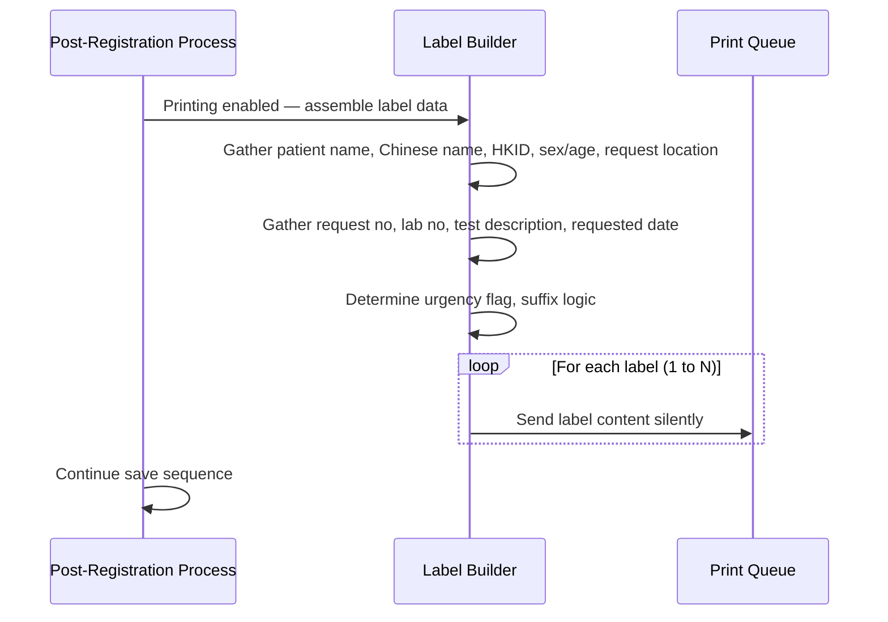
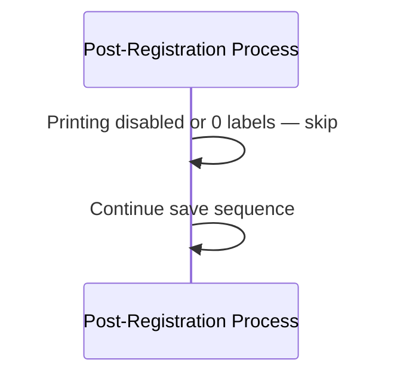

# Request No Label Printing

## Overview

After a registration request is successfully saved, the system can automatically print one or more Request Number labels if this feature is enabled for the hospital and lab. The label carries key patient and request information in a compact format suitable for physical attachment to specimens or request forms. The number of labels to print is selected by the registration staff before clicking Save. If the feature is disabled or zero labels are requested, no label is produced.

---

## Related User Stories

- **[[CRST-510]]** - Registration - Post-register: Request No. Label Printing

**Epic:** LISP-27 [CRST][DEV] Registration - Register Workflow

---

## Key Concepts

### Number of Labels Field
A numeric input field on the Registration screen, visible only when label printing is enabled for the current lab. The staff member sets this to the desired number of labels (0 to 10) before clicking Save. Zero means no label is printed.

### Label Suffix
When more than one label is requested, each printed label carries a distinct suffix appended to the Request Number: `-A` for label 1, `-B` for label 2, and so on up to `-J` for label 10. If only one label is requested, no suffix is appended.

### Test Description
A comma-delimited string of the test codes included in the registration. Limited to 15 characters. If the combined length is 15 characters or fewer, an asterisk (`*`) is appended. If it exceeds 15 characters, only the first 15 characters are shown without an asterisk.

### Site Description *(APS lab only)*
A comma-delimited string of the test sites included in an APS registration. Limited to 20 characters after trimming. If the combined length is 20 characters or fewer, an asterisk (`*`) is appended. If it exceeds 20 characters, only the first 20 characters are shown without an asterisk.

### Print Queue
Labels are sent to the workbench's default print queue (`wf1` from the workbench configuration). No print dialogue is shown; printing is silent.

---

## Trigger Point

This workflow is part of the **post-registration process**, executed immediately after the registration has been successfully saved and after any server-side post-registration processing. It runs once per save, printing all requested labels in sequence before the save sequence continues.

---

## Workflow Scenarios

### Scenario 1: Labels Printed Successfully

#### Prerequisites
- The **Request No Label Printing** lab option is enabled for the current hospital and lab.
- The staff member has set the Number of Labels field to a value of 1 or more.
- The registration has been saved successfully.

#### Process Flow

#### Step-by-Step Details

1. After successful registration, the system checks whether Request No Label Printing is enabled for the current lab. If not enabled, this step is skipped entirely.

2. The system reads the Number of Labels value selected by the staff member. If the value is 0, this step is skipped.

3. The system assembles the label data from the registered request (see [[#Label Content]]).

4. For each label from 1 to N (where N is the number requested):
   - The Request Number is formatted as `*[Request No][Suffix]*`, where the suffix is blank if only one label is requested, or `-A`, `-B`, `-C` … `-J` for labels 1–10 respectively when more than one label is requested.
   - The label is sent to the workbench print queue silently.

5. If a Chinese name is present for the patient, it is encoded into the label format with Unicode supplementary character support. If no Chinese name exists, the Chinese name area on the label is left blank.

6. Labels are queued internally and printed one at a time in sequence. Each label waits for the previous one to finish before printing.

---

### Scenario 2: Feature Disabled or Zero Labels Selected

#### Prerequisites
- Either: the **Request No Label Printing** lab option is not configured (or not set to enabled), OR the staff member has selected 0 labels.

#### Process Flow

#### Step-by-Step Details

1. The system checks the lab option. If not enabled, label printing is skipped with no message to the user.
2. If enabled but the Number of Labels field is 0, label printing is also skipped with no message.
3. The save sequence continues normally.

---

## Label Content

The following information is printed on each Request Number label:

| Field | Content | Formatting Rule |
|---|---|---|
| Patient Name | Patient's full name | As-is |
| Patient Chinese Name | Patient's Chinese name, decoded from CCC code with Unicode supplementary character support | Left blank if no Chinese name |
| HKID | Patient's Hong Kong Identity Card number | As-is |
| Sex / Age | Sex and age, formatted as `[Sex]/[Age][Age Unit in lowercase]` | Sex is blank if null; Age is blank if null; Age Unit is blank if null |
| Request Location | Hospital, specialty, and ward, formatted as `[Hospital]/[Specialty]/[Ward]` | Right-aligned to label width |
| Lab No | Lab number of the request | As-is |
| Request No | Request number, surrounded by `*` on both sides; with label suffix when more than one label is requested | Format: `*[Request No][Suffix]*` |
| Urgency | Urgency indicator | Displays `U` at the top-right if the request is urgent |
| Requested Date | Current server date and time at the moment of printing | Formatted as `dd/MM/yy` |
| Test Description | Comma-delimited test codes | Trimmed to first 15 characters; `*` appended if ≤ 15 chars |
| Site Description | Comma-delimited test sites *(APS lab only)* | Trimmed to first 20 characters after whitespace trimming; `*` appended if ≤ 20 chars |
| Barcode | Barcode representation of the Request Number | Printed below the human-readable request number |

---

## Label Suffix Reference

| Number of Labels Requested | Label 1 | Label 2 | Label 3 | … | Label 10 |
|---|---|---|---|---|---|
| 1 | *(no suffix)* | — | — | — | — |
| 2 or more | `-A` | `-B` | `-C` | … | `-J` |

---

## Configuration

| Setting | Option Code | Option Group | Purpose | Effect when enabled | Effect when disabled |
|---|---|---|---|---|---|
| Request No Label Printing | `MANUAL_PRINT_LABNO_LABEL_ENABLED` | `REQUEST_REGISTRATION` | Controls whether the Number of Labels field is shown and whether labels are printed after registration | Number of Labels field is visible on screen; labels are printed after successful save | Field is hidden; no labels are printed regardless of the field value |

---

## Business Rules

1. Request No Label Printing is **disabled by default**. It must be explicitly enabled via the `MANUAL_PRINT_LABNO_LABEL_ENABLED` lab option.
2. If the Number of Labels field is set to 0, no labels are printed even when the feature is enabled.
3. The label suffix (`-A`, `-B`, etc.) is only applied when **more than one** label is requested. A single-label print has no suffix.
4. The Request Number on each label is always bracketed by `*` characters: it begins and ends with `*`.
5. The Test Description is capped at 15 characters. If the comma-delimited test codes fit within 15 characters, a `*` is appended to signal completeness. If they exceed 15 characters, the text is truncated and no `*` is appended.
6. The Site Description *(APS only)* is capped at 20 characters after trimming. The same `*` completeness rule applies.
7. The Requested Date printed on the label is the current **server** date and time at the moment of printing — not the request date entered on screen.
8. Patient Chinese names are encoded for Unicode supplementary characters (extended CJK support). If no Chinese name is present, the Chinese name area is left blank rather than omitted.
9. Labels are printed silently to the workbench's default print queue. No print dialogue is shown to the user.
10. If multiple labels are queued, they are printed one at a time in sequence; each label waits for the previous one to complete before printing.

---

## Related Workflows

- [[Register Request]] — Label printing is triggered after the registration request has been saved successfully to the server.
- [[Knowledge Base/01_Screens/Registration/Workflows/Pre-Register/Registration Worksheet Printing]] — Also triggered as part of the post-registration process; runs before label printing in the save sequence.
