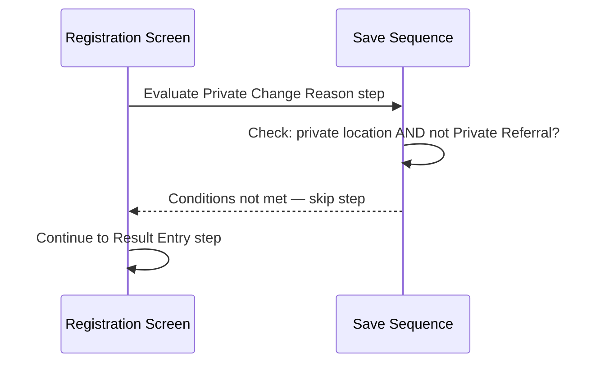
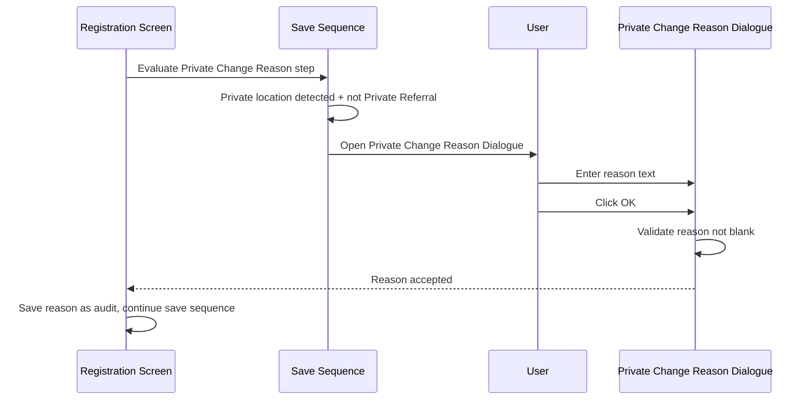
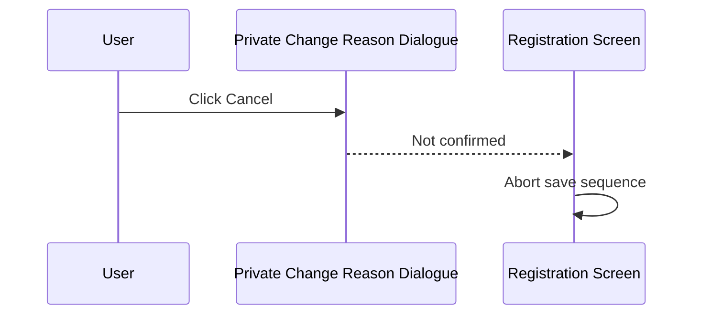

# Private Change Reason Dialogue

## Overview

The Private Change Reason Dialogue is a modal dialogue that appears during the Registration save sequence when the user has selected a private location in the **Report Location** field but has **not** set the privacy status of the request to "Private Referral". Because private locations are expected to carry private referral status, any deviation from this expectation must be justified. The dialogue prompts the user to enter a free-text reason explaining why the privacy status was not set to "Private Referral". The reason is recorded as an audit trail alongside the saved registration. If the user cancels the dialogue, the entire save sequence is aborted.

---

## Related User Stories

- **[[CRST-509]]** - Registration - Pre-register: Private Change Reason Dialogue

**Epic:** LISP-27 [CRST][DEV] Registration - Register Workflow

---

## Key Concepts

### Private Location
A location flagged in the system configuration as a "private" location. When such a location is selected in the **Report Location** field, the system expects the request's **Lab Only / Privacy** field to be set to "Private Referral".

### Privacy Status — "Private Referral"
One of the selectable values in the **Lab Only / Privacy** field (keyword group `PRIVATE_RQ`). When selected, it indicates that the request is a private referral and suppresses it from standard lab-only reporting.

### Private Referral Audit
A free-text field recorded on the registration when the user bypasses the expected "Private Referral" privacy status. It provides an auditable explanation for the exception.

---

## Trigger Point

This dialogue is included in the Pre-Register save sequence, positioned **after the Private Referral Validation step** (part of `validate`) and **before the Result Entry step**. It is triggered only when both of the following conditions are true at save time:

1. The **Report Location** field contains a location marked as private.
2. The **Lab Only / Privacy** field is **not** set to "Private Referral".

If either condition is not met, this step is silently skipped and the save sequence continues.

---

## Workflow Scenarios

### Scenario 1: Conditions Not Met — Step Skipped

#### Prerequisites
- The selected Report Location is **not** a private location, **OR**
- The Lab Only / Privacy field **is** set to "Private Referral".

#### Process Flow

#### Step-by-Step Details

1. The system checks whether the Report Location is a private location.
2. If not a private location, or if the Lab Only / Privacy field is already set to "Private Referral", the check passes silently.
3. The save sequence proceeds to the next step.

---

### Scenario 2: Private Location Selected Without "Private Referral" — Dialogue Shown

#### Prerequisites
- The Report Location is a private location.
- The Lab Only / Privacy field is not set to "Private Referral".

#### Process Flow

#### Step-by-Step Details

1. The system detects that the Report Location is private and the privacy status is not "Private Referral".
2. The **Private Change Reason Dialogue** opens as a modal dialogue.
3. The dialogue displays:
   - **Title:** "Reason for the change"
   - **Prompt:** "Please input the reason for the change of "Private" from the default of a Private Location:"
   - A multi-line text input area
   - An **OK** button and a **Cancel** button
4. The text input area receives keyboard focus automatically when the dialogue opens.
5. The user types their reason into the text area.
6. The user clicks **OK**.
7. If the text area is blank, an error message is shown (message 0004000 — "{0} cannot be blank", where {0} is "Private") and the dialogue remains open.
8. If the text area contains text, the dialogue closes and the entered reason is stored as the **Private Referral Audit** value on the registration.
9. The save sequence proceeds to the Result Entry step.

---

### Scenario 3: User Cancels the Dialogue — Save Aborted

#### Prerequisites
- The Private Change Reason Dialogue has been opened (Scenario 2 conditions apply).
- The user clicks **Cancel** (or closes the dialogue without confirming).

#### Process Flow

#### Step-by-Step Details

1. The user clicks **Cancel** on the Private Change Reason Dialogue.
2. The dialogue closes without saving any reason.
3. The save sequence is aborted. The registration is not saved.
4. The Registration screen remains open with the entered data intact, allowing the user to adjust the privacy status or report location and attempt to save again.

> **Note:** Cancelling this dialogue aborts the entire save. There is no way to proceed with the save without either (a) providing a reason, or (b) correcting the privacy status to "Private Referral" before saving.

---

## Summary Tables

### Trigger Conditions

| Report Location | Lab Only / Privacy | Dialogue Shown? |
|---|---|---|
| Private location | "Private Referral" | No — save proceeds |
| Private location | Any other value (including blank) | Yes — reason required |
| Non-private location | Any value | No — save proceeds |

### User Actions and Outcomes

| User Action | Dialogue Behaviour | Save Outcome |
|---|---|---|
| Enters reason and clicks OK | Reason validated; dialogue closes | Save proceeds with reason recorded |
| Clicks OK with blank reason | Error message 0004000 shown; dialogue stays open | Save blocked until reason is entered |
| Clicks Cancel | Dialogue closes without saving reason | Entire save sequence aborted |

---

## Data Saved

When the dialogue is confirmed with a non-blank reason, the text is stored as the **Private Referral Audit** field on the registration record. This field is passed through the save packing to the server and persisted as part of the registration.

---

## Error Messages

| Message Code | Text | Trigger | User Options |
|---|---|---|---|
| 0004000 | "{0} cannot be blank" (shown as "Private cannot be blank") | User clicks OK with an empty reason text area | Dismiss and enter a reason |

---

## Position in Save Sequence

The Private Change Reason step occupies the following position in the Registration save sequence:

1. Freeze screen
2. Reset request labs
3. Gather server information for validation
4. Convert data for save
5. Validate
6. **Private Change Reason Dialogue** ← this step
7. Result Entry Dialogue
8. Verification Dialogue
9. Process Save
10. Save screen values to param
11. Post-registration process
12. Print registration worksheet
13. Unfreeze screen
14. Clear screen
15. Retain screen values from param
16. Return to screen

---

## Business Rules

1. The Private Change Reason check is performed every time the user saves a registration. It is not a one-time check — if a private location is still selected and the privacy status is not "Private Referral" at save time, the dialogue will appear again.
2. The reason text must be non-blank. A reason consisting only of whitespace is treated as blank and rejected.
3. The reason is stored as a free-text audit field; there is no length restriction enforced by the dialogue itself (the text area is a standard comment area).
4. Cancelling the dialogue aborts the entire save sequence, not just this step. The user must re-attempt the full save.
5. The dialogue is reused across saves — once created, the same dialogue instance is shown again on subsequent saves if the conditions are met, but the text area is not pre-populated with the previous reason.
6. The Private Referral Audit field is cleared (set to null) each time the save sequence begins, ensuring only the reason from the current save attempt is stored.

---

## Related Workflows

- [[Pre-Register Save Sequence]] — The Private Change Reason Dialogue is one step in the overall save sequence, positioned between Validation and Result Entry.
- [[Result Entry on Save]] — The step that follows immediately after the Private Change Reason step when result entry is also required.
- [[Send Out Information Dialogue]] — Another save-sequence step that also appears in the stepper for the same save operation.
