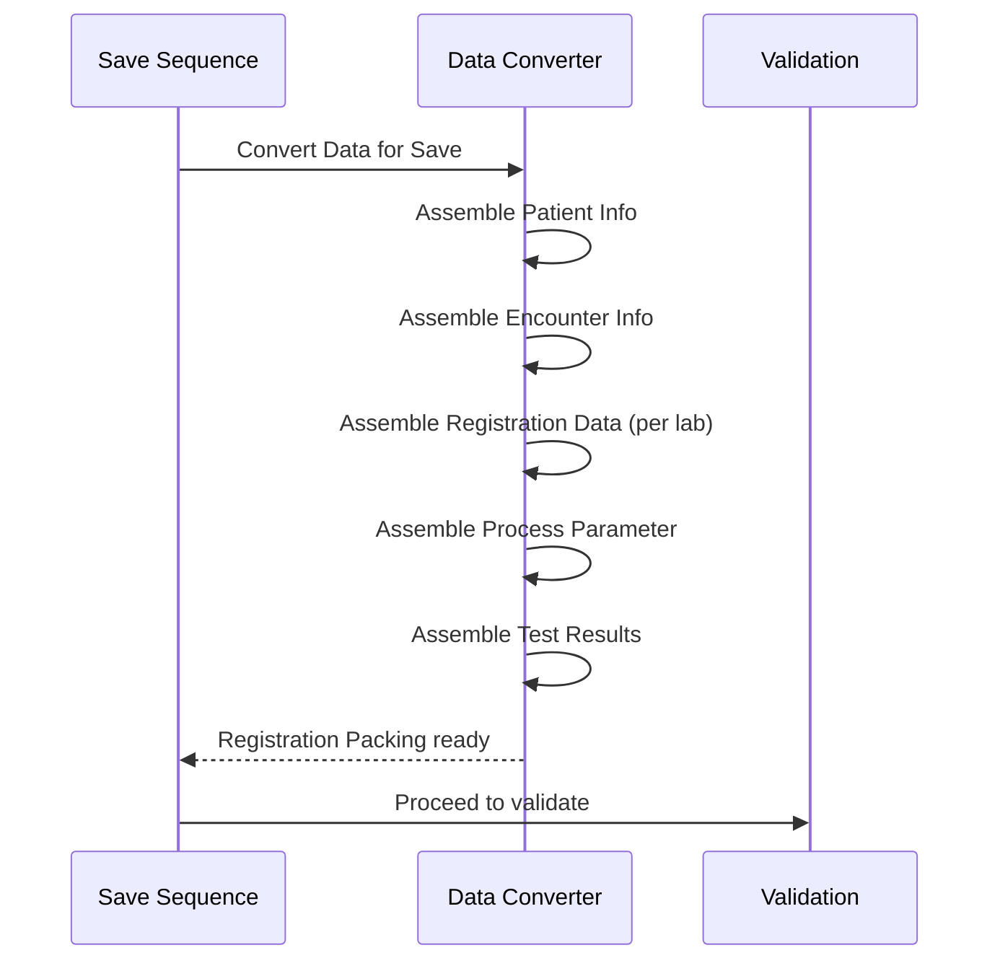

# Register Request

## Overview

When a registration staff member clicks **Save**, the system converts all data entered on the Registration screen into a structured package and submits it to the server for persistence. This conversion step — referred to as "constructing the Registration Packing" — assembles patient identity, encounter details, request profile details, registration data, process parameters, and any test results entered at the point of registration into a single unit. If the patient is new and came from the external patient index (PMI), and the staff member has the appropriate access right, the system also updates the patient's name, race, and Chinese name in PMI as part of the same operation.

---

## Related User Stories

- **[[CRST-108]]** - Registration - Register Request

**Epic:** LISP-27 [CRST][DEV] Registration - Register Workflow

---

## Key Concepts

### Registration Packing
The complete data structure submitted to the server when a registration is saved. It contains all sub-structures listed in this document and is assembled in memory before any server call is made.

### New Patient
A patient whose HKID does not yet exist in the local patient records. For new patients, a separate Patient structure is included in the packing so the server can create the patient record.

### PMI Patient
A new patient whose data was loaded from the external patient index (PMI). If the user modifies the patient's name, race, or Chinese name on the Registration screen and has the right to edit PMI data, those changes are written back to PMI as part of the save.

### %-Prefixed Encounter Number
An encounter number beginning with the `%` character is a system-generated encounter number. For such encounters, the `createBy` and `updateBy` fields are not carried forward from existing patient data.

### Report Copies
The set of locations to which the request report should be sent. This always includes at least one primary report copy (derived from the report destination). Additional report copy locations entered on screen are also included.

### PHLC Lab Order
Some send-out requests are routed to the Public Health Laboratory Centre (PHLC). If this feature is enabled and the send-out destination matches, the packing includes a flag instructing the server to create a PHLC lab order.

---

## Trigger Point

This step runs as **step 4 of the Pre-Register save sequence**, after server-side validation data has been gathered and before the validation step. It converts the current state of all screen fields into the server-ready data structure. No data is sent to the server at this point — the packing is only assembled here for use in later steps.

---

## Workflow Scenario: Constructing the Registration Packing

### Prerequisites
- The user has clicked **Save**.
- Earlier save steps (freeze, reset, gather server information) have completed successfully.

### Process Flow

### Step-by-Step Details

1. The system records the current date and time as the **Registered Date/Time**.
2. All patient, encounter, request, and process data is read from the screen fields and from the patient data loaded earlier in the session.
3. The assembled packing is held in memory and passed through the remainder of the save sequence.
4. After the Verification step, the packing is submitted to the server.
5. The server persists the registration. If the server indicates that the request number format is invalid, **message 3758** is shown and the save is treated as failed. Any other server failure also aborts the save.
6. On success, any post-registration processing continues.

---

## Data Assembled

### Patient Identity

| Field | Source |
|---|---|
| HKID | As entered in the HKID field on screen |
| HKID Key | Patient's HKID key (loaded when patient was retrieved) |
| Sex | As selected on screen |
| Date of Birth | Derived from the DOB/Age/Age Unit field |
| Age | Derived (calculated from DOB, or entered directly if no DOB) |
| Age Unit | Enter code of the selected Age Unit (from keyword group `AGE_UNIT`) |
| Name | New patient: as entered on screen; Existing patient: from patient record |
| Address | New patient: null; Existing patient: from patient record |
| Race | New patient: as selected on screen; Existing patient: from patient record |
| Chinese Name (CCC Code) | New patient: encoded from the Chinese Name field; Existing patient: from patient record |
| Death | New patient: derived from whether Date of Death is present; Existing patient: from patient record |
| Date of Death | New patient: as entered on screen; Existing patient: from patient record |
| Confidentiality | New patient: as selected on screen; Existing patient: from patient record |
| Exact DOB | New patient: null; Existing patient: from patient record |

### Encounter Identity

| Field | Source |
|---|---|
| Encounter Number | As entered on screen |
| Patient Hospital | Hospital code from the Patient Location field |
| Encounter Key | New patient: null; Existing patient: from patient record |
| Is Active | New patient: null; Existing patient: from patient record |

### Encounter Details

| Field | Source |
|---|---|
| Admission Date | New patient or patient with no existing admission date: from the Admission Date field on screen; Existing patient with admission date: carried from patient record unchanged |
| Ward / Hospital / Specialty | Determined by patient location logic (see [[#Patient Location Logic]]) |
| Bed | As entered on screen |
| Category | Alpha2 value of the selected category on screen |
| MRN | As entered on screen |
| Attend Doctor | New patient: null; Existing patient: from patient record |
| Encounter Type | New patient: null; Existing patient: from patient record |
| Create Date / Update Date | New patient: null; Existing patient: from patient record |
| Create By / Update By | New patient: null; Existing patient with %-prefixed encounter: null; Existing patient otherwise: from patient record |
| Discharge Date / Discharge Code | New patient: null; Existing patient: from patient record |
| Create WS / Update WS | New patient: null; Existing patient: from patient record |
| Risk | New patient: null; Existing patient: from patient record |
| Ward Class | New patient: null; Existing patient: from patient record |

### Request Profile Details *(one entry per test per lab)*

| Field | Source |
|---|---|
| Extra Add | Fixed value: 0 |
| Alpha Code | Test profile code. For APS: if the code has prefix `FF_`, the prefix is removed before saving |
| Lab Number | Lab number of the test |
| Registered Date | Registered Date/Time (step 1 above) |
| Request Number | The request number assigned earlier in the save sequence |

### Registration Data — Request Detail

| Field | Source |
|---|---|
| Request Doctor | Doctor Location ID from the Doctor field |
| Request Doctor Name | Doctor name from the Doctor field |
| Request Doctor Department | Doctor department from the Doctor field |
| Request Specialty | Specialty from the Request Location field. If no specialty found, the unknown specialty (key 0) of the request hospital is used |
| Request Location | Location ID from the Request Location field. If not found, the unknown location (key 0) of the request hospital is used |
| Collection Date | As entered in the Collection Date field |
| Arrival Date | As entered in the Arrival Date field |
| Request Date | As entered in the Request Date field |
| Effective Date | Always null (system default) |
| Urgency | Alpha2 of the selected urgency keyword |
| Request Category | Derived from the Category field; adjusted to request category rules |
| Confidentiality | As converted from the Confidential field |
| Retention | Fixed value: 0 (system default) |
| Report Destination | Derived from the patient category (see [[#Report Destination Derivation]]) |
| Age Value | Calculated from the DOB/Age fields |
| Bill | Alpha2 of the selected bill keyword; defaults to 0 if blank |
| Lab Only | Alpha2 of the Lab Only field; defaults to 0 (normal) if blank |
| Authorize Doctor | Unknown authorize doctor (key 0) of the request location hospital |
| Registered Date | Registered Date/Time |
| Complete | Fixed value: 0 |
| Diagnosis | Null |
| Amend | Fixed value: 0 |

### Registration Data — Request Data

| Field | Source |
|---|---|
| Clinical Details | As entered in the Clinical Details field |
| Comment | As entered in the Comment field. If the Test Valid Period check was bypassed and a bypass comment exists, it is appended to the comment |
| Doctor Reference | As entered in the Reference field |

### Report Copies

| Field | Source |
|---|---|
| Primary Report Copy | Derived from the Report Destination and the patient's location |
| Additional Report Copies | Each non-blank Report Copy Location entered on screen, each assigned the corresponding request ID |

### Process Parameter

| Field | Source |
|---|---|
| Is Print Form Checkbox Checked | Only true for send-out requests where the print form checkbox is checked |
| Is Test Valid Period Check Bypassed | Status from the Test Valid Period validation step |
| Is Test Validity Check Bypassed | Status from the Test Validity validation step |
| Is Confirmed Lab Only Request | Whether the staff confirmed a lab-only request flag |
| Tests Bypassing Test Valid Period Check | List of tests for which the valid period check was bypassed |
| Tests Bypassing Test Validity Check | List of tests for which the validity check was bypassed |
| Is PMI Service Not Available | Whether PMI was unavailable during this session |
| System Generated Request Date/Time | System-generated request date/time (if applicable) |
| System Generated Arrival Date/Time | System-generated arrival date/time (if applicable) |
| Private Referral Audit | The reason text entered in the [[Private Change Reason Dialogue]] (if triggered) |
| Is Create PHLC Lab Order | True only if: the request is a send-out, the Create PHLC Lab Order option is enabled, and the send-out destination is PHLC |

### Test Results

Any test results entered via the [[Result Entry on Save]] dialogues during this save session are included in the packing.

### New Patient Structure *(new patients only)*

If the patient is new, both the encounter info and patient info assembled above are also included in a separate New Patient field within the packing. The server uses this to create the patient and encounter records.

---

## Patient Location Logic

The ward, specialty, and hospital sent as the patient's location are determined as follows:

1. If the Patient Location field has a ward or specialty entered, **or** the patient's hospital differs from the current lab's hospital, use the values from the Patient Location field.
2. Otherwise, if the **Copy Request Location to Patient Location** option is enabled (default: enabled), use the values from the Request Location field.
3. Otherwise, use the values from the Patient Location field (which may be blank).

> **Note:** The "Copy Request Location to Patient Location" behaviour is the **default**. It is only disabled when the `COPY_REQ_LOCN_TO_PAT_LOCN_DISABLED` lab option is explicitly set to 1.

---

## Report Destination Derivation

The report destination is derived from the patient's encounter category (in-patient, A&E, out-patient, etc.) using the standard report destination mapping rules. If no patient category is available (new patient), the default destination is used.

---

## PMI Patient Update *(new PMI patients only)*

If all of the following conditions are true, the patient's details are written back to PMI as part of the save:

1. The patient is new (first registration in the system).
2. The patient's data was originally loaded from PMI.
3. The current user has the access right to edit PMI patient data (`u_lis_obj_hkpmi_security_check`).

The following PMI fields are updated:

| PMI Field | Updated To |
|---|---|
| Name | As entered in the Patient Name field |
| Race | As selected in the Race field |
| Chinese Name (CCC Code) | Encoded from the Chinese Name field |

An audit text is generated for each field that changed (before → after), and included in the packing alongside the acting user and authorisation identity.

---

## Configuration

| Setting | Option Code | Option Group | Purpose | Effect when enabled | Effect when disabled |
|---|---|---|---|---|---|
| Copy Request Location to Patient Location | `COPY_REQ_LOCN_TO_PAT_LOCN_DISABLED` | `REQUEST_REGISTRATION` | Controls whether the patient location is populated from the request location when no explicit patient location is set | *Disabled* option = 1 → patient location is **not** copied from request location | Option absent or not 1 → patient location **is** copied from request location (default behaviour) |
| Create PHLC Lab Order | `CREATE_PHLC_LAB_ORDER_REG` | `SEND_OUT` | Controls whether a PHLC lab order is created for eligible send-out requests | PHLC lab order flag set in packing when send-out destination matches | No PHLC lab order created |
| Edit PMI Patient Data | *(source: access right `u_lis_obj_hkpmi_security_check`)* | — | Controls whether the current user can write patient changes back to PMI | PMI update included in packing | PMI update not included |

---

## Business Rules

1. The registration packing is assembled entirely in memory at the point of saving. No data is written to the server until the `processSave` step, which follows the Verification step.
2. The Registered Date/Time is always the current system time at the moment the save sequence begins — it is not taken from any field on screen.
3. For existing patients, most patient and encounter fields are carried forward from the patient record as loaded. Only fields the user can actively change on screen (age, category, bed, MRN, etc.) are taken from screen values.
4. For encounters starting with `%`, the `createBy` and `updateBy` fields are set to null, even if the patient record contains these values. This preserves the generated nature of such encounters.
5. The `Lab Only` field defaults to 0 (normal) if no value is selected. The `Bill` field also defaults to 0.
6. Each lab in the request produces a separate registration entry within the packing. The report copies are cloned per lab, each carrying the corresponding request ID.
7. If the Test Valid Period check was bypassed and a bypass comment exists, that comment is appended to the standard comment field rather than stored separately.
8. PMI patient updates are only triggered for new patients whose data came from PMI and only when the access right is granted. Updates to existing patient records do not trigger PMI writes.
9. The `APS` lab removes any `FF_` prefix from test alpha codes before including them in the request profile details. Other labs include the alpha code as-is.

---

## Related Workflows

- [[Pre-Register Save Sequence]] — Register Request is step 4 (Convert Data for Save) and step 10 (Process Save) of the save sequence.
- [[Private Change Reason Dialogue]] — The private referral audit text captured here is included in the Process Parameter of the packing.
- [[Result Entry on Save]] — Test results captured in Result Entry dialogues are included in the packing's test results list.
- [[Verification Dialogue]] — The packing is submitted to the server immediately after the Verification step confirms the registration.
- [[Registration Worksheet Printing]] — After the request is saved successfully, the system determines and prints any configured Registration Worksheets as step 13 of the save sequence.
