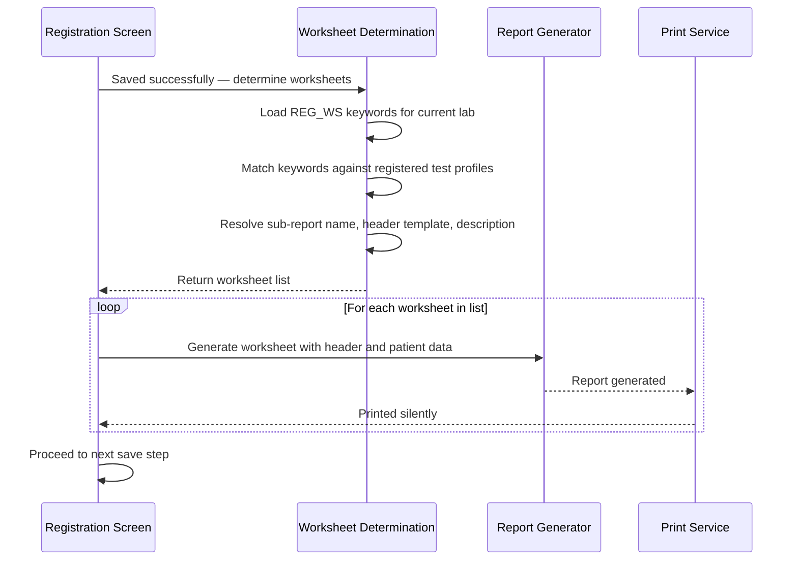
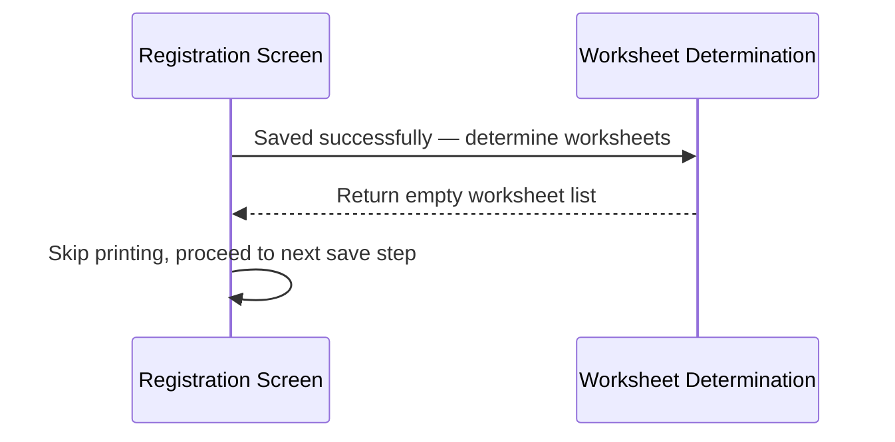
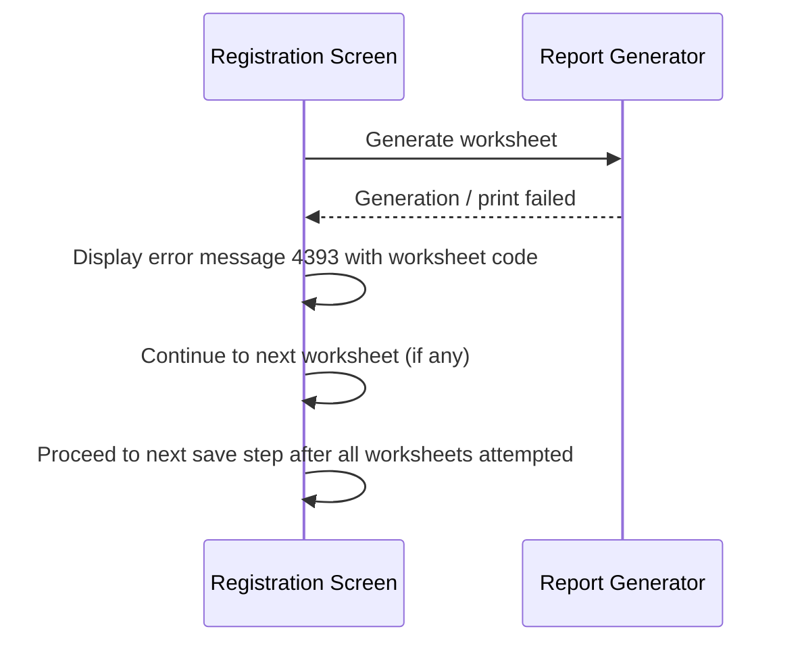

# Registration Worksheet Printing

## Overview

After a registration request is successfully saved, the system automatically determines whether any Registration Worksheets need to be printed for the tests that were registered. If worksheets are configured for the test profiles included in the request, the system generates and silently prints each worksheet in sequence. This workflow ensures that lab staff have the physical worksheet they need to accompany a specimen for specific tests. If printing fails for any worksheet, the user is notified with an error message identifying the affected worksheet.

---

## Related User Stories

- **[[CRST-109]]** - Registration - Post-register: Worksheet Printing

**Epic:** LISP-27 [CRST][DEV] Registration - Register Workflow

---

## Key Concepts

### Registration Worksheet
A printed document generated after registration that accompanies a specimen to the lab. Each worksheet corresponds to a specific test profile or to all registrations at a lab, depending on setup.

### Keyword Group `REG_WS`
The system-level keyword group that maps test profile codes to worksheet codes. Each active keyword entry in this group defines one worksheet rule. The two rule types are:
- **TEST** — the worksheet is printed only when a specific test profile code is included in the registration.
- **ALL** — the worksheet is printed for every registration at that lab, regardless of test profile.

### Worksheet Code
The business code identifying a specific worksheet design, stored in the keyword's second alpha field. This is also used to look up the sub-report name and header template from lab options.

### Sub-Report Name
The Jasper sub-report file name for the worksheet body content. Retrieved from a lab option keyed by the worksheet code. If not configured, no worksheet is produced for that worksheet code.

### Header Template
The Jasper template file name for the worksheet header. Resolved by a three-tier fallback: worksheet-specific lab option → generic lab option → default template `RegWorksheetHeader`.

### Sub-Report Repository
The filesystem path where Jasper sub-report files are stored. Retrieved from a lab option. Defaults to `/appl/lis/project_files/crs_6` if not configured.

---

## Trigger Point

This workflow is triggered automatically after the registration request has been successfully saved to the server. It is part of the post-registration processing phase, executed before Request No Label Printing in the save sequence.

---

## Workflow Scenarios

### Scenario 1: Worksheets Determined and Printed

#### Prerequisites
- Save button has been clicked and the registration request has been saved successfully.
- At least one active keyword entry exists in the `REG_WS` keyword group for the current lab.
- For **TEST**-type keywords: at least one test profile code in the registered request matches the keyword's test profile code.
- For **ALL**-type keywords: the keyword applies unconditionally.
- The sub-report name lab option is configured for the matching worksheet code.

#### Process Flow

#### Step-by-Step Details

1. After successful registration, the system loads the active keyword entries for the `REG_WS` keyword group, filtered to the lab number of the current request.

2. The system iterates through these keyword entries and checks each against the test profiles included in the registered request:
   - If the keyword type is **TEST**, the worksheet is included only if the keyword's test profile code matches one of the registered test profile codes.
   - If the keyword type is **ALL**, the worksheet is included unconditionally.
   - If a worksheet code has already been added to the print list (duplicate), it is skipped.

3. For each matching keyword, the system resolves the worksheet setup:
   - **Sub-Report Name:** Retrieved from the lab option `REG_WORKSHEET_SUB_REPORT_<worksheet code>` in option group `FRONT_END_REPORT`. If not found or blank, the worksheet is excluded from printing.
   - **Header Template (worksheet-specific):** Retrieved from the lab option `REG_WORKSHEET_HEADER_<worksheet code>` in option group `FRONT_END_REPORT`. Used only if found and not blank.
   - **Worksheet Description:** Taken from the keyword description field.

4. A global **Header Template** and **Sub-Report Repository** are resolved from lab options for the current lab (see Configuration section) and applied to all worksheets unless overridden at the worksheet level.

5. For each worksheet in the final list, the system assembles the worksheet data including patient and request information (see [[#Worksheet Data Fields]]) and sends it to the backend for report generation.

6. Each generated report is printed silently (without a print dialogue) in sequence. The system waits for each print to complete before printing the next worksheet.

7. If all worksheets are printed successfully, the save sequence proceeds normally.

---

### Scenario 2: No Worksheets Required

#### Prerequisites
- Save button has been clicked and the registration request has been saved successfully.
- Either: no active keyword entries exist in the `REG_WS` keyword group for the current lab, OR none match the registered test profiles, OR all matching keywords have no sub-report name configured.

#### Process Flow

#### Step-by-Step Details

1. The system performs the same keyword lookup and matching as Scenario 1.
2. If no worksheets qualify, the system skips the printing step entirely with no message to the user.

---

### Scenario 3: Worksheet Printing Fails

#### Prerequisites
- At least one worksheet has been determined for printing.
- The backend report generation or print service returns a failure for one or more worksheets.

#### Process Flow

#### Step-by-Step Details

1. If the backend report generation or print service fails for a worksheet, the system displays error message **4393** identifying the specific worksheet code that failed.
2. The user dismisses the error message.
3. The system continues to the next worksheet in the list. A failed worksheet does not abort printing of the remaining worksheets.
4. After all worksheets have been attempted, the save sequence proceeds to the next step normally.

---

## Summary Tables

### Worksheet Inclusion Rules

| Keyword Type | Condition for Inclusion |
|---|---|
| TEST | The registered request includes the test profile code specified in the keyword's first alpha field |
| ALL | Always included for any registration at the current lab |

*Each worksheet code is included at most once per save, even if multiple keywords reference the same code.*

### Header Template Resolution (Three-Tier Fallback)

| Priority | Source | Option Code | Option Group |
|---|---|---|---|
| 1 (highest) | Worksheet-specific lab option | `REG_WORKSHEET_HEADER_<worksheet code>` | `FRONT_END_REPORT` |
| 2 | Generic lab option | `REG_WORKSHEET_HEADER` | `FRONT_END_REPORT` |
| 3 (default) | Built-in system default | *(N/A)* | Uses template `RegWorksheetHeader` |

### Worksheet Data Fields

| Field | Source |
|---|---|
| Lab No | Lab number of the registered request |
| Request No | Assigned request number |
| Patient Name | Patient name from registration |
| HKID | Patient Hong Kong Identity Card number |
| Encounter No | Encounter number from registration |
| Ward / Bed / Specialty | Patient location ward, bed, and specialty |
| Collection Date | Collection date and time |
| Admission Date | Patient admission date |
| Pay Code | Encounter pay category |
| Sex / Age / Age Unit | Patient sex, age value, and age unit |
| Date of Birth | Patient date of birth |
| Requesting Doctor / Request Location | Requesting doctor name and request location display text |
| Report Location | Report destination display text |
| Clinical Detail | Clinical details from registration |

### Error Messages

| Message | Description | Trigger | User Options |
|---|---|---|---|
| 4393 | Worksheet printing failed — includes the worksheet code | Backend report generation or print service fails | OK (dismiss; printing continues for remaining worksheets) |

---

## Configuration

| Setting | Option Code | Option Group | Purpose | Effect when configured | Effect when not configured |
|---|---|---|---|---|---|
| Sub-Report Name (per worksheet) | `REG_WORKSHEET_SUB_REPORT_<worksheet code>` | `FRONT_END_REPORT` | Specifies the Jasper sub-report file for a worksheet's body | Worksheet is included in the print list | Worksheet is excluded from printing even if keyword matches |
| Worksheet-specific Header Template | `REG_WORKSHEET_HEADER_<worksheet code>` | `FRONT_END_REPORT` | Overrides the header template for a specific worksheet | This template is used for that worksheet | Falls through to generic header or built-in default |
| Generic Header Template | `REG_WORKSHEET_HEADER` | `FRONT_END_REPORT` | Default header template when no worksheet-specific template is configured | Used for all worksheets without a specific header option | System uses built-in default `RegWorksheetHeader` |
| Sub-Report Repository | `REG_WORKSHEET_SUB_REPORT_DIR` | `FRONT_END_REPORT` | File system path to the Jasper sub-report files | Path is used for all worksheets | Defaults to `/appl/lis/project_files/crs_6` |
| Worksheet Keyword Rules | *(source: `REG_WS` keyword group — managed via keyword maintenance)* | — | Maps test profile codes to worksheet codes | Worksheets triggered per configured rules | No worksheets are printed |

---

## Business Rules

1. Worksheet determination and printing occurs only after the registration request has been successfully saved to the server.
2. Each worksheet code is printed at most once per registration save, even if multiple keyword entries reference the same worksheet code.
3. A worksheet is only included if its sub-report name is configured. A matching keyword without a sub-report name configuration does not produce a worksheet.
4. The header template follows a three-tier fallback: worksheet-specific option → generic option → built-in default `RegWorksheetHeader`.
5. Worksheets are printed silently in sequence (no print dialogue is shown).
6. A failed worksheet print does not abort the save sequence or the printing of subsequent worksheets. The user is notified of each failure individually via message 4393.
7. Worksheet printing is lab-specific: keyword rules and lab options are loaded for the lab number of the registered request.
8. For CRS deployments, the backend resets the lab context to the specific lab number before generating the report.

---

## Related Workflows

- [[Register Request]] — Worksheet printing is triggered after the registration request has been successfully saved to the server.
- [[Request No Label Printing]] — Also part of post-registration processing; runs after worksheet printing in the save sequence.
