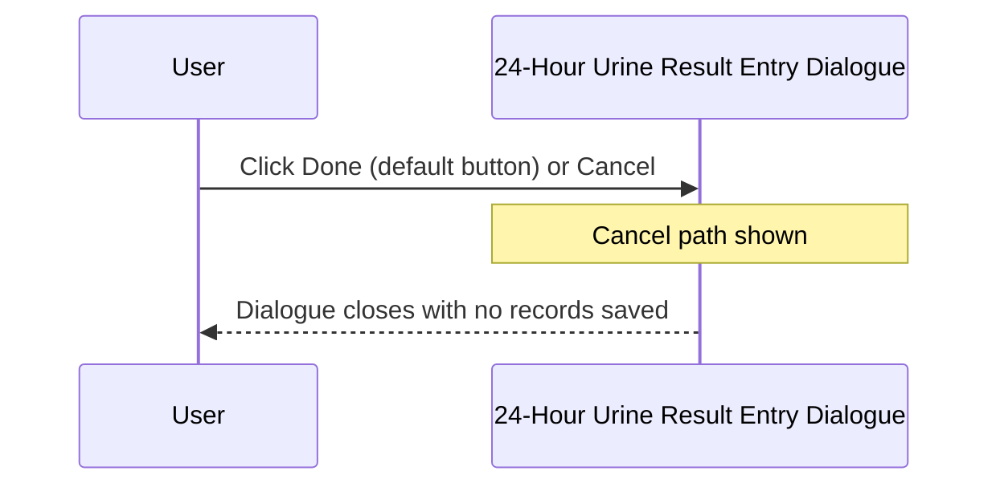

# 24-Hour Urine Result Entry Dialogue

## Overview

The 24-Hour Urine Result Entry Dialogue (titled "Urine Test Specific") is a compact modal dialogue used to capture a **Urine Volume** measurement for 24-hour urine collection tests at the point of registration. Unlike the CRCL urine variant, this dialogue presents a **free-text numeric input field** rather than a keyword combo box, reflecting that 24-hour collections always produce a measured numeric volume. The dialogue is opened during the registration save workflow when a request includes a test whose specimen is configured to trigger 24-hour Urine result entry (`w_lis_ur_24hr_popup`). If the urine test is not configured for the current lab, the dialogue closes silently.

---

## Related User Stories

- **[[CRST-561]]** - Registration - Result Entry (24URINE)
- **[[CRST-246]]** - Specimen Ack - Result Entry (24URINE)

**Epic:** LISP-27 [CRST][DEV] Registration - Register Workflow

---

## Key Concepts

### isDefaultAsSpot = false
For the 24-hour Urine dialogue, the Urine Volume is always presented as a **free-text numeric input**, not a keyword combo box. This is because a 24-hour collection is never a "spot" sample — it produces a measured volume that must be typed in.

### isSkipZeroSpot = false
A Urine Volume of zero or blank is **not** silently skipped for this dialogue. If the field is empty or non-numeric, an error is shown and the dialogue remains open.

### isValueDividedByThousand = false
The value entered by the user is stored exactly as typed — it is not divided by 1000 before being saved.

### Urine Volume Unit
The unit label displayed next to the input field (e.g. "mL") is taken from the first element of the `URINE` lab option text array. This unit is purely a display label; the value is stored as a plain number.

---

## Trigger Point

The dialogue is opened from the Registration screen when the operator saves a request that includes an Enter Code mapped to 24-hour Urine result entry (`w_lis_ur_24hr_popup`). It is part of the broader [[Result Entry on Save]] workflow.

---

## Workflow Scenarios

### Scenario 1: Normal Entry — Volume Entered and Saved

#### Prerequisites
- The Urine Volume test is configured for the current lab (either via the `URINE` lab option test code, or via the fallback test key 4204).
- The dialogue is open.

#### Process Flow

```mermaid
sequenceDiagram
    participant User
    participant Dialogue as 24-Hour Urine Result Entry Dialogue
    participant System as Registration System

    User->>Dialogue: Open dialogue (from save workflow)
    Dialogue->>System: Look up Urine Volume test configuration
    System-->>Dialogue: Test found; unit label loaded
    Note over Dialogue: Pre-fill from prior result if available;<br/>set focus to Urine Volume text input
    Dialogue-->>User: Display Urine Volume text input + unit label

    User->>Dialogue: Type numeric Urine Volume value
    User->>Dialogue: Click Done

    Dialogue->>System: Validate input (not blank, numeric)
    System-->>Dialogue: Valid
    Dialogue->>System: Save Urine Volume record to working result table
    System-->>User: Dialogue closes; registration continues
```

#### Step-by-Step Details

1. The dialogue opens and loads the Urine Volume test configuration from the `URINE` lab option:
   - The unit label (e.g. "mL") is taken from the first element of the option text array.
   - The test code is taken from the second element of the option text array. If no test code is defined, the test with key 4204 is used as a fallback.
2. If no urine test can be found (the option text is null and key 4204 does not exist), the dialogue closes silently (see Scenario 3).
3. The dialogue is displayed with a single **"Urine Vol"** bordered section containing:
   - A **Urine Volume** text input field (numeric, approximately 100 pixels wide).
   - A **unit label** to the right of the input, showing the configured unit (e.g. "mL").
4. The combo box variant of the Urine Volume field is hidden — only the text input is shown for 24-hour Urine.
5. If a prior result exists for this test on the current request, the **Urine Volume** field is pre-filled with that value.
6. Focus is set to the **Urine Volume** text input on open.
7. The user types a numeric value and clicks **Done**.
8. The system validates the input:
   - If the field is blank or the value is not a valid number → error message 1579 "Please enter non-zero urine volume !!" is shown; focus returns to the text input; the dialogue remains open.
9. If validation passes, the system constructs a Urine Volume result record using:
   - The request number.
   - The configured Urine Volume test dictionary.
   - The entered numeric value (stored as-is, without division).
   - The authorize flag from the `URINE` lab option.
10. The record is written to the working result table (`TRANS_TESTRSLT_WKT`).
11. The dialogue closes and the registration save workflow continues.

---

### Scenario 2: User Cancels

#### Prerequisites
- The dialogue is open.

#### Process Flow



#### Step-by-Step Details

1. The user clicks **Cancel**.
2. The dialogue closes. No records are written to the working result table.
3. The registration save workflow is interrupted; the request is not saved.

> **Note:** The **Done** button is configured as the default button for this dialogue — pressing Enter activates it.

---

### Scenario 3: Urine Test Not Configured — Silent Close

#### Prerequisites
- The `URINE` lab option text array is null and the fallback test key 4204 does not exist for the current lab.

#### Process Flow


#### Step-by-Step Details

1. The dialogue checks the urine test dictionary on opening.
2. The urine test is null.
3. The dialogue closes silently and the save workflow continues without writing any record.

---

## Visual Layout

The dialogue is titled **"Urine Test Specific"** and is approximately 300 × 220 pixels. It contains a single titled border section:

- **"Urine Vol"** section: a numeric **text input** field (approximately 100 pixels wide) and a **unit label** (e.g. "mL") to its right. The keyword combo box variant of this field is present in the component but hidden for the 24-hour Urine variant.

A **Done** button (left-aligned) and a **Cancel** button (right-aligned) are at the bottom of the dialogue. Done is the default button (activated by pressing Enter).

---

## Buttons and Actions

### Done
- **When visible:** Always visible; configured as the default button (Enter key activates it).
- **What it does:** Validates the Urine Volume input. If valid, saves the result to the working result table and closes the dialogue.

### Cancel
- **When visible:** Always visible.
- **What it does:** Closes the dialogue immediately without saving any result. The registration save workflow is halted.

---

## Error Messages and System Prompts

| Message | Text | Trigger | User Options |
|---------|------|---------|-------------|
| 1579 | "Please enter non-zero urine volume !!" | Urine Volume field is blank or contains a non-numeric value | Dismiss; focus returns to Urine Volume text input |

---

## Summary Tables

### Comparison with Other Urine Dialogue Variants

| Feature | 24-Hour Urine (CRST-561) | CRCL Urine (CRST-559) |
|---------|-------------------------|----------------------|
| Input control | Text input (numeric) | Keyword combo box |
| SPOT/zero skip | No — zero triggers error 1579 | Yes — SPOT/0 silently skipped |
| Value divided by 1000 | No | No |
| Collection Time field | No | Yes (additional CTIME field) |
| Enter Code | `w_lis_ur_24hr_popup` | `w_lis_crcl_popup` |

### Saved Record Fields

| Field | Source |
|-------|--------|
| Request Number | Current registration request |
| Test | Urine Volume test from `URINE` option, or fallback key 4204 |
| Result value | Numeric value entered in the text input (stored as-is) |
| Authorize flag | `URINE` lab option value (boolean) |

---

## Data Sources

| Data | Source |
|------|--------|
| Urine Volume test definition | Test code from `URINE` lab option text array element [1]; fallback to test key 4204 |
| Urine Volume unit label | First element of `URINE` lab option text array ([0]) |
| Authorize flag | `URINE` lab option value (boolean) |
| Prior Urine Volume result | Retrieved from any existing working result for the configured urine test on the same request |

---

## Configuration

| Setting | Option Code | Purpose | Effect when enabled | Effect when disabled |
|---------|------------|---------|--------------------|--------------------|
| Urine Authorize | `URINE` (option_value, group: `REQUEST_REGISTRATION`) | Controls whether the saved Urine Volume result is marked as authorised | Result record is flagged as authorised | Result record is saved without authorisation |
| Urine Unit and Test Code | `URINE` (option_text_array, group: `REQUEST_REGISTRATION`) | Defines the unit label and test code for the Urine Volume field | Unit label shown next to input; specified test code used for saving | Falls back to test key 4204; no unit label configured |

---

## Business Rules

1. For 24-hour Urine, the volume is always entered as a free-text numeric value — the keyword combo box variant of the field is not used.
2. A blank or non-numeric Urine Volume is an error (message 1579) — unlike the CRCL variant, zero and empty values are not silently skipped.
3. The entered volume is stored exactly as typed; no unit conversion (e.g., divide by 1000) is applied.
4. If the `URINE` lab option does not specify a test code, the system falls back to the test with key 4204.
5. If no urine test can be resolved (option null and key 4204 absent), the dialogue closes silently and the save workflow continues without a urine record.
6. If a prior result already exists for the urine test on the same request, the text input is pre-filled with that value when the dialogue opens.
7. The Done button is the default button — pressing Enter submits the form.

---

## Related Workflows

- [[Result Entry on Save]] — The 24-Hour Urine Result Entry Dialogue is invoked as part of the result entry step within the registration save workflow.
- [[CRCL Result Entry Dialogue]] — Also uses `RegRsltEnUrinePm` as its base class for the urine volume portion, but presents the combo box variant and adds a Collection Time field (CRST-559).
- [[TOX Result Entry Dialogue]] — Another specialised result entry dialogue for toxicology specimen type capture (CRST-560).
- [[Fluid Result Entry Dialogue]] — Fluid result entry dialogue (CRST-555).
