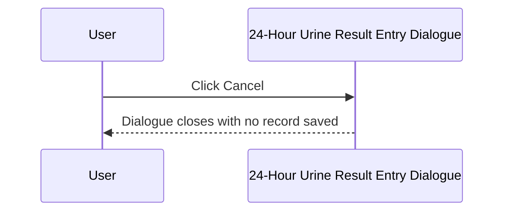
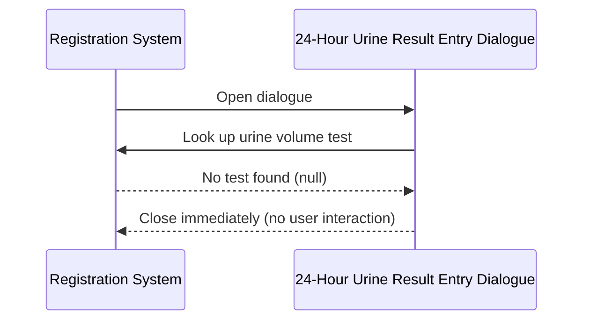

# 24-Hour Urine Result Entry Dialogue

## Overview

The 24-Hour Urine Result Entry Dialogue (titled "Urine Test Specific") is a compact modal dialogue used to capture a **Urine Volume** value at the point of registration for 24-hour urine collection tests. It is opened during the registration save workflow when a request includes a test whose specimen is configured to trigger 24-hour Urine result entry. The user types a numeric volume value into a text input field; the unit label displayed alongside the field is configured per lab. If the urine test cannot be found in the test dictionary, the dialogue closes automatically without prompting the user.

---

## Related User Stories

- **[[CRST-561]]** - Registration - Result Entry (24URINE)
- **[[CRST-246]]** - Specimen Ack - Result Entry (24URINE)

**Epic:** LISP-27 [CRST][DEV] Registration - Register Workflow

---

## Key Concepts

### 24-Hour Urine Volume
The total volume of urine collected over a 24-hour period. Unlike the CRCL or spot-urine dialogues, this dialogue uses a **free-text numeric input** rather than a keyword combo box — the value must be a non-blank, numeric entry.

### URINE Lab Option
A single `LAB_OPTION` row (group: `REQUEST_REGISTRATION`, code: `URINE`) controls three things for this dialogue:
- `option_text[0]` — the unit label displayed next to the input field (e.g., "mL")
- `option_text[1]` — the test code identifying which test to record the result against (if absent, test key 4204 is used as a fallback)
- `option_value` — the authorize flag for the saved result

### Fallback Test Key
If the `URINE` lab option does not specify a test code, the system falls back to test dictionary key **4204** to identify the urine volume test.

---

## Trigger Point

The dialogue is opened from the Registration screen when the operator saves a request that includes an Enter Code mapped to 24-hour Urine result entry (`w_lis_ur_24hr_popup`). It is part of the broader [[Result Entry on Save]] workflow.

---

## Workflow Scenarios

### Scenario 1: Normal Entry — Volume Entered and Saved

#### Prerequisites
- The urine volume test is identifiable (either from the `URINE` lab option test code or fallback key 4204).
- The dialogue is open.

#### Process Flow

```mermaid
sequenceDiagram
    participant User
    participant Dialogue as 24-Hour Urine Result Entry Dialogue
    participant System as Registration System

    User->>Dialogue: Open dialogue (from save workflow)
    Dialogue->>System: Look up urine volume test (from URINE option or fallback key 4204)
    System-->>Dialogue: Test dictionary found; unit label loaded from URINE option
    Dialogue-->>User: Display numeric text input + unit label (e.g. "mL")

    User->>Dialogue: Type urine volume value
    User->>Dialogue: Click Done (or press Enter)

    Dialogue->>System: Validate input (non-blank, numeric)
    System-->>Dialogue: Valid
    Dialogue->>System: Save Urine Volume record to working result table
    System-->>User: Dialogue closes; registration continues
```

#### Step-by-Step Details

1. The dialogue opens and looks up the urine volume test using the test code from the `URINE` lab option (`option_text[1]`). If no test code is configured, test dictionary key 4204 is used instead.
2. If no urine test can be found, the dialogue closes immediately without displaying anything to the user (see Scenario 3).
3. The dialogue is displayed with a single titled border section **"Urine Volume"**, containing:
   - A **numeric text input** field (approximately 100 pixels wide).
   - A **unit label** (approximately 100 pixels wide) to the right of the input, showing the unit loaded from `option_text[0]` of the `URINE` lab option (e.g., "mL").
4. If a prior result exists for this test on the current request, the text input is pre-filled with that value.
5. Focus is set to the text input on open.
6. The user types the urine volume as a numeric value.
7. The user clicks **Done** (or presses Enter, as Done is the default button).
8. The system validates the input:
   - If the field is blank or the value is not a valid number → error message 1579 "Please enter non-zero urine volume!!" is shown; focus returns to the text input; the dialogue remains open.
9. If validation passes, the urine volume record is constructed using the request number, the urine test dictionary entry, the entered value (stored as-is, without unit conversion), and the authorize flag from the `URINE` lab option.
10. The record is written to the working result table (`TRANS_TESTRSLT_WKT`).
11. The dialogue closes and the registration save workflow continues.

---

### Scenario 2: User Cancels

#### Prerequisites
- The dialogue is open.

#### Process Flow



#### Step-by-Step Details

1. The user clicks **Cancel**.
2. The dialogue closes. No record is written to the working result table.
3. The registration save workflow is interrupted; the request is not saved.

---

### Scenario 3: Urine Test Not Found — Silent Close

#### Prerequisites
- The `URINE` lab option specifies no test code and the fallback test key 4204 does not resolve to a valid test for the current lab.

#### Process Flow



#### Step-by-Step Details

1. The dialogue attempts to resolve the urine test from configuration.
2. No valid test is found for the current lab.
3. The dialogue closes silently and the save workflow continues as if the dialogue had been submitted.

---

## Visual Layout

The dialogue is titled **"Urine Test Specific"** and is approximately 300 × 220 pixels. It contains one titled border section:

- **"Urine Volume"** — a numeric text input field (approximately 100 pixels wide) followed by a unit label to its right (e.g., "mL").

> The combo box present in the shared layout is hidden for this dialogue variant. Only the text input is shown.

A **Done** button (left-aligned) and a **Cancel** button (right-aligned) are displayed below the border section. The **Done** button is the default action — pressing Enter activates it.

---

## Buttons and Actions

### Done
- **When visible:** Always visible; also the default button (activated by pressing Enter).
- **What it does:** Validates the urine volume input. If valid, the result record is constructed and saved to the working result list; the dialogue closes.

### Cancel
- **When visible:** Always visible.
- **What it does:** Closes the dialogue immediately without saving any result. The registration save workflow is halted.

---

## Error Messages and System Prompts

| Message | Text | Trigger | User Options |
|---------|------|---------|-------------|
| 1579 | "Please enter non-zero urine volume!!" | Urine volume text input is blank or contains a non-numeric value | Dismiss; focus returns to text input |

---

## Summary Tables

### Behaviour Comparison with Other Urine Dialogue Variants

| Feature | 24-Hour Urine (CRST-561) | CRCL Urine component | Urine (CRST-564) |
|---------|--------------------------|---------------------|-----------------|
| Input control | Text input | Keyword combo | Keyword combo |
| SPOT / 0 silently skipped | No | Yes | No |
| Value divided by 1000 before save | No | No | Varies by variant |
| Validation error | 1579 (blank or non-numeric) | 1560 (invalid keyword) | Varies |
| Default as combo | No (text input shown) | Yes (combo shown) | No |

### Saved Record Fields

| Field | Source |
|-------|--------|
| Request Number | Current registration request |
| Test | Urine volume test (from `URINE` option_text[1] or fallback key 4204) |
| Result value | Numeric value entered in the text input |
| Authorize flag | `URINE` lab option value (boolean) |

---

## Data Sources

| Data | Source |
|------|--------|
| Urine volume test | Test code from `URINE` option_text[1]; fallback to test key 4204 |
| Unit label | First element of `URINE` option_text array (`option_text[0]`) |
| Authorize flag | `URINE` option_value (boolean) |
| Prior result (pre-fill) | Existing working result for the urine test on the same request, if present |

---

## Configuration

| Setting | Option Code | Purpose | Effect when enabled | Effect when disabled |
|---------|------------|---------|--------------------|--------------------|
| Urine Authorize | `URINE` (option_value, group: `REQUEST_REGISTRATION`) | Controls whether the saved result is marked as authorised | Result record is flagged as authorised | Result record is saved without authorisation |
| Urine Unit and Test Code | `URINE` (option_text_array, group: `REQUEST_REGISTRATION`) | Defines the unit label (`[0]`) and test code (`[1]`) for the urine volume field | Configured unit shown; configured test code used | Falls back to test key 4204; no unit label shown |

---

## Business Rules

1. The input field accepts only numeric values. A blank entry or any non-numeric text triggers error message 1579.
2. Unlike some other urine dialogue variants, a value of "0" or a blank entry is **not** silently skipped — it is treated as an error.
3. The entered value is stored as-is in the working result table without unit conversion (not divided by 1000).
4. If no urine test can be resolved for the current lab (from either the option or the fallback key), the dialogue closes silently and the save continues.
5. If a prior result already exists for the urine test on the same request, the text input is pre-filled with that value when the dialogue opens.

---

## Related Workflows

- [[Result Entry on Save]] — The 24-Hour Urine Result Entry Dialogue is invoked as part of the result entry step within the registration save workflow.
- [[CRCL Result Entry Dialogue]] — Uses the same `URINE` lab option for the urine volume component, but shows a keyword combo instead of a text input (CRST-559).
- [[TOX Result Entry Dialogue]] — Another specialised result entry dialogue in the same save workflow (CRST-560).
- [[Fluid Result Entry Dialogue]] — Fluid result entry dialogue (CRST-555).
