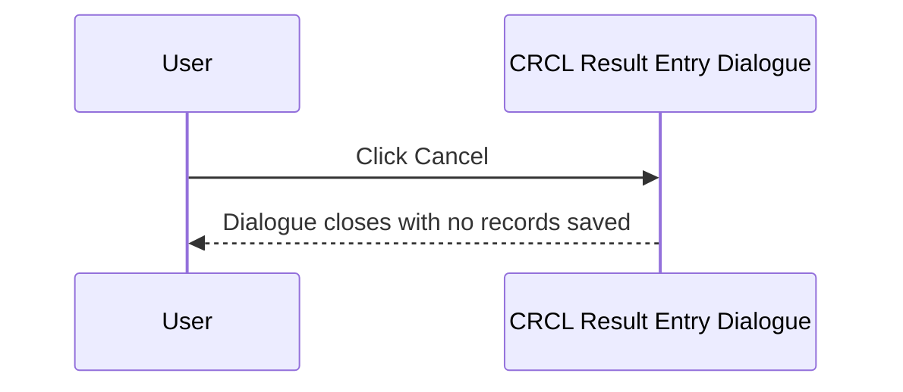
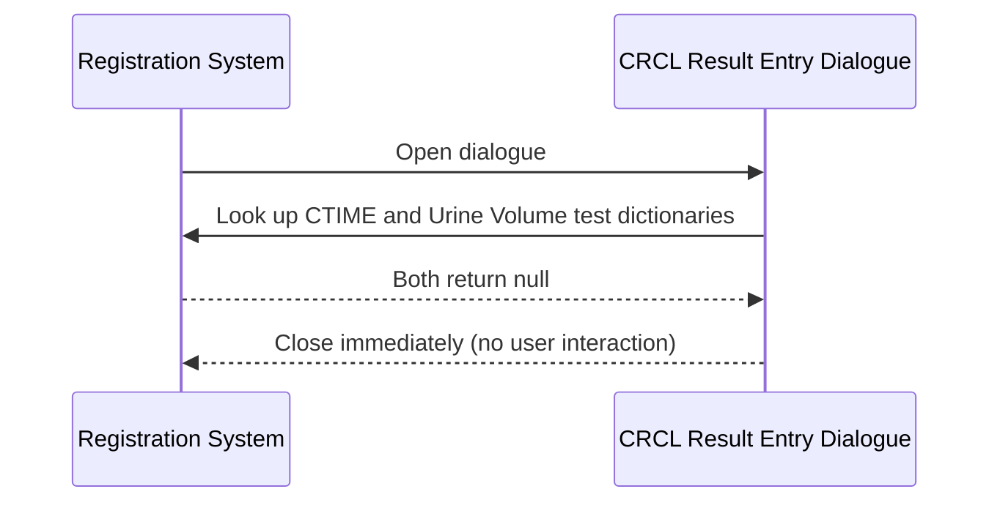

# CRCL Result Entry Dialogue

## Overview

The CRCL Result Entry Dialogue is a compact modal dialogue used to capture two measurements required to calculate Creatinine Clearance (CRCL): a **Urine Volume** and a **Collection Time**. It is opened during the registration workflow when a request includes a test that requires CRCL result entry. The dialogue allows staff to enter or confirm both values before saving them to the working result table. If neither the Collection Time test nor the Urine Volume test is configured for the current lab, the dialogue closes automatically without prompting the user.

---

## Related User Stories

- **[[CRST-559]]** - Registration - Result Entry (CRCL)

**Epic:** LISP-23 [CRST][DEV] Registration - Patient Handling

---

## Key Concepts

### Creatinine Clearance (CRCL)
A kidney function test that requires two inputs: the volume of urine produced over a defined collection period, and the duration of that collection period (in minutes).

### Collection Time (CTIME)
The duration of the urine collection window, always measured in minutes. The test code used for this measurement is hardcoded to `CTIME` — it is not configurable per lab.

### Urine Volume
The total volume of urine collected during the collection period. The unit label (e.g. "mL") and the test code used for this measurement are both configurable per lab via the `URINE` lab option.

### SPOT Value
A keyword value that represents a "spot urine" sample rather than a timed collection. For the CRCL dialogue, a urine value of "SPOT" or "0" is silently skipped — no Urine Volume record is saved — without raising an error.

---

## Trigger Point

The dialogue is opened from the Registration screen when the operator saves a request that includes an Enter Code mapped to CRCL result entry (`w_lis_crcl_popup`). It is part of the broader [[Result Entry on Save]] workflow.

---

## Workflow Scenarios

### Scenario 1: Normal Entry — Both Fields Submitted

#### Prerequisites
- At least one of the two tests (Collection Time or Urine Volume) is configured for the current lab.
- The user has opened the CRCL Result Entry Dialogue.

#### Process Flow

```mermaid
sequenceDiagram
    participant User
    participant Dialogue as CRCL Result Entry Dialogue
    participant System as Registration System

    User->>Dialogue: Open dialogue (from save workflow)
    Dialogue->>System: Check Collection Time and Urine Volume test configuration
    System-->>Dialogue: Return test dictionaries
    Note over Dialogue: Pre-fill fields from prior results if available;<br/>set default Collection Time from lab option
    Dialogue-->>User: Display Urine Volume combo + Collection Time input

    User->>Dialogue: Select Urine Volume value (combo)
    User->>Dialogue: Enter Collection Time (minutes)
    User->>Dialogue: Click Done

    Dialogue->>System: Validate Collection Time (not blank, numeric)
    System-->>Dialogue: Valid
    Dialogue->>System: Validate Urine Volume
    System-->>Dialogue: Valid
    Dialogue->>System: Save Collection Time record to working result table
    Dialogue->>System: Save Urine Volume record to working result table
    System-->>User: Dialogue closes; registration continues
```

#### Step-by-Step Details

1. The dialogue opens and queries the test configuration for both the **Collection Time** (`CTIME`, hardcoded) and the **Urine Volume** test (configured per lab via the `URINE` option).
2. If both tests are unconfigured for the current lab, the dialogue closes immediately without displaying anything to the user.
3. If at least one test is configured, the dialogue is displayed with two sections:
   - **Urine Vol** — a keyword combo box pre-populated with options from the `URINE_SPOT` keyword group, followed by a unit label (e.g. "mL") taken from the `URINE` lab option.
   - **Collection Time for CRCL** — a numeric text input followed by a fixed label "mins".
4. If prior saved results exist for these tests on the current request, both fields are pre-filled with those values.
5. If a default Collection Time is configured via the `CRCL` lab option, the **Collection Time** field is pre-filled with that default (only if not already pre-filled from prior results).
6. Focus is set to the **Urine Volume** combo on open.
7. The user selects a Urine Volume value and enters a Collection Time in minutes.
8. The user clicks **Done**.
9. The system validates the **Collection Time** first:
   - If the field is blank → error message 1558 is shown and the save is aborted.
   - If the value is not a valid number → error message 1559 is shown and the save is aborted.
10. If Collection Time is valid, the system validates the **Urine Volume**:
    - If the selected value is empty or is not a number and is not "SPOT" → error message 1560 is shown.
    - If the value is "SPOT" and the Urine Volume test expects a numeric result, the value is internally converted to `0` before saving.
    - If the value is "SPOT" or "0" and the `isSkipZeroSpot` rule applies (always true for the CRCL dialogue), the Urine Volume record is silently omitted — no error is raised and no record is written for urine.
11. The **Collection Time** record is written to the working result table (`TRANS_TESTRSLT_WKT`) using the `CTIME` test dictionary.
12. If Urine Volume passed validation (and was not silently skipped), the **Urine Volume** record is also written to the working result table using the configured urine test dictionary (or fallback test key 4204 if none is configured).
13. The dialogue closes and the registration save workflow continues.

---

### Scenario 2: User Cancels

#### Prerequisites
- The dialogue is open.

#### Process Flow



#### Step-by-Step Details

1. The user clicks **Cancel**.
2. The dialogue closes. No records are written to the working result table.
3. The registration save workflow is interrupted; the request is not saved.

---

### Scenario 3: No Tests Configured — Silent Close

#### Prerequisites
- Neither the `CTIME` test nor the Urine Volume test is set up for the current lab.

#### Process Flow



#### Step-by-Step Details

1. The dialogue checks both test dictionaries on opening.
2. Both are null (neither test is configured for the lab).
3. The dialogue closes silently and the save workflow continues as if the dialogue had been submitted.

---

## Visual Layout

The dialogue is a small modal window (approximately 300 × 220 pixels) with no title text. It contains two titled border sections stacked vertically:

- **Urine Vol** — contains the Urine Volume keyword combo box (approximately 100 pixels wide) and a unit label to its right showing the configured unit (e.g. "mL").
- **Collection Time for CRCL** — contains a numeric text input (approximately 100 pixels wide) and a fixed label "mins" to its right.

A **Done** button and a **Cancel** button are aligned at the bottom of the dialogue.

---

## Buttons and Actions

### Done
- **When visible:** Always visible.
- **What it does:** Triggers validation and saving of both fields. The Collection Time is validated first; if it fails, the Urine Volume is not evaluated. If all validations pass, both records are written and the dialogue closes.

### Cancel
- **When visible:** Always visible.
- **What it does:** Closes the dialogue immediately without saving any results. The registration save workflow is halted.

---

## Error Messages and System Prompts

| Message | Description | Trigger | User Options |
|---------|-------------|---------|-------------|
| 1558 | Collection Time field is blank | User clicks Done with the Collection Time input empty | Dismiss and correct |
| 1559 | Collection Time is not a valid number | User enters a non-numeric value in the Collection Time field | Dismiss and correct |
| 1560 | Urine Volume value is invalid | Selected urine value is empty, or is neither a number nor "SPOT" | Dismiss and correct |
| 1579 | Urine text value is invalid | Urine Volume entered as free text is blank or non-numeric (not applicable to CRCL, which uses the combo) | Dismiss and correct |

> Note: Messages 1558 and 1560 are displayed inline on the relevant field. The dialogue does not close until the user corrects the input and clicks Done again.

---

## Summary Tables

### Validation Sequence

| Step | Field | Condition | Result |
|------|-------|-----------|--------|
| 1 | Collection Time | Blank | Error 1558; save aborted |
| 1 | Collection Time | Non-numeric | Error 1559; save aborted |
| 1 | Collection Time | Valid number | Proceed to urine validation |
| 2 | Urine Volume | Empty or invalid (not a number, not "SPOT") | Error 1560; save aborted |
| 2 | Urine Volume | "SPOT" or "0" | Silently skipped; no urine record written |
| 2 | Urine Volume | Valid number (or "SPOT" for text result type) | Urine record written |

### Save Sequence

| Order | Record Written | Test Code | Source |
|-------|---------------|-----------|--------|
| 1 | Collection Time | `CTIME` (hardcoded) | Collection Time text input |
| 2 | Urine Volume | Configured per lab (or fallback key 4204) | Urine Volume combo |

---

## Data Sources

| Data | Source |
|------|--------|
| Collection Time test definition | Test dictionary, looked up by hardcoded code `CTIME` for the current lab |
| Urine Volume test definition | Test dictionary, looked up by test code from the `URINE` lab option (`option_text[1]`); falls back to test key 4204 if not configured |
| Urine Volume unit label | First element of the `URINE` lab option text array (`option_text[0]`) |
| Urine Volume keyword list | `URINE_SPOT` keyword group |
| Default Collection Time value | `CRCL` lab option text (`option_text`) |
| Authorize flag | `CRCL` lab option value (boolean) — controls whether the saved result is marked as authorised |
| Prior Collection Time result | Retrieved from any existing working result for `CTIME` on the same request |
| Prior Urine Volume result | Retrieved from any existing working result for the configured urine test on the same request |

---

## Configuration

| Setting | Option Code | Purpose | Effect when enabled | Effect when disabled |
|---------|------------|---------|--------------------|--------------------|
| CRCL Authorize | `CRCL` (option_value, group: `REQUEST_REGISTRATION`) | Controls whether the saved Collection Time result is marked as authorised | Result record is flagged as authorised | Result record is saved without authorisation |
| Default Collection Time | `CRCL` (option_text, group: `REQUEST_REGISTRATION`) | Pre-fills the Collection Time field with a default value | Field is pre-filled on open | Field is empty on open |
| Urine Authorize | `URINE` (option_value, group: `REQUEST_REGISTRATION`) | Controls whether the saved Urine Volume result is marked as authorised | Result record is flagged as authorised | Result record is saved without authorisation |
| Urine Unit and Test Code | `URINE` (option_text_array, group: `REQUEST_REGISTRATION`) | Defines the unit label and test code for the Urine Volume field | Unit label shown next to combo; specified test code used for saving | Falls back to hardcoded test key 4204; no unit label configured |

---

## Business Rules

1. The Collection Time test code is always `CTIME` — it cannot be changed per lab.
2. If both the Collection Time and Urine Volume tests are unconfigured for the current lab, the dialogue closes silently and the save workflow proceeds.
3. Collection Time is validated before Urine Volume. If Collection Time is invalid, the Urine Volume is not evaluated and no records are written.
4. A Urine Volume of "SPOT" or "0" is silently omitted from the save — no error is raised and no Urine Volume record is written for the CRCL dialogue.
5. If the Urine Volume test expects a numeric result type and the user selects "SPOT", the value is internally stored as `0`.
6. If prior results already exist for either test on the same request, both fields are pre-filled with those values when the dialogue opens.
7. The Collection Time record is always written before the Urine Volume record.
8. The authorize flag is shared between both records — it cannot be set independently for Collection Time vs. Urine Volume; however, the authorize flags come from two separate lab options (`CRCL` for CTIME and `URINE` for urine volume).

---

## Related Workflows

- [[Result Entry on Save]] — The CRCL Result Entry Dialogue is invoked as part of the result entry step within the registration save workflow.
- [[Fluid Result Entry Dialogue]] — Another specialised result entry dialogue opened during the same save workflow for Fluid result entry (CRST-555).
- [[TIMH Result Entry Dialogue]] — TIMH result entry dialogue, opened for TIMH-specific tests (CRST-556).
- [[ABG Result Entry Dialogue]] — ABG result entry dialogue for arterial blood gas measurements (CRST-557).
- [[ABG3 Result Entry Dialogue]] — ABG3 result entry dialogue variant (CRST-558).
