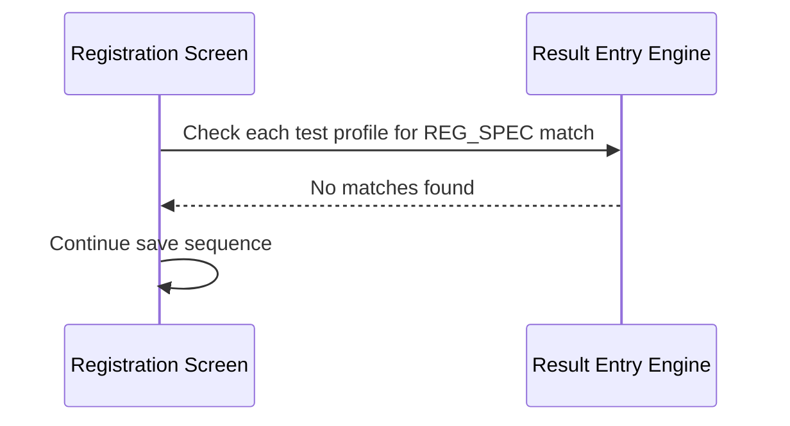
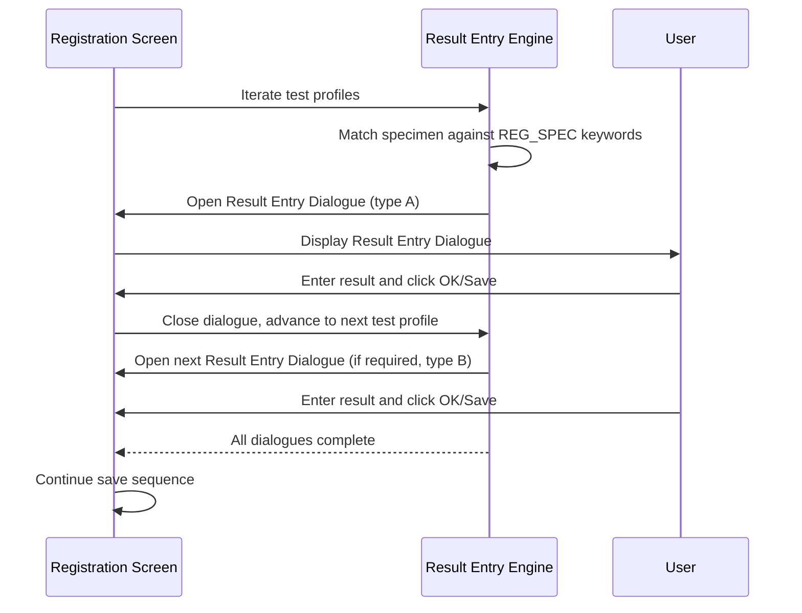
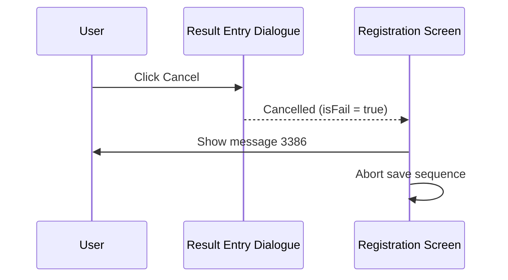

# Result Entry on Save

## Overview

When a registration is saved, the system checks whether any of the requested tests require a result to be entered at the point of registration. If a test's specimen type is configured to trigger Result Entry (via the **REG_SPEC** keyword group), the corresponding Result Entry dialogue is displayed before the registration is committed. Registration staff enter the test result directly into the dialogue; the result is then stored in a pending results queue and processed after registration completes. If the staff cancel the dialogue, the entire registration process is aborted. This workflow applies to specific specimen types — such as body fluids, blood gases, urine, creatinine clearance, and toxicology — where registering the result alongside the specimen is clinically necessary.

---

## Related User Stories

- **[[CRST-105]]** - Registration - Pre-register: Result Entry

**Epic:** LISP-27 [CRST][DEV] Registration - Register Workflow

**Related Result Entry variant stories:**
- [[CRST-555]] — [[Fluid Result Entry Dialogue]]
- [[CRST-556]] — Result Entry (TIMH)
- [[CRST-557]] — Result Entry (ABG)
- [[CRST-558]] — Result Entry (ABG3)
- [[CRST-559]] — Result Entry (CRCL)
- [[CRST-560]] — Result Entry (TOX)
- [[CRST-561]] — Result Entry (24-hour Urine)
- [[CRST-562]] — Result Entry (Urine PYN)
- [[CRST-563]] — Result Entry (Urine QEH)
- [[CRST-564]] — Result Entry (Urine)

---

## Key Concepts

### REG_SPEC Keyword Group
A system keyword group that maps specimen type codes to Result Entry dialogue types. Each keyword in the group has:
- **Alpha2 value:** the specimen type code to match against the registered test's specimen
- **Enter Code:** a comma-delimited string identifying (1) the Result Entry dialogue type and, optionally, (2) a Test Key for specimen type lookup

The system evaluates the specimen of each test profile against this keyword list using the test's lab number. A match means Result Entry is required for that test.

### Enter Code Format
`<Result Entry Class>[,<Specimen Type Test Key>]`

The first part identifies which Result Entry dialogue to show. The second part (optional) identifies the test dictionary key used to determine the specimen type for the dialogue.

### Result Entry Dialogue Types
Each Enter Code maps to a specific dialogue:

| Enter Code | Dialogue Type | Story |
|---|---|---|
| `w_lis_fluid_popup` | [[Fluid Result Entry Dialogue]] | [[CRST-555]] |
| `w_lis_timh_pwh_popup` | TIMH Result Entry | [[CRST-556]] |
| `w_lis_abg_popup` | ABG Result Entry | [[CRST-557]] |
| `w_lis_abg3_popup` | ABG3 Result Entry | [[CRST-558]] |
| `w_lis_crcl_popup` | CRCL (Creatinine Clearance) Result Entry | [[CRST-559]] |
| `w_lis_tox_popup` | Toxicology Result Entry | [[CRST-560]] |
| `w_lis_ur_24hr_popup` | 24-hour Urine Result Entry | [[CRST-561]] |
| `w_lis_ur_pyn_popup` | Urine (PYN) Result Entry | [[CRST-562]] |
| `w_lis_ur_qeh_popup` | Urine (QEH) Result Entry | [[CRST-563]] |
| `w_lis_urine_popup` | Urine Result Entry | [[CRST-564]] |

### Deduplication of Dialogues
If multiple test profiles on the same registration request the same type of Result Entry dialogue (i.e., they share the same Enter Code), the dialogue is shown only once — not once per test profile. The dialogue receives all test profiles as context.

### Pending Results Queue
Accepted results are stored in the `TRANS_TESTRSLT_WKT` table (the "working table"), where they await background processing after the registration is saved. They are not written directly to the final results table at registration time.

---

## Trigger Point

This workflow is initiated during the save sequence, after the **Private Change Reason** step and before the **Verification** step. It runs after all pre-register validations have passed and the registration data has been prepared for saving.

---

## Workflow Scenarios

### Scenario 1: No Tests Require Result Entry — Step Skipped

#### Prerequisites
- None of the registered test profiles have a specimen type that matches any keyword in the REG_SPEC keyword group for the test's lab.

#### Process Flow

#### Step-by-Step Details

1. For each test profile in the request, the system looks up the REG_SPEC keyword list applicable to the test's lab number.
2. Each keyword's Alpha2 value is compared against the test profile's specimen type.
3. If no test profile's specimen matches any REG_SPEC keyword, no Result Entry dialogue is shown.
4. The save sequence proceeds to the Verification step.

---

### Scenario 2: One or More Tests Require Result Entry — Dialogues Shown in Sequence

#### Prerequisites
- At least one registered test profile has a specimen type that matches a keyword in the REG_SPEC keyword group.

#### Process Flow

#### Step-by-Step Details

1. The system iterates through all test profiles in registration order, starting from the first.
2. For each test profile with a non-empty test code, the system looks up the REG_SPEC keyword list for that test's lab.
3. If the test's specimen type matches a keyword's Alpha2 value, the matching keyword's Enter Code is used to determine the Result Entry dialogue type.
4. If the identified dialogue type has not yet been shown during this save (deduplication check), the corresponding Result Entry dialogue is opened.
5. If the Enter Code contains a second part (a Specimen Type Test Key), the system looks up that test in the test dictionary to obtain the specimen type label for display in the dialogue.
6. The dialogue receives the full list of test profiles, the current request number, and any previously entered results as context.
7. The user enters the required result values and confirms (clicks OK, Save, or equivalent).
8. The entered results are collected and added to the results list for this registration.
9. After the dialogue closes, the system advances to the next test profile and repeats the check.
10. If a test profile's Enter Code matches a dialogue type already shown during this save, that dialogue is not shown again — the next test profile is checked instead.
11. Once all test profiles have been processed, the collected results are passed to the save sequence.
12. The save sequence continues to the Verification step.

---

### Scenario 3: User Cancels a Result Entry Dialogue — Registration Aborted

#### Prerequisites
- A Result Entry dialogue has been opened.
- The user clicks the **Cancel** button (or equivalent close action) on the dialogue.

#### Process Flow

#### Step-by-Step Details

1. The user clicks **Cancel** on the Result Entry dialogue.
2. The dialogue closes and signals that the result was not accepted.
3. **Message 3386** is displayed to notify the user that the registration process has been aborted.
4. The save sequence terminates. The registration is not saved.
5. The Registration screen remains open with the data intact, allowing the user to attempt the save again.

> **Note:** Cancelling any single Result Entry dialogue aborts the entire registration save — it is not possible to skip one dialogue and continue to the next.

---

## Summary Tables

### Result Entry Triggering Logic

| Test Profile Condition | Result Entry Required? |
|---|---|
| Specimen type matches a REG_SPEC keyword for the test's lab | Yes — corresponding dialogue shown |
| No specimen type set on the test profile | No |
| Specimen type does not match any REG_SPEC keyword | No |
| Enter Code dialogue type already shown this save | No — deduplicated |

### Outcome by User Action

| User Action | Outcome |
|---|---|
| Enters result and confirms in dialogue | Results collected; next test profile checked; save continues when all done |
| Cancels dialogue | Message 3386 shown; entire save aborted |

---

## Data Sources

| Data | Source |
|---|---|
| REG_SPEC keyword list | System keyword dictionary, filtered by keyword group code `REG_SPEC` and lab number |
| Test specimen type | Test profile information loaded at registration time |
| Specimen Type label (optional) | Retrieved from the test dictionary using the Specimen Type Test Key from the Enter Code |
| Accepted results | Stored in `TRANS_TESTRSLT_WKT` pending results table after save |

---

## Business Rules

1. The Result Entry check is performed once per test profile, in the order the test profiles appear on the registration.
2. The specimen type of each test profile is matched against the REG_SPEC keyword list scoped to that test's lab number. Cross-lab keyword lists are not consulted.
3. The same type of Result Entry dialogue is shown at most once per registration save, regardless of how many test profiles match the same Enter Code. (Deduplication is based on the Enter Code value.)
4. Cancelling any Result Entry dialogue cancels the entire registration. There is no way to proceed without entering the result if one is required.
5. Accepted results are written to the pending results queue (`TRANS_TESTRSLT_WKT`) and are not immediately visible in result reports. They are processed after registration completes.
6. The Result Entry step runs after all pre-register validations have passed. A validation failure earlier in the save sequence means Result Entry dialogues are never shown.
7. The Enter Code in the REG_SPEC keyword may include a second comma-delimited value identifying a test key. When present, this key is used to look up the specimen type label displayed in the dialogue.

---

## System Revamp Notes

> The US explicitly states: *"In the upcoming system, the result entry field will be displayed as an element in a stepper. When multiple test profiles with Result Entry are being registered, multiple Result Entry steps would be implemented in the stepper."*

In the current system, each Result Entry dialogue is a sequential modal pop-up. In the revamped system, these should be implemented as steps in a stepper component, with one step per distinct Result Entry type required by the registration.

---

## Related Workflows

- [[Pre-Register Save Sequence]] — Result Entry is one step in the overall save sequence, positioned after Private Change Reason and before Verification.
- [[Fluid Result Entry Dialogue]] — Detail for Fluid Result Entry (CRST-555).
- [[CRST-556]] — TIMH Result Entry dialogue detail.
- [[CRST-557]] — ABG Result Entry dialogue detail.
- [[CRST-558]] — ABG3 Result Entry dialogue detail.
- [[CRST-559]] — CRCL Result Entry dialogue detail.
- [[CRST-560]] — Toxicology Result Entry dialogue detail.
- [[CRST-561]] — 24-hour Urine Result Entry dialogue detail.
- [[CRST-562]] — Urine (PYN) Result Entry dialogue detail.
- [[CRST-563]] — Urine (QEH) Result Entry dialogue detail.
- [[CRST-564]] — Urine Result Entry dialogue detail.
