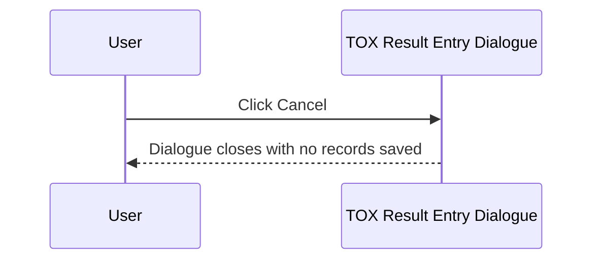
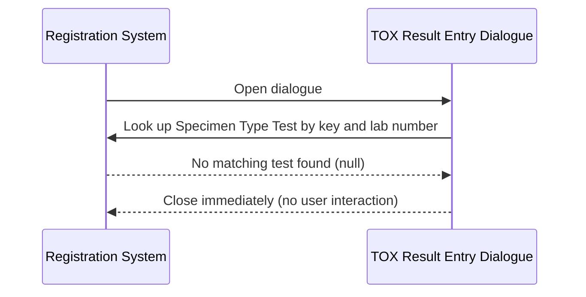

# TOX Result Entry Dialogue

## Overview

The TOX Result Entry Dialogue (titled "TRL Test Specific") is a modal dialogue used to capture the **Specimen Type** and an optional **Specimen Description** for toxicology (TOX) tests at the point of registration. It is opened during the registration save workflow when a request includes a test whose specimen is configured to trigger TOX result entry. The user selects the specimen type from a keyword-driven drop-down list and may optionally enter a free-text description. If the specimen type test cannot be matched to the current lab's test dictionary, the dialogue closes automatically without prompting the user.

---

## Related User Stories

- **[[CRST-560]]** - Registration - Result Entry (TOX)
- **[[CRST-245]]** - Specimen Ack - Result Entry (TOX)

**Epic:** LISP-27 [CRST][DEV] Registration - Register Workflow

---

## Key Concepts

### Specimen Type Test Key
A test dictionary key passed as the second part of the REG_SPEC Enter Code (e.g., `w_lis_tox_popup,<testKey>`). The system uses this key to look up a test in the test dictionary. The **attribute** field of that test defines which keyword group populates the Specimen Type drop-down. The **key** value of that test is used to verify the test exists in the current lab's test dictionary.

### Specimen Type Keyword Group
The keyword group code is taken from the `attribute` field of the Specimen Type Test. The drop-down is populated with all keywords in this group, filtered to the current lab. Only keyword items with a valid (positive) key value are accepted as valid selections.

### Specimen Description
A free-text field (up to 255 characters) allowing the user to enter additional description for the specimen type. This field is optional — it can be left blank. Its value is stored alongside the specimen type in the working result record.

---

## Trigger Point

The dialogue is opened from the Registration screen when the operator saves a request that includes an Enter Code mapped to TOX result entry (`w_lis_tox_popup,<specimenTypeTestKey>`). It is part of the broader [[Result Entry on Save]] workflow. The Specimen Type Test Key must be included in the Enter Code; without it, the test dictionary lookup cannot be performed.

---

## Workflow Scenarios

### Scenario 1: Normal Entry — Specimen Type Selected and Saved

#### Prerequisites
- The Specimen Type Test Key from the Enter Code maps to a test that exists in the current lab's test dictionary.
- The dialogue is open and the Specimen Type combo is populated.

#### Process Flow

```mermaid
sequenceDiagram
    participant User
    participant Dialogue as TOX Result Entry Dialogue
    participant System as Registration System

    User->>Dialogue: Open dialogue (from save workflow)
    Dialogue->>System: Look up Specimen Type Test by test key and lab number
    System-->>Dialogue: Test dictionary found; keyword group code obtained from test attribute
    Dialogue-->>User: Display Specimen Type combo (populated from keyword group) + Specimen Description text area

    User->>Dialogue: Select Specimen Type from drop-down
    User->>Dialogue: Optionally enter Specimen Description text
    User->>Dialogue: Click Done

    Dialogue->>System: Validate Specimen Type selection
    System-->>Dialogue: Valid (key > 0)
    Dialogue->>System: Construct TOX result record (request no., specimen type Alpha2, specimen description)
    Dialogue->>System: Save record to working result table
    System-->>User: Dialogue closes; registration continues
```

#### Step-by-Step Details

1. The dialogue opens and uses the Specimen Type Test Key (from the Enter Code) to look up a test dictionary entry matching the key and the current lab number.
2. If no matching test dictionary entry is found for the current lab, the dialogue closes immediately without displaying anything (see Scenario 3).
3. If a matching test is found, the dialogue is displayed with:
   - A **Specimen Type** label and combo box on the upper portion, populated from the keyword group defined in the test's attribute field, scoped to the current lab. No default selection is made ("NO_DEFAULT" mode).
   - A **Specimen Description** label and multi-line text area below, accepting up to 255 characters.
   - A hint label: "Maximum input: 255 characters".
4. Focus is set to the **Specimen Type** combo box on open.
5. The user selects a specimen type from the combo. The combo supports both drop-down selection and manual text entry (keyword combo box behaviour).
6. The user optionally types a description in the **Specimen Description** area.
7. The user clicks **Done**.
8. The system validates the Specimen Type:
   - If no item is selected (selection is null) → error message 2528 "Specimen Type cannot be empty!" is shown; focus returns to the Specimen Type combo; the dialogue remains open.
   - If the selected item's internal key is null or zero or negative → error message 1555 "[@PARM1] is invalid!!" is shown, where `@PARM1` is substituted with the full name of the Specimen Type test; focus returns to the Specimen Type combo; the dialogue remains open.
9. If validation passes, the system constructs a TOX result record using:
   - The request number from the current registration.
   - The Specimen Type test dictionary entry (as the test being recorded).
   - The Alpha2 value of the selected keyword item (the specimen type code stored as the result value).
   - The text entered in the Specimen Description field (stored as the textual result).
10. The record is added to the working result list for this registration.
11. The dialogue closes and the registration save workflow continues.

---

### Scenario 2: User Cancels

#### Prerequisites
- The dialogue is open.

#### Process Flow



#### Step-by-Step Details

1. The user clicks **Cancel**.
2. The dialogue closes. No records are written to the working result table.
3. The registration save workflow is interrupted; the request is not saved.

---

### Scenario 3: Specimen Type Test Not Found — Silent Close

#### Prerequisites
- The Specimen Type Test Key from the Enter Code does not match any test in the current lab's test dictionary.

#### Process Flow



#### Step-by-Step Details

1. The dialogue checks the test dictionary for an entry matching both the Specimen Type Test Key and the current lab number.
2. No match is found.
3. The dialogue closes silently and the save workflow continues as if the dialogue had been submitted with no result.

---

## Visual Layout

The dialogue is titled **"TRL Test Specific"** and is approximately 380 × 220 pixels. It contains two vertically stacked sections:

- **Upper section (Specimen Type):** A label "Specimen Type:" on the left half, and a keyword combo box (approximately 220 pixels wide) on the right half.
- **Lower section (Specimen Description):** A label "Specimen Description:" across the full width, followed by a multi-line scrollable text area (approximately 80 pixels tall), and a hint label "Maximum input: 255 characters" below the text area.

A **Done** button and a **Cancel** button are aligned to the right at the bottom of the dialogue.

---

## Buttons and Actions

### Done
- **When visible:** Always visible.
- **What it does:** Triggers validation of the Specimen Type selection. If validation passes, the TOX result record is constructed and added to the registration's working result list; the dialogue closes.

### Cancel
- **When visible:** Always visible.
- **What it does:** Closes the dialogue immediately without saving any result. The registration save workflow is halted.

---

## Error Messages and System Prompts

| Message | Text | Trigger | User Options |
|---------|------|---------|-------------|
| 2528 | "Specimen Type cannot be empty!" | User clicks Done with the Specimen Type combo empty | Dismiss; focus returns to Specimen Type combo |
| 1555 | "[@PARM1] is invalid!!" | Selected item's internal key is null or ≤ 0 (PARM1 = Specimen Type test full name) | Dismiss; focus returns to Specimen Type combo |

---

## Summary Tables

### Validation Logic

| Condition | Result |
|-----------|--------|
| No specimen type test found for current lab | Dialogue closes silently; save continues |
| Specimen Type combo is empty on Done | Error 2528; dialogue stays open |
| Selected specimen type key is null or ≤ 0 | Error 1555; dialogue stays open |
| Valid specimen type selected | Record constructed; dialogue closes |

### Saved Record Fields

| Field | Source |
|-------|--------|
| Request Number | Current registration request |
| Test (member key) | Specimen Type Test dictionary entry |
| Result value | Alpha2 value of the selected Specimen Type keyword |
| Textual result | Text entered in the Specimen Description field (may be blank) |
| Authorize flag | Controlled by the `TOXI_SPEC` lab option |

---

## Data Sources

| Data | Source |
|------|--------|
| Specimen Type Test dictionary | Looked up by Specimen Type Test Key (from Enter Code second part) and current lab number |
| Specimen Type keyword list | Keyword group defined in the test's attribute field, scoped to current lab |
| Authorize flag | `TOXI_SPEC` lab option (boolean) |

---

## Configuration

| Setting | Option Code | Purpose | Effect when enabled | Effect when disabled |
|---------|------------|---------|--------------------|--------------------|
| TOX Authorize | `TOXI_SPEC` (option_value, group: `REQUEST_REGISTRATION`) | Controls whether the saved TOX result record is marked as authorised | Result record is flagged as authorised | Result record is saved without authorisation |

> **Note:** The Specimen Type Test Key is not a `LAB_OPTION` setting — it is the second comma-delimited component of the REG_SPEC keyword Enter Code for this dialogue type (e.g., `w_lis_tox_popup,12345`). It is configured per lab in the REG_SPEC keyword group, not in `LAB_OPTION`.

---

## Business Rules

1. The Specimen Type Test Key must be present as the second part of the Enter Code. Without it, no test dictionary lookup can occur and the dialogue closes immediately.
2. The Specimen Type Test Key is matched against both the test dictionary key and the current lab number. A test configured in a different lab does not qualify.
3. The `attribute` field of the Specimen Type Test defines which keyword group populates the drop-down. This group is lab-scoped.
4. A Specimen Description is optional — the dialogue accepts and saves an empty description.
5. The selected specimen type is stored as the Alpha2 code of the chosen keyword, not as the displayed description.
6. Only one TOX result record is written per dialogue submission (one specimen type result per registration).

---

## Related Workflows

- [[Result Entry on Save]] — The TOX Result Entry Dialogue is invoked as part of the result entry step within the registration save workflow.
- [[CRCL Result Entry Dialogue]] — Another specialised result entry dialogue opened during the same save workflow for CRCL (CRST-559).
- [[Fluid Result Entry Dialogue]] — Fluid result entry dialogue (CRST-555).
- [[TIMH Result Entry Dialogue]] — TIMH result entry dialogue (CRST-556).
- [[ABG Result Entry Dialogue]] — ABG result entry dialogue (CRST-557).
- [[ABG3 Result Entry Dialogue]] — ABG3 result entry dialogue variant (CRST-558).
