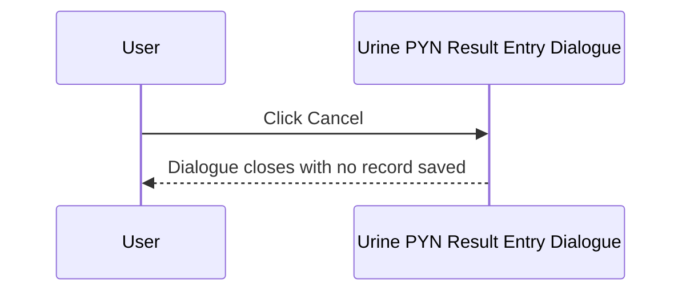
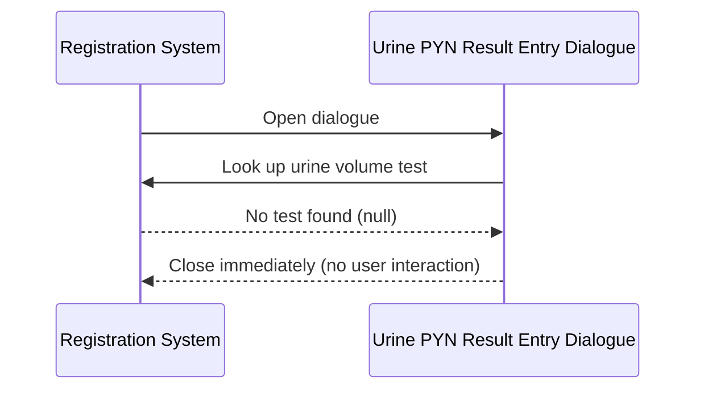

# Urine PYN Result Entry Dialogue

## Overview

The Urine PYN Result Entry Dialogue (titled "Urine Test Specific") is a compact modal dialogue used to capture a **Urine Volume** value at the point of registration for urine tests at PYN (Pamela Youde Nethersole Eastern Hospital) laboratories. It is opened during the registration save workflow when a request includes a test whose specimen is configured to trigger Urine PYN result entry. The user selects or types a urine volume value using a keyword combo box populated from the `URINE_SPOT` keyword group. A numeric value entered is divided by 1000 before being stored, reflecting the unit conversion convention at PYN. The word "SPOT" is a valid entry and is stored as a value of 0.

---

## Related User Stories

- **[[CRST-562]]** - Registration - Result Entry (URINE_PYN)
- **[[CRST-247]]** - Specimen Ack - Result Entry (URINE_PYN)

**Epic:** LISP-27 [CRST][DEV] Registration - Register Workflow

---

## Key Concepts

### SPOT Value
"SPOT" is a valid keyword entry representing a spot urine sample rather than a timed volume. When the user selects or types "SPOT" and the urine test expects a numeric result type, the value is stored as `0` in the working result table. This is distinct from zero entered as a number.

### Division by 1000
Unlike the 24-hour Urine dialogue, the Urine PYN variant **divides all numeric input values by 1000** before saving. For example, if the user enters `1500`, the saved result is `1.5`. This reflects a unit convention where the user enters volume in mL but the stored result is in L.

### URINE_SPOT Keyword Group
The combo box is populated from the `URINE_SPOT` keyword group, scoped to the current lab. The keyword items include numeric values and the special "SPOT" entry. The unit label displayed next to the combo is taken from the `URINE` lab option.

---

## Trigger Point

The dialogue is opened from the Registration screen when the operator saves a request that includes an Enter Code mapped to Urine PYN result entry (`w_lis_ur_pyn_popup`). It is part of the broader [[Result Entry on Save]] workflow.

---

## Workflow Scenarios

### Scenario 1: Normal Entry — Volume Selected and Saved

#### Prerequisites
- The urine volume test is identifiable (from the `URINE` lab option test code or fallback key 4204).
- The dialogue is open with the keyword combo populated.

#### Process Flow

```mermaid
sequenceDiagram
    participant User
    participant Dialogue as Urine PYN Result Entry Dialogue
    participant System as Registration System

    User->>Dialogue: Open dialogue (from save workflow)
    Dialogue->>System: Look up urine volume test (URINE option or fallback key 4204)
    System-->>Dialogue: Test found; keyword group and unit label loaded
    Dialogue-->>User: Display URINE_SPOT keyword combo + unit label

    User->>Dialogue: Select or type urine volume (number or SPOT)
    User->>Dialogue: Click Done

    Dialogue->>System: Validate selection (non-empty, numeric or SPOT)
    System-->>Dialogue: Valid
    Dialogue->>System: Derive stored value (SPOT→0; numeric÷1000)
    Dialogue->>System: Save Urine Volume record to working result table
    System-->>User: Dialogue closes; registration continues
```

#### Step-by-Step Details

1. The dialogue opens and resolves the urine volume test from the `URINE` lab option (`option_text[1]`); if absent, falls back to test dictionary key 4204.
2. If no urine test is found for the current lab, the dialogue closes immediately without displaying anything (see Scenario 3).
3. The dialogue is displayed with a single titled border section **"Urine Volume"**, containing:
   - A **keyword combo box** (approximately 100 pixels wide), populated from the `URINE_SPOT` keyword group for the current lab, with no pre-selected default ("first item" selection mode).
   - A **unit label** (approximately 100 pixels wide) to the right, showing the unit from `option_text[0]` of the `URINE` lab option (e.g., "mL").
4. If a prior result exists for this test on the current request, the combo is pre-set to that value.
5. Focus is set to the keyword combo on open.
6. The user selects a value from the drop-down or types a value manually. The combo accepts both selection and free text.
7. The user clicks **Done**.
8. The system validates the selection:
   - If no item is selected (empty) → error message 1560 "Invalid urine volume entered!!" is shown; focus returns to the combo; the dialogue stays open.
   - If the value is neither a valid number nor "SPOT" → error message 1560 is shown; same behaviour.
9. If the selected value is "SPOT" and the test result type is numeric, the value is converted to `0` before saving.
10. If the selected value is a valid number, it is **divided by 1000** before saving (e.g., 1500 → 1.5).
11. The urine volume record is constructed using the request number, the urine test dictionary, the derived value, and the authorize flag from the `URINE` lab option.
12. The record is written to the working result table (`TRANS_TESTRSLT_WKT`).
13. The dialogue closes and the registration save workflow continues.

---

### Scenario 2: User Cancels

#### Prerequisites
- The dialogue is open.

#### Process Flow



#### Step-by-Step Details

1. The user clicks **Cancel**.
2. The dialogue closes without writing any record.
3. The registration save workflow is interrupted; the request is not saved.

---

### Scenario 3: Urine Test Not Found — Silent Close

#### Prerequisites
- No urine test can be resolved for the current lab from either the `URINE` lab option or the fallback key 4204.

#### Process Flow



#### Step-by-Step Details

1. The dialogue attempts to resolve the urine test from configuration.
2. No valid test is found for the current lab.
3. The dialogue closes silently and the save workflow continues.

---

## Visual Layout

The dialogue is titled **"Urine Test Specific"** and is approximately 300 × 220 pixels. It contains one titled border section:

- **"Urine Volume"** — a keyword combo box (approximately 100 pixels wide) populated from `URINE_SPOT`, followed by a unit label (e.g., "mL") to its right.

> The free-text input field present in the shared layout is hidden for this dialogue variant. Only the combo box is shown.

A **Done** button (left-aligned) and a **Cancel** button (right-aligned) are displayed below the border section. The **Done** button is the default action — pressing Enter activates it.

---

## Buttons and Actions

### Done
- **When visible:** Always visible; also the default button (activated by pressing Enter).
- **What it does:** Validates the combo selection. If valid, derives the stored value (SPOT → 0; number ÷ 1000), constructs the result record, and closes the dialogue.

### Cancel
- **When visible:** Always visible.
- **What it does:** Closes the dialogue immediately without saving any result. The registration save workflow is halted.

---

## Error Messages and System Prompts

| Message | Text | Trigger | User Options |
|---------|------|---------|-------------|
| 1560 | "Invalid urine volume entered!!" | Combo is empty, or the selected/typed value is not a number and is not "SPOT" | Dismiss; focus returns to combo |

---

## Summary Tables

### Value Derivation Rules

| User Input | Stored Value |
|------------|-------------|
| "SPOT" (and test result type is numeric) | 0 |
| Numeric value (e.g., 1500) | Input ÷ 1000 (e.g., 1.5) |
| Empty / non-numeric / non-SPOT | Error 1560; not saved |

### Comparison with Other Urine Dialogue Variants

| Feature | 24-Hour Urine (CRST-561) | Urine PYN (CRST-562) | CRCL Urine component | Urine (CRST-564) |
|---------|--------------------------|---------------------|---------------------|-----------------|
| Input control | Text input | Keyword combo | Keyword combo | Keyword combo |
| SPOT accepted | No | Yes (stored as 0) | Yes (stored as 0) | Varies |
| SPOT silently skipped | No | No | Yes (CRCL only) | No |
| Value ÷ 1000 before save | No | **Yes** | No | No |
| Validation error | 1579 | 1560 | 1560 | 1560 |

### Saved Record Fields

| Field | Source |
|-------|--------|
| Request Number | Current registration request |
| Test | Urine volume test (from `URINE` option_text[1] or fallback key 4204) |
| Result value | Derived value (SPOT → 0; numeric input ÷ 1000) |
| Authorize flag | `URINE` lab option value (boolean) |

---

## Data Sources

| Data | Source |
|------|--------|
| Urine volume test | Test code from `URINE` option_text[1]; fallback to test key 4204 |
| Unit label | First element of `URINE` option_text array (`option_text[0]`) |
| Keyword list | `URINE_SPOT` keyword group, scoped to current lab |
| Authorize flag | `URINE` option_value (boolean) |
| Prior result (pre-fill) | Existing working result for the urine test on the same request, if present |

---

## Configuration

| Setting | Option Code | Purpose | Effect when enabled | Effect when disabled |
|---------|------------|---------|--------------------|--------------------|
| Urine Authorize | `URINE` (option_value, group: `REQUEST_REGISTRATION`) | Controls whether the saved result is marked as authorised | Result record is flagged as authorised | Result record is saved without authorisation |
| Urine Unit and Test Code | `URINE` (option_text_array, group: `REQUEST_REGISTRATION`) | Defines the unit label (`[0]`) and test code (`[1]`) | Configured unit shown; configured test code used | Falls back to test key 4204; no unit label |

---

## Business Rules

1. All numeric values entered are divided by 1000 before being saved. This is a fixed convention for the PYN variant and cannot be changed by configuration.
2. Entering "SPOT" saves a value of 0 (when the test result type is numeric). This is the standard SPOT convention.
3. Unlike the CRCL dialogue, a "SPOT" entry here is **not silently skipped** — it is saved as 0.
4. The combo accepts free-text input in addition to drop-down selection. Any free-text that is neither a number nor "SPOT" is rejected with error 1560.
5. If no urine test can be resolved for the current lab, the dialogue closes silently and the save continues.
6. If a prior result already exists for the urine test on the same request, the combo is pre-set to that value when the dialogue opens.

---

## Related Workflows

- [[Result Entry on Save]] — The Urine PYN Result Entry Dialogue is invoked as part of the result entry step within the registration save workflow.
- [[24-Hour Urine Result Entry Dialogue]] — The 24-hour variant uses a text input instead of a combo, does not divide by 1000, and uses error 1579 instead of 1560 (CRST-561).
- [[CRCL Result Entry Dialogue]] — Uses the same `URINE` lab option and `URINE_SPOT` combo, but silently skips SPOT/0 and adds a Collection Time field (CRST-559).
- [[TOX Result Entry Dialogue]] — Another specialised result entry dialogue in the same save workflow (CRST-560).
