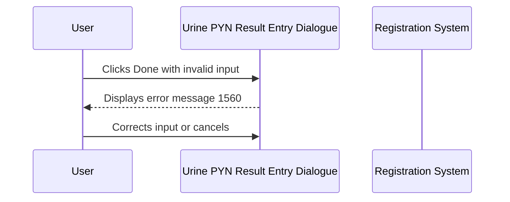

# Urine PYN Result Entry Dialogue

## Overview

The Urine PYN Result Entry Dialogue is a modal dialogue that allows registration staff to enter a urine volume measurement for PYN-related tests at the time of registration. The volume is entered in millilitres but is automatically converted by the system before saving — the entered value is divided by 1 000 prior to storage. The dialogue defaults to a keyword combo box allowing the user to select either a numeric value or the special keyword "SPOT"; SPOT is accepted as a valid entry and is saved as a volume of zero.

---

## Related User Stories

- **[[CRST-562]]** - Registration - Urine PYN Specific Result Entry

**Epic:** LISP-27 [CRST][DEV] Registration - Register Workflow

---

## Key Concepts

### Divide-by-1000 Conversion
The value the user types into the numeric input is divided by 1 000 before being saved. For example, entering 500 stores a value of 0.5. This conversion is transparent to the user; no indication is shown in the dialogue.

### SPOT Keyword
"SPOT" is a valid urine collection method keyword available in the combo box. Selecting SPOT is treated as a valid entry; the system saves a volume of zero. SPOT is **not** silently skipped — it is recorded against the test.

### Keyword Combo Box
The primary input control is a combo box pre-populated with keywords from the **URINE_SPOT** keyword group. When the user types a number directly into the combo box field, it is treated as a numeric volume.

---

## Trigger Point

This dialogue is opened during the Registration save process when one or more tests on the request require urine volume input and the Urine PYN enter code (`w_lis_ur_pyn_popup`) is configured for the relevant test. It appears as part of the multi-step result entry sequence triggered on save.

---

## Workflow Scenarios

### Scenario 1: User Selects a SPOT Keyword

#### Prerequisites
- The request includes at least one test configured for Urine PYN result entry.
- The dialogue has been opened as part of the registration save sequence.

#### Process Flow

```mermaid
sequenceDiagram
    participant User
    participant Dialogue as Urine PYN Result Entry Dialogue
    participant System as Registration System

    User->>Dialogue: Opens (combo box focused by default)
    User->>Dialogue: Selects "SPOT" from the Urine Vol combo box
    User->>Dialogue: Clicks Done (or presses Enter)
    Dialogue->>System: Saves volume as 0 (SPOT accepted)
    System-->>User: Dialogue closes; save continues
```

#### Step-by-Step Details

1. The dialogue opens with the **Urine Vol** combo box focused and pre-populated with keywords from the **URINE_SPOT** keyword group.
2. The user selects **SPOT** from the combo box drop-down.
3. The user clicks **Done** or presses **Enter**.
4. The system treats SPOT as a valid volume of zero and saves the result.
5. The dialogue closes and the registration save process continues.

---

### Scenario 2: User Enters a Numeric Volume

#### Prerequisites
- The request includes at least one test configured for Urine PYN result entry.
- The dialogue has been opened as part of the registration save sequence.

#### Process Flow

```mermaid
sequenceDiagram
    participant User
    participant Dialogue as Urine PYN Result Entry Dialogue
    participant System as Registration System

    User->>Dialogue: Opens (combo box focused by default)
    User->>Dialogue: Types a numeric value into the Urine Vol combo box
    User->>Dialogue: Clicks Done (or presses Enter)
    Dialogue->>System: Divides entered value by 1000, saves result
    System-->>User: Dialogue closes; save continues
```

#### Step-by-Step Details

1. The dialogue opens with the **Urine Vol** combo box focused.
2. The user types a numeric value directly into the combo box field.
3. The user clicks **Done** or presses **Enter**.
4. The system divides the entered number by 1 000 and saves the resulting value against the configured test code.
5. The dialogue closes and the registration save process continues.

---

### Scenario 3: User Cancels the Dialogue

#### Prerequisites
- The dialogue is open.

#### Process Flow

```mermaid
sequenceDiagram
    participant User
    participant Dialogue as Urine PYN Result Entry Dialogue
    participant System as Registration System

    User->>Dialogue: Clicks Cancel
    Dialogue-->>System: No result saved
    System-->>User: Dialogue closes; registration save may be aborted or skipped
```

#### Step-by-Step Details

1. The user clicks **Cancel**.
2. No urine volume is saved.
3. The dialogue closes without recording a result.

---

### Scenario 4: Invalid Input Entered

#### Prerequisites
- The dialogue is open.
- The user has left the field empty or has entered a value that is neither a valid number nor the SPOT keyword.

#### Process Flow



#### Step-by-Step Details

1. The user clicks **Done** (or presses **Enter**) without entering a valid value.
2. The system validates the input: it must be either a positive number or the SPOT keyword.
3. If the input is empty or is not a recognised number or keyword, **error message 1560** ("Invalid urine volume entered !!") is displayed.
4. The user must correct the input or click **Cancel** to exit.

---

## Visual Layout

The dialogue is a compact modal window titled **"Urine Test Specific"**. It contains a single titled border box labelled **"Urine Vol"**, which holds the keyword combo box control. The unit label is displayed alongside the input, sourced from the configured **URINE** lab option. Two buttons appear at the bottom: **Done** on the left and **Cancel** on the right. Pressing **Enter** activates the **Done** button.

---

## Buttons and Actions

### Done
- **Keyboard shortcut:** Enter
- **When visible:** Always visible while the dialogue is open.
- **What it does:** Validates the entered value. If the input is a valid number, divides it by 1 000 and saves the result. If the input is SPOT, saves a volume of zero. If the input is invalid, shows error message 1560.

### Cancel
- **Keyboard shortcut:** None
- **When visible:** Always visible while the dialogue is open.
- **What it does:** Closes the dialogue without saving any urine volume result.

---

## Error Messages and System Prompts

| Message | Text | Trigger | User Options |
|---------|------|---------|-------------|
| 1560 | "Invalid urine volume entered !!" | User clicks Done with an empty field or an entry that is neither a valid number nor the SPOT keyword | Dismiss and correct input, or Cancel |

---

## Summary Table — Input Behaviour

| Input | Valid? | Stored Value |
|-------|--------|-------------|
| Positive number (e.g. 500) | Yes | Entered value ÷ 1 000 (e.g. 0.5) |
| SPOT keyword | Yes | 0 |
| Empty / blank | No | Error 1560 shown |
| Non-numeric, non-keyword text | No | Error 1560 shown |

---

## Data Sources

| Data | Source |
|------|--------|
| Urine volume keyword list | Global keyword dictionary — **URINE_SPOT** keyword group |
| Unit label | **URINE** lab option — first configured value (option_text[0]) |
| Test code for result storage | **URINE** lab option — second configured value (option_text[1]); falls back to key 4204 if not configured |
| Authorisation flag | **URINE** lab option — option value (boolean) |

---

## Configuration

| Setting | Option Code | Purpose | Effect when enabled | Effect when disabled |
|---------|-------------|---------|--------------------|--------------------|
| Urine result entry test code and unit | `URINE` (option_text) | Defines the test code and unit label used for the saved urine result | Custom test code and unit applied | Falls back to default key 4204 |
| Urine result entry authorisation | `URINE` (option_value) | Controls whether the saved result is automatically authorised | Result is authorised on save | Result is saved without authorisation |

---

## Business Rules

1. The entered urine volume is divided by 1 000 before being stored. Entering 500 saves 0.5.
2. The SPOT keyword is a valid entry and is saved as a volume of zero. It is not silently skipped.
3. Any input that is neither a valid positive number nor the SPOT keyword is rejected with error 1560.
4. The unit label displayed next to the input is taken from the URINE lab option configuration, not hardcoded.
5. On opening, focus is placed on the Urine Vol combo box so the user can immediately type or select a value.
6. Pressing Enter activates the Done action.

---

## Related Workflows

- [[Result Entry on Save]] — This dialogue is opened as part of the multi-step result entry sequence triggered during the Registration save process.
- [[CRCL Result Entry Dialogue]] — The CRCL dialogue also uses a urine volume input (combo box variant), but does not apply the divide-by-1000 conversion and silently skips SPOT entries.
- [[24-Hour Urine Result Entry Dialogue]] — The 24-hour urine variant uses a text input instead of a combo box and does not divide the value by 1 000.
- [[Urine QEH Result Entry Dialogue]] — An alternative urine result entry dialogue used in QEH-specific configurations.
