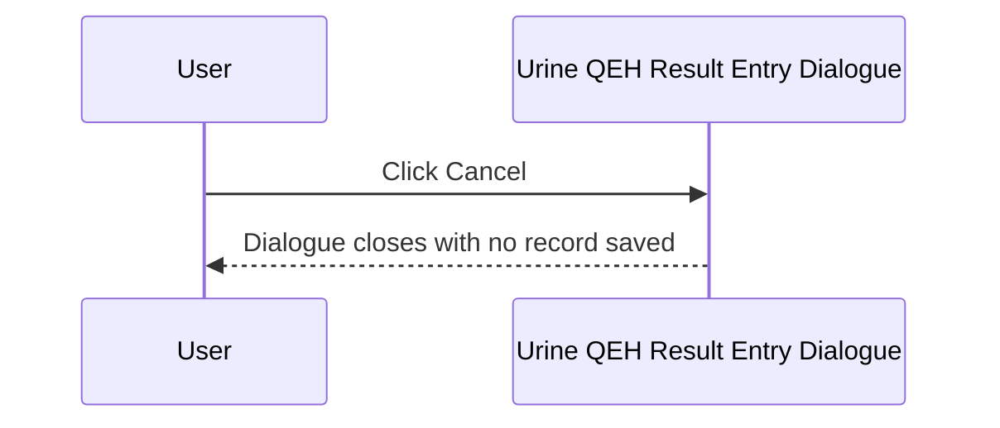
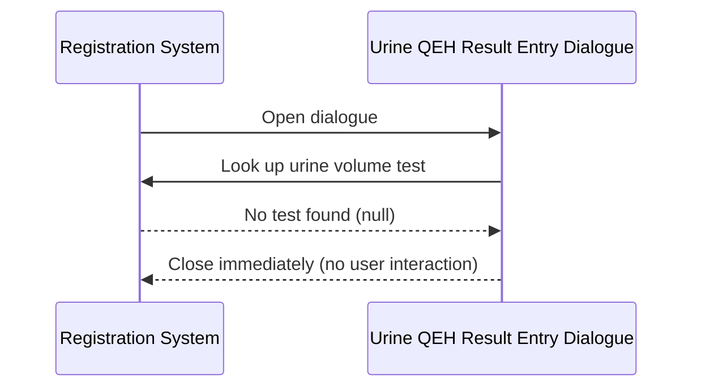

# Urine QEH Result Entry Dialogue

## Overview

The Urine QEH Result Entry Dialogue (titled "Urine Test Specific") is a compact modal dialogue used to capture a **Urine Volume** value at the point of registration for urine tests at QEH (Queen Elizabeth Hospital) laboratories. It is opened during the registration save workflow when a request includes a test whose specimen is configured to trigger Urine QEH result entry. The user selects a urine volume value from a drop-down list populated from the `URINE_SPOT` keyword group. Unlike the PYN variant, the numeric value entered here is saved **as-is** without any division. The word "SPOT" is a valid selection and is stored as a value of 0.

---

## Related User Stories

- **[[CRST-563]]** - Registration - Result Entry (URINE_QEH)
- **[[CRST-248]]** - Specimen Ack - Result Entry (URINE_QEH)

**Epic:** LISP-27 [CRST][DEV] Registration - Register Workflow

---

## Key Concepts

### SPOT Value
"SPOT" is a valid keyword entry representing a spot urine sample rather than a timed volume. When the user selects or types "SPOT", the value is stored as `0` in the working result table.

### No Division — Value Saved As-Is
Unlike the PYN urine variant, the QEH variant saves the numeric value **exactly as entered**. If the user enters `1500`, the stored result is `1500`. No unit conversion is applied.

### URINE_SPOT Keyword Group
The drop-down list is populated from the `URINE_SPOT` keyword group, scoped to the current lab. The keyword items display the `alpha2` value of each keyword entry. The unit label displayed to the right of the drop-down is taken from the `URINE` lab option.

### Drop-Down vs Combo Box
The QEH variant uses a **drop-down data grid** (single-column grid with dropdown behaviour), rather than a standard combo box. Like the PYN variant, the user can also type a value manually; the text is bound from the drop-down's text input.

---

## Trigger Point

The dialogue is opened from the Registration screen when the operator saves a request that includes an Enter Code mapped to Urine QEH result entry (`w_lis_ur_qeh_popup`). It is part of the broader [[Result Entry on Save]] workflow.

---

## Workflow Scenarios

### Scenario 1: Normal Entry — Volume Selected and Saved

#### Prerequisites
- The urine volume test is identifiable (from the `URINE` lab option test code or fallback key 4204).
- The dialogue is open with the drop-down populated.

#### Process Flow

```mermaid
sequenceDiagram
    participant User
    participant Dialogue as Urine QEH Result Entry Dialogue
    participant System as Registration System

    User->>Dialogue: Open dialogue (from save workflow)
    Dialogue->>System: Look up urine volume test (URINE option or fallback key 4204)
    System-->>Dialogue: Test found; keyword group and unit label loaded
    Dialogue-->>User: Display URINE_SPOT drop-down + unit label

    User->>Dialogue: Select or type urine volume (number or SPOT)
    User->>Dialogue: Click Done

    Dialogue->>System: Validate selection (non-empty, numeric or SPOT)
    System-->>Dialogue: Valid
    Dialogue->>System: Derive stored value (SPOT→0; numeric saved as-is)
    Dialogue->>System: Save Urine Volume record to working result table
    System-->>User: Dialogue closes; registration continues
```

#### Step-by-Step Details

1. The dialogue opens and resolves the urine volume test from the `URINE` lab option (`option_text[1]`); if absent, falls back to test dictionary key 4204.
2. If no urine test is found for the current lab, the dialogue closes immediately without displaying anything (see Scenario 3).
3. The dialogue is displayed with a single titled border section **"Urine Volume"**, containing:
   - A **drop-down list** (approximately 100 pixels wide), populated from the `URINE_SPOT` keyword group for the current lab. The list displays the alpha value of each keyword item. No default item is pre-selected (`selectedIndex = -1`) unless a prior result exists.
   - A **unit label** to the right, showing the unit from `option_text[0]` of the `URINE` lab option (e.g., "mL").
4. If a prior result exists for this test on the current request, the drop-down text is pre-set to that value.
5. Focus is set to the drop-down on open.
6. The user selects a value from the drop-down list or types a value manually.
7. The user clicks **Done**.
8. The system validates the input:
   - If the text field is empty, or the value is neither a valid number nor "SPOT" → error message 1579 is shown; focus returns to the drop-down; the dialogue stays open.
9. If the value is "SPOT", it is stored as `0`.
10. If the value is a valid number, it is stored **as entered** (no conversion applied).
11. The urine volume record is constructed using the request number, the urine test dictionary, the stored value, and the authorize flag from the `URINE` lab option.
12. The record is written to the working result table (`TRANS_TESTRSLT_WKT`).
13. The dialogue closes and the registration save workflow continues.

---

### Scenario 2: User Cancels

#### Prerequisites
- The dialogue is open.

#### Process Flow



#### Step-by-Step Details

1. The user clicks **Cancel**.
2. The dialogue closes without writing any record.
3. The registration save workflow is interrupted; the request is not saved.

---

### Scenario 3: Urine Test Not Found — Silent Close

#### Prerequisites
- No urine test can be resolved for the current lab from either the `URINE` lab option or the fallback key 4204.

#### Process Flow



#### Step-by-Step Details

1. The dialogue attempts to resolve the urine test from configuration.
2. No valid test is found for the current lab.
3. The dialogue closes silently and the save workflow continues.

---

## Visual Layout

The dialogue is titled **"Urine Test Specific"** and is approximately 300 × 220 pixels. It contains one titled border section:

- **"Urine Volume"** — a drop-down list (approximately 100 pixels wide) populated from `URINE_SPOT`, followed by a unit label (e.g., "mL") to its right.

> The drop-down used in the QEH variant is a single-column drop-down data grid rather than a standard keyword combo box. Visually it functions similarly — the user can select from the list or type a value manually.

A **Done** button (left-aligned) and a **Cancel** button (right-aligned) are displayed below the border section.

---

## Buttons and Actions

### Done
- **When visible:** Always visible.
- **What it does:** Validates the drop-down input. If valid, derives the stored value (SPOT → 0; number saved as-is), constructs the result record, and closes the dialogue.

### Cancel
- **When visible:** Always visible.
- **What it does:** Closes the dialogue immediately without saving any result. The registration save workflow is halted.

---

## Error Messages and System Prompts

| Message | Text | Trigger | User Options |
|---------|------|---------|-------------|
| 1579 | "Invalid urine volume entered!!" | Input is empty, or the value is not a number and is not "SPOT" | Dismiss; focus returns to drop-down |

> **Note:** The US document for CRST-563 incorrectly references message 1560. The actual implementation uses message **1579** — the same code used by the 24-Hour Urine variant.

---

## Summary Tables

### Value Derivation Rules

| User Input | Stored Value |
|------------|-------------|
| "SPOT" | 0 |
| Numeric value (e.g., 1500) | 1500 (saved as-is) |
| Empty / non-numeric / non-SPOT | Error 1579; not saved |

### Comparison with Other Urine Dialogue Variants

| Feature | 24-Hour Urine (CRST-561) | Urine PYN (CRST-562) | Urine QEH (CRST-563) |
|---------|--------------------------|---------------------|---------------------|
| Input control | Text input | Keyword combo | Drop-down data grid |
| SPOT accepted | No | Yes (stored as 0) | Yes (stored as 0) |
| Value ÷ 1000 before save | No | **Yes** | No |
| Validation error | 1579 | 1560 | 1579 |

### Saved Record Fields

| Field | Source |
|-------|--------|
| Request Number | Current registration request |
| Test | Urine volume test (from `URINE` option_text[1] or fallback key 4204) |
| Result value | Derived value (SPOT → 0; numeric as-is) |
| Authorize flag | `URINE` lab option value (boolean) |

---

## Data Sources

| Data | Source |
|------|--------|
| Urine volume test | Test code from `URINE` option_text[1]; fallback to test key 4204 |
| Unit label | First element of `URINE` option_text array (`option_text[0]`) |
| Drop-down list | `URINE_SPOT` keyword group, scoped to current lab (`alpha2` field displayed) |
| Authorize flag | `URINE` option_value (boolean) |
| Prior result (pre-fill) | Existing working result for the urine test on the same request, if present |

---

## Configuration

| Setting | Option Code | Purpose | Effect when enabled | Effect when disabled |
|---------|------------|---------|--------------------|--------------------|
| Urine Authorize | `URINE` (option_value, group: `REQUEST_REGISTRATION`) | Controls whether the saved result is marked as authorised | Result record is flagged as authorised | Result record saved without authorisation (default: not authorised) |
| Urine Unit and Test Code | `URINE` (option_text_array, group: `REQUEST_REGISTRATION`) | Defines the unit label (`[0]`) and test code (`[1]`) | Configured unit shown; configured test code used | Falls back to test key 4204; no unit label |

---

## Business Rules

1. Numeric values entered are saved **as-is** — no unit conversion is applied. This distinguishes the QEH variant from the PYN variant (which divides by 1000).
2. Entering "SPOT" saves a value of 0. This is the standard SPOT convention across all urine variants.
3. Cancelling the dialogue aborts the entire registration save workflow.
4. If no urine test can be resolved for the current lab, the dialogue closes silently and the save continues.
5. If a prior result already exists for the urine test on the same request, the drop-down is pre-set to that value when the dialogue opens.
6. The drop-down list is populated from the `URINE_SPOT` keyword group, scoped to the current lab. Only active keywords are shown.

---

## Related Workflows

- [[Result Entry on Save]] — The Urine QEH Result Entry Dialogue is invoked as part of the result entry step within the registration save workflow.
- [[24-Hour Urine Result Entry Dialogue]] — Uses a text input instead of a drop-down, uses error 1579 (same), and also saves as-is without division (CRST-561).
- [[Urine PYN Result Entry Dialogue]] — Similar structure but uses a keyword combo and divides numeric values by 1000; uses error 1560 (CRST-562).
- [[TOX Result Entry Dialogue]] — Another specialised result entry dialogue in the same save workflow (CRST-560).
