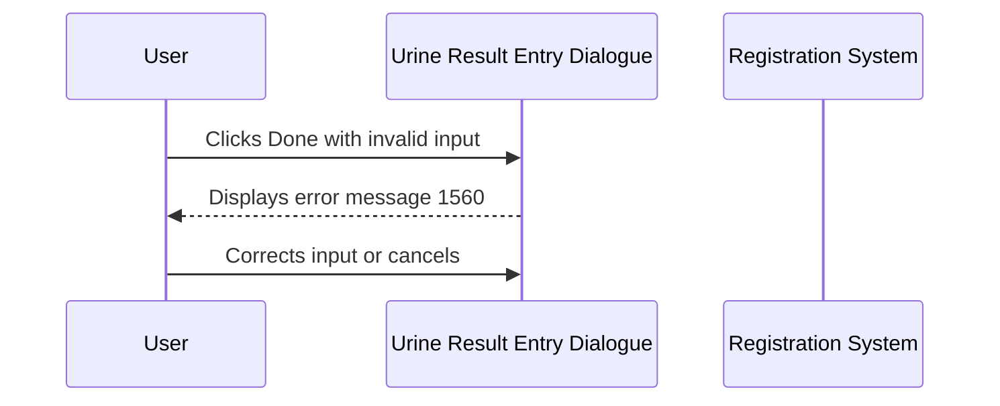

# Urine Result Entry Dialogue

## Overview

The Urine Result Entry Dialogue is a modal dialogue that prompts registration staff to enter a urine volume measurement for tests that require it at the point of registration. The dialogue displays a keyword combo box pre-populated from the **URINE_SPOT** keyword group. A defining feature of this variant is the **skip-zero-spot** behaviour: if the user selects "SPOT" or enters "0", no result record is created — the system silently skips the entry and continues the registration save. Only a genuine numeric volume above zero is saved. The value is stored as entered, with no unit conversion applied.

---

## Related User Stories

- **[[CRST-564]]** - Registration - Pre-register: Result Entry (URINE)

**Epic:** LISP-27 [CRST][DEV] Registration - Register Workflow

**Related:** [[CRST-249]] - Specimen Ack - Result Entry (URINE)

---

## Key Concepts

### Skip-Zero-Spot Behaviour
This dialogue is configured with skip-zero-spot enabled. If the user selects "SPOT" or enters the value "0", the urine result is **not saved**. The system treats these as non-results — no record is written to the pending results queue and the save workflow continues normally. This is the key difference from the [[Urine PYN Result Entry Dialogue]] and [[Urine QEH Result Entry Dialogue]], both of which accept SPOT as a genuine value (stored as 0).

### Value Saved As-Is
When a valid numeric value above zero is entered, it is stored exactly as entered. Unlike the [[Urine PYN Result Entry Dialogue]], no divide-by-1000 conversion is applied.

### Keyword Combo Box
The input control is a combo box loaded from the **URINE_SPOT** keyword group, scoped to the current lab. The user can either select a keyword from the drop-down or type a value directly.

---

## Trigger Point

This dialogue is opened during the Registration save sequence when one or more tests on the request require urine volume input and the Urine enter code (`w_lis_urine_popup`) is configured for the relevant test. It appears as part of the multi-step result entry sequence triggered on save, as described in [[Result Entry on Save]].

---

## Workflow Scenarios

### Scenario 1: User Enters a Valid Numeric Volume

#### Prerequisites
- The request includes at least one test configured for Urine result entry.
- The dialogue has been opened as part of the registration save sequence.
- The user intends to enter a real numeric volume greater than zero.

#### Process Flow

```mermaid
sequenceDiagram
    participant User
    participant Dialogue as Urine Result Entry Dialogue
    participant System as Registration System

    User->>Dialogue: Opens (combo box focused by default)
    User->>Dialogue: Types or selects a numeric value in the Urine Vol combo box
    User->>Dialogue: Clicks Done (or presses Enter)
    Dialogue->>System: Validates input (not empty, not NaN, not SPOT)
    System-->>Dialogue: Valid
    Dialogue->>System: Saves numeric value as-is
    System-->>User: Dialogue closes; save continues
```

#### Step-by-Step Details

1. The dialogue opens with the **Urine Vol** combo box focused, loaded with keywords from the **URINE_SPOT** keyword group.
2. The user types a numeric value or selects one from the combo drop-down.
3. The user clicks **Done** or presses **Enter**.
4. The system checks that the value is not empty and is a valid number. A "0" or "SPOT" at this stage would trigger the skip logic (see Scenario 2), so the value here is a positive number other than 0.
5. The numeric value is saved as-is against the configured urine test code.
6. The dialogue closes and the registration save continues.

---

### Scenario 2: User Selects SPOT or Enters "0" — Entry Silently Skipped

#### Prerequisites
- The dialogue is open.
- The user selects "SPOT" from the combo box or types "0".

#### Process Flow

```mermaid
sequenceDiagram
    participant User
    participant Dialogue as Urine Result Entry Dialogue
    participant System as Registration System

    User->>Dialogue: Selects "SPOT" or types "0"
    User->>Dialogue: Clicks Done (or presses Enter)
    Dialogue->>System: Skip-zero-spot check: SPOT or 0 detected
    System-->>User: No result saved; dialogue closes; save continues
```

#### Step-by-Step Details

1. The user selects "SPOT" from the combo drop-down, or types the value "0".
2. The user clicks **Done** or presses **Enter**.
3. The system's skip-zero-spot check detects the value is "SPOT" or "0".
4. **No urine volume record is created.** The pending results queue is not written for this test.
5. The dialogue closes immediately and the registration save workflow proceeds to the next step, as if no result entry was required.

> **Important:** This silent skip is intentional and distinguishes this dialogue from the Urine PYN and Urine QEH variants. A SPOT selection here does **not** save a zero — it is treated as no measurement taken.

---

### Scenario 3: Invalid Input Entered

#### Prerequisites
- The dialogue is open.
- The user has left the field empty or entered text that is neither a valid number nor a recognised keyword.

#### Process Flow



#### Step-by-Step Details

1. The user clicks **Done** (or presses **Enter**) with an empty or unrecognised value in the combo box.
2. The system validates the input: it must be either a valid number or the "SPOT" keyword.
3. If the input fails validation, **error message 1560** ("Invalid urine volume entered !!") is displayed.
4. Focus returns to the combo box.
5. The user must correct the input or click **Cancel** to exit.

---

### Scenario 4: User Cancels

#### Prerequisites
- The dialogue is open.

#### Process Flow

```mermaid
sequenceDiagram
    participant User
    participant Dialogue as Urine Result Entry Dialogue
    participant System as Registration System

    User->>Dialogue: Clicks Cancel
    Dialogue-->>System: No result saved
    System-->>User: Dialogue closes; registration save aborted
```

#### Step-by-Step Details

1. The user clicks **Cancel**.
2. No urine volume is saved.
3. The dialogue closes and the overall registration save is aborted (see [[Result Entry on Save]] — Scenario 3).

---

## Visual Layout

The dialogue is a compact modal window titled **"Urine Test Specific"**. It contains a single titled border box labelled **"Urine Vol"**, which holds the keyword combo box control. The unit label is displayed alongside the input, sourced from the configured **URINE** lab option. Two buttons appear at the bottom: **Done** on the left and **Cancel** on the right. Pressing **Enter** activates the **Done** button.

---

## Buttons and Actions

### Done
- **Keyboard shortcut:** Enter
- **When visible:** Always visible while the dialogue is open.
- **What it does:** Checks the entered value. If "SPOT" or "0", silently skips saving and closes. If a valid non-zero number, saves the result and closes. If empty or invalid, shows error 1560.

### Cancel
- **Keyboard shortcut:** None
- **When visible:** Always visible while the dialogue is open.
- **What it does:** Closes the dialogue without saving any urine volume result. The overall registration save is aborted.

---

## Error Messages and System Prompts

| Message | Text | Trigger | User Options |
|---------|------|---------|-------------|
| 1560 | "Invalid urine volume entered !!" | User clicks Done with an empty field or an entry that is not a valid number and not a recognised keyword | Dismiss and correct input, or Cancel |

---

## Summary Tables

### Input Behaviour

| Input | Valid? | Stored Value | Behaviour |
|-------|--------|-------------|-----------|
| Positive number (e.g. 1500) | Yes | 1500 (saved as-is) | Result record created |
| "0" | Skipped | Nothing saved | Silent skip; save continues |
| "SPOT" keyword | Skipped | Nothing saved | Silent skip; save continues |
| Empty / blank | No | — | Error 1560 shown |
| Non-numeric, non-keyword text | No | — | Error 1560 shown |

### Comparison with Other Urine Dialogue Variants

| Feature | 24-Hour Urine (CRST-561) | Urine PYN (CRST-562) | Urine QEH (CRST-563) | Urine (CRST-564) |
|---------|--------------------------|---------------------|---------------------|-----------------|
| Input control | Text input | Keyword combo | Drop-down data grid | Keyword combo |
| SPOT handling | Error 1579 | Saved as 0 | Saved as 0 | **Silently skipped** |
| "0" handling | Saved as 0 | Saved as 0 | Saved as 0 | **Silently skipped** |
| Value ÷ 1000 before save | No | **Yes** | No | No |
| Validation error | 1579 | 1560 | 1560* | 1560 |
| Enter key activates Done | Yes | Yes | No | Yes |

*Urine QEH US states 1560; source uses 1579. See [[Urine QEH Result Entry Dialogue]].

---

## Data Sources

| Data | Source |
|------|--------|
| Urine volume keyword list | Global keyword dictionary — **URINE_SPOT** keyword group, scoped to current lab |
| Unit label | **URINE** lab option — first configured value (option_text[0]) |
| Test code for result storage | **URINE** lab option — second configured value (option_text[1]); falls back to test key 4204 if not configured |
| Authorisation flag | **URINE** lab option — option value (boolean) |
| Prior result (pre-fill) | Existing working result for the urine test on the same request, if present |

---

## Configuration

| Setting | Option Code | Purpose | Effect when enabled | Effect when disabled |
|---------|-------------|---------|--------------------|--------------------|
| Urine result entry test code and unit | `URINE` (option_text, group: `REQUEST_REGISTRATION`) | Defines the unit label ([0]) and test code ([1]) used for the saved result | Custom test code and unit applied | Falls back to test key 4204; no unit label |
| Urine result entry authorisation | `URINE` (option_value, group: `REQUEST_REGISTRATION`) | Controls whether the saved result is automatically authorised | Result is authorised on save | Result is saved without authorisation (default) |

---

## Business Rules

1. If the user selects "SPOT" or enters "0", no urine volume record is created. The dialogue closes and the save workflow continues as if no result entry was needed. This is the **skip-zero-spot** rule.
2. A valid entry must be a positive number other than zero, or one of the keywords in the URINE_SPOT group (other than SPOT/0). Any other input is rejected with error 1560.
3. Valid numeric values are saved exactly as entered — no unit conversion is applied.
4. On opening, focus is placed on the Urine Vol combo box so the user can immediately type or select a value.
5. Pressing Enter activates the Done action.
6. Cancelling the dialogue aborts the entire registration save.
7. If a prior result already exists for the urine test on the same request, the combo box is pre-set to that value when the dialogue opens.

---

## Related Workflows

- [[Result Entry on Save]] — This dialogue is opened as part of the multi-step result entry sequence triggered during the Registration save process.
- [[Urine PYN Result Entry Dialogue]] — A similar urine combo variant that accepts SPOT (stored as 0) and divides numeric values by 1000. No skip-zero-spot behaviour.
- [[Urine QEH Result Entry Dialogue]] — A drop-down data grid variant that accepts SPOT (stored as 0). No skip-zero-spot behaviour.
- [[24-Hour Urine Result Entry Dialogue]] — Uses a text input, no skip-zero-spot, no ÷1000.
- [[CRCL Result Entry Dialogue]] — Also uses a urine volume input (combo variant with skip-zero-spot) as part of a larger CRCL calculation dialogue.
