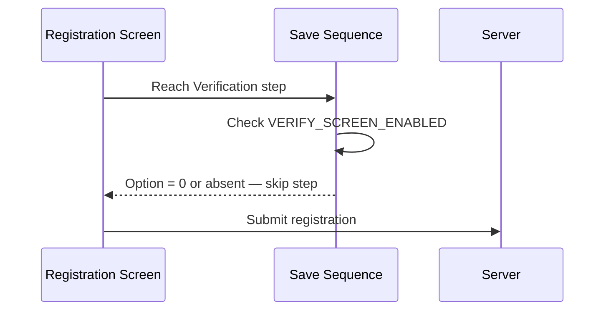
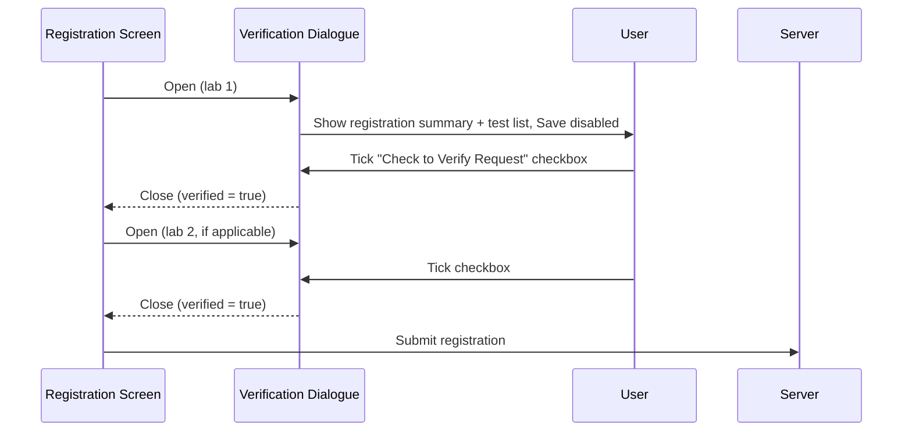
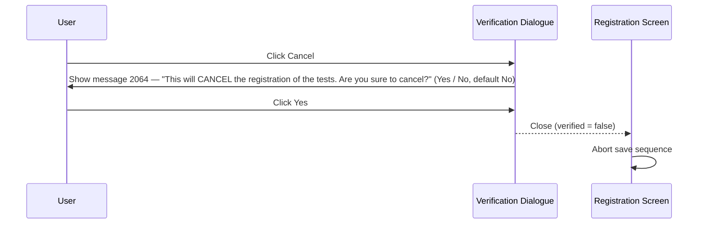

# Verification Dialogue

## Overview

The Verification Dialogue is a modal step presented at the end of the Pre-Register save sequence, giving registration staff an opportunity to review key registration details before the request is committed to the system. It displays a summary of the patient and request information alongside the list of registered tests for each lab involved in the request. When the **Check to Verify Request** checkbox is configured, staff must actively check it before the save button is enabled. The step can be suppressed entirely via configuration, in which case registration proceeds without any manual review step.

---

## Related User Stories

- **[[CRST-107]]** - Registration - Pre-register: Verification Dialogue
- **[[CRST-262]]** - Verification Dialogue (non-registration screen, governs detailed field layout rules)

**Epic:** LISP-27 [CRST][DEV] Registration - Register Workflow

---

## Key Concepts

### Per-Lab Verification
When a request spans multiple labs, the Verification Dialogue is shown once per lab that has registered tests. Each instance shows only the tests belonging to that lab. The dialogue cycles through labs in order; if a lab has no registered tests, that lab's verification is automatically treated as confirmed and the next lab is checked.

### Verify Checkbox Mode vs. Auto-Continue Mode
The `VERIFY_SCREEN_ENABLED` lab option controls which mode applies:
- **Value 1 (Checkbox Mode):** The **Check to Verify Request** checkbox is visible. The Save button is disabled until the checkbox is ticked. Ticking it immediately closes the dialogue and proceeds.
- **Value 2 (Auto-Continue Mode):** The checkbox is hidden. The Save button is enabled immediately — the user reviews details and clicks Save directly.

---

## Trigger Point

This step runs as the **last step of the Pre-Register save sequence**, immediately after the Result Entry step and before the actual server save. It is only shown when `VERIFY_SCREEN_ENABLED` is configured to 1 or 2. If the option is absent or set to 0, the step is silently skipped and the request is saved immediately.

---

## Workflow Scenarios

### Scenario 1: Verification Step Disabled — Step Skipped

#### Prerequisites
- `VERIFY_SCREEN_ENABLED` is 0, or the option does not exist for the lab.

#### Process Flow



#### Step-by-Step Details

1. The save sequence reaches the Verification step.
2. The system checks the `VERIFY_SCREEN_ENABLED` option for the lab.
3. The value is 0 or the option is not configured — the Verification Dialogue is not opened.
4. The save sequence proceeds directly to the server save step.
5. The request is registered.

---

### Scenario 2: Checkbox Mode (Option Value = 1) — Staff Must Verify

#### Prerequisites
- `VERIFY_SCREEN_ENABLED` is set to 1 for the lab.
- At least one lab in the request has registered tests.

#### Process Flow



#### Step-by-Step Details

1. The Verification Dialogue opens for the first lab in the request.
2. The dialogue displays the registration summary (see [[#Information Displayed]]) and the list of registered tests for that lab.
3. The **Check to Verify Request** checkbox is visible and unchecked. The **Save** button is disabled.
4. The user reviews the displayed information.
5. The user ticks the **Check to Verify Request** checkbox (by clicking or pressing the Space bar).
6. The dialogue closes immediately upon ticking the checkbox. No separate Save button click is required in this mode.
7. If the request spans multiple labs, the dialogue re-opens for the next lab that has registered tests. The process repeats from step 2.
8. If a lab has no registered tests, that lab is automatically counted as verified and skipped.
9. Once all labs have been verified, the save sequence proceeds to the server save step.
10. The request is registered.

---

### Scenario 3: Auto-Continue Mode (Option Value = 2) — Staff Reviews and Clicks Save

#### Prerequisites
- `VERIFY_SCREEN_ENABLED` is set to 2 for the lab.
- At least one lab in the request has registered tests.

#### Process Flow

```mermaid
sequenceDiagram
    Registration Screen->>Verification Dialogue: Open (lab 1)
    Verification Dialogue->>User: Show registration summary + test list; Save enabled
    User->>Verification Dialogue: Click Save button
    Verification Dialogue-->>Registration Screen: Close (verified = true)
    Registration Screen->>Server: Submit registration
```

#### Step-by-Step Details

1. The Verification Dialogue opens for the first lab.
2. The registration summary and test list are displayed.
3. The **Check to Verify Request** checkbox is **not visible**. The **Save** button is enabled immediately.
4. The user reviews the details and clicks **Save**.
5. The dialogue closes. Per-lab cycling follows the same logic as Checkbox Mode.
6. Once all labs are done, the request is registered.

---

### Scenario 4: User Cancels — Save Aborted

#### Prerequisites
- The Verification Dialogue is open (either mode).
- The user clicks **Cancel**.

#### Process Flow



#### Step-by-Step Details

1. The user clicks **Cancel** on the Verification Dialogue.
2. A confirmation prompt is shown — **message 2064**: *"This will CANCEL the registration of the tests. Are you sure to cancel?"* with **Yes** and **No** options. The default selection is **No**.
3. If the user clicks **No**, they remain on the Verification Dialogue with no change.
4. If the user clicks **Yes**, the dialogue closes with a cancelled result.
5. The save sequence is aborted. The request is not registered.
6. The Registration screen remains open with data intact.

> **Note:** Cancelling at any point in the per-lab verification cycle (not just the first lab) aborts the entire save. A single cancellation stops all remaining labs from being verified.

---

## Information Displayed

The following details are shown in the Verification Dialogue for review:

| Field | Source |
|---|---|
| Request No | The request number assigned earlier in the save sequence |
| Patient Name | As entered on the Registration screen |
| HKID | As entered on the Registration screen |
| Encounter No | As entered on the Registration screen |
| Request Doctor | Doctor entered on the Registration screen |
| Request Location | Request location as displayed on the screen |
| Report Location | Report location as displayed on the screen |
| Report Copy Location | All report copy locations, concatenated with commas |
| Clinical Details | Clinical details as entered |
| Urgency | "Urgent" or "Non-urgent" |
| Sex | Patient sex |
| Age | Patient age with unit |
| Date of Birth | Patient date of birth |
| Registered Tests | List of test names for the lab being verified in this instance |

Additional lab-specific data may be included for certain labs via extended configuration.

---

## Summary Tables

### Verify Step Behaviour by Option Value

| `VERIFY_SCREEN_ENABLED` Value | Verify Step Shown | Check to Verify Checkbox | Save Button State on Open |
|---|---|---|---|
| 0 | No | N/A — step skipped | N/A |
| *(not configured)* | No | N/A — step skipped | N/A |
| 1 | Yes | Visible and enabled | Disabled until checkbox ticked |
| 2 | Yes | Not visible | Enabled immediately |

### User Action Outcomes

| User Action | Outcome |
|---|---|
| Ticks **Check to Verify Request** checkbox (mode 1) | Dialogue closes immediately; verified = true for this lab |
| Clicks **Save** button (mode 2) | Dialogue closes; verified = true for this lab |
| Clicks **Cancel** → **Yes** to confirmation | Save sequence aborted; request not registered |
| Clicks **Cancel** → **No** to confirmation | Remains in Verification Dialogue |

---

## Configuration

| Setting | Option Code | Option Group | Purpose | Effect when enabled | Effect when disabled |
|---|---|---|---|---|---|
| Verify Screen | `VERIFY_SCREEN_ENABLED` | `REQUEST_REGISTRATION` | Controls whether the Verification step appears and which mode is used | Value 1: step shown with mandatory checkbox; Value 2: step shown with no checkbox | Value 0 or absent: step skipped entirely |

---

## Business Rules

1. The Verification Dialogue is shown only when `VERIFY_SCREEN_ENABLED` is 1 or 2. Any other value (including absent) skips the step.
2. When the option is 1, the **Check to Verify Request** checkbox must be ticked before save can proceed. Ticking the checkbox closes the dialogue immediately — no separate Save button click is needed.
3. When the option is 2, no checkbox is shown and the Save button is enabled immediately.
4. For multi-lab requests, the dialogue is shown once per lab that has at least one registered test. Labs with no registered tests are automatically counted as verified.
5. Cancelling at any point in the verification cycle — including mid-way through a multi-lab sequence — aborts the entire save. No partial saves occur.
6. The confirmation prompt (message 2064) defaults to **No**, preventing accidental cancellation.
7. The dialogue is re-used across the per-lab cycle. Its state is reset before each lab's data is loaded.

---

## Related Workflows

- [[Pre-Register Save Sequence]] — The Verification Dialogue is the last step before the server save in the save sequence.
- [[Private Change Reason Dialogue]] — An earlier step in the same save sequence.
- [[Result Entry on Save]] — The step that immediately precedes the Verification Dialogue in the save sequence.
