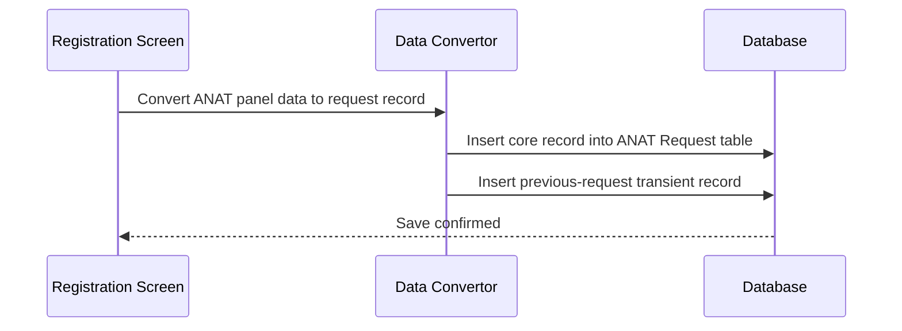
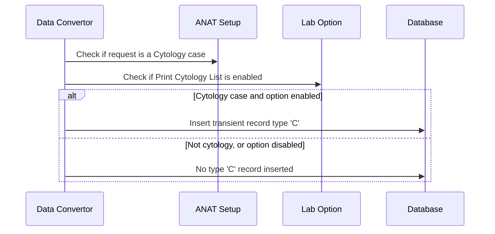
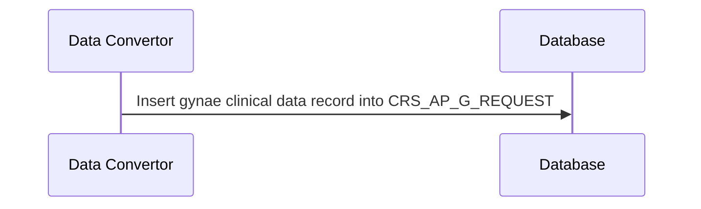
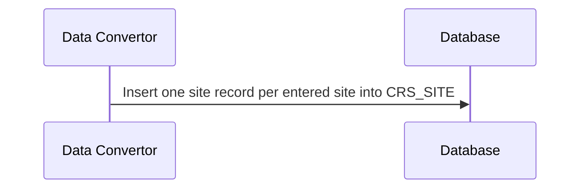

# Register ANAT Request

## Overview

When a registration clerk completes entry of an ANAT lab request via Manual Registration and confirms the save, the system persists the request data across several database tables. This workflow documents which data is stored, in which tables, and under what conditions — covering the core request record, gynae clinical data, cytology print list entries, site records, and the previous-request transient entry. The data stored here forms the permanent record that downstream processes (result entry, specimen acknowledgement, and reporting) rely upon.

---

## Related User Stories

- **[[CRST-120]]** — Registration - Register ANAT Request

**Epic:** LISP-30 [CRST][DEV] Registration - Special Lab Workflow (ANAT)

---

## Trigger Point

This workflow is triggered when the registration clerk confirms the save of an ANAT lab request on Manual Registration. The request number must already have been assigned before data is written to the ANAT-specific tables.

---

## Workflow Scenarios

### Scenario 1: ANAT Lab Request Registered — Core Request Record

#### Prerequisites

- The registration clerk has completed all required fields on the ANAT Input Dialogue.
- The request number has been assigned.

#### Process Flow

#### Step-by-Step Details

1. When the ANAT lab request is registered, the system inserts one record into the ANAT Request table (`CRS_AP_REQUEST`) containing the data described in the table below.
2. Fields that were not populated on the ANAT Input Dialogue (e.g., Responsible Person, Authorise By, X-Ray No., Specimen Type) are stored as null.
3. The system always inserts a transient record of type **P** (Previous Request) into the transient table (`CRS_AP_TRANSIENT`), regardless of which bench or test was used. This record is used to track that a Manual Registration event occurred.

---

### Scenario 2: Cytology Request — Cytology Print List Entry

#### Prerequisites

- The registered ANAT lab request is a Cytology case (the bench/test code matches the cytology configuration in the ANAT setup).
- The **Print Cytology List** lab option is enabled.

#### Process Flow

#### Step-by-Step Details

1. After the core request record is inserted, the system checks whether the registered request is a Cytology case by matching the bench test code against the cytology entries in the ANAT setup.
2. The system also checks whether the **Print Cytology List** option is enabled.
3. Only if **both** conditions are met does the system insert a transient record of type **C** into `CRS_AP_TRANSIENT`. This record is used to trigger cytology list printing.
4. If the request is not a Cytology case, or if the **Print Cytology List** option is disabled, no type **C** transient record is inserted.

---

### Scenario 3: Gynae Clinical Data Saved

#### Prerequisites

- The registration clerk has entered gynae clinical data via the [[Gynae Clinical Data Request Panel]] before saving the request.

#### Process Flow

#### Step-by-Step Details

1. If gynae clinical data was entered via the [[Gynae Clinical Data Request Panel]], the system inserts one record into the gynae clinical data table (`CRS_AP_G_REQUEST`) linking the clinical data to the lab request number and recording the registration date.
2. Cervix appearance and all other gynae fields are stored against the request. Fields that were not entered remain null.
3. If no gynae clinical data was entered, no record is inserted into `CRS_AP_G_REQUEST`.

---

### Scenario 4: Specimen Site Recorded

#### Prerequisites

- The registration clerk has entered at least one specimen site on the ANAT Input Dialogue before saving.

#### Process Flow

#### Step-by-Step Details

1. For each specimen site entered on the ANAT Input Dialogue, the system inserts one record into the site table (`CRS_SITE`) with the lab request number, site sequence, and the site data.
2. **Freetext mode** (when the site input is configured for free text entry): the site text is stored in the free-text column; the SNOMED code, class, and sequence columns are stored as null.
3. **Non-freetext mode** (SNOMED-coded site entry): the SNOMED code, class, and sequence are stored; the free-text column is stored as null.
4. If no specimen site was entered, no records are inserted into `CRS_SITE`.

---

## Summary Tables

### Data Written to ANAT Request Table (`CRS_AP_REQUEST`)

| Field | Value Written |
|-------|--------------|
| Lab Request No. | The assigned request number |
| Bench Test | The selected bench test code |
| Date of Death (DOD) | DOD date/time if entered; null if not entered |
| Coroner | **Y** if the Coroner checkbox was checked; **N** otherwise |
| Collection Time Unknown | **Y** if the Collection Time Unknown checkbox was checked; **N** otherwise |
| Responsible Person | User code of the selected responsible person; null if not selected |
| Authorise By | User code of the selected authorising person; null if not selected |
| X-Ray No. | X-Ray number if entered; null if not entered |
| Specimen Type | Specimen type if entered; null if not entered |
| Create Date/Time | Current date/time at registration |
| Create By | User code of the registering user |
| Update Date/Time | Current date/time at registration |
| Update By | User code of the registering user |
| Create Workstation | Workstation code of the terminal used |
| Update Workstation | Workstation code of the terminal used |
| Registration Date/Time | Date/time the request was registered |
| Comp Code | Computed component code (derived from bench/test configuration) |
| Comp Unit | Computed component unit (derived from bench/test configuration) |
| Bill, Keep Spec, Keep Specimen, Keep Frozen, Proforma, Slide Bank, QA, Autopsy Type, Batch Report | All stored as **N** (default values) |

### Data Written to Transient Table (`CRS_AP_TRANSIENT`)

| Transaction Type | When Inserted | Fields Written |
|-----------------|--------------|----------------|
| **P** (Previous Request) | Always, when a Manual Registration ANAT request is saved | Lab request no., type = P, workstation code, registration date/time |
| **C** (Cytology Print List) | Only when: (1) the request is a Cytology case AND (2) the Print Cytology List option is enabled | Lab request no., type = C, workstation code, registration date/time |

### Data Written to Gynae Clinical Data Table (`CRS_AP_G_REQUEST`)

| Field | Value Written |
|-------|--------------|
| Lab Request No. | The assigned request number |
| Cervix Appearance | Entered cervix appearance value; null if no gynae data entered |
| Registration Date/Time | Date/time the request was registered |
| All other gynae fields | Entered clinical data values as per [[Gynae Clinical Data Request Panel]] |

*(No record is inserted if the registration clerk did not open or save the Gynae Clinical Data panel.)*

### Data Written to Site Table (`CRS_SITE`)

| Field | Freetext Mode | Non-Freetext Mode |
|-------|--------------|-------------------|
| Lab Request No. | Assigned request number | Assigned request number |
| Site Sequence | Display sequence number | Display sequence number |
| SNOMED Code | Null | SNOMED site code |
| SNOMED Class | Null | SNOMED class code |
| SNOMED Sequence | Null | SNOMED sequence |
| Site Text | Entered free-text site description | Null |
| Registration Date/Time | Registration date/time | Registration date/time |

*(No records are inserted if no specimen site was entered.)*

---

## Configuration

| Setting | Option Code | Purpose | Effect when enabled | Effect when disabled |
|---------|-------------|---------|---------------------|----------------------|
| Print Cytology List | `PRINT_CYTOLOGY_LIST` *(group: REQUEST_REGISTRATION)* | Controls whether a cytology print list entry is created for Cytology requests | Type 'C' transient record inserted on registration of Cytology requests | No type 'C' record inserted regardless of request type |
| Site Input Mode | `TEXT` *(group: SPECIMEN)* | Controls whether specimen sites are entered as free text or as SNOMED-coded values | Site stored in free-text column; SNOMED columns null | Site stored in SNOMED columns; free-text column null |

---

## Business Rules

1. The core ANAT Request table record (`CRS_AP_REQUEST`) is always inserted when a Manual Registration ANAT request is saved; no conditional logic applies to the core record itself.
2. A transient record of type **P** is always inserted on Manual Registration, regardless of lab or bench type. This distinguishes manually registered requests from those entered through other workflows.
3. A transient record of type **C** is only inserted when both conditions are met: the request is a Cytology case AND the Print Cytology List lab option is enabled. Either condition failing is sufficient to suppress the record.
4. Gynae clinical data is only stored if the registration clerk opened and saved the Gynae Clinical Data panel. If the panel was not used, no gynae record is created.
5. Site records are only stored if at least one specimen site was entered. Multiple sites result in multiple site records, each with a unique sequence number.
6. In freetext site mode, the SNOMED columns are stored as null. In non-freetext mode, the free-text column is stored as null.

---

## Related Workflows

- [[Gynae Clinical Data Request Panel]] — The gynae clinical data entered via this panel is persisted as part of this workflow.
- [[Specimen Site Input Component]] — Specimen site entries made via this component are persisted as part of this workflow.
- [[ANAT Panel Save Validation]] — Validation is applied before this workflow runs; save is blocked if validation fails.
- [[Gynae Clinical Data Button]] — Controls whether gynae clinical data can be entered prior to registration.
