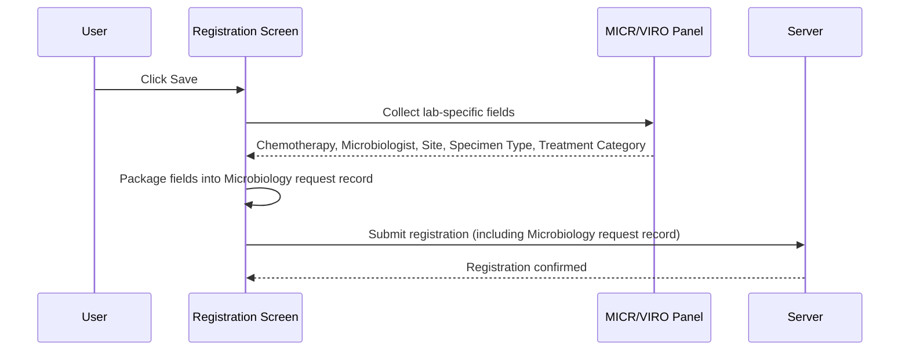

# Register MICR VIRO Request

## Overview

When a Microbiology (MICR) or Virology (VIRO) lab request is saved, the system collects additional laboratory-specific data from the MICR/VIRO Panel and packages it for persistence. This data supplements the standard registration information (patient, specimen, tests) and is stored in the Microbiology request record. The workflow ensures that all required and optional MICR/VIRO fields are captured and submitted as part of the registration save operation.

---

## Related User Stories

- **[[CRST-124]]** — Registration - Register MICR/VIRO Request
- **[[CRST-459]]** — Registration - MICR/VIRO Panel

**Epic:** LISP-32 [CRST][DEV] Registration - Special Lab Workflow (MICR/VIRO)

---

## Trigger Point

This workflow is triggered as part of the standard registration save sequence, after the user clicks **Save** and all common validations have passed. It runs alongside the general registration data conversion before the request is submitted to the server.

---

## Workflow Scenarios

### Scenario 1: Standard MICR/VIRO Registration Save

#### Prerequisites
- The user has opened the Registration screen for a Microbiology or Virology lab request.
- The patient has been identified and a valid request number has been entered.
- The user has clicked **Save**.

#### Process Flow

#### Step-by-Step Details

1. The system reads the following fields from the MICR/VIRO Panel and assembles them into a single Microbiology request record:

| Field Saved | Column (`mb_request`) | Source in Panel | Notes |
|-------------|----------------------|----------------|-------|
| Chemotherapy | `req_chemotherapy` | **Chemotherapy** text area | Free text; saved as entered |
| Microbiologist | `req_microbiologist` | **Microbiologist** dropdown | If no selection is made, the value is recorded as 0 |
| Patient identifier | `req_pid_group` | Derived from the identified patient | Not entered directly by the user |
| Request Number | `req_reqno` | Derived from the entered request number | Not re-entered here |
| Site | `req_site` | **Site** text area | Required field |
| Specimen Type | `req_specimen` | **Specimen Type** dropdown | Keyword-based selection |
| Treatment Category | `req_treatment` | **Treatment Category** dropdown | If no selection is made, the value is recorded as 0; field may be hidden depending on configuration |

2. The assembled record is wrapped in a collection and passed to the registration process for submission to the server along with all other registration data.

---

## Summary Tables

### Field Behaviour by State

| Field | Enabled at Patient Ready | Enabled at Registration Ready |
|-------|--------------------------|-------------------------------|
| Microbiologist | No | Yes |
| Specimen Type | No | Yes |
| Site | No | Yes |
| Chemotherapy | No | Yes |
| Treatment Category | No | Yes (only when the request lab prefix matches the configured list — see Configuration) |

### Null Handling

| Field | When user leaves blank | Value saved |
|-------|------------------------|-------------|
| Microbiologist | No selection | 0 |
| Treatment Category | No selection | 0 |
| All other fields | Left empty | Empty string |

---

## Configuration

| Setting | Option Code | Purpose | Effect when enabled | Effect when disabled |
|---------|------------|---------|--------------------|--------------------|
| Treatment Category Visible | `isTreatmentCategoryVisible` *(source: Registration dictionary parameter)* | Controls whether the Treatment Category field is displayed | Field shown | Field hidden; value not collected |
| Treatment Category Enabled by Lab Prefix | `labPrefixsToEnableTreatmentCategory` *(source: Registration dictionary parameter)* | List of request lab number prefixes for which Treatment Category can be edited | Field enabled at Registration Ready for matching prefixes | Field remains disabled regardless of state |

---

## Business Rules

1. The Chemotherapy, Site, Specimen Type, Microbiologist, and Treatment Category fields are all disabled until the patient has been identified and a valid request number has been entered.
2. If the Microbiologist or Treatment Category dropdown has no selection, the system saves the value as 0 rather than leaving it null.
3. The Site field is required before the registration can be saved.
4. The Treatment Category field visibility is controlled by configuration; when hidden, it is not collected and does not affect registration.
5. The Specimen Type may be pre-filled automatically when prior request information is available for the patient (auto-fill from previous registration info).

---

## Related Workflows

- [[MICR VIRO Panel]] — The panel that presents all MICR/VIRO-specific input fields referenced in this workflow.
- [[MICR VIRO Validation]] — Validation rules that run before this data collection step.
